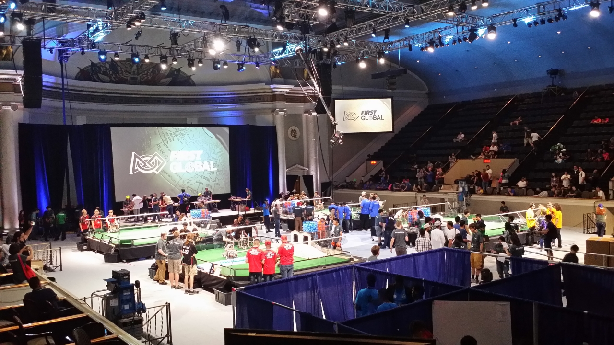

Jutranja gneča je podaljšala čas prevoza na naši relaciji za skoraj 20 minut. Tokrat ni šlo
brez hupanja in izsiljevanja prednosti, a na srečo ni bilo nobene škode.

Prvi dan uradnega tekmovanja nas je pričakal s štirimi igrami, kjer smo bili v različnih aliansah.

<!-- truncate -->

Prva tekma je bila daleč od načrtov. Po cca. 20 s se je povezava prekinila in fantje so se
mrzlično trudili, da bi jo vzpostavili še pred koncem tekme. Neuspešno.

Drugo tekmo smo odigrali normalno.

Tretja tekma je bila svetel primer sreče v nesreči. Kmalu po začetku igre je povezava padla
dol, takoj po tistem, ko smo zadeli ob robota nasprotnika in mu nehote izpulili baterijo in
ga popolnoma onesposobili. Naš robot pa, namesto da bi se ob padcu povezave varno ustavil,
je šinil naprej, se zabil pod most in popolnoma blokiral žogice, ki so prihajale spodaj ven.
Preostali del naše ekipe je ta čas pridno čistil, kar je bilo žogic na igrišču, novih žogic
ni bilo, pred koncem igre pa smo uspeli ponovno vzpostaviti povezavo, a se z robotom nismo
utegnili obesiti na ograjo (del igre, 20 točk), ker je kmalu spet padla dol. Kljub temu smo
nasprotnike premagali za eno točko. Nizozemci so bili kljub zapletu strašno veseli, ker so
za sabo že imeli en poraz. High five.

Način, kako je padla povezava, je presenetil in vzbudil zanimanje tehnične podpore, saj bi
se moral robot ob izgubi povezave brezpogojno ustaviti. To je nakazovalo resen problem v
opremi. Eden od prostovoljcev iz tehnične podpore je predlagal, da prestavimo kontrolno
enoto, ker da kabli drsijo po terenu in da to povzroča prekinitve. Malo nam je bilo čudno,
ker teh problemov doma nismo imeli, a smo se vseeno odločili za premontažo. Med montiranjem
je nekomu uspelo odtrgati žico napajalnega kabla do razširitvene enote. Ni mi bilo jasno,
kako se je to zgodilo ob sicer previdnem ravnanju in po premisleku sem prišel do zaključka,
da je bil kabel tam nalomljen že od jutra, ko smo menjali nadzorno enoto in da ga je skupaj
v kontaktu držala le skrčljiva cev za izolacijo. Zamenjali smo vse napajalne kable in
povezava potem ni več padala dol. Vendar pa smo imeli v naslednji tekmi še vedno zanimivo
nadaljevanje tehničnih problemov.

V četrti tekmi se je izkazalo, da je zdaj problem še v igralni ploščici, gamepadu, ki je
ravno tako izgubljal povezavo. Še posebej je bilo čudno videti, ko je tablica kazala, da je
gamepad priklopljen, čeprav je bilo več kot očitno, da ga tam ni. Luka je za vsak slučaj
naredil posnetek s telefonom. Po tekmi smo problem uspeli replicirati pred tehnično podporo,
ki je bila nad dogodkom vidno presenečena. Nato nam je dala nov gamepad, v naši programski
kodi popravila nekaj vrstic zaradi »znanih« hroščev ter z nekim servisnim programom
stabilizirala delovanje. Na prizorišču smo ostali skoraj do 20h, ko so v hali ostali
skorajda samo še varnostniki, a so vsaj problemi nekako izginili. Finally.

Ker je avtobus ob 20h že zdavnaj odpeljal, smo se v svoji režiji najprej odpravili v Pizza
Hut in naročili vsak svojo pico. Za slovenski okus niso bile nič posebnega, je bila pa
izbira dodatkov kar velika. Luka, Mark in David so svoje pice dobili, moja je malo zamujala,
picopek pa je po treh picah izgledal brez dela. Nekdo je pripomnil, da bi se na mojem mestu
že pritožil, meni pa se ni nikamor mudilo. Ko so ostali skoraj že pojedli, sem le vprašal,
če bo moje naročilo kmalu. Picopek je rekel, da bo nekaj pogledal, izginil nekam zadaj
(kasneje se je izkazalo, da je šel preverit naročilo), prišel nazaj, se opravičil, povedal,
da bo vzelo 10 minut, ponudil, naj si izberem 2-litrsko plastenko pijače in dal zraven kar
šest kozarcev. Ponudbo sem sprejel, ko mi je zagotovil, da ne gre na njegov račun. Fantje
so bili presenečeni, jaz pa ves pameten in zadovoljen, da sem dokazal, da se tudi s
potrpljenjem kaj doseže. Nekaj kosov pic je ostalo, pa smo jih poleg dveh kozarcev vzeli s
seboj. Zunaj je že bila trda tema. Sleepy.

Preden smo popadali spat, smo lahko še ugotovili, da je nekdo zamenjal napisa za moške in ženske toaletne prostore. Very funny.
