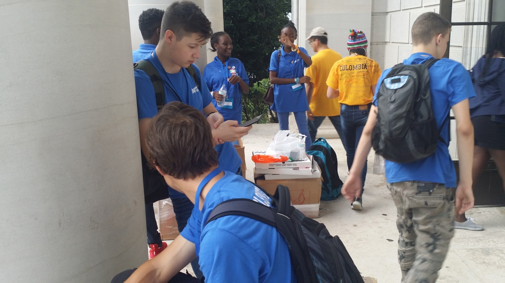

Jutranja gneča je spet podaljšala čas potovanja na prizorišče tekmovanja, a ni bilo hudo.
Ta dan sta nas čakali še dve tekmi in izvedli smo še nekaj minornih popravkov na robotu.
<!-- truncate -->

Po odigrani peti tekmi, ki smo jo za razliko od ostalih tekem končno lahko odigrali brez
tehničnih problemov, smo se malo sprehodili okoli DAR Constitution Halla, se slikali pred
Washington Monumentom, Ameriškim Rdečim Križem in Belo hišo ter se malo razgledali po
bližnji okolici. Obletavali so jo helikopterji, policije je bilo vsepovsod polno, sem pa
tja pa je v coni prepovedanega letenja pristajalo kako letalo na letališče Ronalda Reagana
v bližini. Obetalo se je k nevihti, zato smo pri vrnitvi malo pohiteli.

Šesta tekma je bila zelo zanimiva, tudi kazalo je zelo dobro. Manjši zaplet je nastal na
koncu pri obešanju robota, rahlo je popustil kavelj in se je ujel za las za rob. Luka je
posvaril ostale, naj se nihče ničesar ne dotika, a se je vendarle našel nekdo iz alianse,
ki se je naslonil na ograjo, jo premaknil in s tem robota dokončno porinil dol. Oh well.

Ko je bila šesta in zadnja tekma za nami, so fantje obsedeli, kot bi jih izklopil, in prav
videlo se je, kako je popustil adrenalin.

Popoldan je bila zaključna prireditev, kjer so podelili nagrade v več kategorijah. Glavno
nagrado v glavni kategoriji je dobila ekipa, ki je zastopala Evropo, drugo nagrado so
podelili Poljski, za tretjo se pa nismo več zanimali. Naša ekipa se je uvrstila na 78.
Mesto. V tolažbo nam je bilo, da so za nami bili Albanija, Lesoto, Tanzanija, Turkmenistan,
Kirgizija ..., pa tudi Francija, Belgija, Nizozemska, Rusija, UK, USA in Kanada.

Previdno smo spakirali robota ter ga odnesli pred vhod. Slovake sem vprašal, kaj bodo počeli
naslednji dan, pa so dejali, da so jih povabili na kosilo na slovaško ambasado.

Kmalu je prišel avtobus in odpeljali so nas v nazaj internat na predzadnjo nočitev.
Za večerjo so šli fantje v bližnjo delikateso, jaz sem pa dokončal borovničevo pito.