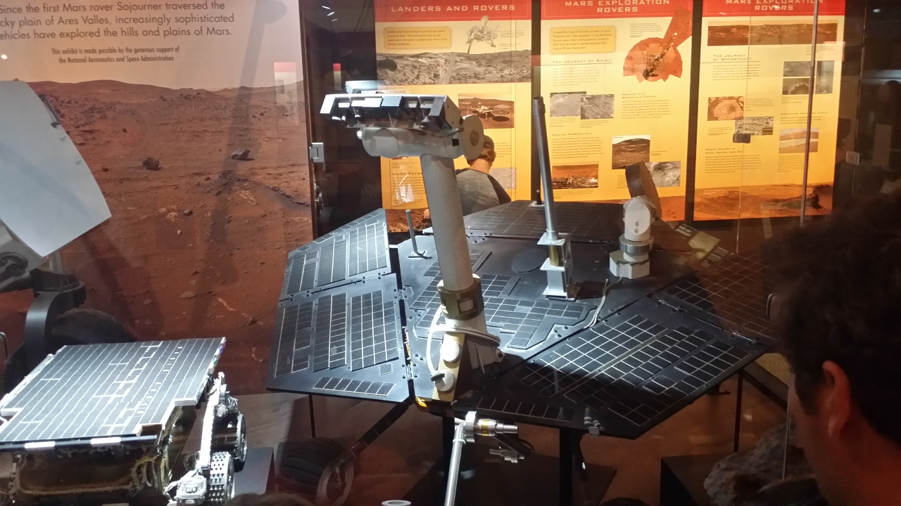
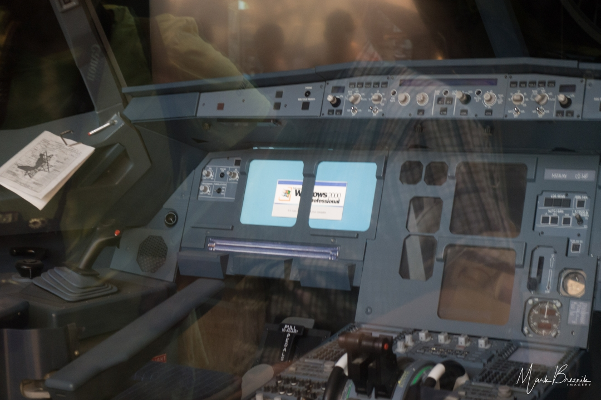
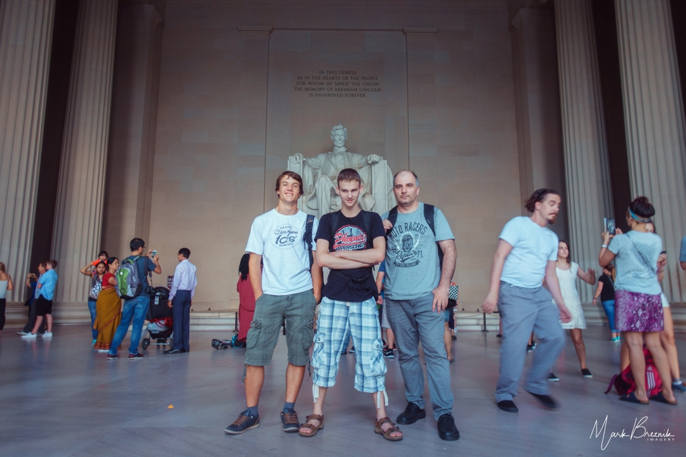

Končno smo imeli prost dan, zato smo zjutraj kljub dragocenemu času spanje potegnili do
pol desetih. Ob šestih zjutraj sem opazil, da so v našem nadstropju samo še ženski
toaletni prostori. Very funny again.
<!-- truncate -->

Zanimivo, da nikoli nismo videli, kdo naše prostore sploh vzdržuje. Vedno so bili zjutraj
snažni, pomiti in koš za smeti prazen. Tudi dvigalo, ki se je enkrat ali dvakrat pokvarilo,
je bilo vedno kmalu v pogonu.

Približno ob osmih sem spodaj slišal neke glasove in pogledal skozi okno. Zunaj pred vhodom
sta bili parkirani dve policijski vozili, dva policista sta se pogovarjala z našo oskrbnico
in se kmalu nato odpeljala. Malo iz dolgčasa, malo iz radovednosti sem se sprehodil po našem
nadstropju, si ogledoval opremo in našel še drugo dvigalo. Nekatere ekipe so ta dan že
odhajale in dve sobi sta bili odprti in razmetani, kot da je nekdo zelo malomarno in v
naglici odhajal. Messy.

Ko smo končno vsi vstali, so fantje šli v bližnjo delikateso na zajtrk, jaz pa sem počakal
v sobi. Po zajtrku smo se odpravili v muzej aviacije in osvajanja vesolja Smitsonian. Tja
smo prispeli približno ob pol dvanajstih. Vstop je bil brezplačen, so pa nas na vhodu
pregledali, kot da se najmanj vkrcavamo na letalo. Ker ni bilo vstopnine, smo si ob treh
lažje privoščili prigrizek v muzejskem McDonaldsu. Ogledovali smo si tudi spominke, a smo
nakupe pustili za konec, ko bomo vedeli, kaj vse ponujajo. What a mistakea to makea.

Za ogled smo namenili dve uri, a je zapiranje muzeja ob pol šestih zvečer prišlo tako
iznenada, da nismo utegnili kupiti niti enega spominka. Sicer je bilo 15 minut prej po
ozvočenju opozorilo, da nekaj zapirajo, a smo ga zanemarili, ker je bilo govora samo o
galeriji, ki smo si jo trenutno ogledovali. Praktično pa so ob pol šestih vse obiskovalce
po kavbojsko nagnali ven. Tudi v trgovino s spominki se ni dalo več. How rude.

Odpravili smo se proti centru mesta, a ko smo prišli tja, razen trgovin, ob katerih se je
denarnica kar skrčila, ni bilo videti ničesar posebnega. Menda je zvečer tamkajšnja
razsvetljava zelo umetniška. Ker čakati na večer ni imelo smisla, smo naročili Lyft in si
šli pogledat Lincoln Memorial, če je res tak, kot v Planetu opic.

Naredili smo še kak kilometer in se usedli na klop ob reki ter tuhtali, kaj gremo še lahko
gledat. In ugotovili smo, da še nismo šli pogledat nobenega trgovskega centra. Za konec
dneva smo si potem ogledali še dve trgovini (BestBuy in Target) v 7 km oddaljenem trgovskem
centru, kjer smo nakupili nekaj malenkosti za domov in na pot.
