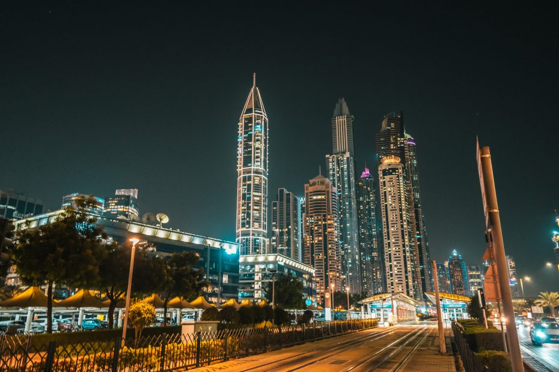
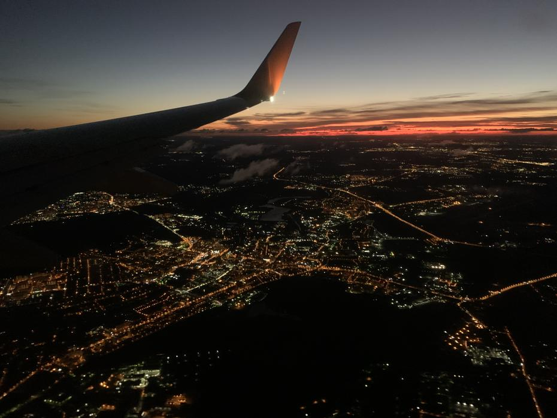
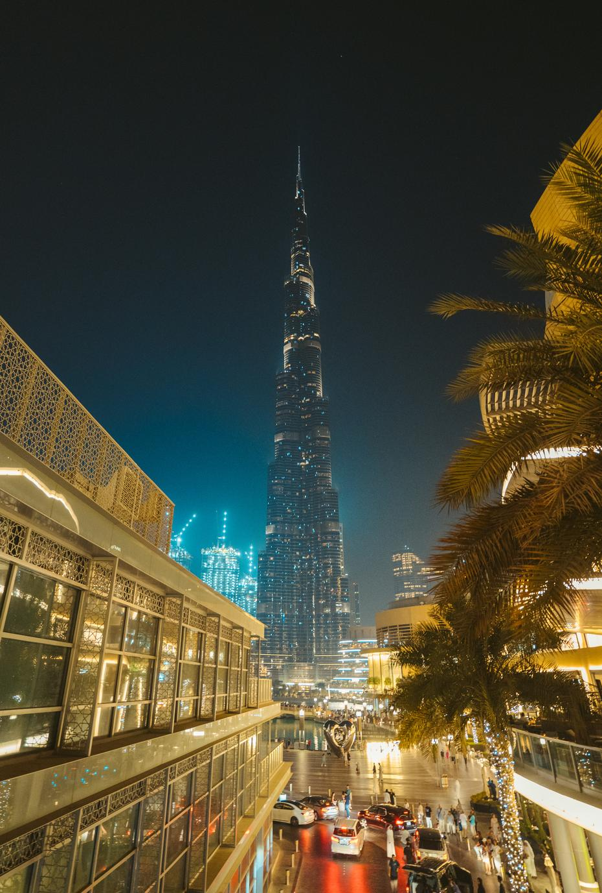
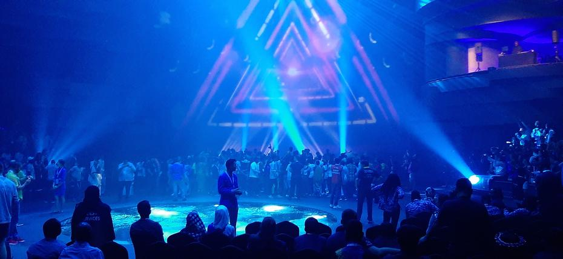

Dijaki Vegove Ljubljana smo se 22. 10. 2019 odpravili na potovanje, ki bo zapisano v knjige – ali
pa vsaj na spletno stran. Pot nas je popeljala v mesto blišča, Dubaj. Kljub napornemu 11-urnemu
letu je bila slovenska reprezentanca robotike še vedno nasmejana, energična in poskočna. <!-- truncate -->
Nastanjeni smo bili v Festival City hotelu v lasti InterContinentala, ki je vsekakor bil več
kot le hotel. Tam smo spoznali ostale tekmovalce, izmenjali zgodbe med večerjo in se sami kot
ekipa zelo zbližali. Vendar Dubaj ni le počitniško mesto, je tudi mesto bojevnikov oz. v našem
primeru študentov, ki so pripravljeni pokazati svoje znanje in robotove zobe svetu.

Vsak izmed sodelujočih robotov je bil sestavljen iz enakih delov, saj je vsaka izmed reprezentanc
prejela identičen t. i. »kit komplet«, v katerem so bili edini dovoljeni deli za sestavo robota.
Tako smo bili vsi v enakem položaju. Ekipa je lahko uporabila vse dele, lahko pa jih je pustila
tudi nekaj neuporabljenih. Največja dovoljena velikost robota je bila pol metra (tako v x- kot v
y-smeri). Robota se je prav tako dalo upravljati na razdaljo, kar pomeni, da ni smel delovati
povsem samostojno (brez posredovanja uporabnika ni smel izvesti nobenega opravila). Pravila igre
so narekovala, da robot ne sme imeti ostrih delov, saj bi z njimi lahko poškodoval robote sotekmovalcev.
Naloga robota je bila potiskanje, streljanje, dvigovanje žog ter marsikaj drugega. Ekipe so imele
tudi proste roke pri tem, da oblikujejo del nalog robota po svoje. Robota sta pred pričetkom tekmovanja
preverila tako nadzornik za strojno kot nadzornik za programsko opremo. Slednja sta nam tudi dala
zeleno luč za pričetek tekmovanja.

Do prihodnjič,  
lahko noč

