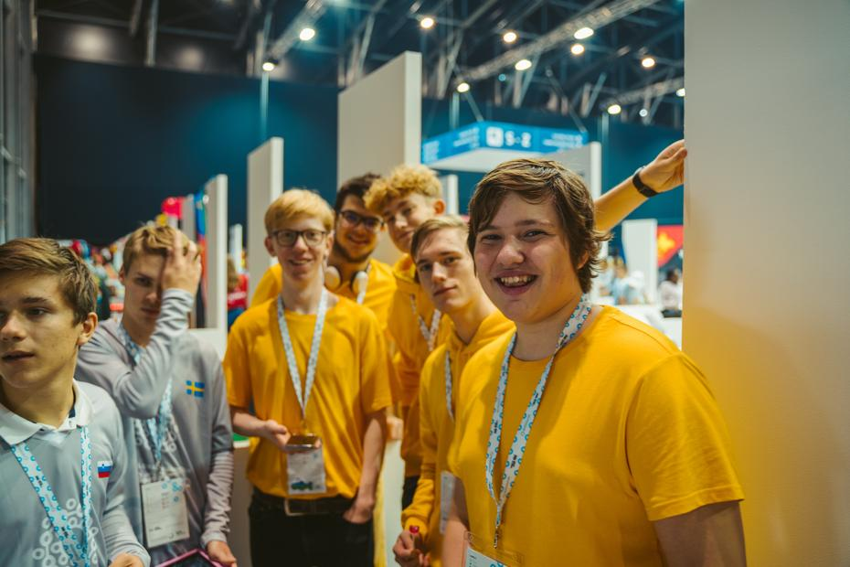
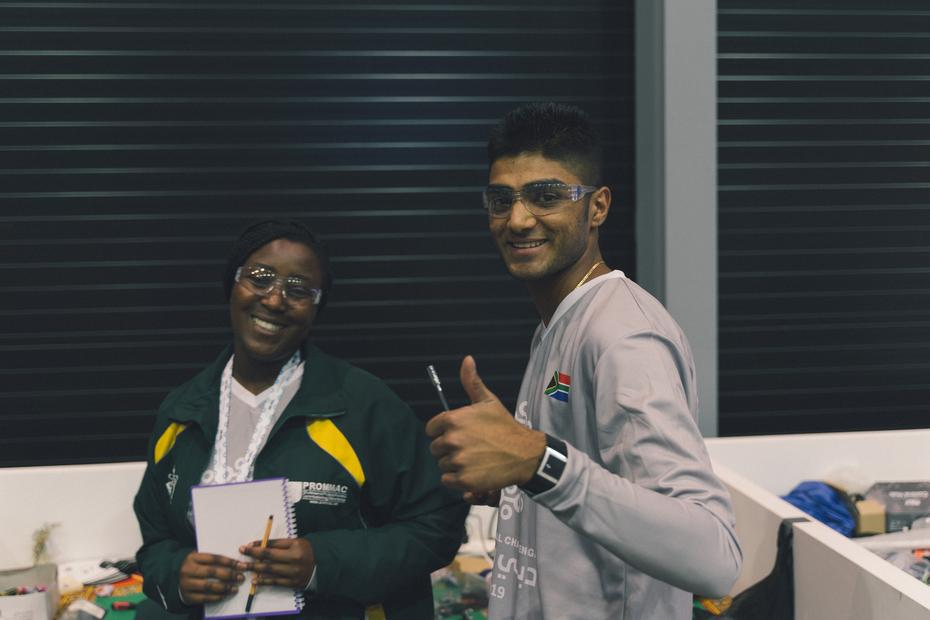
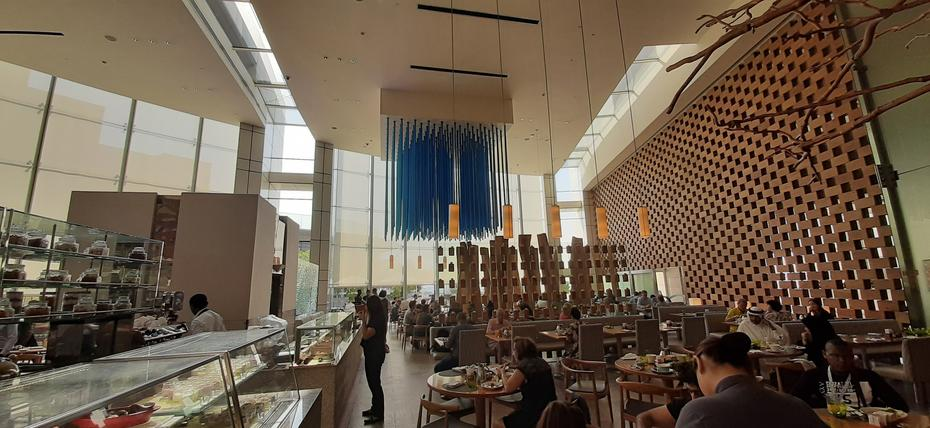
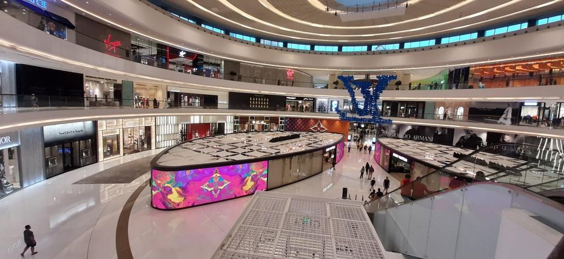
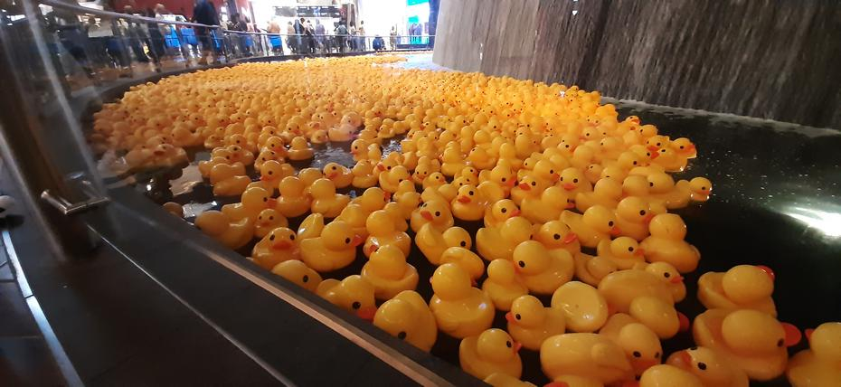

Nov dan, nove igre! Pomanjkanje spanca nas pri prvem dvoboju ni prav nič oviralo, saj smo 
združeni s pozitivno naravnanostjo Gvajane in Gabona dosegli rezultat 119 : 60. Takratni
rezultat domačinov je bil 3 : 1. <!-- truncate --> Po kratkem počitku smo z robotom v rokah
že drveli nazaj v areno, kjer smo se spoprijateljili z Jamajčani in Estonci. Peta igra je
potekala proti Tanzaniji, Madagaskarju ter Salomonovim otokom. Kljub večji količini morja
okoli otoka je voda še vedno naplavila zmago na našo obalo. 4 : 1, lep rezultat, a prišel
je tudi težji čas za nas, saj smo morali tokrat poraženo odkorakati od mize. Kljub pomoči
Bermudov in Jordanije nam ni uspelo, vendar upanje umre zadnje! 4 : 2, ekipa je malce potrta,
vendar še vedno nasmejanih obrazov. Sedem slovenskih palčkov je čakala sedma igra
kvalifikacijskega kroga, vendar tokrat sedmica ni bila naša dobitna številka. 4 : 3. Nastopil
je konec drugega dne. Sedaj le upamo, da bo naslednji dan uspešnejši od današnjega.

Do prihodnjič,  
God natt

