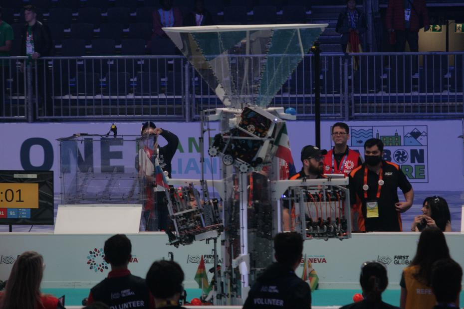
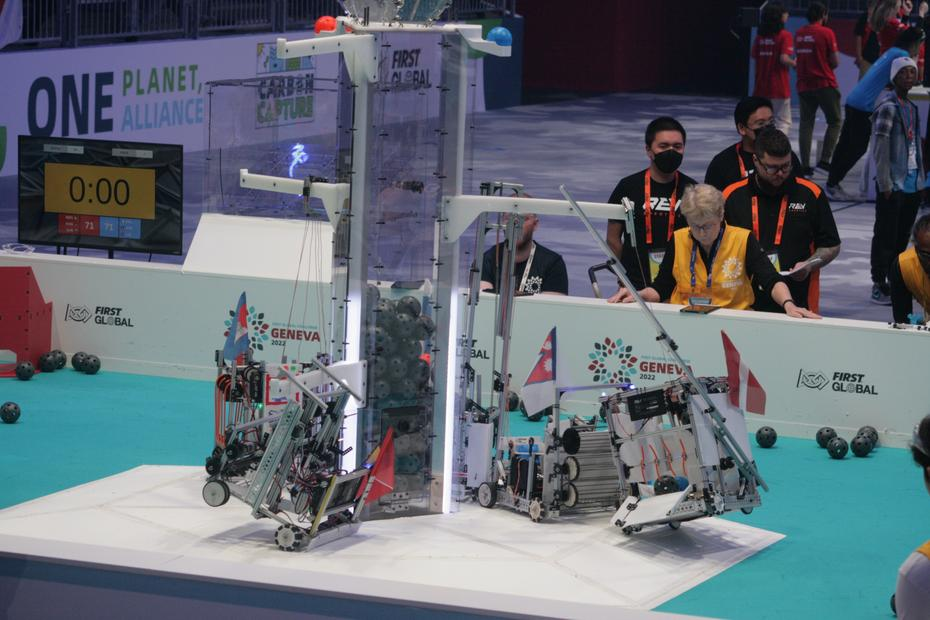
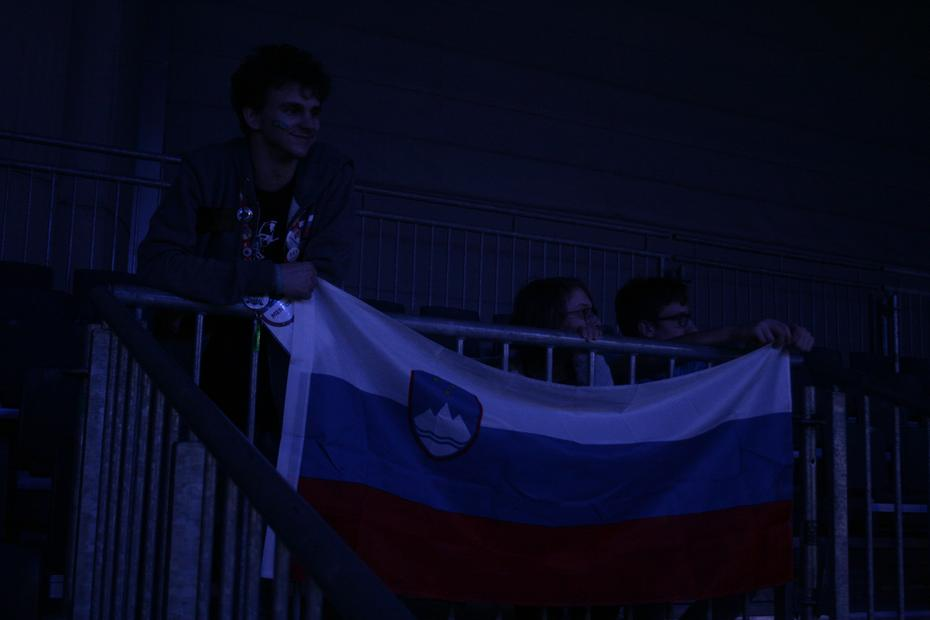
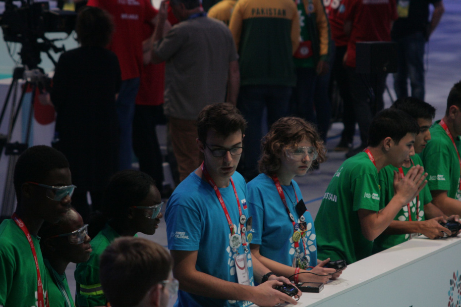
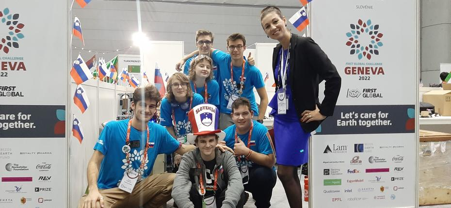

Petke običajno povežemo s počitkom in udobjem, v primeru svetovne olimpijade pa precejšnjo
mero adrenalina in pozitivne nervoze. Po prvenstvenem zajtrku se je nenaspana reprezentanca
odpravila proti vhodnim vratom Palexpo arene, za katerimi nas je še čakala obila dela na robotu.
<!-- truncate -->

Tekom popravljanja smo prejeli urnik pripravnih tekem, ki so bile vse skupaj tri, te so se
pa odvile med deveto in dvanajsto uro. Tekom preizkušanja je drive team (David, Ana, Jaka)
odkril kup napak, ki so jih vsako prosto minuto poskušali popraviti. Trema pred prvimi
ocenjevalnimi igrami, po katerih se tudi štejejo točke za uvrstitev na lestvici, je postala
vse hujša. Na srečo nas je kosilo s pomočjo majhnih sendvičev in solat ter pudingov uspelo
pomiriti.

Prva ocenjevalna tekma je vozniški del ekipe pahnila v začasno slabo počutje, saj so prvi
porazi najzahtevnejši za zaužiti. Vendar kot pravi Baltazarji, smo držali glave pokonci in
si že z drugo igro prisvojili prvo zmago. Razmerje zmag proti izgubam je nihalo okoli ravnovesja,
mesto na lestvici prvega tekmovalnega dne nam je pa tudi bilo všeč.

Poleg tekmovalnega dogajanja smo imeli tudi srečo v družabnih. Spoznali smo med drugimi reprezentanco
Črne Gore ter dvojnika asistenta Fakultete za računalništvo. Bili smo tudi deležni prijetnega
obiska gospe Bruant Gulejove iz CERN-a, ki se je zanimala za sodelovanje z dijaki naše srednje
šole. Tik pred zaključkom dneva nas je obiskal krokodil, ki grize s šalami, gospod Michael
iz Floride. Tisti večer je bil načrtovan kot kulturni večer, da bi udeleženci prišli na
večerjo oblečeni v tradicionalna oblačila in tudi plesali svoje plese. Tovrstnega interesa
žal ni bilo, vendar upamo, da se kaj takega pripeti prihodnje leto.

Do naslednjič, laku noč.
