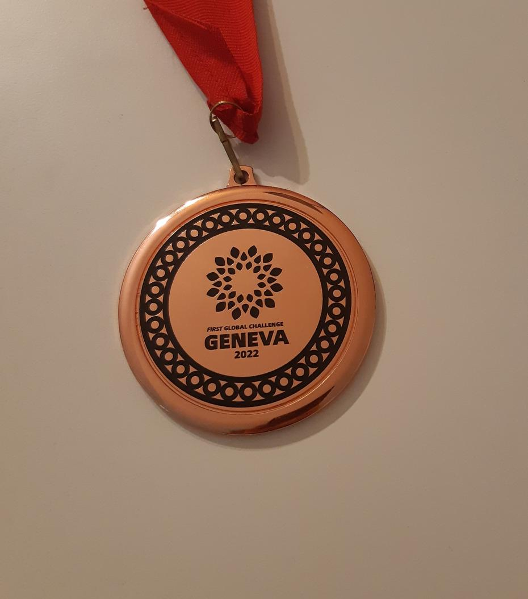

Odgovor na naslov je zelo preprost, in sicer od marsikogar. Po običajnem pričetku dneva smo
se znašli v areni in bili kmalu vabljeni k prevzemu nagrade “Helping hands”, ki smo si jo
prislužili s tem, da smo pomagali drugim ekipam (Norvežani, Nova Zelandija, Sierra Leone…),
na kar se bomo lahko spomnili ob pogledu na bronasto medaljo. <!-- truncate --> Skoraj vse
države so bile deležne nekakšne nagrade, vendar nekatere žal brez medalje. Vsi smo zmagovalci,
to je sporočilo tekmovanja! Zato smo tudi vsi bili deležni aplavza in fotografov ob prejemu
nagrade. Večina držav je prejela nagrado za prisotnost na družabnih omrežjih in za varnost.

Na srečo smo v nedeljskem slogu bili deležni samo dveh iger, kmalu za tem smo pa tudi strastno
že navijali za naše prijatelje iz Črne Gore in Makedonije. Vsak krog so kvalifikacije postajale
bolj napete, tribune bolj glasne in rezultati vedno bližji, nekatere tekme so se celo končale
z izenačenjem. Dinamika zadnjih iger dneva in tekmovanja je bila občutno višja, s tem pa se
je tudi število točk znatno povišalo (povprečje 400-tih točk po igri).  Zmagovalno alianco
letošnjega First Global Challenge tekomvanja so sestavljale Litva, Belize in Švica, izmed
katerih je baltska država pristala na prvem mestu. (na sliki so ekipe, ki so osvojile
Albert Einstein nagrado)

Preostanek dneva smo preživeli tako, da smo se poslavjali od naših prijateljev in podarjevali
preostanek promocijskega materiala prostovoljcem in uslužbencem. Večer pred odhodom smo preživeli
v družbi ekip Nizozemske, Kanade, Amerike in Surinama. Kulturno obarvan večer se je končal
z voščenjem lahke noči v tujih jezikih in prejemu oranžnih klobukov od Nizozemcev, ki so v
barvi kraljevine (kasskopf).

Do naslednjič, good night.
