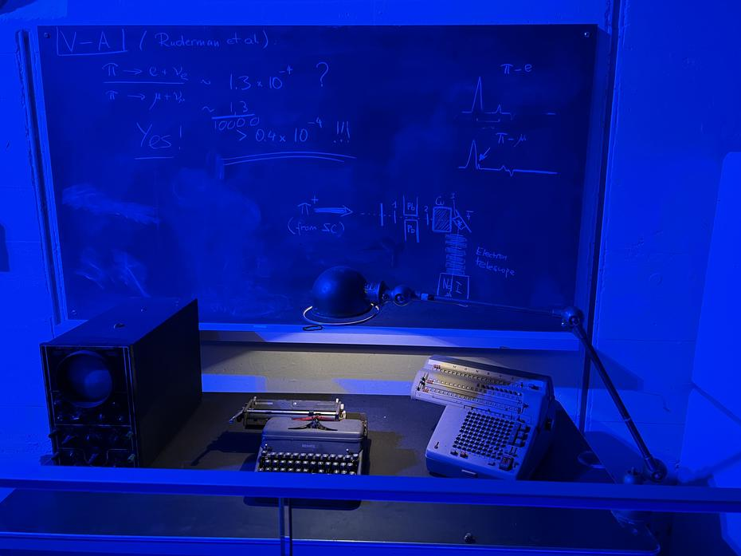
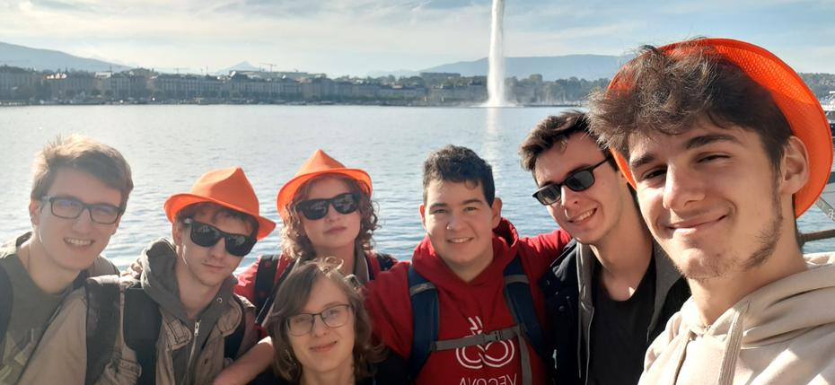
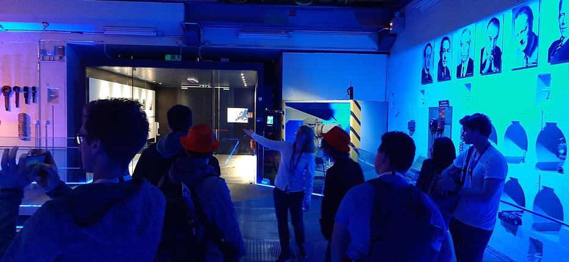
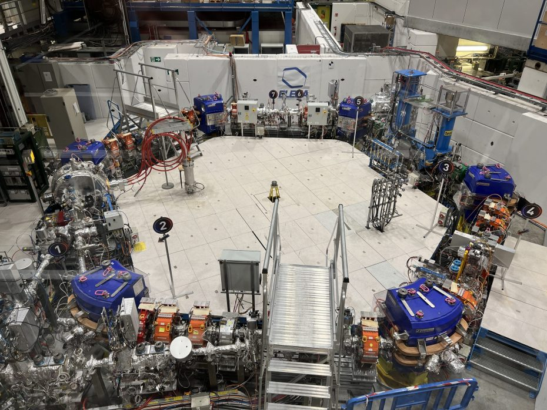
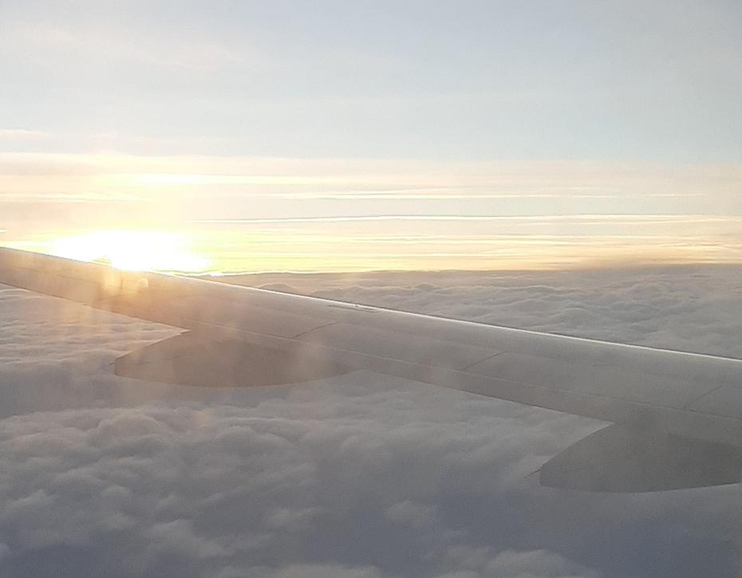

Vse lepe stvari slej ko prej pridejo h koncu. Tako se končuje tudi obisk Ženeve za našo ekipo,
vendar na pozen popoldanski let se je potrebno pripraviti s hitrim turističnim obhodom. Po
zmagovalnem zajtrku smo do konca pospravili naše sobe in pripravili prtljago za na pot. Ob
vrnitvi hotelskih kartic se je odprla priložnost, da se poslovimo od podpornikov Nove Zelandije
in mentorjev Kanade. Kmalu za tem smo pa zopet skočili na vsem znan avtobus št. 5 in se
odpravili v središče mesta.
<!-- truncate -->

Ponedeljek sveti v Ženevi v drugačni luči, saj ni moč občutiti utrujenosti med ljudmi, ki
smo jih srečali med našim prvim obiskom mesta v dnevni svetlobi. Ogledali smo si največjo
znamenitost mesta – fontano (Jet d’Eau). Zaradi časovne stiske smo si uspeli ujeti le še
kanček arhitekture preden smo odhiteli na tramvaj do CERN-a. Linija javnega prevoza št. 18
nas je pripeljala čez cesto od vhoda v sanjsko delovno mesto marsikaterega znanstvenega
navdušenca. Tam smo srečali tudi ekipo Velike Britanije, Cayman Islands in Romunije med
čakanjem naše osebne vodičke Anje. Ta nam je ob kratki uvodni debati razdelila karte za vstop
v majhno mestece, v katerem smo se prvo odpravili na ogled miniaturnega muzeja, ki govori
o zgodovini prvega pospeševalnika in kako so marsikatere znanstvene iznajdbe starejše od
LEGO kock in žepnih računal. Za tem smo se odpravili do tovarne antimaterije, kjer smo prvo
imeli debato o napakah filma Angeli in demoni. Za tem smo šli naprej do naprav, ki so
ugotavljale padec antivodika(Gbar), upočasnjevalnik protonov (ELENA) in dvigalo do samega
pospeševalnika s 30km premerom, ki obratuje pod zemljo. Na poti ven iz malega mesteca, ki
ima svoje gasilce, pošto, zdravstven dom ipd. smo lahko videli tudi kamen, ki nakazuje mejo
med Francijo in Švico, ter njihovo “živalsko zavetišče”.

Po potekanju smo lovili čim hitrejši način prevoza domov izmed ponujenih linij javnega prevoza,
pri čemer smo se lovili in na koncu uspešno po dveh prestopih našli linijo št. 28, ki nas je
pripeljala do letališča, od tam pa št. 5 do hotela. Od našega začasnega prebivališča smo se
odpravili za tem, ko smo pobrali svojo prtljago (in seveda tudi robota). Pomahali smo Palexpo
in hvaležno odkorakali proti letališču, kjer smo brez kakršnihkoli zapletov hitro prispeli
v čakalnico za prisedanje na letalo. Brez zamud smo po isti poti prispeli domov in se po
ekipnem objemu ter selfie-ju poslovili, za tem pa odkorakali vsak v svojo smer.

Do naslednjič, …
