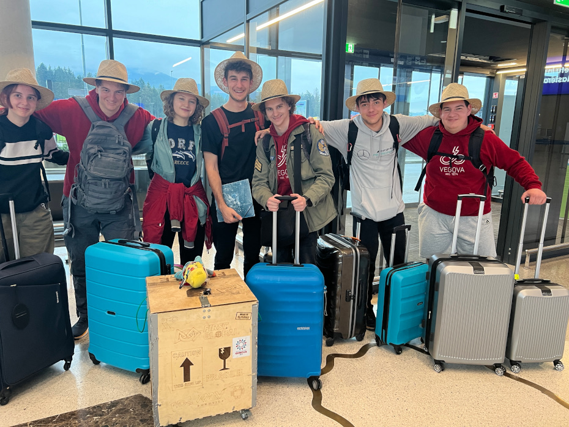
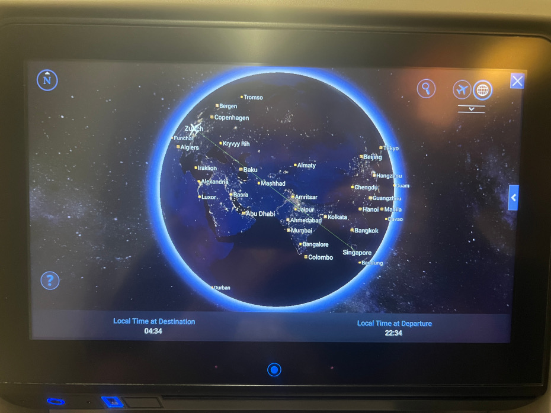
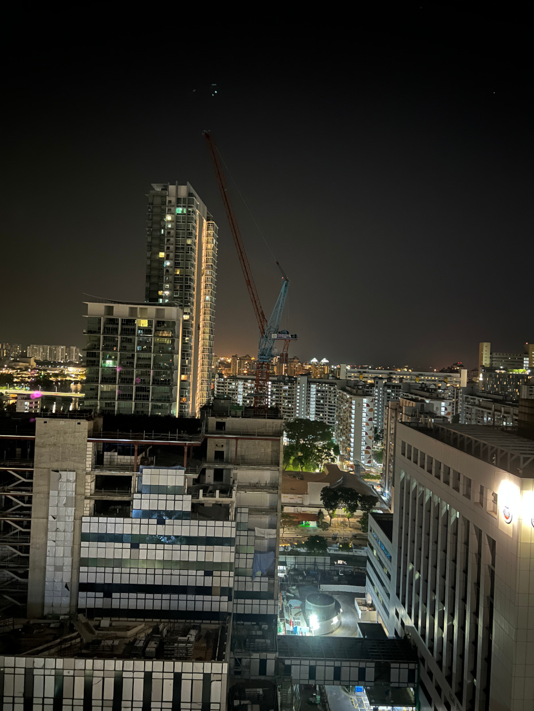
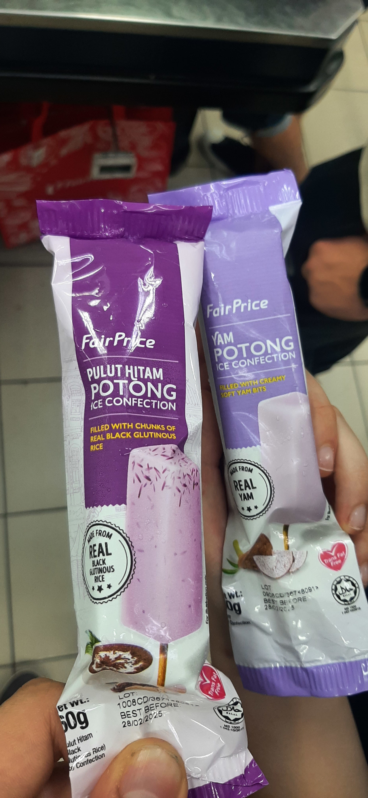

Dolgo pričakovani začetek poti je napočil, in tako je ekipa First Global Slovenija v večernih
urah poletela proti Zurichu. Tam nas je čakal dvourni prestop in med drugim tudi vožnja s
podzemnim vlakom ob spremstvu animirane osebe Heidi ter iznajdba prostorov Aperture Laboratories.
Kmalu smo se vkrcali mimo prvoklasnih potnikov na naše sedeže, in se ob igranju z zaslonom
na dotik odpravili na 12 urno pot, v kateri bomo prepotovali približno enajst tisoč kilometrov.
<!-- truncate -->

Dva obroka in en krajši spanec kasneje smo se znajdli na Changi letališču v Singapurju,
mestu trajnostnega razvoja. Po dolgem čakanju na vrsto za avtomatiziran pregled in prehod,
smo se z zamudo ene pokvarjene windows naprave kasneje oglasili na delu s prtljago. Z
zagotovljeno SIM kartio smo se oglasili pri prvem FIRST Global Challenge koordinatorju.
Ta nas je prijazno napotil svojim kolegom, ti so nas pa usmerili na čakajoč avtobus, na
poti do katerega smo se prvič soočili z vremenom, ki ga bomo prihodnjih nekaj dni
srečevali v Singapurju.

Sprejem v hotelu V Hotel Lavender je bil brez težav in poln srečevanja in spoznavanja novih
obrazov letošnjih ekip. Kmalu smo ucvrli vsi v svoje sobe z namenom počitka. Regenerativni
seji je sledil sprehod z namenom iskanja primernega ponudnika za naš prvi obrok na novem
kontinentu. Nekaj restavracih, trgovin in nejasnih prometnih pravil kasneje smo se odločili,
da se bomo prehranjevali v bližnji menzi Kopitiam. Po daljšem odločanju smo se odločili za
raznoliko izbiro med glavami ekipe, ki je segala od Piščanca z rižem do indijskega pekočega
golaža (in ananasa v rižu). Po večerji se spodobi se ohladiti z eksotičnim sladoled, ki je
ta večer vključeval okuse kokos,jam in črni riž.

Po vrnitvi v hotel je bilo več kot očitno, da vse kar nam preostane je pojavljanje oblačkov
“Zzzzz” nad glavami polnih sanj.

Do prihodnjič,
lahko noč.
