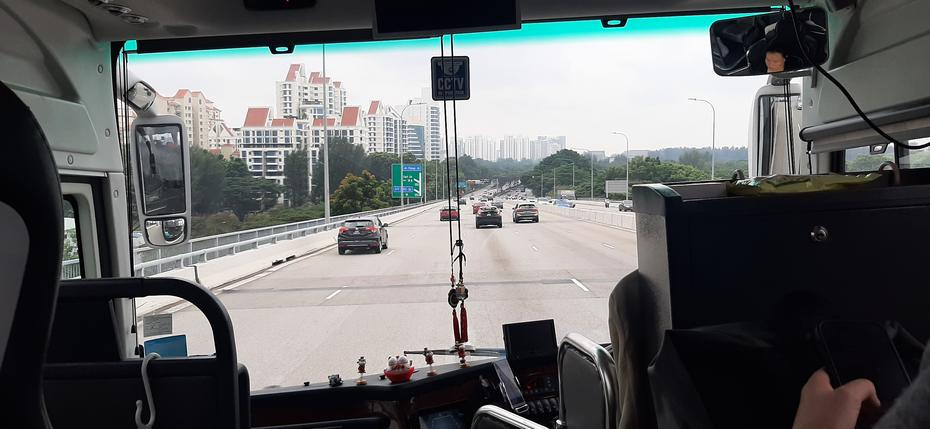
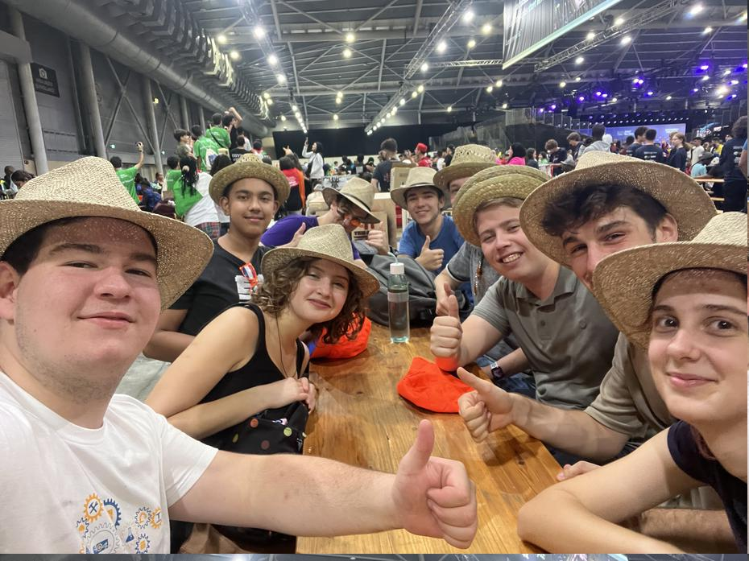
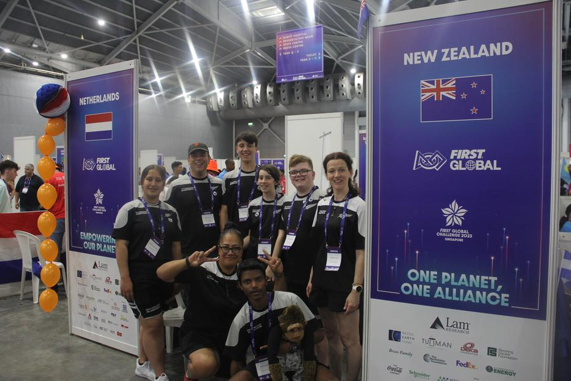
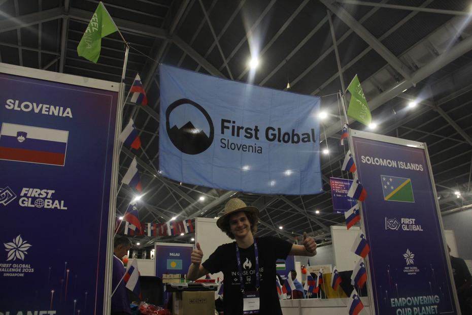
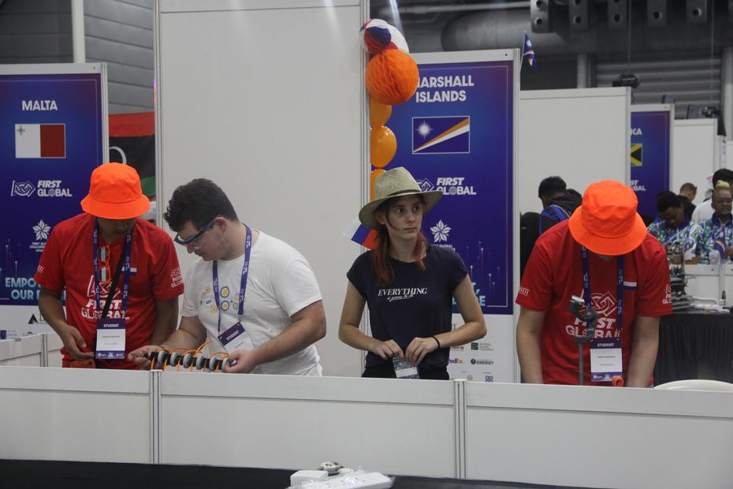
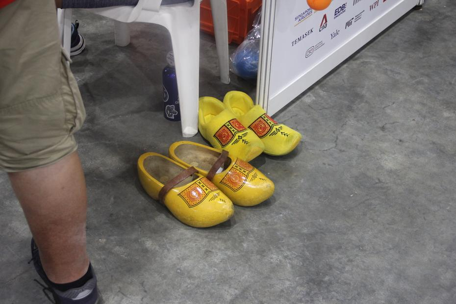
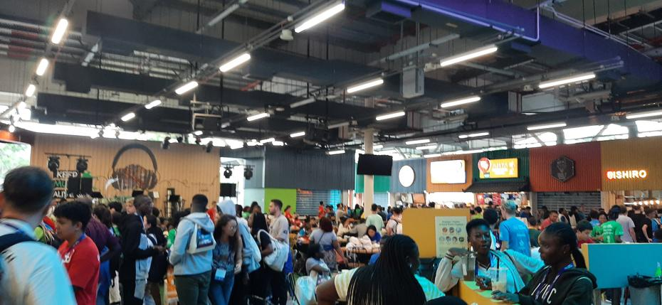

Drugi dan našega singapurškega soneta smo začeli z zajtrkom, ki je vključeval sončni vzhod
in hrano kot so paratha (palačinke), poha(rumeni riž) in hway teow (praženi rezanci). Po
zehanju smo se počasi odpravili v nagužvano dvigalo in skupaj z robotom v singapurško EXPO areno.
<!-- truncate -->

Nam zanimiv dogodek nas je čakal v hali 3, medtem ko so v ostalih potekale tržnice in tudi
največji sejem opreme za dojenčke. Nestrpno čakanje v predprostoru smo popestrili z debatami
in obiski naših prijateljev. Ko so se vrata odprla, smo se odpravili v halo, v kateri nas
je navdušila prostornost. Medtem ko je eden izmed mentorjev urejal postopek registracije
ekip in ob tem prejel nekaj izdelkov za vsakega člana in mentorja svoje ekipe: dve majici,
vreča, flaša, obesek in predvsem obesek z imenom udeleženca/-ke. Mentorje so člani nestrpno
dočakali v družbi svojih prijateljev iz Nizozemske in petju Zdravnika.

S koncem kratke veselice smo šli v gruči ljudi iskati še ostale nam znane reprezentance.
Po krajšem času smo jih našli in odkrili, da imajo letos enega člana in mentorico, ki sta
iz Slovenije. Martino in Ožbeja (ali kar Bej) je bilo prijetno spoznati in spremljati njuno
prvo srečanje s tekmovanjem First Global Challenge.

Kmalu je prišel čas za uradno odprtje štandov držav. Vsaka izmed držav je bila pričakana z
aplavzom in vzkliki s strani organizatorjev v spodbudo.

Prva naloga dneva je bila okraševanje štanda, druga pa dopolnitev robota. Čeprav smo bili
v zaostanku z nedokončanim robotom (podobno kot mnoge druge države), so naši prijatelji
ekipe Netherlands bili na slabšem, saj njihovega robota niso naložili na letalo zaradi
primankljaja dovoljenj. Novica nas je pretresla in smo želeli pomagati kolikor lahko. Čeprav
je njihov načrt bil, da ga pošljejo 6.10. zjutraj, niso bili prepričani če bo prišel v času
za prvo kvalifikacijsko tekmo. Zaradi tega smo dva naša člana, Jako in Brino, poslali v pomoč.
Skupaj z njuno pomočjo je bil postopek izdelave robota občutno hitrejši.

Nastopil je čas za kosilo in napet izbor med 4 meniji (Western, Asian, International in Vegetarian),
ki ga je vsak izmed nas prejel zapakiranega za s seboj, jedel pa kar tu. Ob kosilu in po le
tem smo imeli priložnost se družiti z ekipo nizozemske (ob izdelovanju robotov obeh ekip)
in se naučiti nekaj novih besed v njihovem jeziku (in obratno).

Dan smo zaključili s prejemom kuponov za večerjo in se odpravili v bližnjo barvito zgradbo
(Timbre+) kot po navodilih organizatorjev. Tam nas je pričakala gneča in precejšen nabor
restavracij, pri katerih smo lahko naše bone porabili s sistemom 2 bona za 1 glavno jed,
ali pa 1 bon za 1 prilogo/sladico/posebno pijačo. Ekipa se je razdelila in se sestala pri
vnaprej dogovorjeni mizi z piskajočimi obročki ter pridno počakala na svojo hrano (približno
pol ure). Kar nekaj piščanca, riža, pekočih začimb in podobnih jedi kasneje smo ugotovili,
da nam je še nekaj kuponov ostalo. Skupinska odločitev je vodila v vnovčitev kuponov v zameno
za 6 napitkov iz sugarcane sestavine. Z okusnimi napitki in hrano v želodcih smo se odpravili
na avtobus nazaj do hotela.

Tam nas je ujela utrujenost, ki smo se je kmalu znebili s spancem (večina nas). 
Jutri se pa tekmovanje uradno začne.

Do prihodnjič,
Pō mārie
