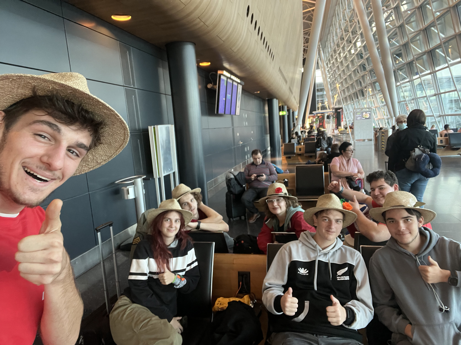

Poslednje jutro našega obiska Singapurja smo začeli nekoliko kasneje kot ponavadi, saj smo
želeli malo več počitka (in pospraviti nazaj prtljago). Po zajtrku smo se odjavili od hotela
in pustili prtljago. Logistiki je sledil začetek naših zadnjih singapurških avantur.
<!-- truncate -->

Skočili smo na avtobus 980 in kasneje prestopili na linijo 166 (dvonadstropen), tako da smo
si lahko ogledali mesto na drugačen način. Ta nas je odložil na postaji Flame Tree Park in
smo začeli našo pot po njihovem narodnem parku. Pot z deščicami se je začela na Squirrel
Trail trasi, na kateri smo imeli priložnost srečati rdeče kačje pastirje, lokalno rastlinstvo
in veverice. S koncem omenjene trase so se začeli pojavljati znaki za usmeritev, pri čemer
smo sledili znakom za TreeTop Walk. Na naši poti, ki je delno speljana vzporedno z lokalno
cesto, smo srečali tudi druge pohodnike in celo dva kuščarja. Soparno vreme in visoke
temperature niso bile ravno spodbudne, vendar je pot vedno hitreje minevala. Od 3km potrebnih
do cilja smo slabe 2km prehodili precej hitro. Ustavili smo se ob posebnemu obisku – opice!
Na poti smo srečali opice, ki so se mirno gibale po gozdu in plezale po drevesih. Naslednji
postanek je bil pri pitnikih, ki so nameščeni tik pred najhujšim klancem celotne poti do
Tree Top Walk-a. Asfaltirana pot ni bila ravno zanimiva, nas je pa presenetil nenaden dež,
ki ni bil napovedan. Izkorstili smo srečo v nesreči kot priložnost za ohladitev. Na vrhu
nas je čakal naš cilj in tudi sprememba načrta. TreeTop Walk – sprehod po mostu med gozdnimi
krošnjami – ima pravilo, da ko obiskovalec stopi na most mora nadaljevati pot v smeri trase
(ni vračanja po tej točki, kar znaki zelo očitno povejo). Tako smo z dežjem v laseh hodili
v višini drevesnih krošenj in občudovali razgled, ki se razprostiral na vse strani. Za
mostom nas je čakala pot z ograji in deščicami, tekom katere smo srečali kar nekaj sprehajalcev,
ki so se skrili pred dežjem. Na koncu označene poti smo se lotili makedamske poti, ki nas
je pripeljala nazaj do pitnikov, vendar je tokrat bil obisk nekoliko bolj zanimiv. Kmalu po
začetku počitka so nas obiskale opice. Imeli smo priložnost videti mamo in njenega opičjega
otroka ter tudi strategije tatvine : medtem ko je ena opica prikupna in krade pozornost,
druga poskusi ukrasti karkoli pride po njene prste. Po nekem času in obili slik smo se
odpravili nazaj po trasi po kateri smo prišli do pitnikov prvič. Na poti nazaj smo šli po
drugi (lepši) poti do veveričje steze (Squirrel Trail) in smo lahko videli, da je takoj ob
polnem sijanju sonca začela voda z lesenih desk izparevati. Po približno treh urah hoje smo
opravili krog in se vrnili na začetno točko, kot je zemljevid na začetku napovedal. Prepoteni
in utrujeni smo se odpravili na avtobus do naše naslednje točke.

Kavarna s cenovno nedostopno glasbeno opremo, natančneje slušalkami, je bila točka za počitek
za fante, medtem ko je preostali del ekipe prepešačil večji del mestne četrti Little India
(ime izhaja iz tega, da tržnica, ljudje in vse ostalo spominja na Indijo) in ob tem si ogledali
tudi dva hindujska templja: Sri Veeramakaliamman Temple in Sri Srinivasa Perumal Temple. Na
koncu četrti so obiskali City Square Mall in poslali razglednice. Na poti nazaj do fantov
se je preostanek ekipe ustavil tudi v trgovini za spominčke ter supermarketu z živimi ribami
in raki ter nižajočim se stropom. Kmalu se je ekipa ponovno zbrala v trgovskem središču za
računalniško opremo in elektroniko Sim Lim Square, ki ima kar šest nadstropij. Po krajšem
preletu trgovin se je ekipa odpravila na kosilo v restavracijo Hill Street Tai Hwa Pork
Nuddle, ki je street food z eno Michellinovo zvezdico.

Po kosilu se je ekipa razdelila na počivalno polovico, ki je ostala v hotelu, in raziskovalno
polovico, ki se je odpravila v kitajsko četrt mesta – Chinatown. Različne trgovine, trgovski
center in stojnice krasijo omenjeno četrt, pri čemer je preostanek pohodnikov bil na lovu za
enim izdelkom, Maneki-Neko (figura mačke s premikajočo roko). Po uspešnem preletu in nakupu
po nižji ceni je stoječa polovica ekipe hitro stopila na vijolično linijo metrojev, nato
prestopila na zeleno, ki jih je pripeljala do hotela.

Pred odhodom na letališče je ostal le še en korak: preurejanje prtljage in s tem prerazporeditev
teže. Z urejenimi kovčki smo se odpravili na zadnji avtobus tega potovanja. Na letališču smo
opravili preskok med terminali s pomočjo vlaka seveda in opravili check in ter obenem tudi
odložili robota in kovčke, ki jih pred Ljubljano ne bomo več videli. Za tem so se nekateri
člani odločili za osvežitev pod letališkimi tuši, ki so bili le en parking stran od čakalnice
v kateri so ostali ostali člani ekipe. Po ponovnem zboru je naša ekipa opravila varnosti
pregled in oddrvela do čakalnice za naš let. Prej kot smo se zavedali smo že sedeli na letalu,
pred nami je pa bil 13 urni let, ki smo ga na srečo večino prespali, čeprav po delih.

Nekaj obrokov, neudobnih pozicij za ležanje in filmov kasneje smo pristali na letališču v
Zurichu. Tu smo ponovno obiskali vlak s spremljevalnim glasom risane junakinje Heidi, da smo
lahko prišli do pravilnega dela letališča. En promocijski video za našega podpornika Zavarovalnico
Triglav kasneje smo od dela letališča z najboljšimi trgovinami se odpravili do našega
zadnjega gate-a. Švicarska temperatura nas je prijetno presenetila, saj nismo zašvicali.
Let do domače prestolnice je bil kratek, preostal nam je le še najtežji del – poslavljanje.

Do prihodnjič
再见
