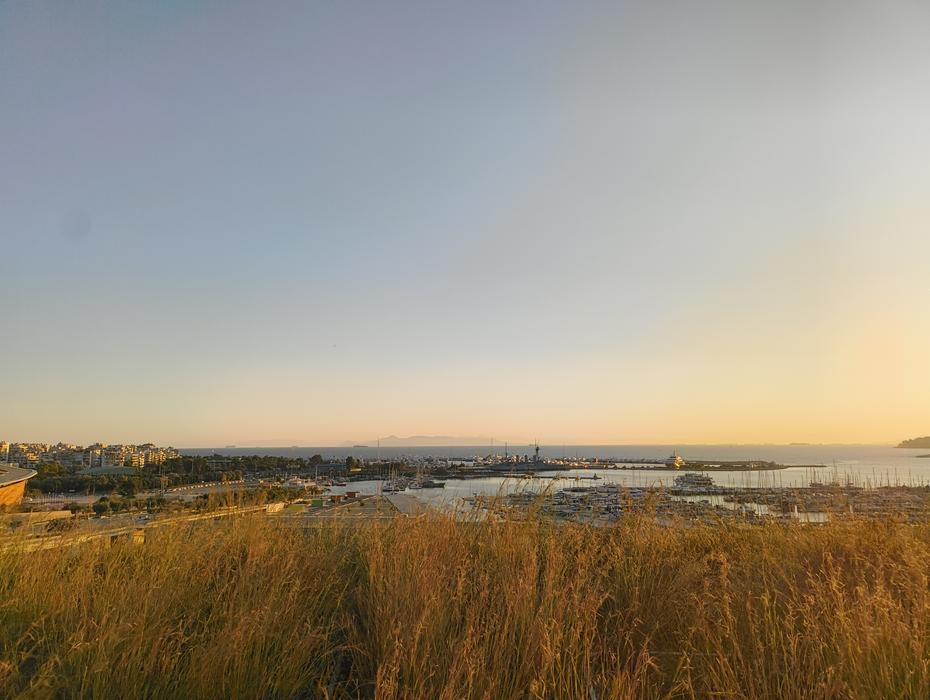

Nastopil je drugi jesenski dan in podali smo se na pot proti državi izumiteljev, girosov in
bogov. Zgodnje ure na letališču Brnik smo si krajšali s tehtanjem prtljage in razporejanjem
orodja ter baterij. Kmalu je bil za nami varnostni pregled, tako da smo lahko v miru počakali
na vrkcavanje ob pogledu na deževno vreme.
<!-- truncate -->

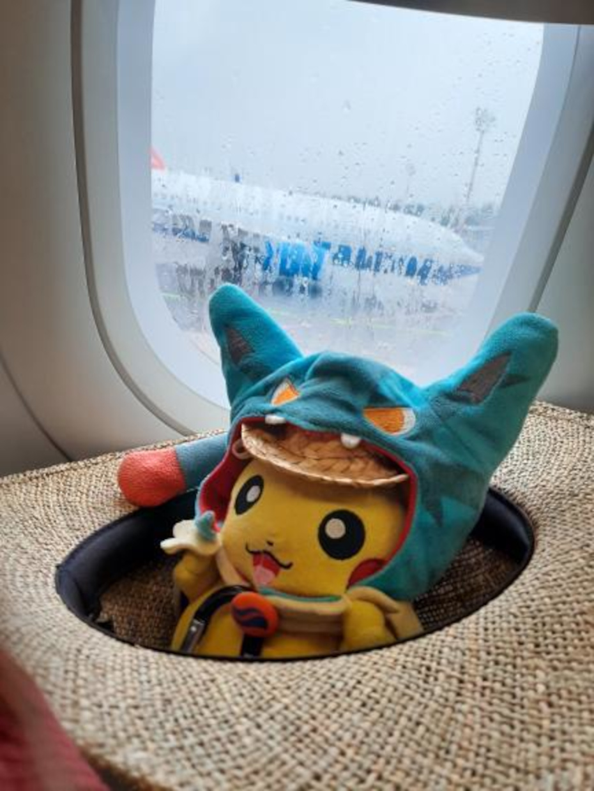

Dvourna pot je hitro minila in kmalu po malici na letalu smo se znašli na letališču pristaniškega
mesta Atene. Višje temperature so nas skupaj z osebjem olimpijade robotike First Global Challenge
dočakale zunaj letališča. Uri čakanja na odhod našega avtobusa je sledila polurna vožnja po
avtocesti podobni ameriškim. Na poti do mesta nas je obkrožalo suho rastlinstvo, kar nas
je v kombinaciji s temperaturami spominjalo na dalmacijo.

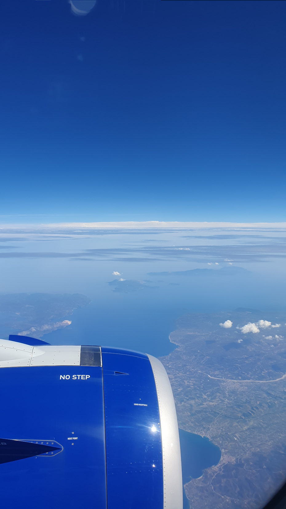

Mestno jedro je bilo svojevrstno. Na kratko povedano je mešanica dobrega in slabega, saj
lepše ustanove in trgovine obkroža pozabljena in zastarela infrastrukura ali celo smeti.
Na poti do hotela smo videli dva kipa, ki sta nas spominjala na podobo iz sovjetskih časov,
ter več lepših zgradb, ki so v resnici banke, akademije, knjižnice ipd., in tudi manjšo
skupino tradicionalnih grških vojakov, ki so hodili po pločniku.

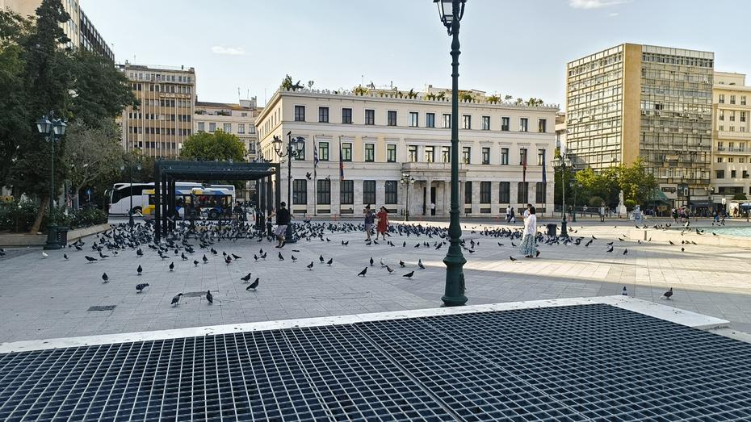

Prijetno smo bili presenečeni, da je hotel Titania, v katerem bomo prenočili našo grško
avanturo, ena izmed lepših zgradb v mestu. Sobe v štirizvezdnem hotelu so bile sicer druga
zgodba, vendar za odspati nekaj kitic čez noč bodo dobre. Privoščili smo si krajši počitek,
se preoblekli in podali na pot v mesto jedro.

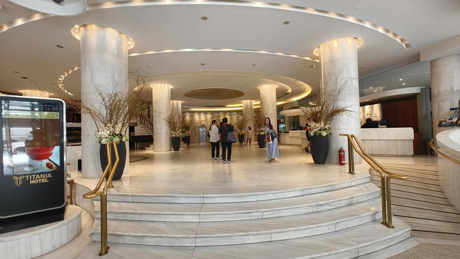

Pot do našega obroka v Potato King restavraciji nas je popeljala čez cesto skozi park, v
katerem smo se srečali s prvim prizorom krute realnosti obiskanega mesta. Pogled na ljudi
pod vplivom substanc in igle na tleh so nam dale vedeti, da moramo biti oprezni kdaj se
zadržujemo izven hotela in predvsem kje. Preostanek poti smo opravili ob glavnih cestah,
kjer smo bili deležni le sprehoda mimo trafik in stojnic z orodjem, hrano in raznolikimi
starejšimi izdelki. Vmes smo opazili tudi manjše dvorane, ki so bile podobne tržnicam, ven
je pa prihajal vonj rib. Bližje kot smo bili mestnemu jedru manjši je bil nivo hrupa in
večje je bilo število kavarn in trgovin na vsaki strani ceste.

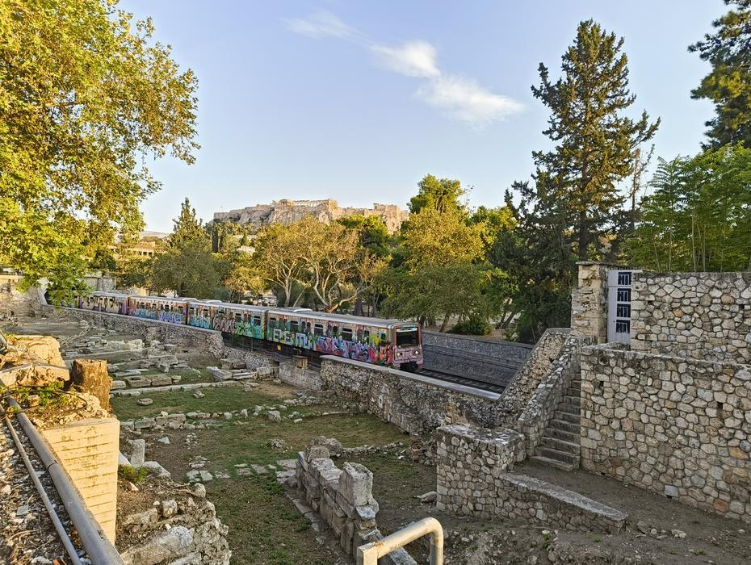
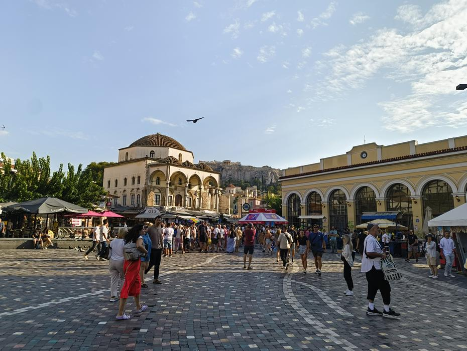

Osrednji trg je krasila manjša kapelica, pogled na akropolo oz. partheon in lesene stopnice.
Traso do našega kosila smo spremenili in se napotili skozi tržnico, ki je imela od spominkov
in nastinjenih majic vse do vinil plošč in koles. Na koncu tržnice smo pogled obrnili na
ostanke iz starih časov, ki jih imajo po mestu naključno ograjene. Potato King nas je
zadovoljivo okrepčal z kar nekaj ocvrtega krompirja, sirovimi kroglicami, zavitki in omakami.

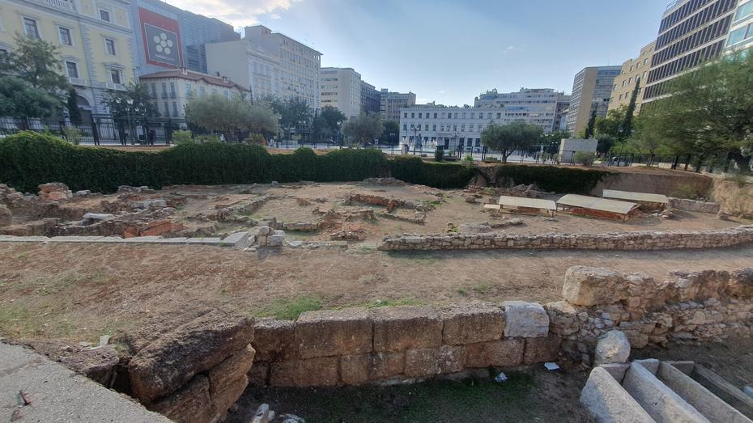
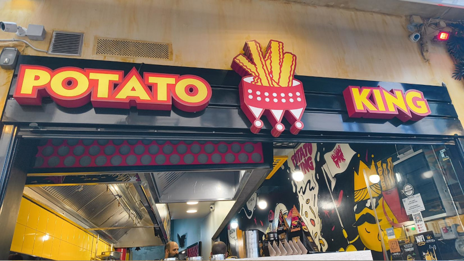

Po kosilu smo se odpravili na ogled kavarne Little Kook, ki je sezonsko okrašena hiša z
ujemajočimi okrasi glede na sezono. Mi smo bili deležni Halloween okrasov, ki so bili
postavljeni tudi na nasprotni strani ceste in v manjši ulici, ki vodi do le te.

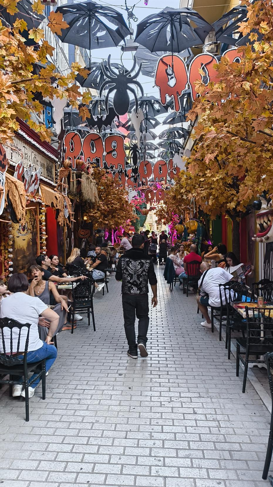
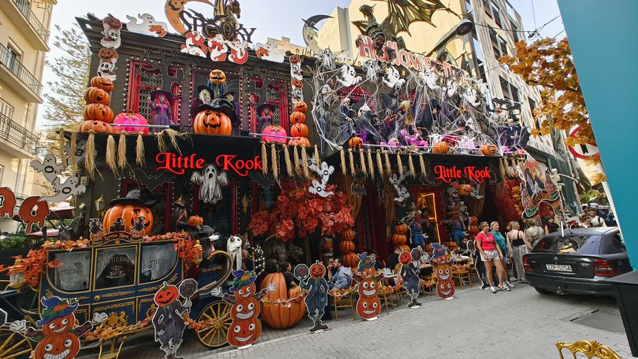

Pot nazaj do hotela je zajela še postanek v lokalni trgovini, kjer smo nakupili manjšo zalogo
sokov in bonbonov za kasnejše konzumiranje ob pisanju tehnične dokumentacije našega robota.

Do naslednjič,
lahko noč
