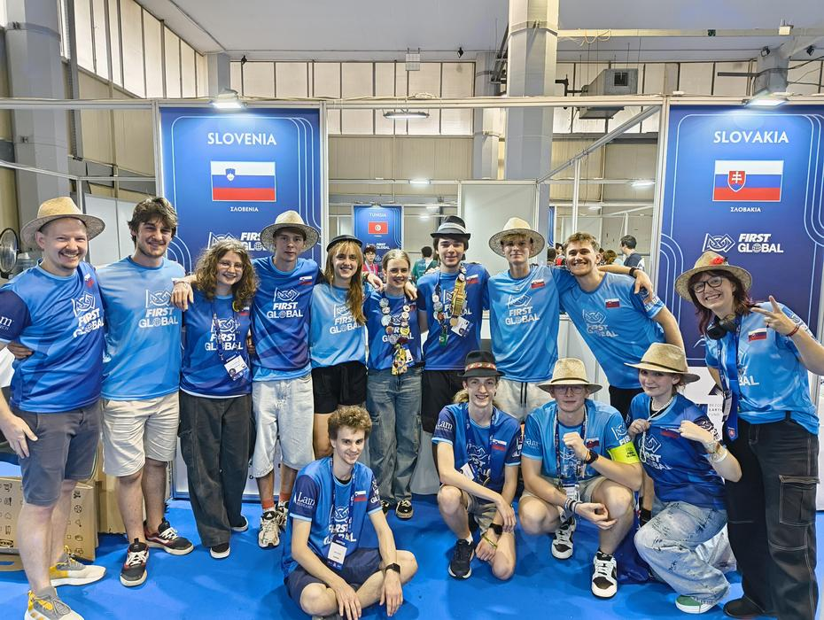
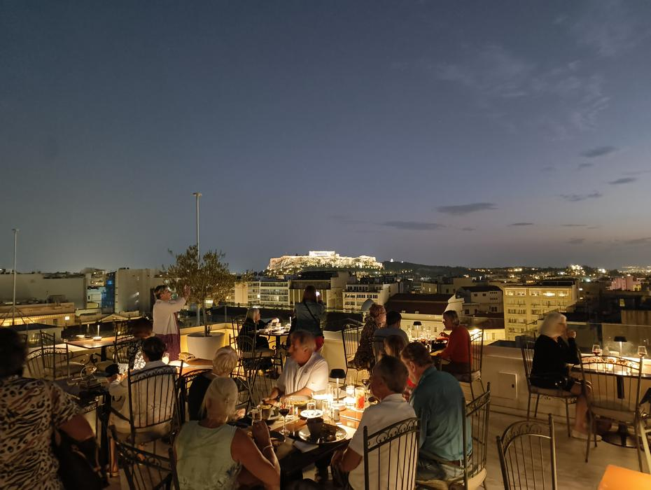
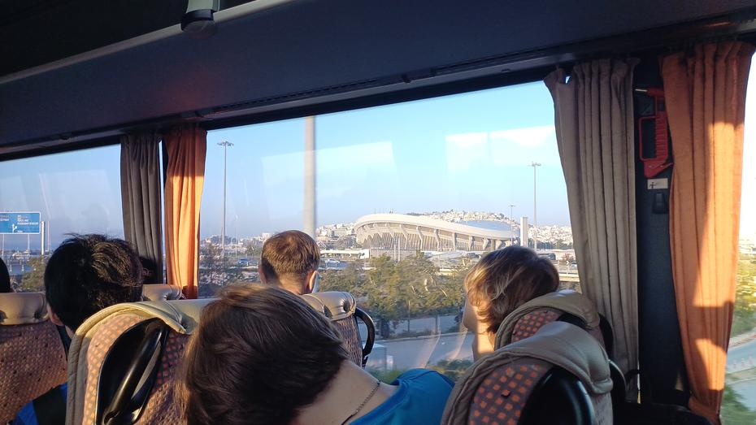
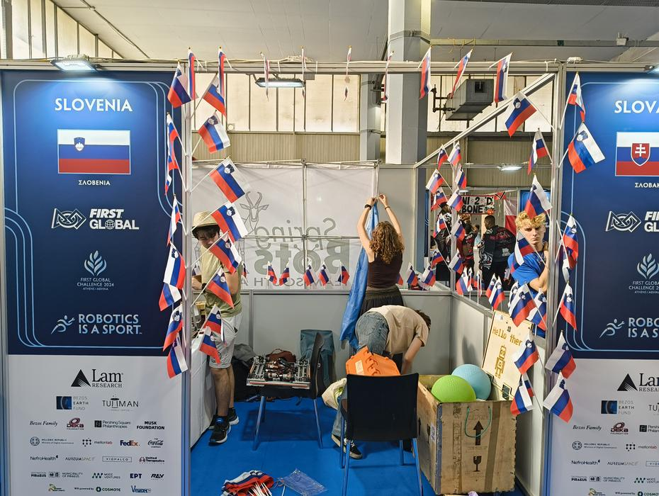
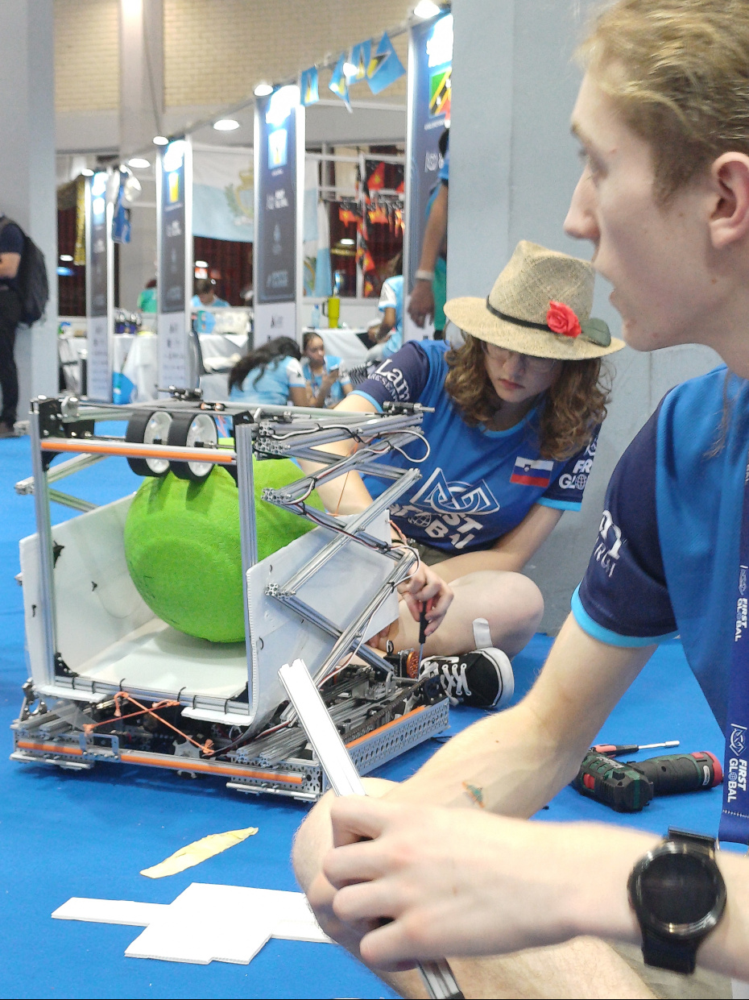
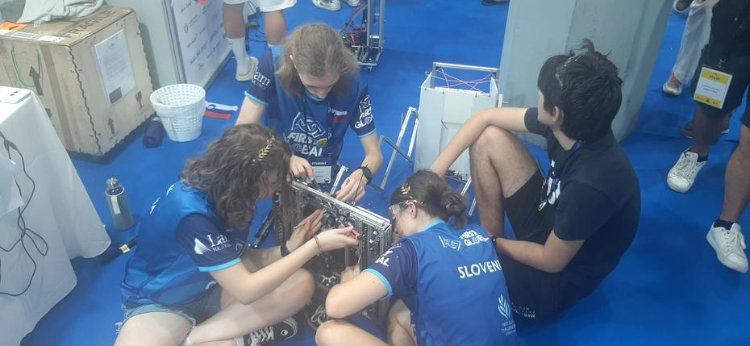
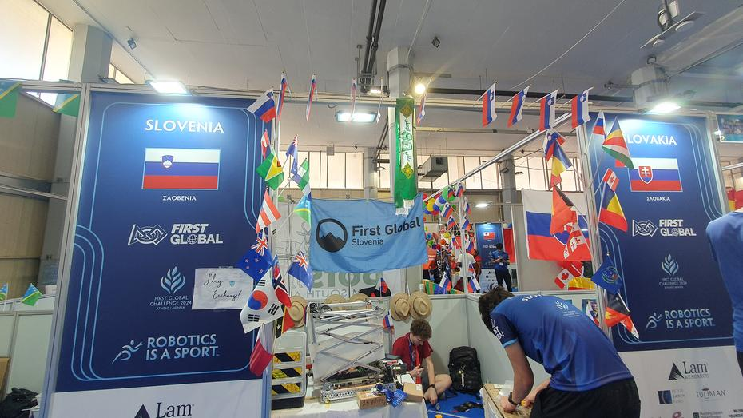
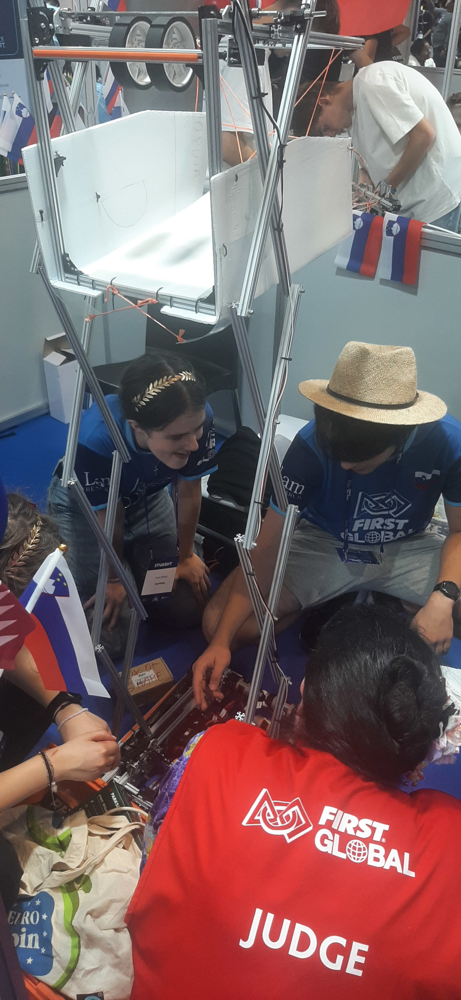
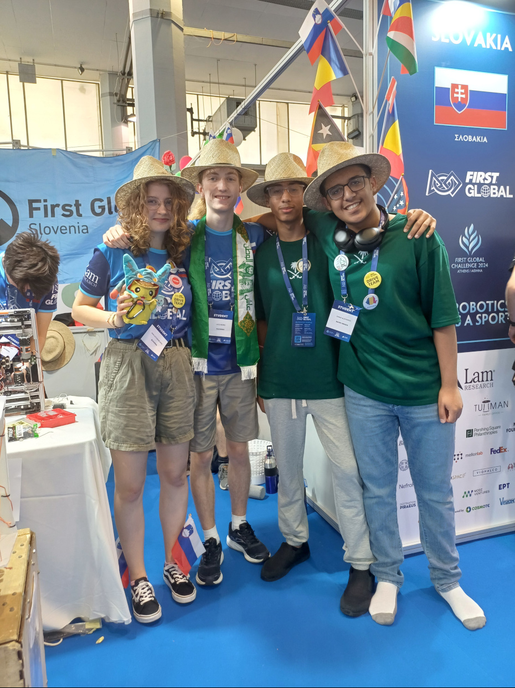
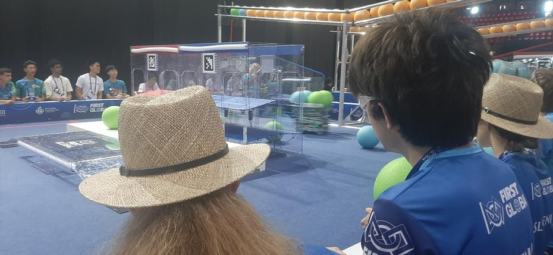

Našo sredo smo začeli z obilnim zajtrkom na strehi hotela Titania ob sončnem vzhodu, do
katerega smo se morali prebiti preko stopnišča zasilnega izhoda zaradi zasedenosti dvigal.
V 11. nadstropju nas je dočakala gneča, poleg pogleda na akropolo. Pomanjkanje pribora je
kompenzirala okusna hrana, ki smo jo morali hitro počistiti s krožnikov, da ne bi zamudili
avtobusa, kot se je to zgodilo nekaterim državam, medtem ko nekatere druge sploh še niso
prispele v Atene.
<!-- truncate -->

Polne avtobuse olimpijcev je pot popeljala po avtocesti do stadiona miru in prijateljstva
(Peace and Friendship Stadium). Olimpijska arena je postavljena tik ob morju in ima ukrivljeno
streho v obliki čips-a. Naraščajoče temperature so z vsakim avtobusom spremljali tudi glasovi
članov ekip, ki so nestrpno čakali na odprtje vhodnih vrat. V tem času smo imeli priložnost
pozdraviti stare prijatelje, natančneje ekipi Slovaške in Norveške. Debate in spoprijateljevanje
novih članov je hitro minilo, čas je bil da vsaka država najde svoje mesto v olimpijski
abecedi in razpakira svoje orodje ter prične z delom na robotu.

Naše udomačevanje v kotičku z napisom “Slovenija” so popestrili stari prijatelji iz Južne
Afrike, Slovaške in Solomonskih otokov. Za tem smo razpakirali robota in pričeli z manjšim
po-transportnim servisom, ki ga je prekinila velika nesreča – z enega izmed verižnikov za
naš dvigni mehanizem je zdrsnila ketna zaradi ponesrečene pozicije matice in vijaka ter se
za tem zagozdila med verižnik in profil. Ketna poleg tega ni bila pravilno sestavljena.
Kmalu smo ketno razstavili, popravili, ponovno napeljali in skupaj povezali oba konca.
Podvozje robota je bilo pripravljeno, potrebno je bilo le še preizkusiti dvižni mehanizem,
ki spominja na škarje.

Dvižni mehanizem je s pomočjo elastik bil zmožen dviga dveh žog. Skrb se je porodila med
člani ekipe zaradi nagibanja celotnega mehanizma tekom dviganja ali spuščanja. Zaradi enake
poti oz. poteka pri dviganju in spuščanju smo se odločili mehanizem pustiti kot je. Sledilo
je nekaj preizkusnih dvigov in urejanje rampe za samodejen potek žogic proti izhodu škatle.
Pri tem je bilo potrebno urediti naklon, saj bi lahko premalo napihnjena žoga ušla ven iz
škatle v primeru nenadnega ustavljanja robota.

Tekom popravljanja je mentor Luka prinesel škatlo z dresi, vrečkami, flašami in drugimi
manjšimi darili, ki jih prejme vsaka država. Potna oblačila smo zdaj lahko končno zamenjali
s športnimi majicami, kmalu za tem smo pa odkrili, da je vzrok za vročino na delovnem mestu
vseh držav napačno montirana klimatska naprava z zunanjo enoto na našem koncu. Za tem smo
se odločili začeti svetovno izmenjavo zastav, kjer lahko vsaka država dobi slovensko
zastavo,če svojo pusti pri nas.

Kmalu po trenutkih obdarovanja smo se odpravili na kosilo, ki je zajemalo kar nekaj menijev
in veliko dvorano, ki je sicer telovadnica z igrišči za košarko. Po kosilu s prijatelji iz
Norveške smo se polni energije odpravili nazaj na pit oz. štand, kjer smo kmalu po vrnitvi
dobili priložnost, da opravimo z inšpekcijo robota. Gospa je našega robota temeljito
pregledala in po demonstraciji delovanja rekla, da smo čudovito opravili. Pozabila nam je
dati nalepko za opravljen pregled in indikator v obliki LED lučke, ki je namenjen prikazovanju
za katero stran (alianco) igraš, tako da smo to dobili kasneje.

Po inšpekciji so se dijaki razdelili, pri čemer so nekateri odkorakali do poskusnih polj ostali
pa na spoznavanje ostalih ekip oz. držav. V vmesnem času sta mentorja varovala naš štand
in debatirala z mentorji ostalih ekip.

Po ponovnem zboru vseh dijakov na delovnem mestu smo slišali po ozvočenju za sestanek voznikov,
ki smo ga zasledili tudi na že vnaprej objavljenem sporedu. Vozniki in t.i. človeški igralci 
(human player) so tekom dobro uro dolgega sestanka izvedeli več o pravilih izvedbe samih
tekem. Takoj po koncu sestanka se je odprla priložnost za poskusno igro in po enem klicu
je bil robot že na poti.

Po daljšem času so se dijaki vrnili, kot nalašč v času za večerjo. Tudi tokrat smo se v
dveh izmenah podali na par minutni sprehod okoli celotne arene, da smo prispeli do jedilnice,
kjer nas je dočakal nov meni in še ena obilna jed. Po večerji smo še pospravili naš štand
in se odpravili na avtobus domov. Pred počitkom smo še zadnje popravke namenimili naši
dokumentaciji in se dogovorili za tisk z osebjem na recepciji hotela.

Do naslednjič,
dobru noc