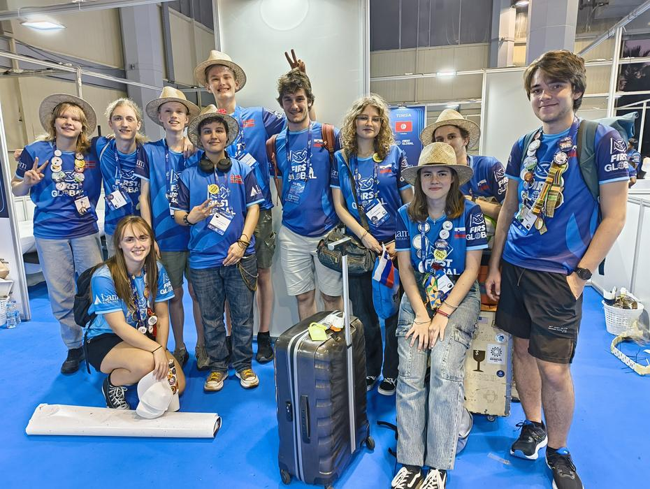
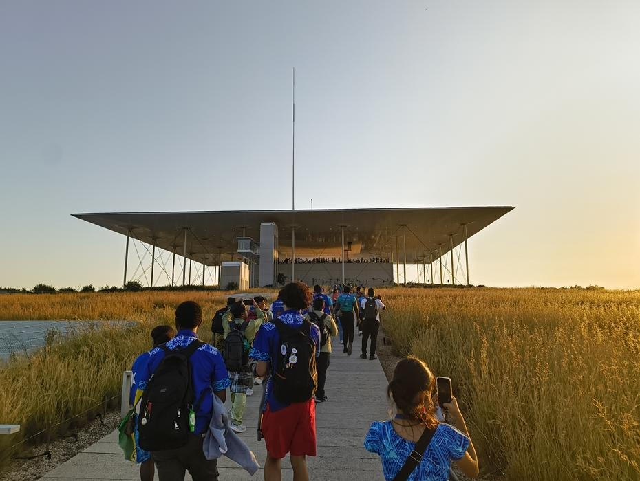
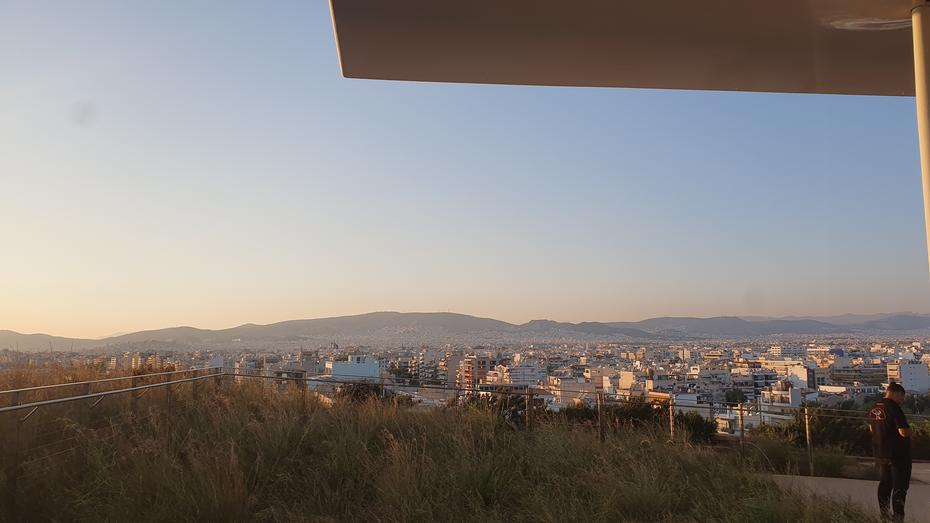
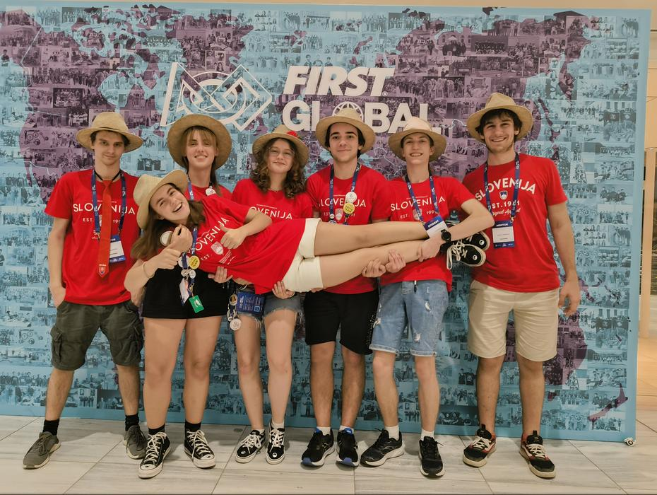

Po dolgi noči in kratkem spancu smo odprli oči v prvi tekmovalni dan. Enakemu jutranjemu
ritualu in poti do stadiona miru in prijateljstva je sledila obljubljena seja popravljanja
robota, natančneje mehanizma za ujetje žoge. Po krajši preizkusni seji smo spremenili pristop,
in sicer smo ubrali pristop podoben rešitvi naših kolegov iz Norveške. "Kletko" smo izdelali
iz profilov in gredi, na katerih so bile nameščene objemke, ki so zmanjšale trenje in s tem
omogočile drsenje žoge s prostim vrtenjem na gredi.
<!-- truncate -->

Ker čas hitreje mineva bližje kot smo točkovanim igram, nismo uspeli namestiti novega mehanizma,
ki bi potreboval dodatno programiranje komponent za uspešno obratovanje. Iz omenjega razloga
smo oddrveli na prvo resno igro, in sicer na tekmo številka 22, ki smo jo igrali ob strani
Maroka in Tunizija. Žal smo bili premagani z izzidom 24 - 32 proti modri alianci, ki so jo
sestavljale Irak, Italija in Laos.

<iframe title="YouTube video player" src="https://www.youtube.com/embed/V06dYpW1Yrw?si=OTZYkwNOXv4_FZhz&amp;start=4489" style={{ width: "100%", aspectRatio: '16/9' }} frameborder="0" allowfullscreen="allowfullscreen"></iframe>

Manjši popravki in uvodna vaja so nam dali dodatno motivacijo, ki je prišla do izraza v naši
drugi igri oz. tekmi številka 51, ki smo jo odigrali v družbi ekip iz Črne Gore in Kajmanskih
otokov. Tokrat smo končali z močnejšim izzidom s kar 55 točkami, ki jih je pa uspela nasprotna
alianca izenačiti. V igri proti državam Niger, Belorusija in Cookovi otoki ni bilo zmagovalca.

<iframe title="YouTube video player" src="https://www.youtube.com/embed/Pu7E_WJHU_g?si=uudp9p1rpWLiSbnp&amp;start=12575" style={{ width: "100%", aspectRatio: '16/9' }} frameborder="0" allowfullscreen="allowfullscreen"></iframe>

Kmalu je nastopilo kosilo, ki nam je poleg skoraj zmagane igre dalo dodatno energijo. Pisk
je ponovno naznanil začetek tekme, in sicer tekme številka 82. Tokrat smo združili moči s
Ciprom in Ekvadorjem, da smo si pridobili zmago z rezultatom 48 - 42 proti Angoli, Alžiriji
in Bocvani.

<iframe title="YouTube video player" src="https://www.youtube.com/embed/V06dYpW1Yrw?si=Iph78Gqizm8fAHy6&amp;start=17316" style={{ width: "100%", aspectRatio: '16/9' }} frameborder="0" allowfullscreen="allowfullscreen"></iframe>

Zadnja igra pred našo napovedano večerjo mešanih kultur je imela zaporedno številko 102.
Tokrat smo na rdeči strani strani sodelovali z Japonsko in Urugvajem. Vse je tekoče teklo,
dokler ni v robotu nekaj naredilo neprijetnega zvoka, ki mu je sledila zelo ukrivljena
trajektorija dvižnega mehanizma. Poleg nesreče smo morali zaradi nepravilnega delovanja
elementov na polju (v primeru izpolnjenega pogoja - modra in zelena žoga v košu, se ni
sprostila oranžna žoga) ponoviti igro od začetka. Še zadnji poskus uporabe dvižnega mehanizma
je rezultiral v spremembi strategije do te mere, da smo samo še prevažali ročno vstavljene
žoge do zbirališča na tleh. Žal smo države v rdeči alianci tokrat pristale v rdečem tudi z
rezultatom, saj se je igra končala z izzidom 57 - 77. S tem smo prvi dan točkovanih iger
zaključili z 1 zmago, 1 izenačenjem in 2 izgubljenima igrama.

<iframe title="YouTube video player" src="https://www.youtube.com/embed/Pu7E_WJHU_g?si=UDEZANhfYD42BBRq&amp;start=20014" style={{ width: "100%", aspectRatio: '16/9' }} frameborder="0" allowfullscreen="allowfullscreen"></iframe>

Napočil je čas, da se preoblečemo v nekoliko drugačna oblačila. Tokrat smo ubrali majice z
napisom Slovenija in se ob klicu odpravili na avtobus proti Stavros Niarchos kulturnemu
centru. V avtobusu na poti do atenske špice oz. tivolija so nam družbo delali člani slovaške
ekipe iz severnega hribovitega dela države. Sprehod ob zgradbi in mirujoči vodi omenjenega
kulturnega centra nam še ni ničesar izdal, medtem ko se je za vogalom razkril stekleni del
zgradbe, katere notranjost je po nadstropjih spominjala na prenovljeno ljubljansko cukrarno.
Objekt očitno pogosto obiskujejo ljudje na sprehodih, se zadržujejo v kavarni ali pa se
družijo na bližnjem travniku. Mi smo sledili prostovoljcem z napisom "First Global Challenge"
in tako nas je pot popeljala po rampi, nato skozi manjši park z nizkimi drevesi in travnikom
na še eno rampo do vrha kulturnega centra. Tam je vseh 193 ekip dočakala glasba, panoramski
razgled in raznolika hrana (sladoledni bar se je odprl naknadno).

Tako smo ob glasbi in hrani s pogledom na sončni zahod zaključili dan. Žal se je odhod zavlekel,
čeprav bi morali z nastopom in plesom bobnarjev zaključiti dan. Tako smo s približno dvournim
zamikom odšli domov in se nekateri odpravili na zaslužen počitek, drugi so pa vihteli karte
pred spancem.

Do naslednjič,
god natt