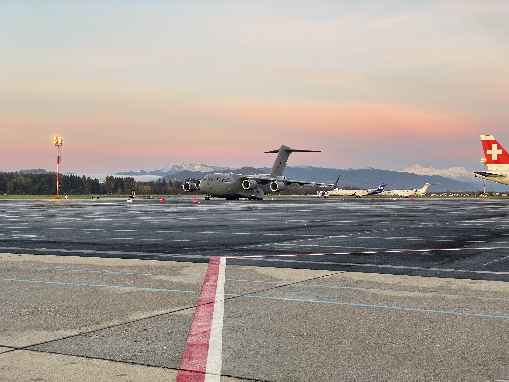
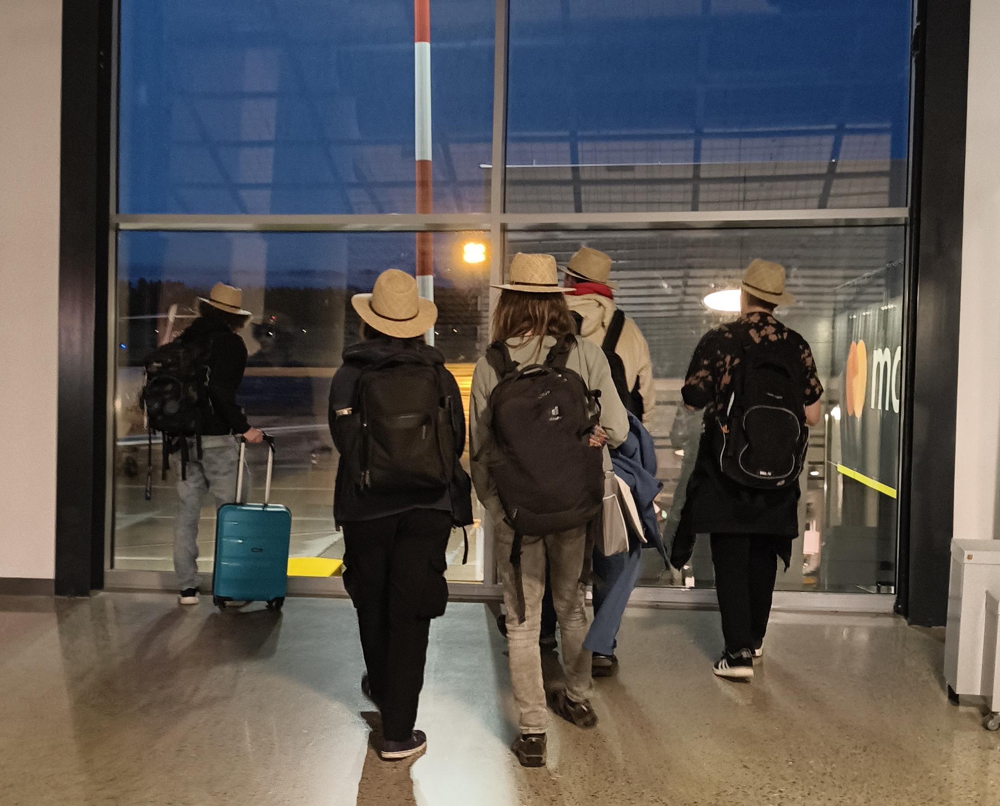
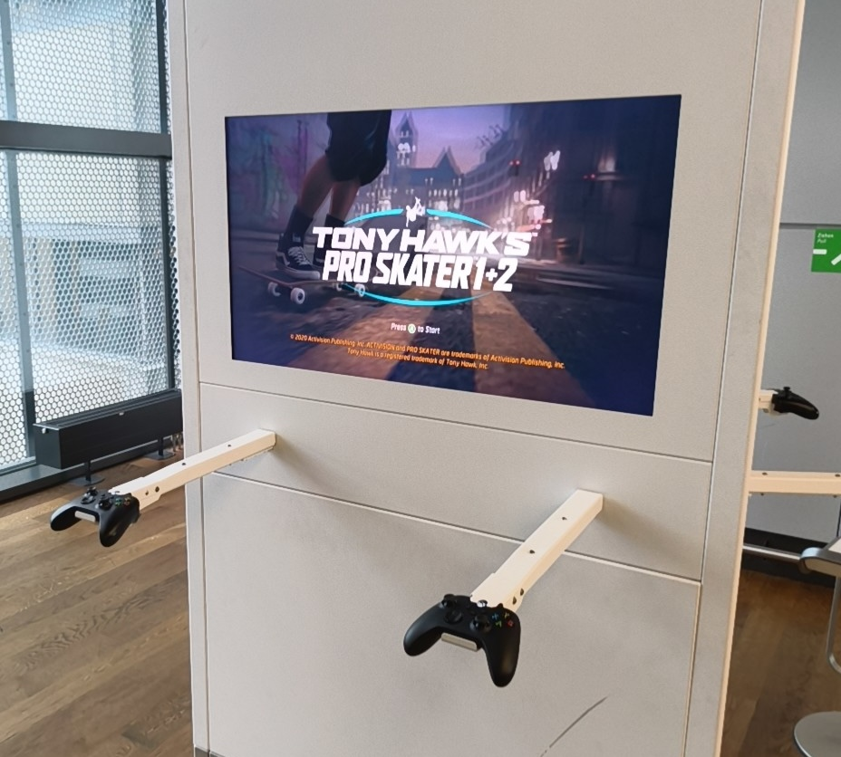
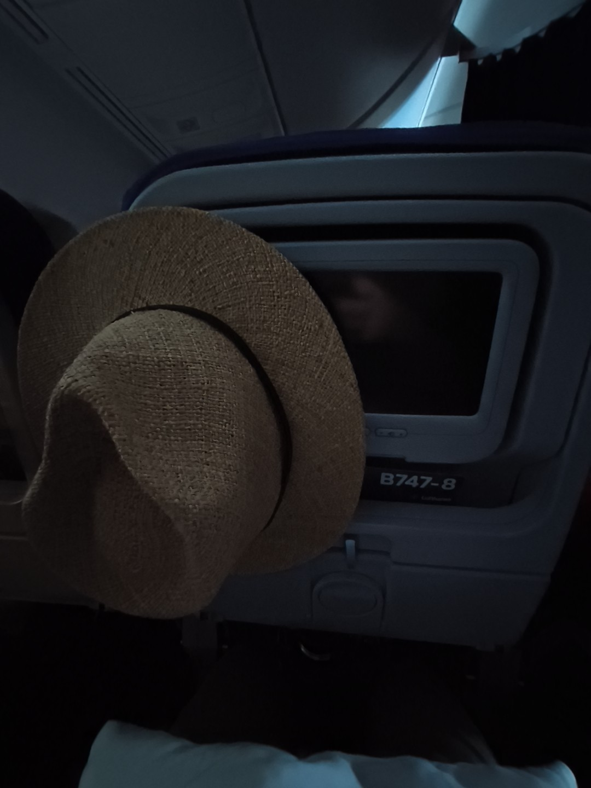
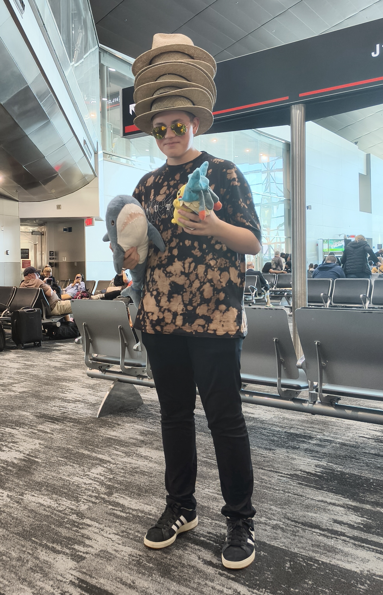
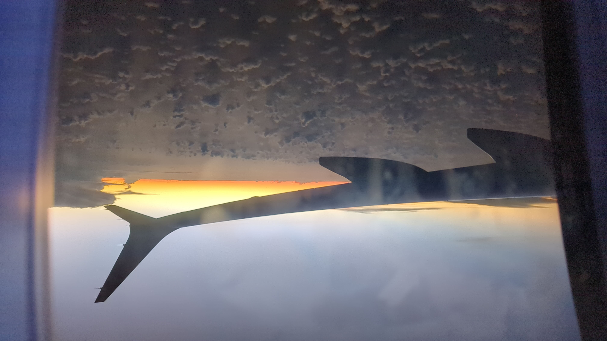
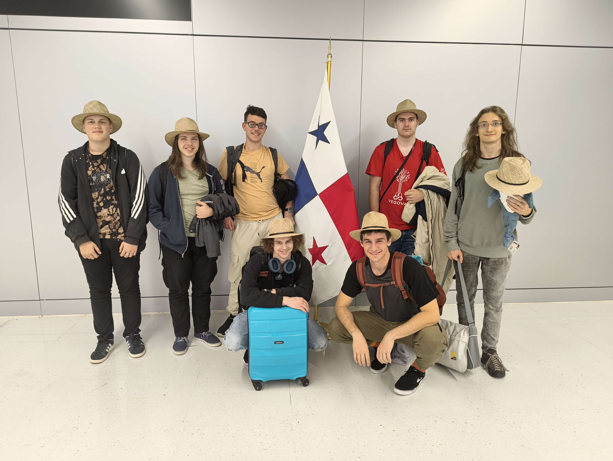
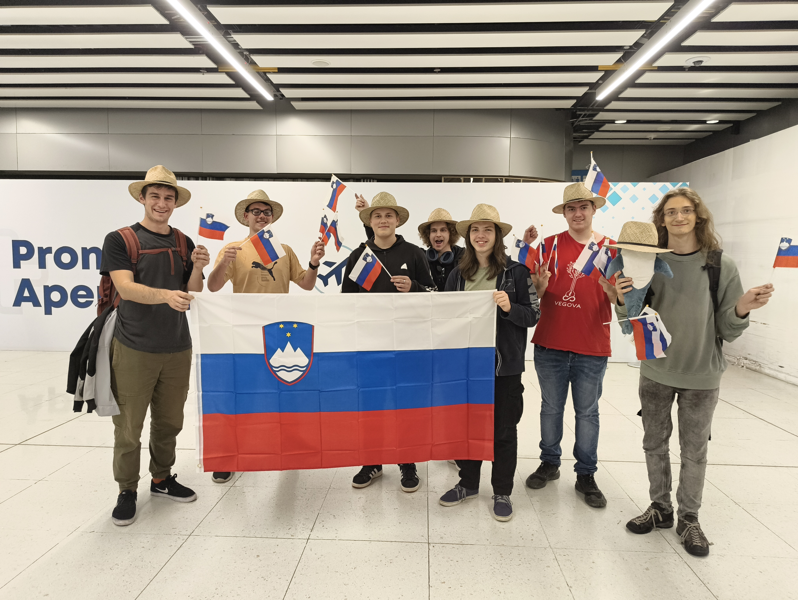
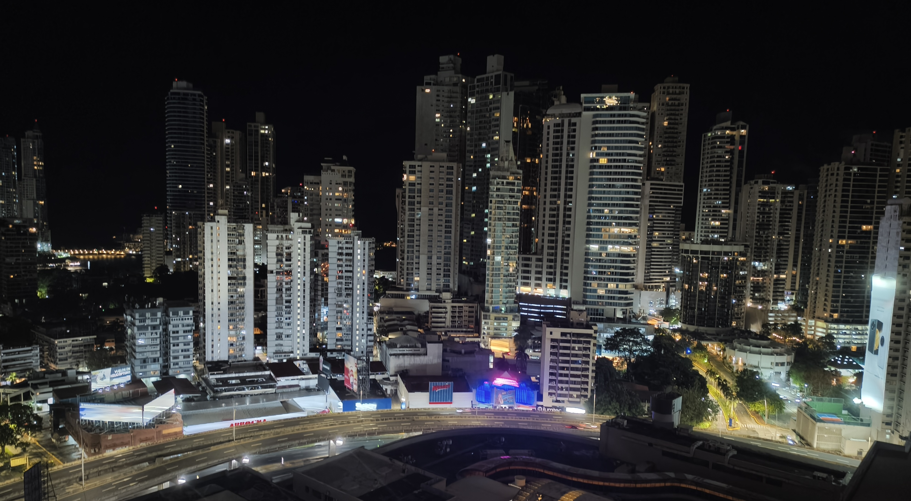

Letošnja ekipa je svojo pot začela 27.10.2025 ob 5:00 na Brniku. Prelaganju in tehtanju prtljage je sledila logistika oddajanja robota kot kosa prtljage. Ko smo imeli karte v rokah smo opravili varnostni pregled in se napotili do vrat našega leta smo si lahko privoščili nekaj minut za oddih in ogled letal.
<!-- truncate -->

Let do Frankfutra je trajal približno dve uri, po pristanku smo pa hitro opravili potovalno logistiko in se parkirali pred naslednji “gate”. Preostanek časa smo porabili za iskanje in uživanje v malici ali pa igranje igric o rolkanju na konzolah letališča.

Odhod iz Frankfurta ni bil težaven, smo pa bili razporejeni na zgornje in spodnje nadstropje letala. Udobno smo se namestili, klobuke posadili v naročje ali nataknili na obešalnik in se kratkočasili s spanjem, opravljanjem službenih dolžnosti ali pa gledanjem filmov. 10 urni let je minil brez težav, trajal je pa le 4 ure (če bi gledali le uro prihoda in odhoda).

Pristanek na Floridi nam je podaril pogled na gosto poseljena naselja, bazene vode in ameriške “highway-e”. Ker nismo imeli ameriških potnih listov smo se usmerili v dolgo vrsto, na koncu katere nas je čakalo krajše izpraševanje in pridobivanje podatkov o prstnih odtisih (4 na vsaki roki in palec vsake roke). Malo preden smo prišli na vrsto smo zasledili napis na ekranu, da ne smemo prinesti hrane, zato smo morali hitro pojesti svoje čokoladke in sendviče (sicer potem ni bilo težav, vendar vsaj nismo bili potem lačni vsi). Sledil je “check-in”, kjer smo zaradi jezikovnih ovir zgubili nekaj časa, še več časa je pa ušlo, ker so pri zadnjem članu narobe zastopili situacijo in mislili, da potrebuje za vstop vizo (kljub urejenim ESTA-m). Posledično smo šibali na varnostni pregled, kjer so kot nalašč pregledali nekaj naših nahrbtnikov, tako da smo še bolj zadnjo sekundo prišli do prijave za na letalo. Nekaj minut smo imeli za oddih, vendar ne dovolj da bi lačni člani poiskali prodajalno hrane. So pa uspeli člani ekipe posneti prispevek za Social Media Challenge, v katerem so morali dokumentirati svojo pot do Paname. 

Zadnjo sekundo smo izvedeli, da boarding pass-i niso dovolj in da moramo iti čez postopek prijave s pomočjo potnih listov in ESTA-e. Končno smo prispeli na letalo, zasedli pozicije in se prepustili sončnemu zahodu in tropskim sokovom (Guava-Ananas, med drugim).

Ko smo prispeli v Panamo, smo srečali gospo s "First Gobal” napisom, ki nas je pospremila na drugo stran letališča (dobesedno) peš, da smo opravili Inšpekcijo, kjer so prav tako vzeli naše prstne odtise in sliko. Nato smo se slikali ob zastavi Paname, pobrali prtljago in se odpravili do izhoda, kjer smo bili pospremljeni na avtobus s turškim interierjem (tepihi in tapete).

Pot je nas in ekipi Južne Koreje ter Ekvadorja peljala mimo avtobusov z bliskavicami na vrhu, preko avtocest in mimo blokov, da prijetno osvetljenega mesta. V hotelu Megapolis smo srečali v avli še nekaj ekip, ki so čakali na svoje sobe. Očitno se je logistika za sobe precej zakomplicirala, saj je vsaka ekipa na recepciji preživel po 30 minut, preden so dobili sobe, ki so sproti postale dostopne. Po uri in pol čakanja sva mentorja prišla na vrsto in počasi izpolnila podatke ter dočakala dostopnost sob, medtem ko so ostale ekipe se pritoževale. Postopek je bil sicer dolg, vendar problem sta bila utrujenost in pozna ura.

Po uspešni vselitvi v sobe je sledilo dokončevanje tehnične dokumentacije in sprehod do bližnjega marketa. Na sprehod sva ugotovila, da je mesto res varno (na kar je namigoval gospod ob ob vstopu v Miami). Namreč vsakih 200 metrov sva srečala varnostnika ali policista, pri čemer na sprehodu nisva srečala vse skupaj 10 ljudi v roku dobre pol ure. Dan se je končal tako, da je v trgovini Marbella gospod brez znanja španščine in angleščine uspel spremeniti električno napeljavo za plačilo s kartico tako, da sva lahko instant nudle kupila brez vstopa v trgovino. "Muchos gracias" je zaključil izkušnjo (ter odprl željo po pijači “pipa fria”) in naju popeljal na pot nazaj v stanovanje, kjer sva s pomočjo kuhalnika za čaj pripravila vrelo vodo in zaužila svoje rezance ob 1:30 po panamskem času. O tem, kako obratujemo na slabih štirih urah spanca, pa si lahko preberete v naslednji objavi.

Do naslednjič,

buenas noches 