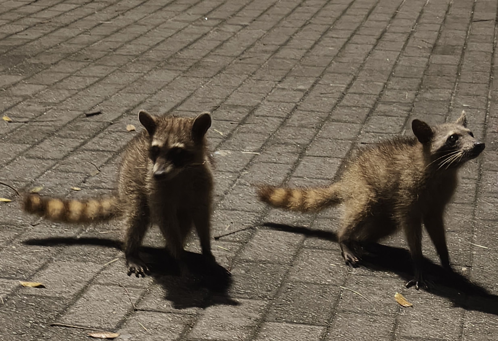

Nekaj ur spanca in sončno jutro je bilo dovolj, da smo se lahko pobrali od dolgega leta. Ob 6:20 po lokalnem času smo se dobili v drugem nadstropju in se odpravili na zajtrk. Sveže sadje, čevapi in ostala bolj tipična hotelska hrana so nas uspeli okrepčati skupaj z eksotičnimi sokovi (pasijonka, jugo ipd.). Ura je to jutro hitro tiktakala, saj smo ob 7:00 morali biti že na avtobusu. Pobrali smo stvari, zaužili sončni vzhod in po dolgem čakanju na dvigalo spravili robota iz 24 nadstropja (izmed 62-ih) v avlo.
<!-- truncate -->
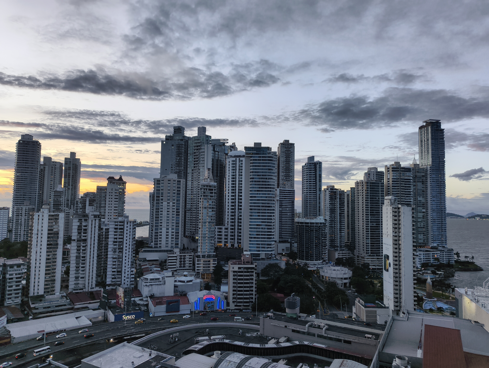

Pot do letošnjega mesta dogajanja je hitro minila, saj smo lahko uživali ob pogledu na morje in visoke stavbe, medtem ko je na vsako uho letel jezik z drugega kontinenta. Panama Convention Center nas je pričakal s tropskim rastlinstvom in vlakom pred vhodom. Velika steklena bela avla je ob našem prihodu varovala mnoge najstnike pred soparnim zrakom gostujoče države, monotonost so pa uspeli razbiti z druženjem, glasbo in plesom. Podobno kot mnoga leta so zabavo vodili dijaki iz Venezule in Tunizije, tako da je bil dolgčas na dnu seznama prisotnosti. Naša ekipa se je parkirala na strani in prepustila dijakom prosto pot, da spoznajo svoje sovrstnike. Kmalu so nas organizatorji usmerili desno od vhoda, proti vhodu v halo, v kateri se bomo družili prihodnjih nekaj dni. Vrsta je bila vedno daljša, vendar v čredi je slamnike enostavno šteti. 

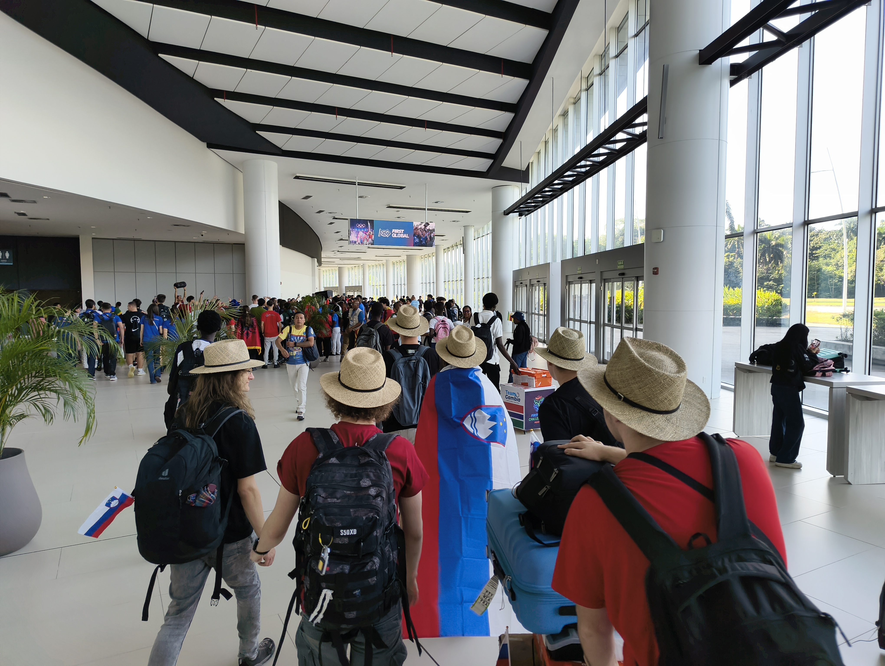

Hitro smo uspeli locirati svoj štand in se takoj lotili tradicionalnega okraševanja. Polovica ekipe je obešala zastavice, medtem ko je druga polovica razpakirala robota in se lotila servisiranja ter preizkušanja.

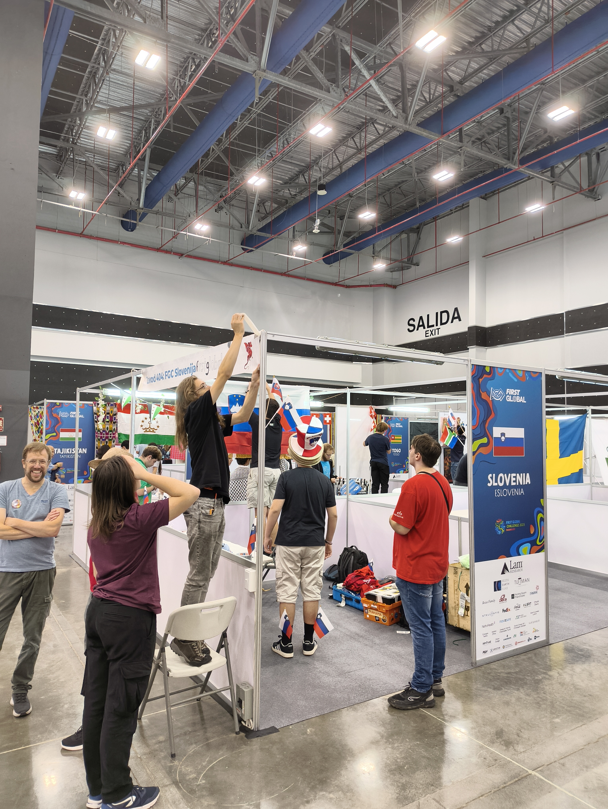

Preostanek časa na dogodku je zajemal preizkušanje robota na polju, spoznavanje novih prijateljev, okušanje novih sladic, druženje s starimi kolegi in ekipno druženje ob kosilu in večerji.

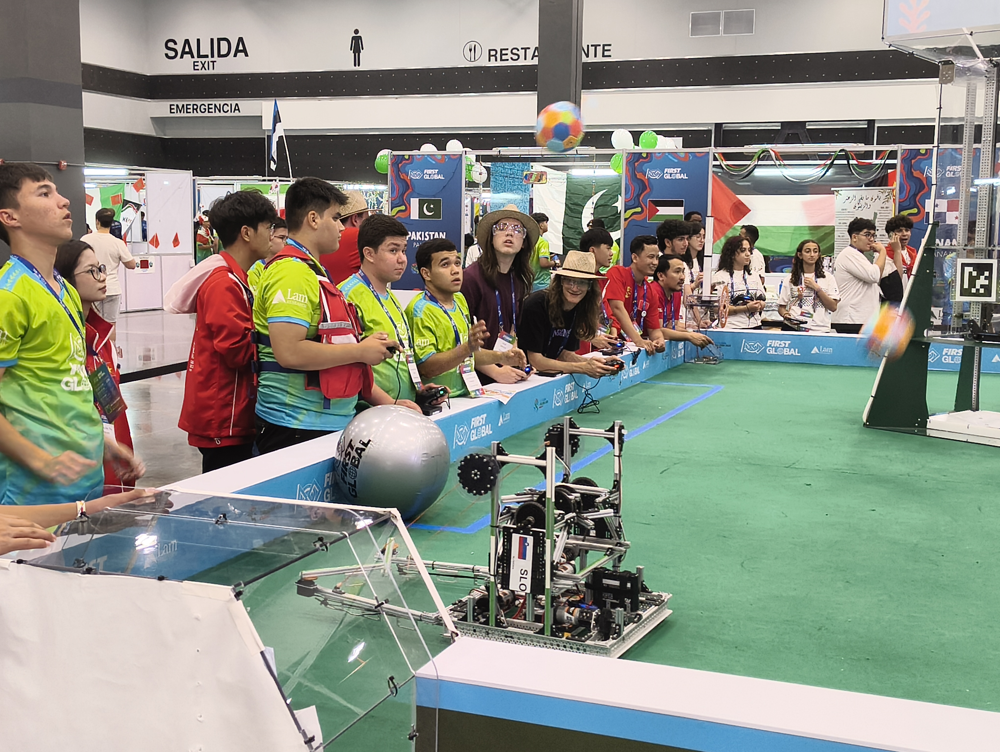

Po prihodu v hotel smo si vzeli par minut za oddih in se dobili v avli hotela, od koder smo se odpravili ven. Ustavili smo se čez cesto v Outlet shopping centru, kjer smo v Wow shop-u našli veliko vsega. Nakup se je zaključil na blagajni s stolom za kampiranje, napihljivim stolom, sladkimi pijačami in 10 kW zvočnikom na tekočem traku. Da se ne bi sprehajali z artikli po mestu smo se oglasili na kratko v hotelskih sobah, kjer smo preizkusili stol in pozorno prebrali navodila za uporabo zvočnika, ki so bila vprašljiva, vendar sprejemljiva. 

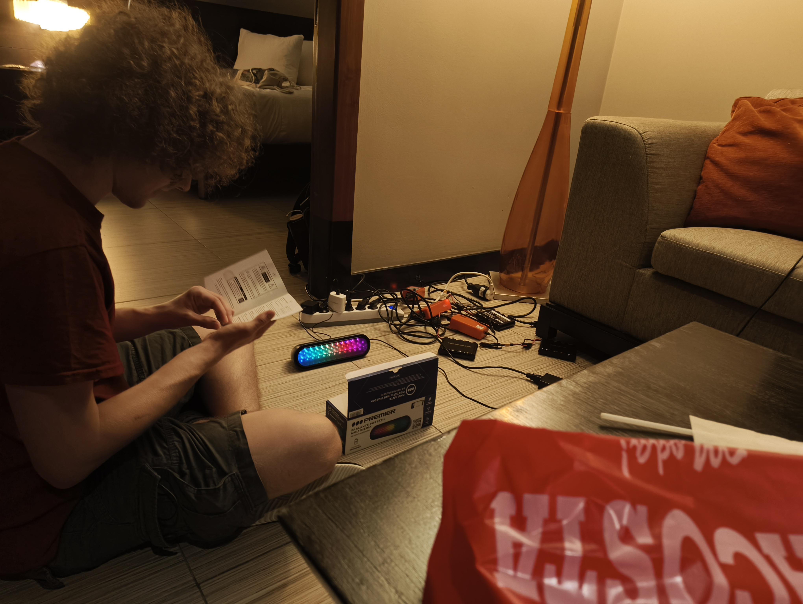

Kmalu smo se napotili naprej s ciljem, da pridemo do morja in obiščemo rakune. Pot nas je popeljala ob glavni cesti, ki je vzporedna obali. Tekom hoje smo videli kar nekaj spuščenih taksijev in avtov z žarometi modre ali rumene barve. Tokrat so nam prehodi za pešče bili naklonjeni in tipke za le te so delale kot morajo. Prehodi za prečkanje glavne ceste so zelo redki, namen le teh pa je da pešci pridejo do otočka na sredini glavne ceste. Otoček zajema parking in rdeč most, preko katerega je mogoče prečkati še en par pasov glavne ceste, da pridemo do obale.

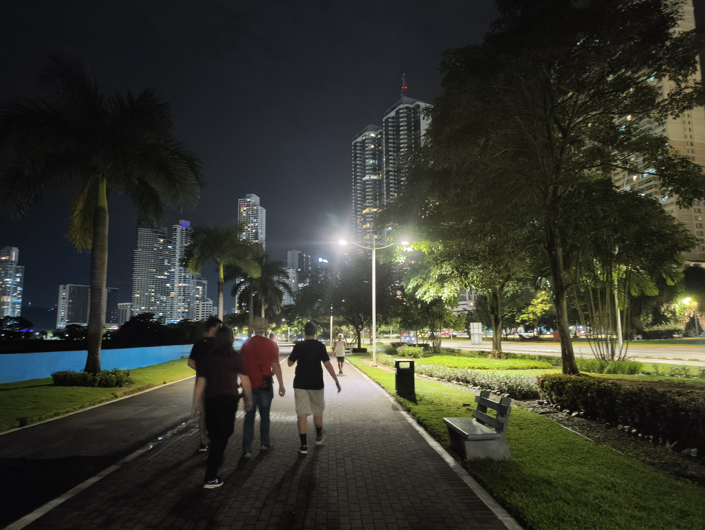
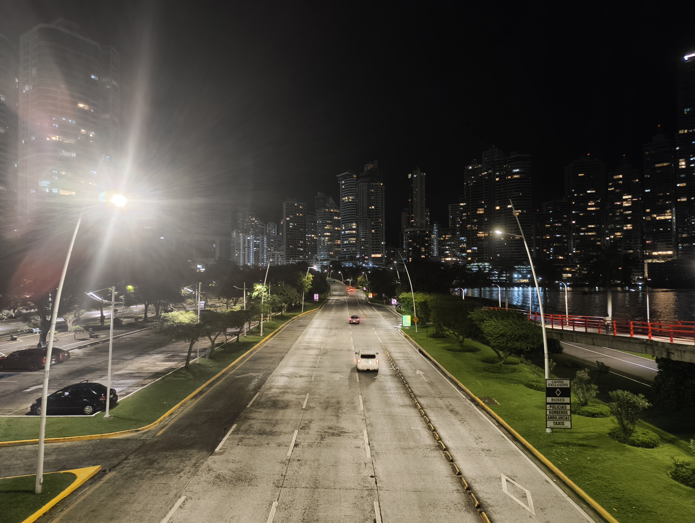

Med sprehodom po obali smo na široki potki srečali veliko tekačev in ozkih klopic. Ob naši trasi je potekala tudi pot za kotalkarje in kolesarje. Na poti do rakunov smo šli mimo nekaj igrišč, merilnika UV svetlobe in nekaj vodnjakov. Voda v Panami do zdaj ni najokusnejša. Kmalu so našo pozornost pritegnile speče mačke na steni ob obali. Za njimi smo videli bleščeče oči z majhnimi rokami blizu. Za mačkami so bili trije rakuni na kamnih ob plaži. S fotografiranjem smo hitro obupali, saj so bili skriti v temi noči. Smo pa naleteli na novo štirico rakunov malo za tem. Veselo so pristopili do nas, v upanju da jim bomo ponudili večerjo. Ko so ugotovili, da od tega ne bo nič, so se napotili do bližnjega koša za smeti, da poskusijo svojo srečo. Takrat smo ugotovili, da so kar spretni pri plezanju tako v smetnjake kot na drevesa. V tem procesu se je eden izmed rakunov znašel na nasprotni strani ograje (ne vemo kako) in ni znal priti ven iz otroškega igrišča. Nekaj časa se je mučil z ograjo, vendar je ni znal preplezati. Kmalu smo mu šli pomagati in ga usmerjali ven, pri čemer je nabolje razumel ortonormirano 3D bazo. Ko smo jih pospremili domov (do stene ob plaži) smo se napotili domov, kjer je našo pozornost ujela neznana vrsta ptice, ki je bila podobna lastovki. Kot zelo laični biologi smo jo analizirali in kmalu obupali z raziskavo.

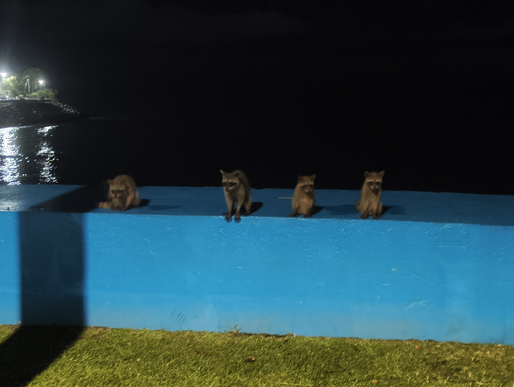

Pot domov nas je popeljala po drugi strani ceste nazaj, od koder smo se kasneje priključili nazaj na mentorjema znano traso nazaj do hotela Megapolis.

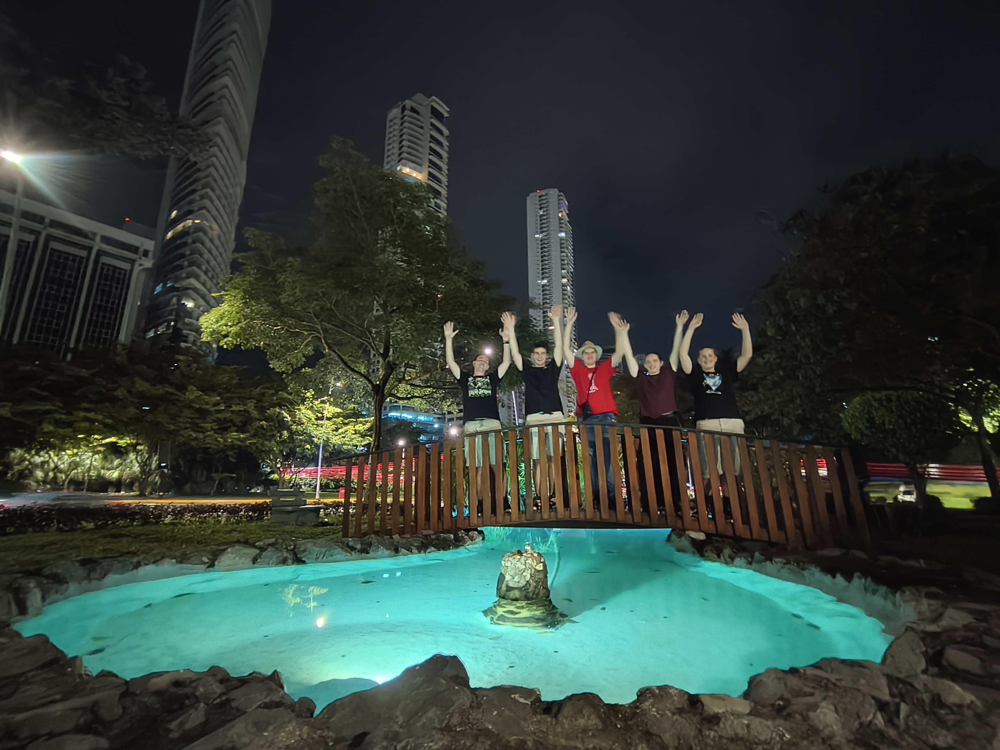
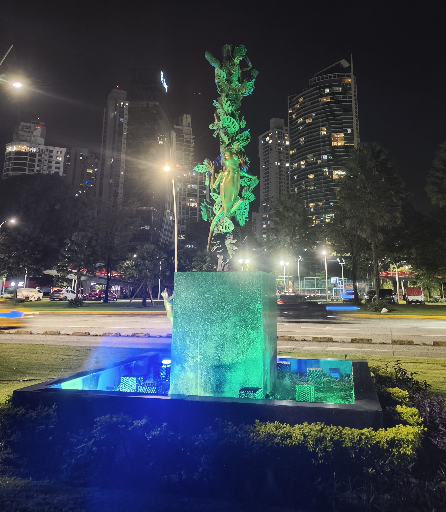

Po vrnitvi v hotel smo namenili par minut planiranju za naslednji dan in se nato odpravili vsi v svoja prenočišča. Jutri nas čaka še nekaj dela na robotu in otvoritvena prireditev, tako da energija bo zelo dobrodošla.

Do naslednjič,

Gudnaet bae mi go fo slip