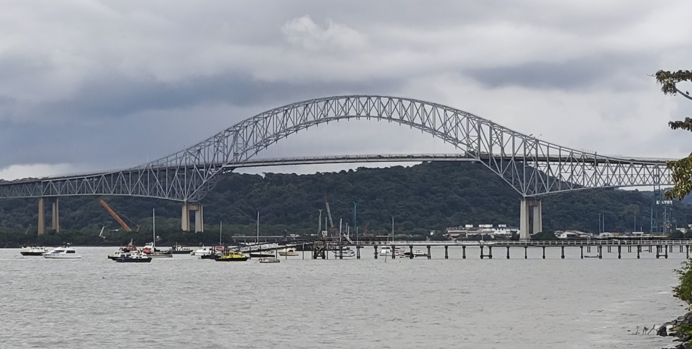

Tretji dan naše ameriške pustolovščine smo začeli na enak način, s tem da danes smo morali biti pozorni, da se po zajtrku na avtobus z nami napoti tudi kovček z narodnimi nošami. Na pot smo se podali skozi sončno jutro zopet preko mosta in skozi promet poln preventivnih hupajočih opozoril za vključitev.
<!-- truncate -->
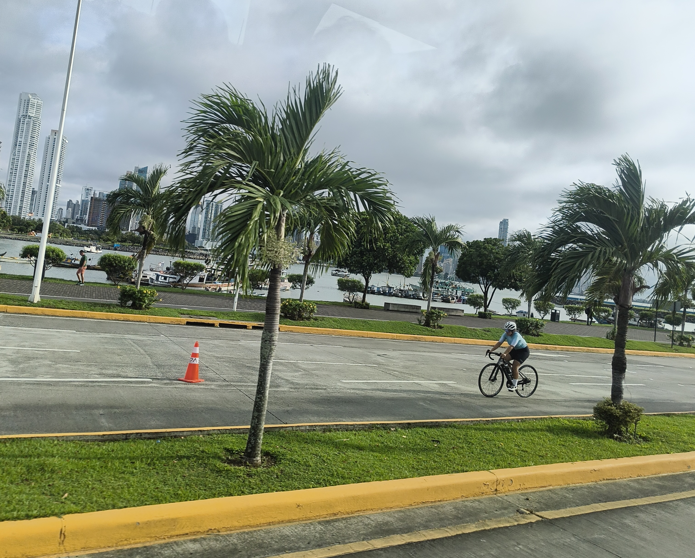
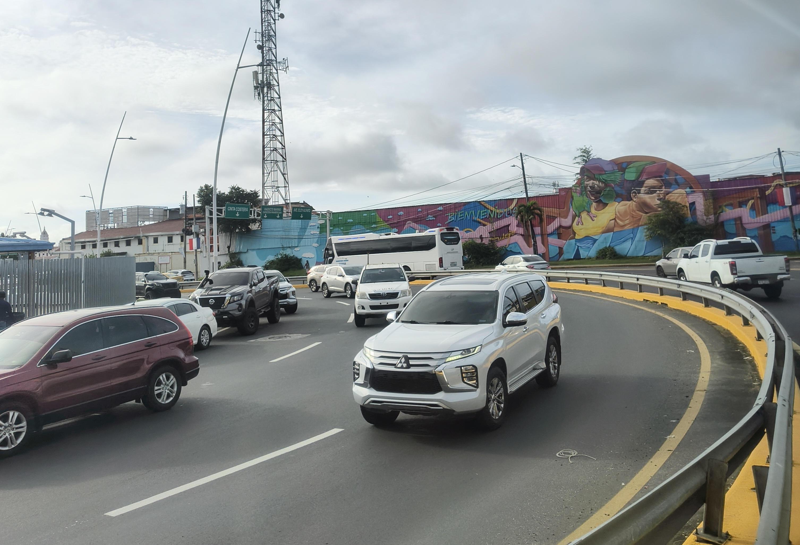

Prva točka dneva je bila dokončna postavitev elementov v štandu, kar je pomenilo preizkušanje stola za ribarjenje in napihovanje "zofe", ki se je kasneje izkazala za pravi hit, saj je navdušila vsakega obiskovalca.

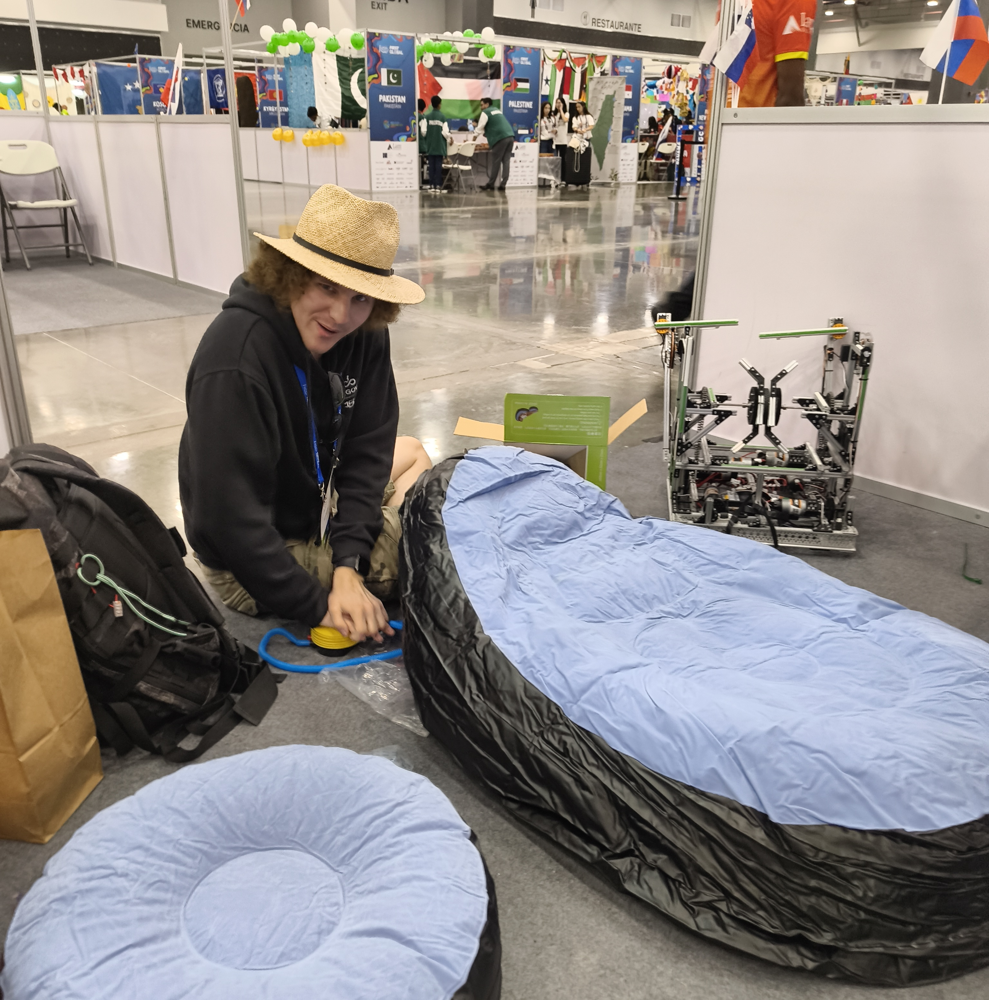

Na sporedu za današnji dan je bilo preizkušanje robota na prijateljskih tekmah (practice match), na katere so se člani morali prijaviti vnaprej. Med čakanjem na ogrevalne tekme so fanti preizkušali robota kar na prehodu med štandi. Ko fantje niso imeli roke polne dela so se namenili naokoli na ogled robotov, preizkušanje sladkarij ali pa opravljanje različnih družabnih opravil (podpisovanje knjižic, zastav ipd.).

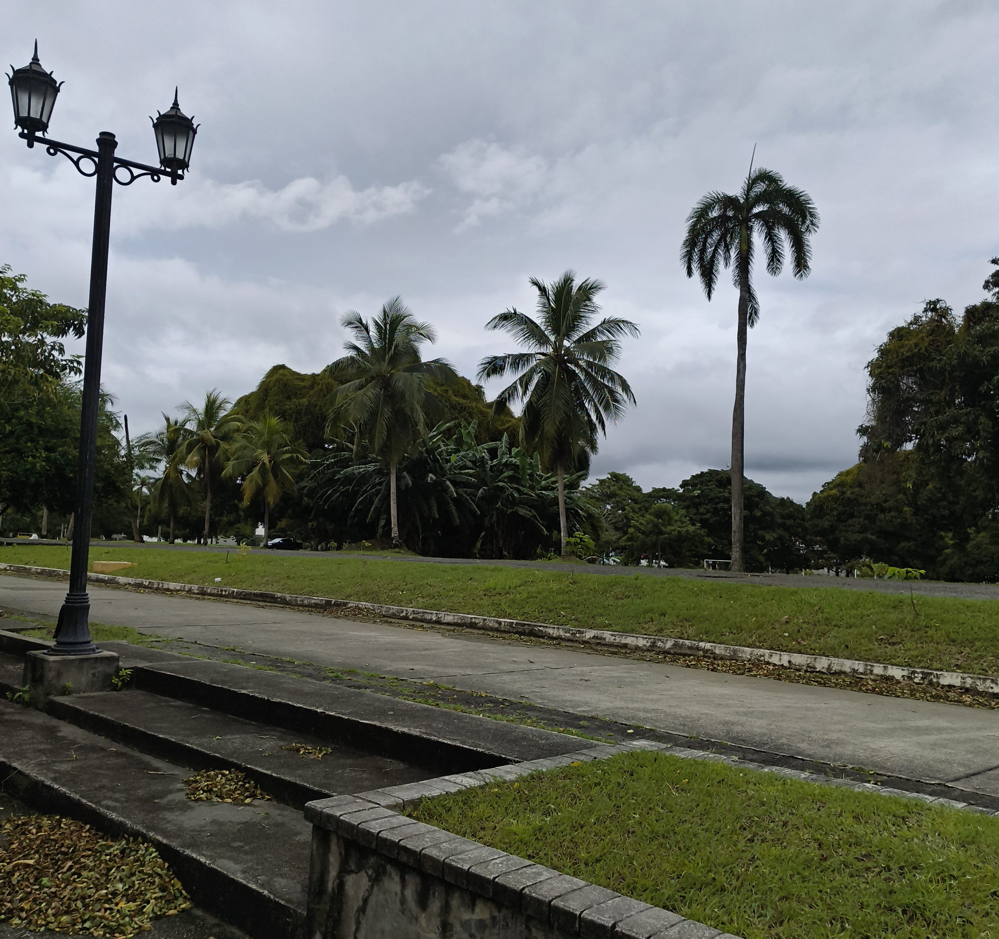

Trdo delo si zasluži tudi primeren počitek, zato se je zasedba odpravila tudi na ogled bližnje okolice. Čez cesto je bila pot, ki nas je popeljala do spomenika, ki se navezuje na Južno Korejo in Panamo. Malo naprej od omenjenega spomenika je pa voda, ki teče skozi Panamski kanal. Naš pogled je ravno takrat prečkala velika tovorna ladja, ki je bila napotena proti znanemu mostu.

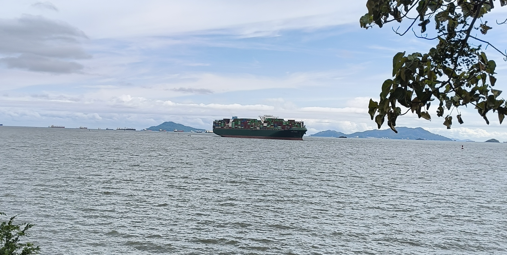
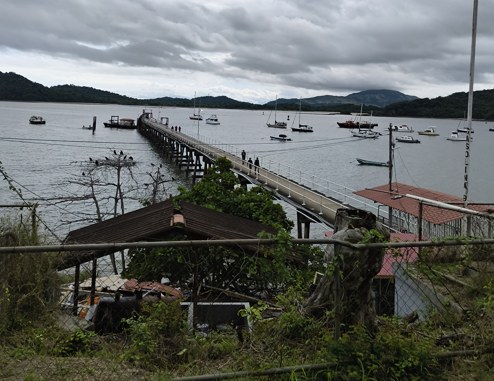

Bližje proti mostu smo našli tudi manjši pomol, na katerem so delavci nalagali tovor v manjših porcijah na manjše ladje. Okolico je krasilo raznoliko rastlinstvo že celo pot, od palm do kaktusov, od barvitih ptic in rož do neurejenih električnih napeljav manjkajočih uličnih svetilk.

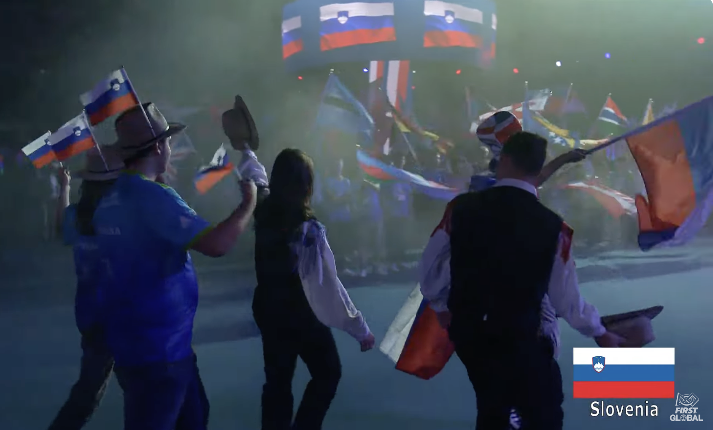

Kmalu je napočil trenutek, ko so fantje morali odložiti orodje, parkirati robota in se odpraviti na večerjo, kjer so srečali dolge vrste in neprestano izginotje zaloge. Po nekoliko manj obilni večerji so nadeli noši in klobuke ter se odpravili na generalko. Koncu le te je sledil krajši počitek, čas za osvežitev, malo za tem se je pa že pripravila vrsta zastav.

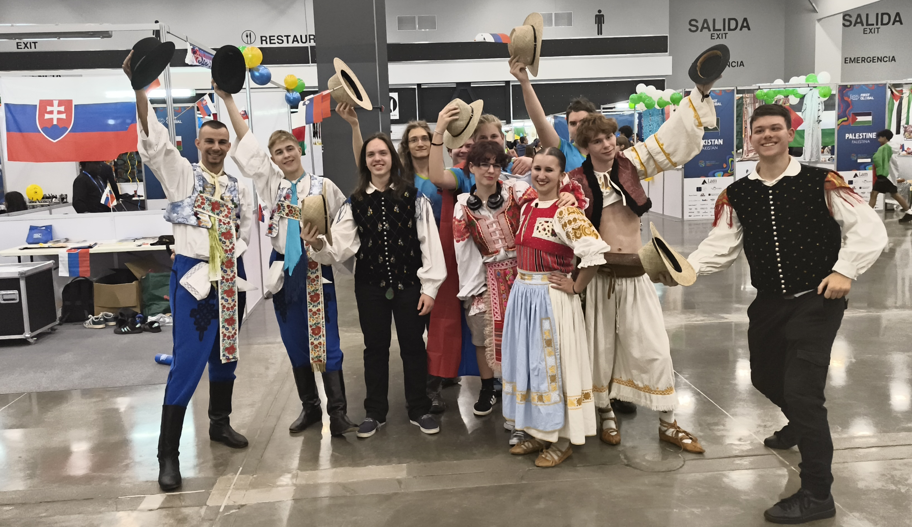

Mentorja sta zasedla svoje mesto na koncu gruče ljudi, ki so pridno že greli plehnate tribune. Mentorja sva prav na teh srečala kolega Gregory-ja, ki je bil dijak v času tekmovanja v Dubaju (2019) in ga navdušila s svojim spominom, saj sva se spomnila celotne takratne zasedbe. Izdalo ga je to, da je rekel da je iz Venezuele. 

Korakanje in vihtenje zastav v rokah bodočih inovatorjev je spremljal aplavz iz publike in občasno tudi nekaj trobil, odvisno od količine obiskovalcev iz izbrane države. Morje zastav je naznanilo pričetek govorov s strani ustanovitelja organizacije FIRST, prve dame Paname in še nekaterih pomembnih gostov. Premieri nove skladbe za tekmovanje FGC je pa sledil pravi panamski karneval, kjer sta zbor in orkester poskrbela za glasbeno spremljavo za plesalce in plesalke. Le ti so bili oblečeni v tradicionalna oblačila z različnim sijajem.

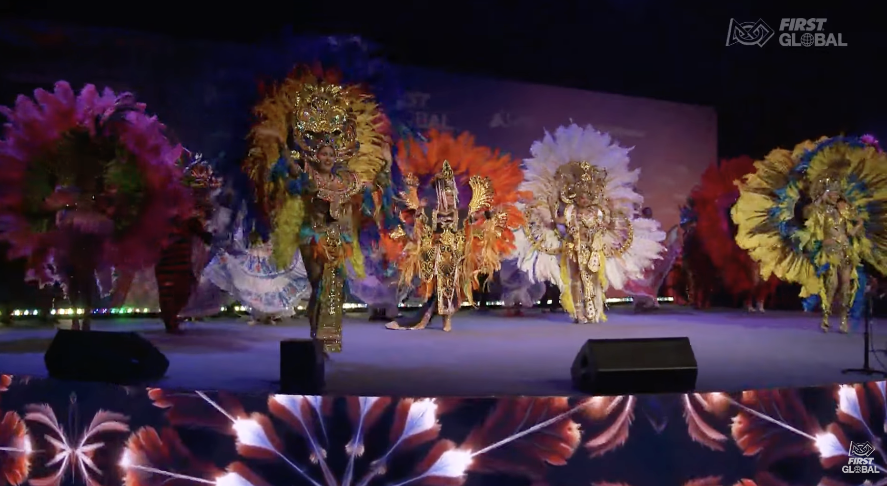

Utrujeni a veseli smo se usedli na avtobus do doma. Nekateri smo imeli mirno pot domov, medtem ko so se sedeži drugih tresli v ritmu basov zaradi latinskih pesmi. V hotelu smo odložili stvari ter se napotili v McDonalds in za tem še do kolega v 24/7 trgovino, na poti do katerih smo srečali ameriško specialiteto - vozilo CyberTruck.

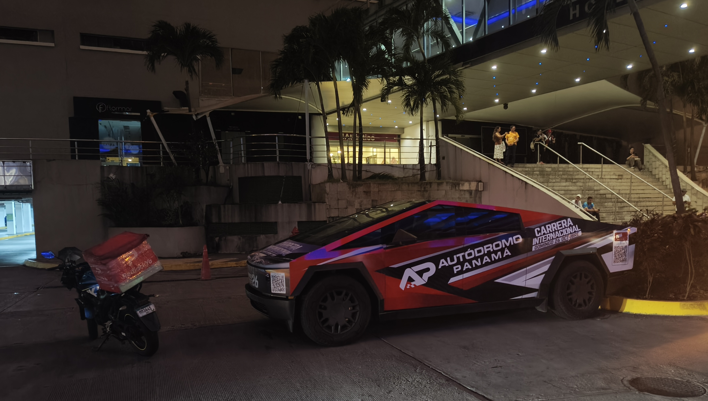

V trgovini smo si kupili različne pijače, čaje, prigrizke, plišaste tukane in magnete. Kot del kulturnega doživetja smo poskusili tudi plantano (široko banano z vonjem po kumarah), ki smo jo pripravili po tradicionalnem receptu.

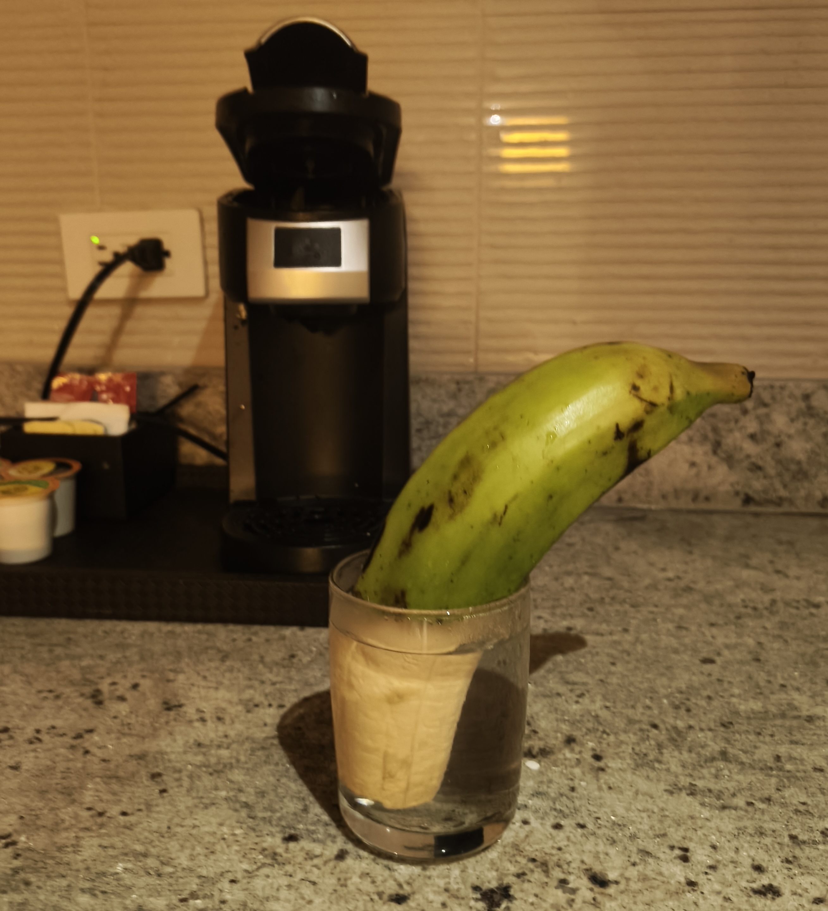

Do naslednjič,

god natt