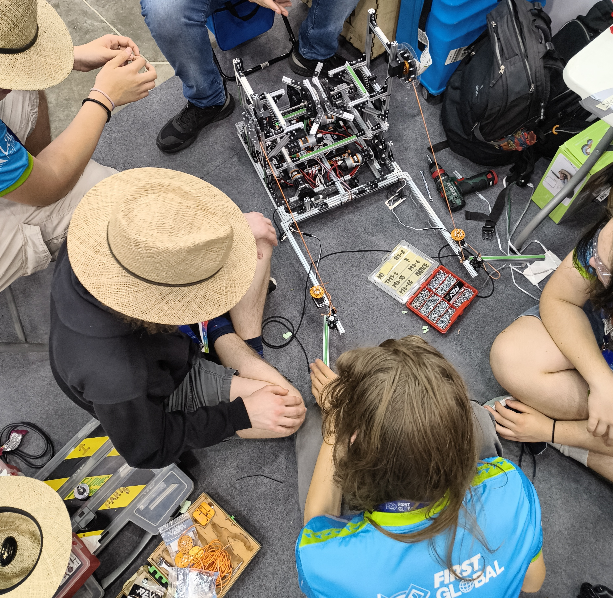

Obilen zajtrk novega dneva smo hitro izkoristili za ukrcanje na avtobus. Sonce je obsijalo cesto, reže na mostu in hrib s panamsko zastavo, na katerem se skrivajo lenivci in papige. V kolikor bi pa radi videli še metulje in žabe bi se pa morali zapeljati približno 45 minut ven iz mesta (tako pravijo na širnem spletu).
<!-- truncate -->
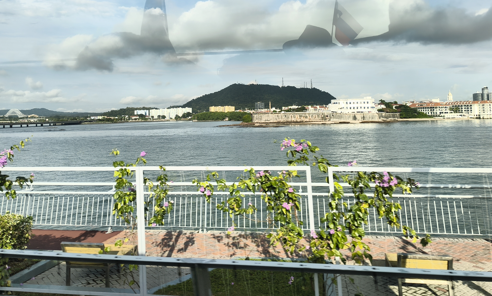
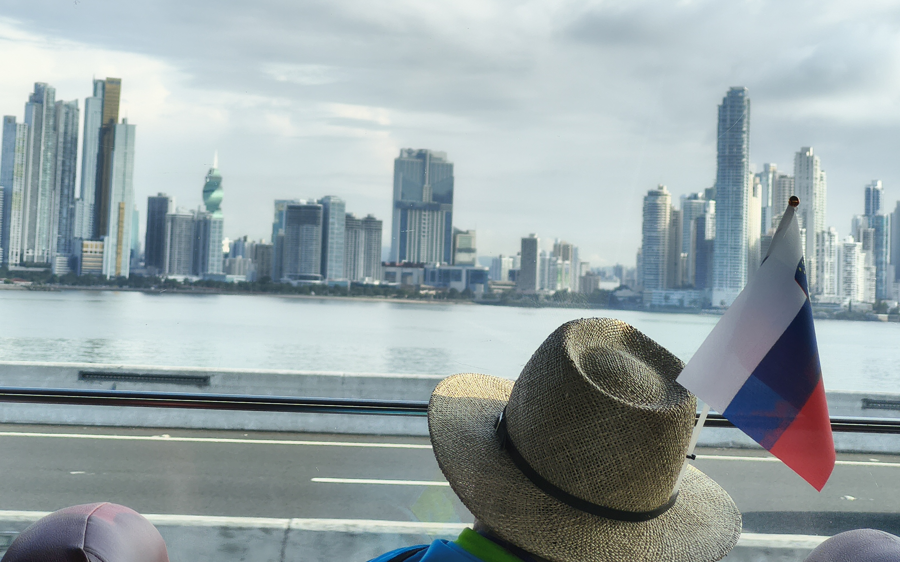

V vhodni dvorani je čakalo veliko tekmovalcev, pripravljenih na vstop v štande. Mi smo čakalno vrsto izkoristili sebi v prid in skočili do razgledne točke pri vodi, da smo se nagledali ladijskega prometa. Napotili smo se še naprej po pešpoti, da smo zapravili nekaj časa, dokler nas ni začela preganjati pretirana toplina panamskega vremena.

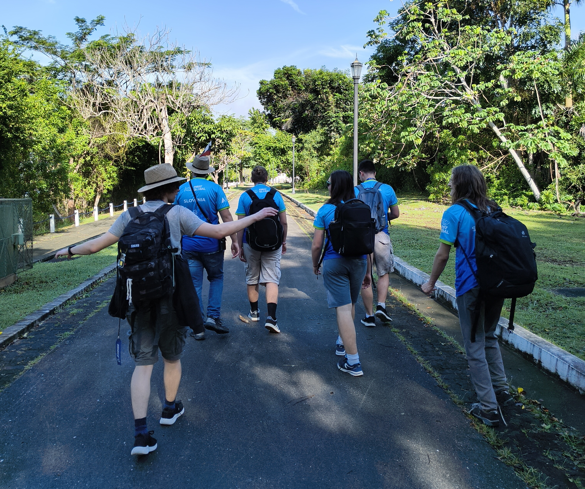
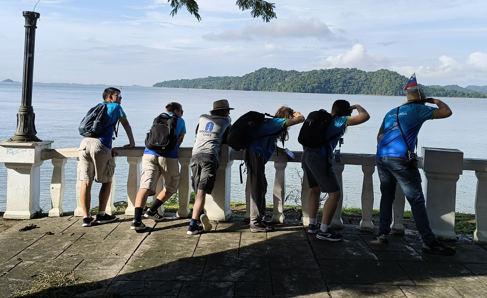

Na poti nazaj do tekmovalnih prostorov je naš pogled ujela nenavadna kombinacija barv, ki ji je sledil rep. Našli smo iguano, ki je iskala toplino na soncu. Prijazno smo jo pozdravili, slikali in preizkusili njeno poznavanje inženirskih šal. Ob šali je prijazno pokimala, ko je pa imela šal dovolj, se je odpravila v smeri z-osi (vertikalno) po drevesu gor.

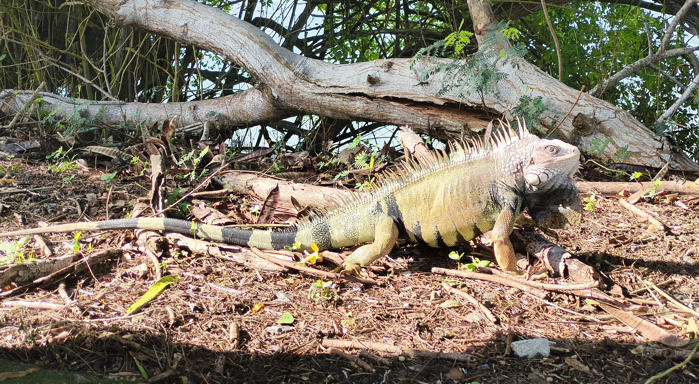
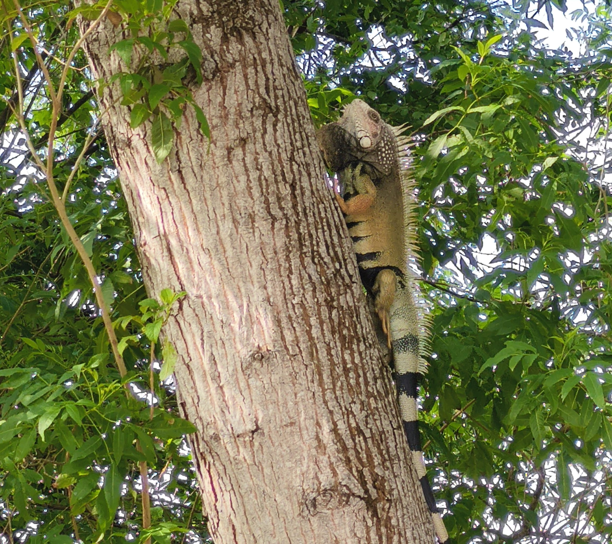

Ko smo se parkirali na zofo in stol za ribarjenje smo naredili zadnje popravke na robotu in se s tem pripravili na prve točkovane tekme. Do začetka kvalifikacijskih iger je fantom ostalo nekaj časa, zato so po pridobitvi sporeda tekem se odločili priskočiti na pomoč svojim prvim soigralcem - Državam Mikronezije. Namreč njihov mehanizem za uporabo acceleratorja (sestavni del igralnega polna) ni deloval najbolje, zato so fantje vskočili s sestavnimi deli in načrtom, da bi jim ga pomagali sestaviti. Tekom procesa je priskočila na pomoč še ena država, tako da so naši fantje bili prosti, da se sprehodijo en krog po abecedi barvitih zastav.

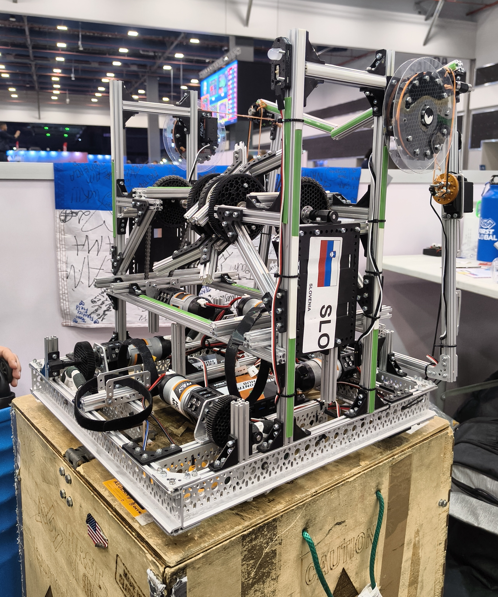

Zaradi unikatnosti in učinkovitosti podvozja so se fantje prijavili na t.i. Skills Challenge, kjer prijavljene ekipe (vsaka ločeno) pokažejo zmogljivost robota preko nekoliko drugačnega načina (časovno omejeno pobiranje in transportiranje žog, streljanje/metanje le teh). Tekom izziva so se pri robotu izkazale določene nepopolnosti, vendar fantje niso bili prepričani kaj točno bi lahko bilo vzrok tovrstnega delovanja robota. 

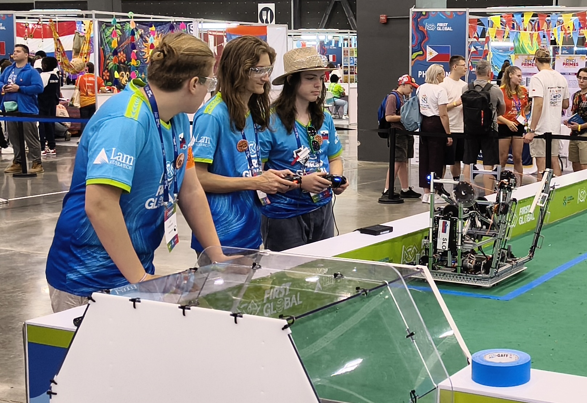
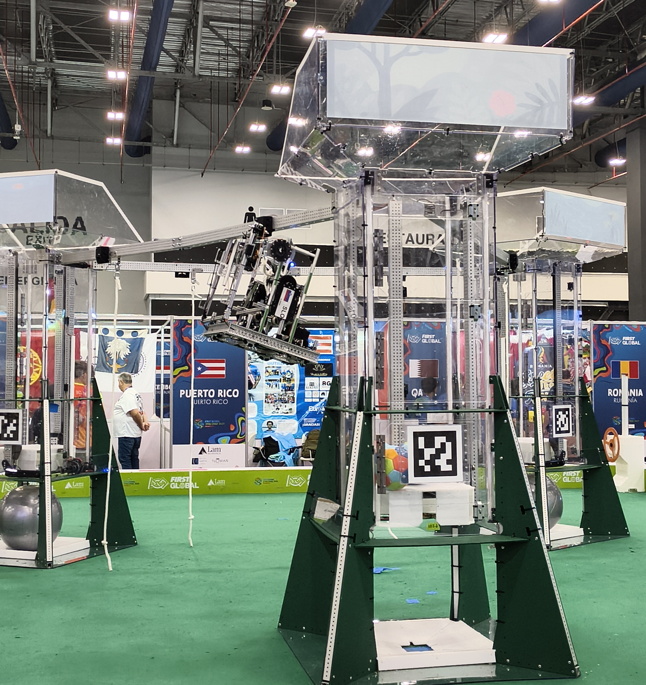

Prve igre so se kmalu začele in z njimi grobe ugotovitve. Zaporedna igra s številko 30, v kateri smo ob strani imeli Države Mikronezije in Tajvan je bila točkovno slaba, vendar nam je dala pogled na realno stanje robota. To igro smo za las zmagali z rezultatom 21:18 proti modri alianci, ki so jo tvorile Japonska, Ukrajina in Srbija. Tekom tekme smo potrdili težavo - servo motorji za mehanizem rok nisi bili dovolj trpežni. V povprečju smo uničili po en servo motor na poskusno/kvalifikacijsko tekmo do zdaj. Zavedali smo se, da nimamo dovolj časa za zamenjavo celotnega mehanizma, zato smo zadevo sproti servisirali in pazljivo manevrirali za zdaj.

<iframe width="560" height="315" src="https://www.youtube.com/embed/bipuBmCye9g?si=y4YNw-t2Wdt7doii&amp;start=3782" title="YouTube video player" frameborder="0" allow="accelerometer; autoplay; clipboard-write; encrypted-media; gyroscope; picture-in-picture; web-share" referrerpolicy="strict-origin-when-cross-origin" allowfullscreen></iframe>

Drugo igro današnjega dneva smo pa popestrili na prvem polju (izmed petih) v areni. Tokrat smo bili poparčkani z Dansko in Gano v modro alianco. Nezanesljivost rok je bilo mogoče občutiti v točkah, saj smo to igro zaključili z rezultatom 25:22. Zmagovalen aplavz za igro številka 49 je prejela naša polovica igrišča, za tem smo pa kolegom iz Bosne in Hercegovine, Mavritanije in Guatemale segli v roke in se napotili ven iz arene.

<iframe width="560" height="315" src="https://www.youtube.com/embed/Hy2VGJjoMoo?si=nz0phuS250zesMC0&amp;start=8180" title="YouTube video player" frameborder="0" allow="accelerometer; autoplay; clipboard-write; encrypted-media; gyroscope; picture-in-picture; web-share" referrerpolicy="strict-origin-when-cross-origin" allowfullscreen></iframe>

Tekom tretje tekme prvega dne smo odkrili novo hibo našega robota. Med nastopanjem s kolegi iz Estonije in Pakistana smo zasledili, da se robot počasneje pelje kot bi se moral, kar je oba voznika motila, saj naš robot je primarno namenjen igranju podporne vloge. Sreča je tokrat skrila zobe, vendar ne do konca. Igra z zaporedno številko 76 se je zaključila z izzidom 28:28, tako da smo enakomerno razporejen aplavz prejeli mi in rdeča alianca, ki so jo tokrat sestavljali vrstniki iz Malawija, Kiribatov in Kitajske.

<iframe width="560" height="315" src="https://www.youtube.com/embed/t4IdgPIlFyg?si=9Dak3_LZFhGQ_H9O&amp;start=11994" title="YouTube video player" frameborder="0" allow="accelerometer; autoplay; clipboard-write; encrypted-media; gyroscope; picture-in-picture; web-share" referrerpolicy="strict-origin-when-cross-origin" allowfullscreen></iframe>

Zadnji tekmi prvega dneva tekmovalnega dela olimpijade je bila pripisana zaporedna številka 96. Pot nas je vodila na nastop na glavnem polju (številka 5). Tokrat smo modro alianco zastopali skupaj z Belorusijo in Gambijo. Stres, utrujenost in še marsikaj bi lahko pripisali izzidu tekme, vendar pošteno je tudi seči v roko boljšemu nasprotniku. Tokrat je zmagovalen rezultat 26:22 padel na stran Paname, Maldivov in Armenije.

<iframe width="560" height="315" src="https://www.youtube.com/embed/bipuBmCye9g?si=amkc-VSbP86qH0I5&amp;start=13333" title="YouTube video player" frameborder="0" allow="accelerometer; autoplay; clipboard-write; encrypted-media; gyroscope; picture-in-picture; web-share" referrerpolicy="strict-origin-when-cross-origin" allowfullscreen></iframe>

Med čakanjem na večerjo smo si vzeli čas za refleksijo in ugotovili, da bi ta igra lahko imela drugačen izzid, če nam kolegi iz Belorusije ne bi ukradli vrv za obešanje zaradi česar smo bili prikrajšani nekaj točk. Poleg tega smo potrdili, da se baterija prehitro prazni v navadnem režimu obratovanja, kar bi lahko vzrokovalo upiranje enega izmed motorjev ali koles. Problematičen sestavni kos smo hitro locirali in zamenjali ter popravili pripadajoč sklop. Poleg tega smo se lotili izdelave prototipa novega mehanizma za roko. Čas nas je prehitel, in smo se zato odpravii na večerjo v oblačilih naše kulture (v našem primeru slamniki).

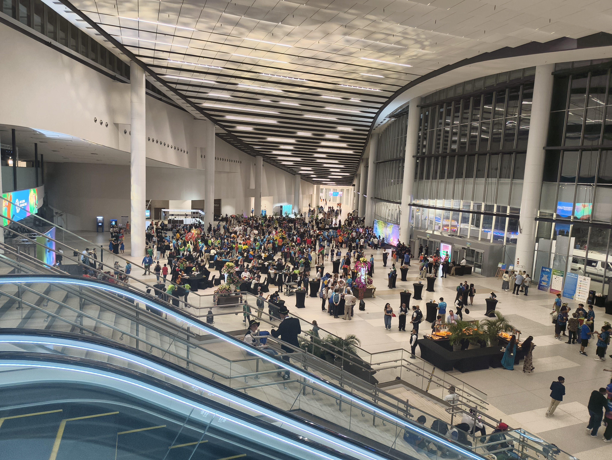

Dijaki so bili v družbi svojih vrstnikov, medtem ko sta se mentorja pogovarjala z Michaelom, ki je na poziciji inženirja pri podjetju Boeing. Dolgo vrsto smo pretrpeli, vendar je zato tokrat bila količina hrane obilnejša. Vmes smo dobili obsik (in nastop) ustanovitelja g. Deana Kamena, ki je tekom svojega govora predstavil novega gosta - slavnega kuharja Paul Irvyne. Zaupal nam je, da bomo naslednje leto na dogodku imeli priložnost preizkusiti kuho iz drugih, bolj slavnih rok. Večer se je nadaljeval s plesnimi vlakci, ekipnimi fotografiranji in tiskanjem fotografij.

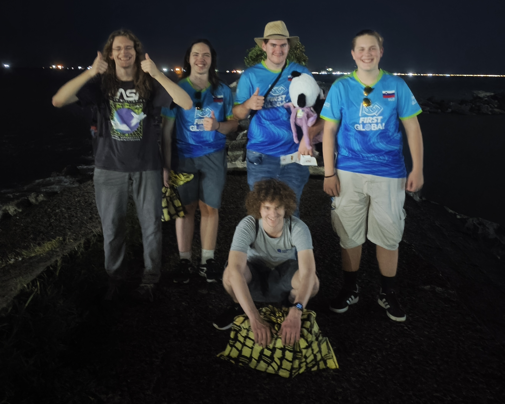

Po vrnitvi domov smo dogovorili za obisk nove trgovine v neposredni bližini hotela Megapolis. Zapodili smo se na drugo stran glavno ceste, pri čemer smo za prehod morali žrtvovati nekaj minut obhoda, saj so prehodi za pešče redki na glavni cesti. Trgovina Arrecha je bila sicer oglaševana kot farmacija, vendar navznoter je (po izdelkih) spominjala na Pepco. Romali smo okoli kar nekaj časa in stopili ven z LEGO kockami, prigrizki, plišastimi igračami in še čim. Firbec in višek energije sta nas popeljala na en krog po novi teritoriji. Hodili smo ob novi cesti in bili priče nekoliko realnejši sliki mesta, ki zajema nekoliko več smeti. Kmalu smo se znašli v parku z igriščem, zraven obeh smo pa našli tudi Pacifik.

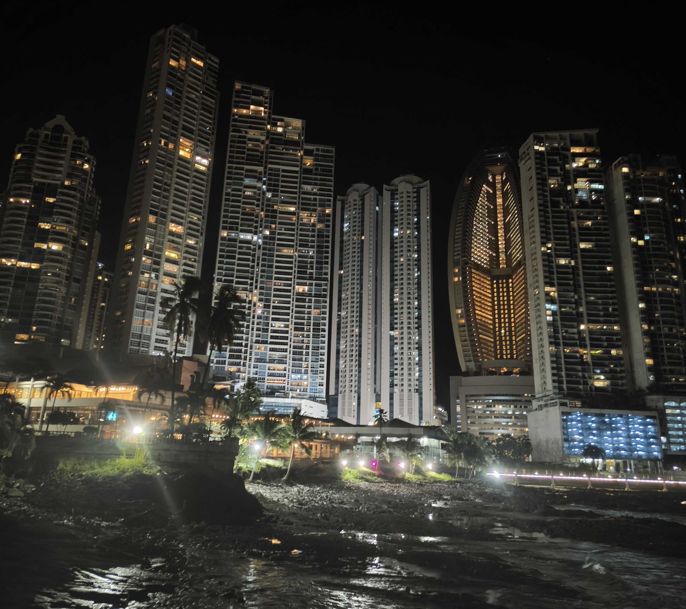

Firbec nas je popeljal na bližnji pomol, na poti do katerega nas je čakalo presenečenje. Za vogalom sta nas v temi pričakala dve policista ob motornem kolesu. V španščini sta nas vprašala kam gremo, pri čemer smo sklepali kontekst in je mentor rekel "foto" ter pokazal na pomol. Želeli so videti dokumente, kar ni bilo problematično dokler en član ni imel dokumenta s seboj, medtem ko mentor ni izgledal enako kot na sliki (kar smo rešili z dviom las). Vprašali so nas koliko časa bomo tam ("tempo?"), na kar smo odgovorili s petimi prsti. Odhiteli smo do pomola, ki je sprva bil cel, nato vmes zrušen in nato spet cel. Nismo imeli časa (niti želje) lesti čez zrušen pomol, zato smo raje namenili kakšno minuto fotografiranju. Na poti nazaj do hotela smo bili prijazno opomnjeni, da na tem koncu sveta hupanje predstavlja prijazno opozorilo in zelo verjetno kršenje prometnih predpisov. Kmalu smo se znašli spet v hotelskih posteljah in z zaprtimi očmi čakali na nov dan.

Do naslednjič,

mačka omáčka