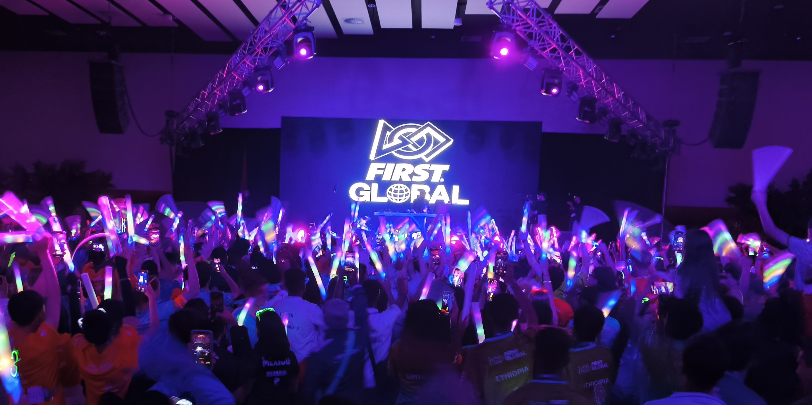
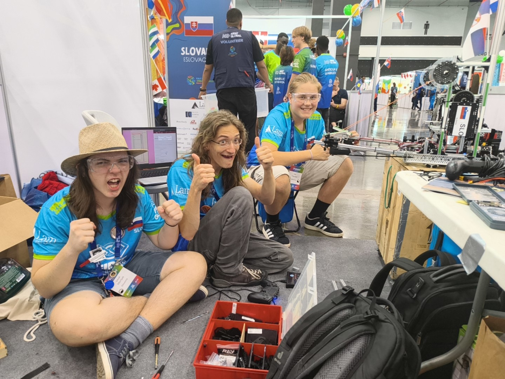
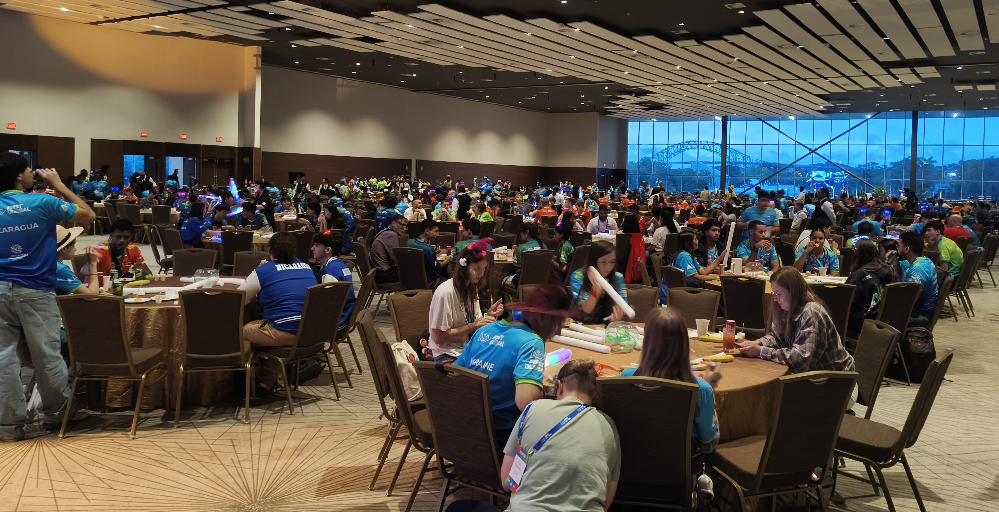
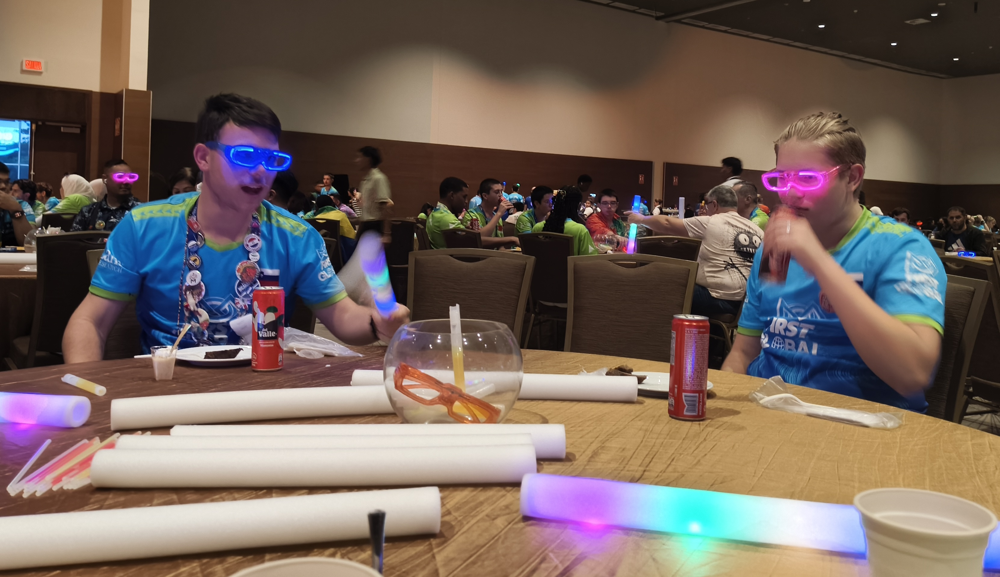
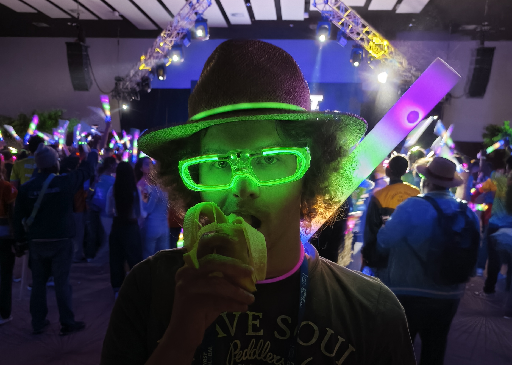

Nov dan, nove prilike za uspeh. Po jutranjem obredu smo se zapodili v štand, kjer smo dokončali prototip za nov mehanizem za roke in ga tudi implementirali v času prvih kvalifikacijskih tekem drugega dneva uradnega dela tekmovanja.
<!-- truncate -->

Razlika je ta, da smo tokrat namesto servo motorjev uporabili core hex motorje z zobniškim prenosom, saj so omenjeni motorji bolj robustni. Kmalu je nastopila prva priložnost, da jih preizkusimo izven štanda in poskusnih polj. Prvo tekmo današnjega dne smo igrali skupaj z Virgin Islands in Indijo. Izboljšava rok se je hitro pokazala za koristno, saj smo uspeli nabrati večje število točk kot do zdaj in prinesti v štand zmago z rezultatom 44:42. Kolegi na nasproṭ̣̣ni strani polja za zastopali države Izrael, Guyana in Malta.

<iframe title="YouTube video player" src="https://www.youtube.com/live/19KenSMx4QI?si=GVBWe2qoYR9MaTk_&t=4601" style={{ width: "100%", aspectRatio: '16/9' }} frameborder="0" allowfullscreen="allowfullscreen"></iframe>

Tekmo z zaporedno številko 181 smo hitro dočakali in oddrveli z robotom na škatli do čakalne vrste za uradne tekme. Tokrat smo krasili rdečo alianco v družbi Bermude in Kosova. Tokrat ni bilo boljše aliance, le enakovredni. Domov smo prinesli 57 točk, tako naša alianca kot Eritreja, Luksemburg in Turčija.

<iframe title="YouTube video player" src="https://www.youtube.com/live/IMzAHjn2oqA?si=WednWYk5ZUymf9VP&t=10396" style={{ width: "100%", aspectRatio: '16/9' }} frameborder="0" allowfullscreen="allowfullscreen"></iframe>

Dan nam ni dajal dolgih odmorov, kvečjem za kak prigrizek iz druge države ali pa sprehod in debato. Zvok troblje so kmalu predvajali na polju 3 in s tem naznanili začetek tekme 206. Tokrat smo bili na modri strani skupaj z Bulgarijo in Korejo. Za čim boljši uspeh smo sodelovali z "nasprotniki", tokrat s Sirijo, Savdsko arabijo in Švico. Še ena zmaga za nas z rezultatom 48:45. Trenutna statistika za Slovenijo beleži 4 zmage, 2 izenačenji in 1 izgubo.

<iframe title="YouTube video player" src="https://www.youtube.com/live/19KenSMx4QI?si=6dmyQJNPEmM6jirN&t=17720" style={{ width: "100%", aspectRatio: '16/9' }} frameborder="0" allowfullscreen="allowfullscreen"></iframe>

Bližmo se udarni tekmi na sporedu, vendar še nismo čisto tam. Loči nas še igra z zaporedno številko 232, tekom katere smo stali ob strani Sao Tome in Principe in Eswatini. Uspeli smo dvigniti povprečje še malo z zmagovalnim izzidom 58:56 proti Združenim Arabskim Emiratom, Cookovim otokom in Beninu.

<iframe title="YouTube video player" src="https://www.youtube.com/live/DzvYXbAkqIc?si=9E5GE-1OnHMXAQch&t=21441" style={{ width: "100%", aspectRatio: '16/9' }} frameborder="0" allowfullscreen="allowfullscreen"></iframe>

Ura je napočila za udarno tekmo na udarnem polju. Tokrat smo bili na polju 5 poparčkani z nekaterimi "velikani". Nam v podporo so bili predstavniki Kazahstana in Združenih držav Amerike, tako da smo imeli strategijo pripravljeno in smo se dobro počutili pred igro. Na nasprotni strani smo lahko v oči pogledali kolege iz Venezuele, Papua Nove Gvineje in Brunei Derussalam. Tokrat smo med "velikani" mi bili ta večji in prinseli domov prijeten dvig povprečja z izidom 114:98.

<iframe title="YouTube video player" src="https://www.youtube.com/live/yYWFSdB9Fd8?si=JVfxp8Nmgm_2_OhW&t=24906" style={{ width: "100%", aspectRatio: '16/9' }} frameborder="0" allowfullscreen="allowfullscreen"></iframe>

vecerja, postavlal oder, glow in the dark stvari
Napornemu dnevu je sledila večerja v nekoliko bolj prostorni dvorani kot do sedaj. Med kosilom smo zasledili, da so premikali mize in postavljali oder, tako da smo sklepali da bomo danes imeli zabavo, kar je pa samo še popestril nabor žurerskih dodatkov na mizah. Lahko smo si postregli zapestnice, očala ali pa palice, vse z lučkami za v temo.

Proti zaključku večerje je DJ začel predvajati glasbo, s tem da so basi postajali iz minute v minuto občutnejši. Kmalu so se luči ugasnile in dijaki so pohiteli na plesišče pod odrom. Utripanje svetlečih palic in očal, glasna glasba in skakanje mladih robotikov je treslo tla po hali.

Po uvodu gostujočega DJ-a je prišel na obisk gospod Dean Kamen in veselo naznanil, da sta prispeli dve državi, ki so ju zadrževale vremenske razmere, zato je predlagal da se jih premakne v finalni nabor 32 držav, da bosta lahko igrali. Seveda se je celo plesišče strinjalo. Nato je pa naznanil posebnega gosta, ki je večer res odprl. Pred nas je stopil will.i.am in nastopal v živo, s tem pa poskrbel za nepozaben večer. Na poti domov smo se zagrebli in si zagotovili Soyo transport avtobus, ki rad zabavo nadaljuje vse do hotela. Latinsko ameriške skladbe skupaj z globokimi basi skrajšajo pot.

Do naslednjič,

bari gisher