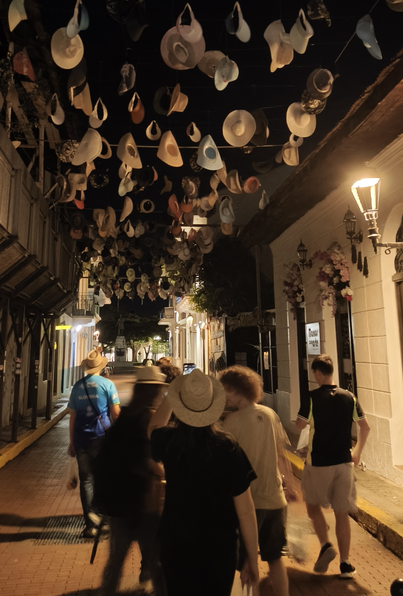

generic uvod
<!-- truncate -->
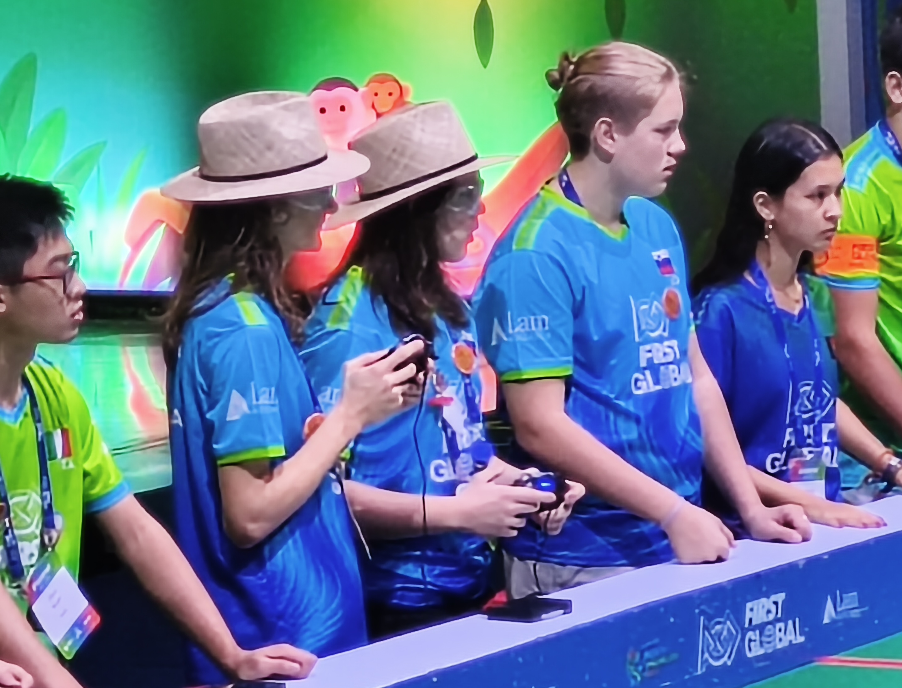

Danes nas čakajo 3 tekme, zato smo zgodaj začeli s prvo tekmo dneva, ki jo organizatorji beležijo pod zaporedno številko 299. Tokrat smo krasili drečo stran skupaj z ekipama iz Združenih držav Tanzanije in Češke. Nadgradnje na robotu in dobra strategije sta se poplačala in smo uspeli pričarati izzid 74:68 na našo stran. Tokrat smo po dveh minutah in pol segli v roke predstavnikom San Marina, Nizozemske in Latvije.

<iframe width="560" height="315" src="https://www.youtube.com/embed/W_ZVyhQoIOg?si=Yy6hiWANcxhHo2px&amp;start=1795" title="YouTube video player" frameborder="0" allow="accelerometer; autoplay; clipboard-write; encrypted-media; gyroscope; picture-in-picture; web-share" referrerpolicy="strict-origin-when-cross-origin" allowfullscreen></iframe>

Kratka pavza in smo že drveli nazaj v čakalno vrsto. Tokrat smo bili poparčkani s sosedi in smo se lahko zbližali z Italijani, trojico so pa dopolnili še prestavniki Afganistana. Igra na polju 4 je bila napeta, vendar žal se je tekma št. 317 končala z zmago na strani kolegov iz Djibouti-ja, Cipra in Konga (36:40).

<iframe width="560" height="315" src="https://www.youtube.com/embed/W_ZVyhQoIOg?si=87uNzGz-phkbgBGo&amp;start=4331" title="YouTube video player" frameborder="0" allow="accelerometer; autoplay; clipboard-write; encrypted-media; gyroscope; picture-in-picture; web-share" referrerpolicy="strict-origin-when-cross-origin" allowfullscreen></iframe>

Da zaključimo spored smo pristopili še kvalifikacijski igri s številko 337 na polju 1. Tokrat smo imeli čast soustvarjati strategijo in igro skupaj z Nikaragvo in Kirgizistanom. Naš poskus na tekmovanju First Global Challenge smo zaključili z zmago proti (oz. z, saj želimo zmagati kot skupnost) Mozambiku (pri katerih je nastopal le human player, voznikov in robota ni bilo), Paragvaju in Arubi. Zaključne številke na ekranu so izpisale 48:40. Statistika za Slovenijo je s tem beležila 8 zmag, 2 izenačenji in 2 izgubi. 

<iframe width="560" height="315" src="https://www.youtube.com/embed/FbAeVwfciMQ?si=cqvyOio84_0DkONZ&amp;start=7566" title="YouTube video player" frameborder="0" allow="accelerometer; autoplay; clipboard-write; encrypted-media; gyroscope; picture-in-picture; web-share" referrerpolicy="strict-origin-when-cross-origin" allowfullscreen></iframe>

Bližal se je konec dogodka, zato smo morali začeti pospravljati štand. Preden smo se tega lotili smo poskrbeli, da smo se slikali z majicami naših sponzorjev.

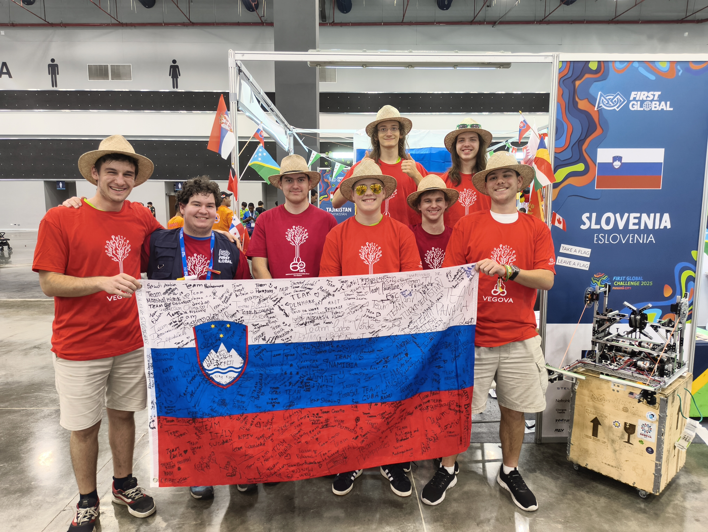

V procesu pospravljanja so se oglasili obiskovalci ostalih držav in nas prosili za podpise v knjigice, drese in nas vprašali če imamo še kaj suvenirjev. Debate so zabredle v presdstavitve o Sloveniji in v obratno smer, tako da vemo več o Južni Afriki, Alžeriji, Ukrajini in še nekaterih. Ko smo potrebovali počitek, smo se pa odpravili menjati dres za dres s prijateljskimi državami.

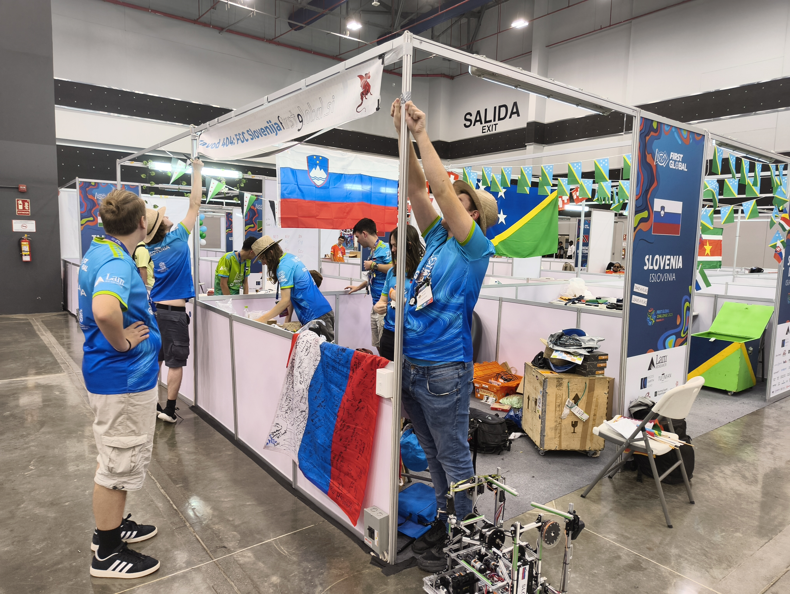

Na večerji smo se pa najedli in po mnogih burgerjih je ostalo mnogo škatlic, zato so se naši dijaki odpravili na misijo, da izdelajo stolp. Ko se je le ta podrl, so se odločili ojačati strukturo v tristrano prizmo. Kmalu je izdelava stolpnice spodbudila druge države, da so prispevale svoje škatlice. Kmalu so priskočili na pomoč kolegi iz Moldavije in navdušeno pomagali pri stolpu. Po treh iteracijah smo skupaj našli idealno strukturo, ki je spominjala na Burj Khalifo iz Dubaja. Eno štuporamo kasneje smo bili na višini mnogih škatlic in dobili aplavz od dvorane ter pozorne poglede in nasmehe natakarjev. Stolp se je seveda potem podrl, vendar nič za to.

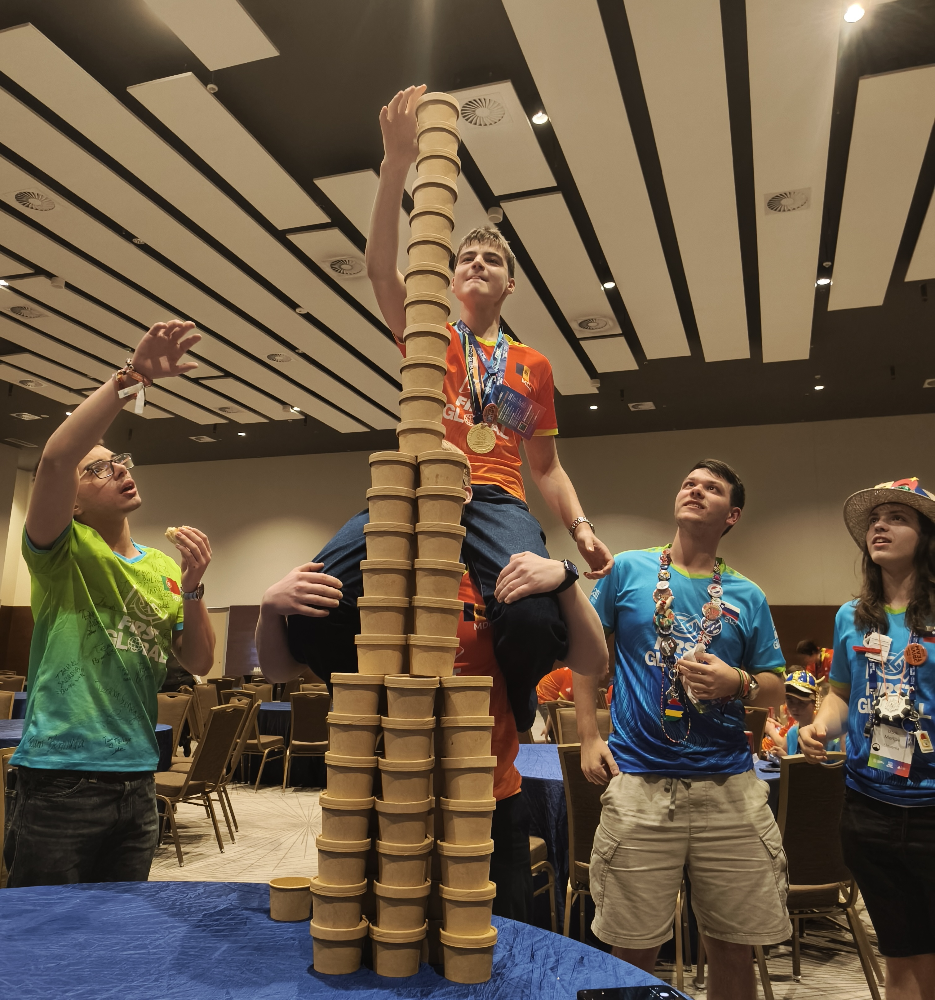

S spakiranim robotom in pospravljenim štandom smo se napotili do avtobusa in v hotel. Slabo uro smo namenili pakiranju prtljage in zavarovanju robota.

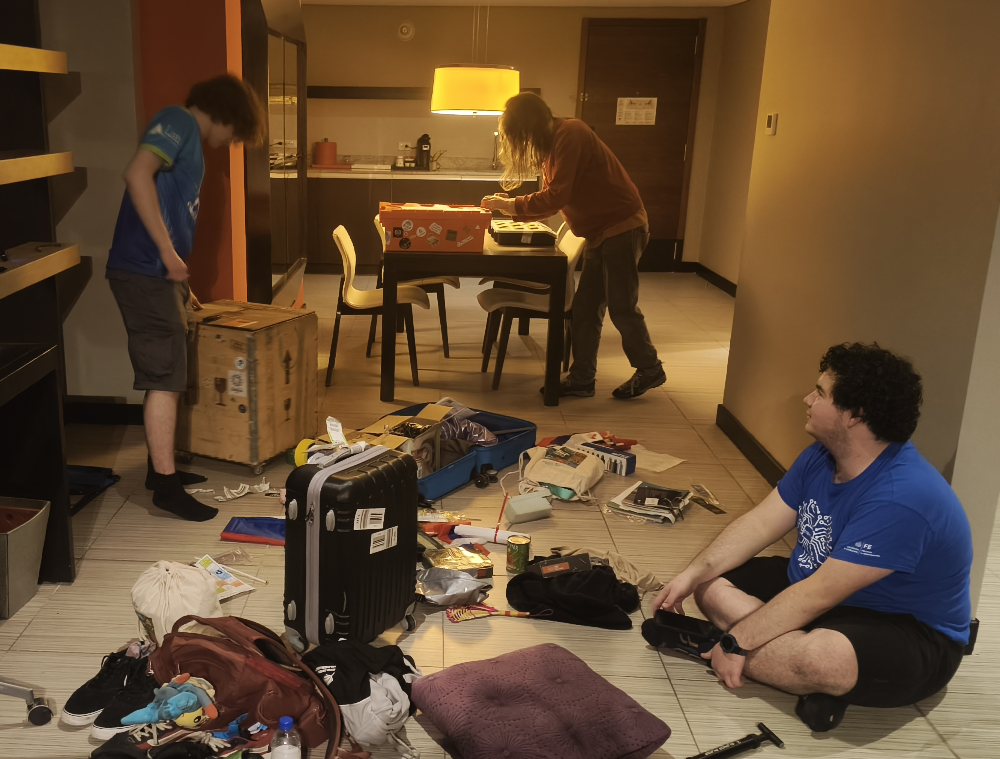

Za počitek od pakiranja smo naročili 2 Uberja in se odpravili v staro mesto oz. Casco Viejo. Nočno temo so krasile prijetne rumene luči, ki so nas spremljale že od naše prve postaje, in sicer parka Plaza Herrera. Tam smo si lahko ogledali spomenike in stavbe ter ujeli eno izmed še odprtih trgovin za suvenirje.

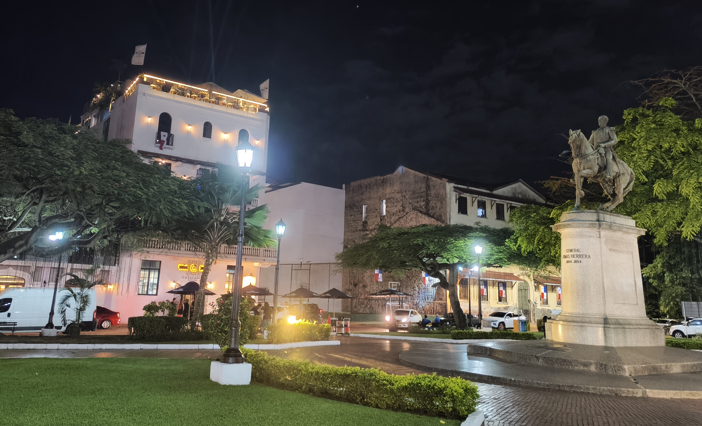

Z vrečami v rokah smo pot nadaljevali do konca polotoka, kjer smo poleg morja našli spomenike, stolp in manjše obzidje.

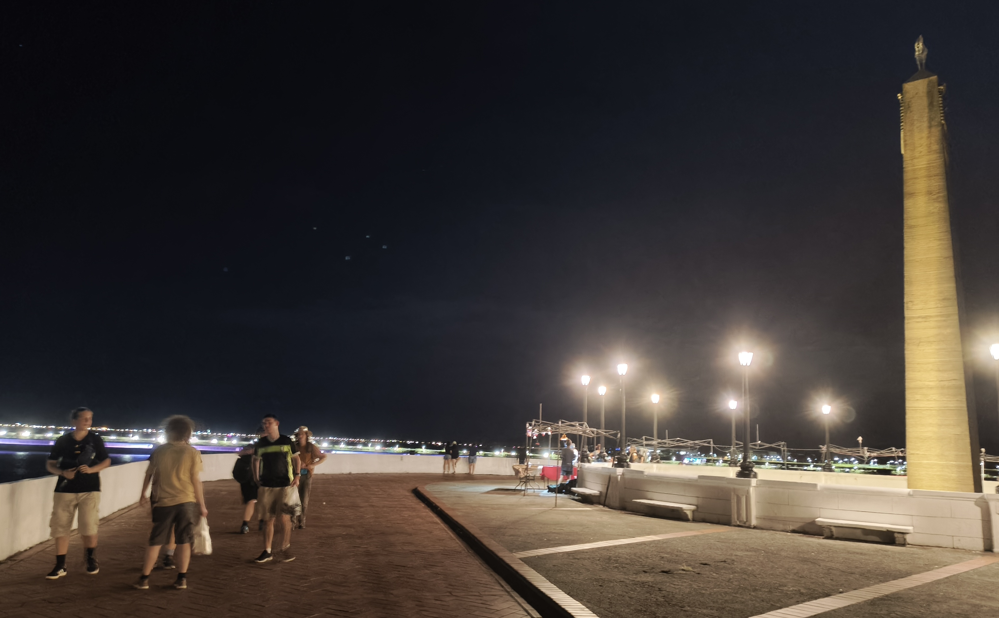

Nazaj v mesto nas je pospremil tunel lučk, za katerim smo zavili levo na ulico klobukov, pri kateri smo našli tudi trgovino s klobuki.

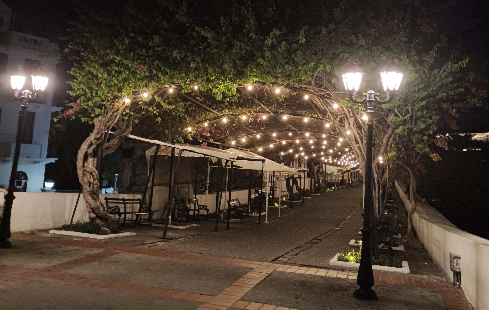

Pot po ozkih pločnikih in mimo oboroženih policistov, ki varujejo trge, nas je popeljala do popeljala do umetnostnega muzeja, cerkve in nacionalnega gledališča.

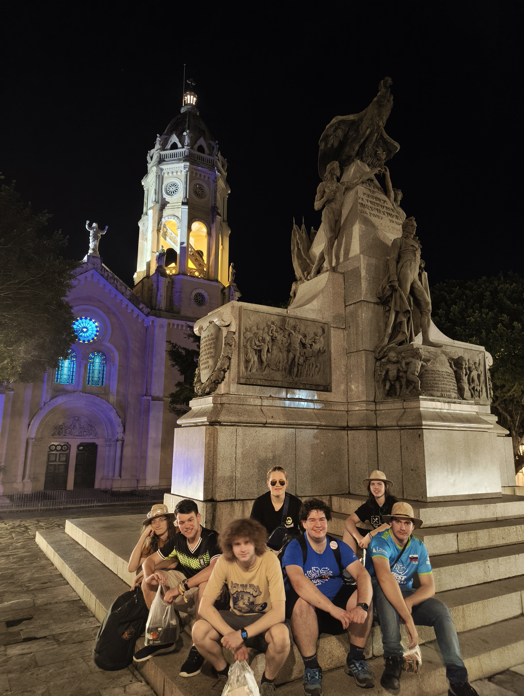

Na poti nazaj smo obiskali še cerkev in stavbe na trgu samostojnosti (Plaza De La Independencia).

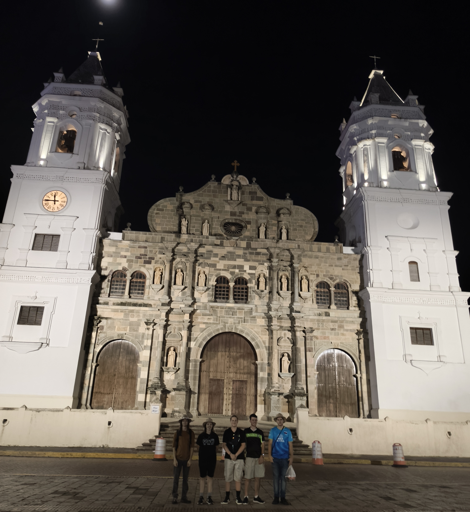

Za tem smo se mokrih las usedli v uber, ki smo ga morali naročiti v sosednji ulici od trga (zaradi policajev), in se odpravili domov.

Do naslednjič,

dobroyi nochi