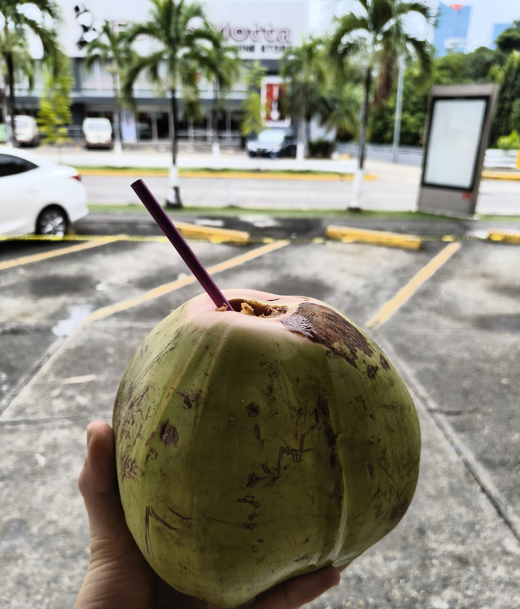
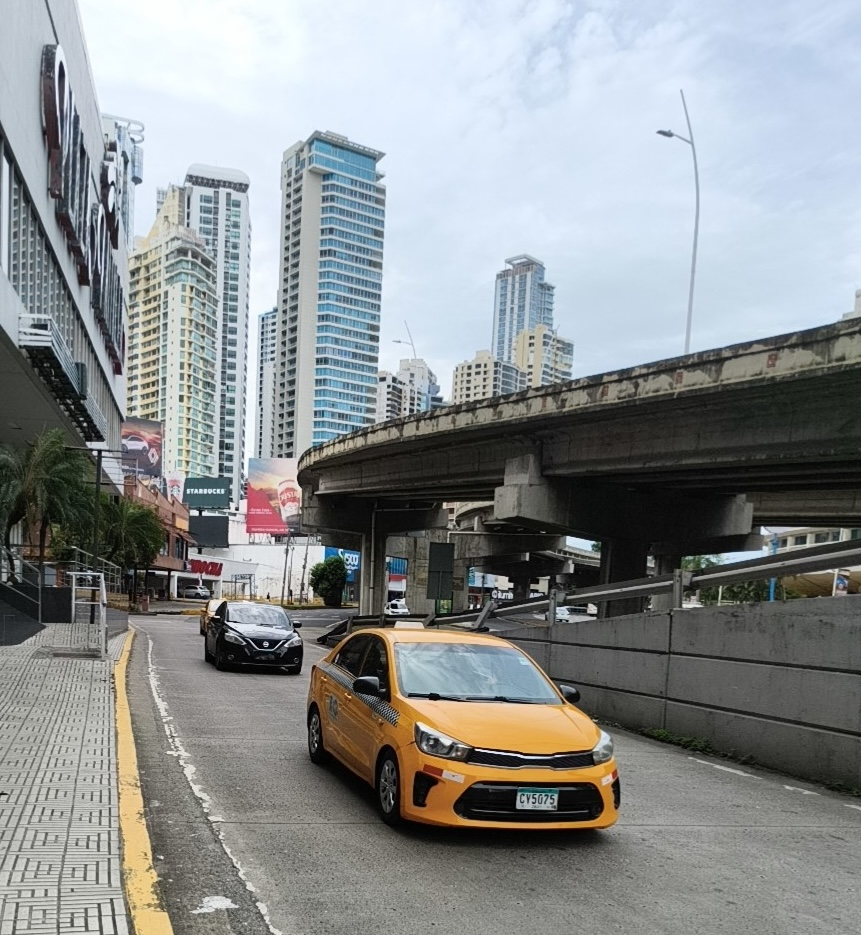
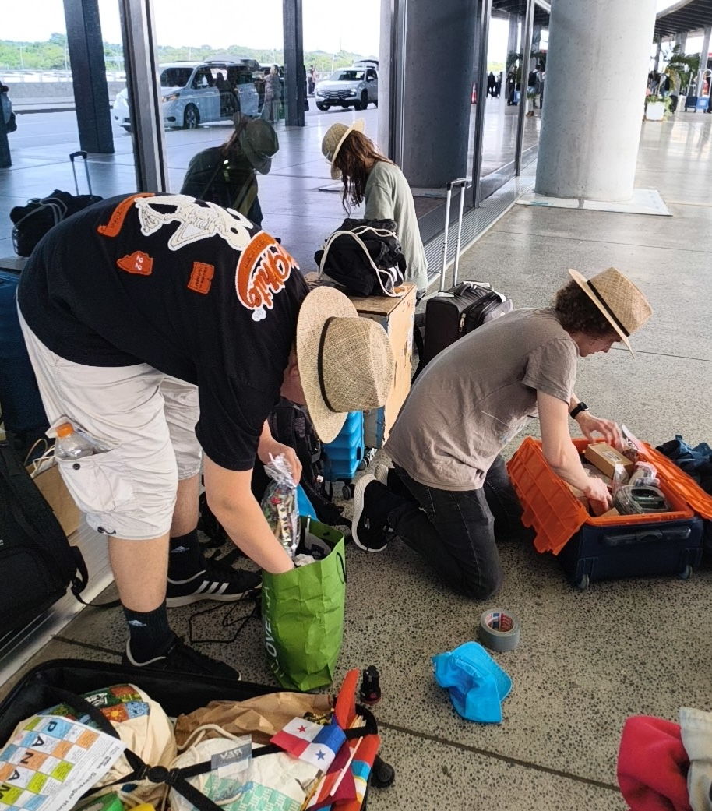
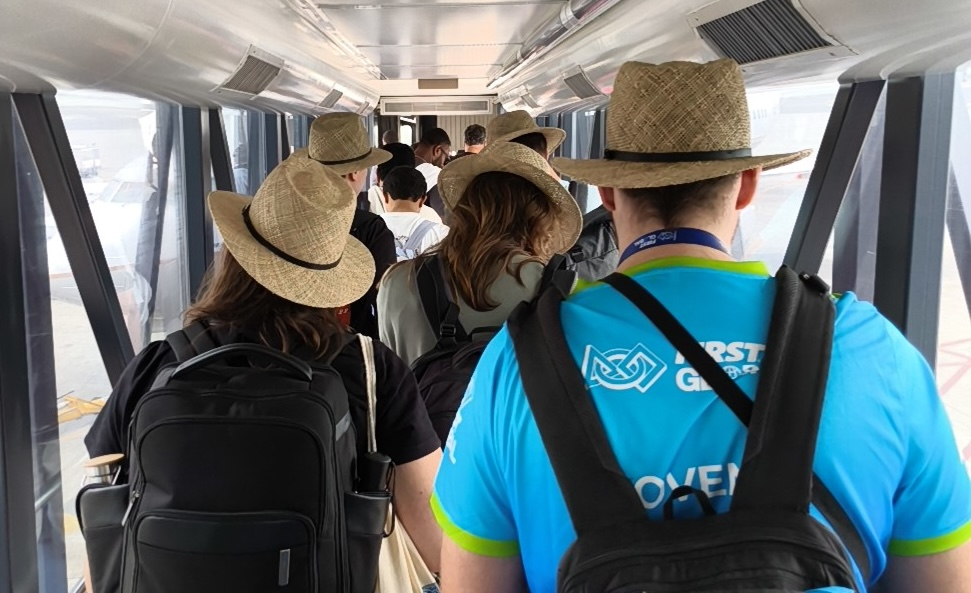
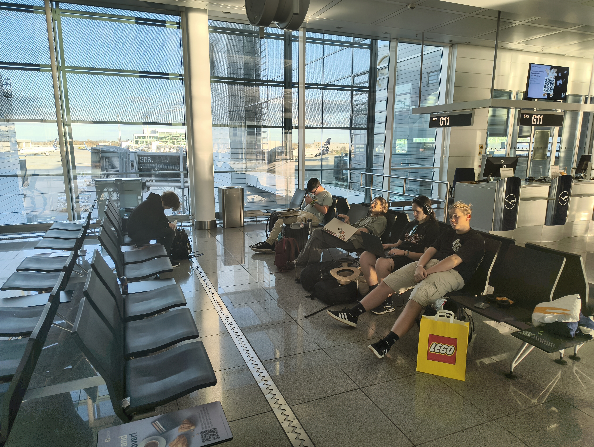

zjutraj eni potengli, eni sli v stacuni. Kupili snacke, caj, kokos
Jutro zadnjega dne smo nekateri začeli bolj zgodaj kot drugi. Kdor je želel je imel priložnosti iti še zadnjič v tem tednu do dežurne trgovine, sicer pa je ostala možnost daljšega spanca in kasnejšega zajtrka. V trgovini smo našli prigrizke in napitke ter kokos, ki nam ga je lastnik odprl z nožem in ponudil slamico.
<!-- truncate -->

zjutraj ceprav nedelja trgovine delajo normalno(razmetan urnik ig), street vendorji z bananami tudi
Trgovine v Panami so obratovale normalno čeprav je bila nedelja, vendar je imela vsaka svoj čas odprtja. Zato smo se trije mušketirji odpravili do nam že znane trgovine Arrecha, na hitro opravili nakupe in se opravili nazaj v hotel. Pobrali smo svoje stvari in se zbrali v avli hotela. Avtobus je kmalu prispel za ekipo "Slovenia". Stvari smo predali gospodu vozniku, da je naložil v shrambo avtobusa. Na letališču smo se takoj umaknili na stran in prerazporedili stvari po kovčkih ter v njih spravili še vsebino vrečk, ki so jih nekateri pozabili spakirati.

sli na bus, na letaliscu prepakirali stvari (vrece ostale), pol dolga vrsta, so nas jebal s folijo. Prišli na gate, kupili kavo/čas, zamenjali gate (še enkrat security).
S pripravljenimi in stehtanimi kovčki smo se postavili v dolgo vrsto. Na sredini le te je do nas prišel gospod in rekel, da lahko pridemo z njem na drugo stran hale, kjer je kolona prazna. Priložnost smo zagrabili in se napotili za njem. Na poti nam je povedal, da moramo škatlo od robota zaviti v folijo. Ekipa je šla namprej, mentor pa pristopil gospodu s strojem za folijo. Med nalaganjem je zasledil račun na stroju in vprašal za ceno. Stric je pokazal na napis "17$", kar je mentor vljudno zavrnil. Nato smo preverili, če lahko škatlo sami zavijemo in so rekli, da lahko. Tako da smo dodajali srebrni lepilni trak po robovih, ogljiščih in čez glave vijakov. Vmes smo preverjali in vsakič je bilo "še malo". Nato smo malo po ovinkih prišli mimo zaposlenih, češ da je "vaš sodelavec rekel da je ok". Na recepciji za check-in je mentor dobil od gospoda listek, na katerem je podpisal in odkljukal, da oddaja prtljago brez folije. S tem smo to komplikacijo rešili. Zdaj pa varnostni pregled in na letalo. Čakali smo nekaj časa na prvotnih vratih in hodili po trgovinah. Vmes so vrata zamenjali, tako da smo počasi prešli na drug konec hodnika, vendar nas je tam pričakala dolga kolona in še en varnostni pregled (aha, zato nam rekli da ne moremo pijač iz trgovine nesti na letalo).

Skoraj enourni zamudi je sledila pot do Miami letališča. Zaradi zamude smo prispeli kasneje v vrsto z 100-200 ostalimi ljudmi, ki nimajo ameriškega državljanstva. Po krajšem zagovoru za vstop in slikanju smo šli prevzeti prtljago in šibali do naših vrat. Ko smo prispeli tja, so nam pa rekli da je za ta let krcanje zaključeno. Na srečo smo imeli vsi slamnike in so dojeli da preprečujejo vstop sedmim ljudem. Urgentno so klicali nadrejene in na neki točki je gospa pokazala kolegici 👍. Hitro smo kot po tekočem traku vsi opravili check-in in šibali na varnostni pregled. Komplikacija z baterijami za robota je bila hitro rešena in smo odhiteli naprej, prišli do vrat in še celo čakali v vrsti za vrkcanje. V miru smo se usedli na letalo do Munchna, kjer smo po pristanku preživeli približno 8 ur.

Do naslednjič,

oíche mhaith