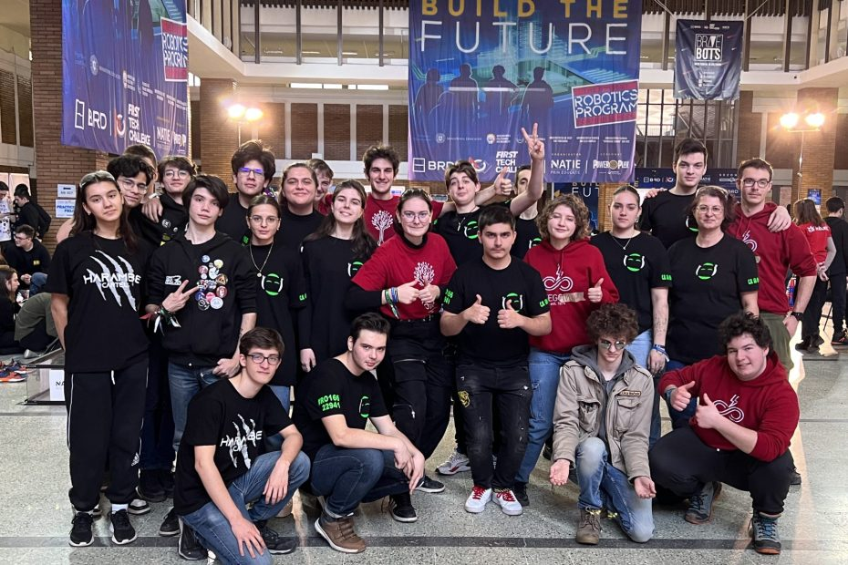
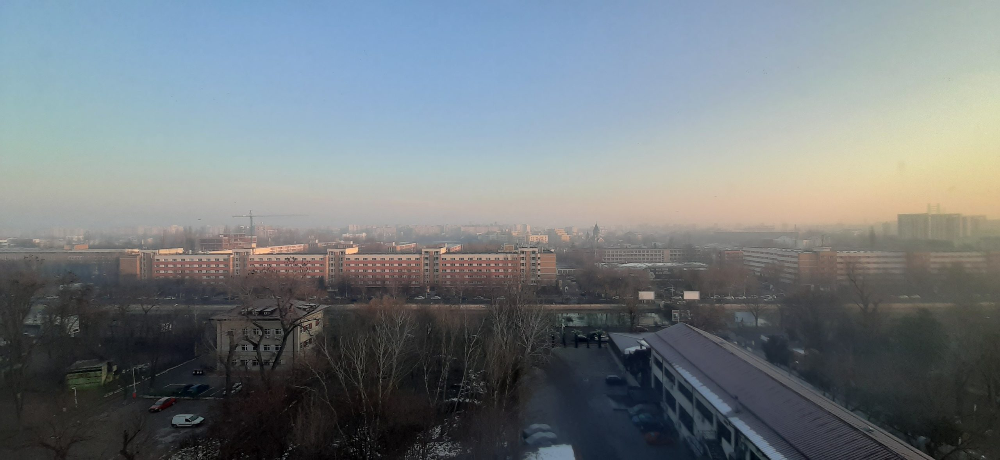
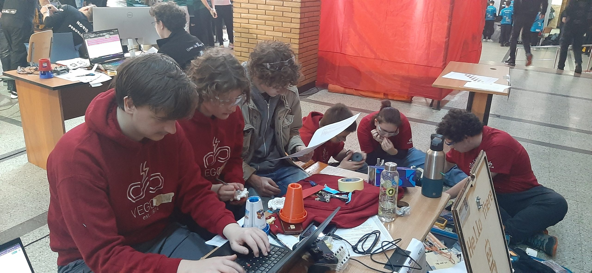
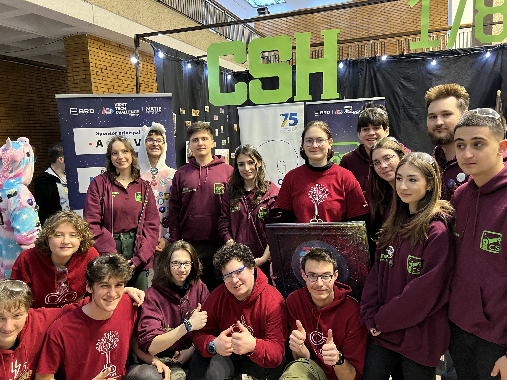
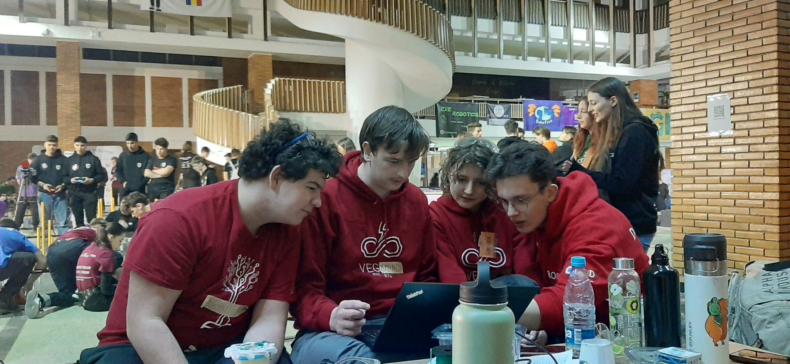
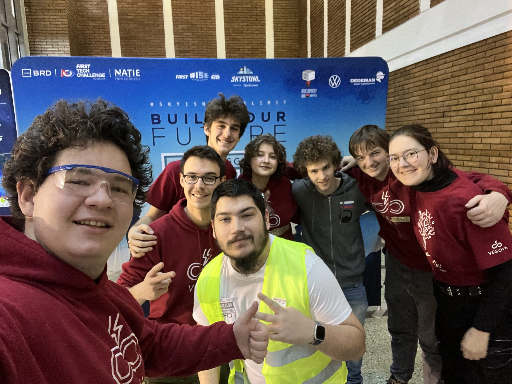
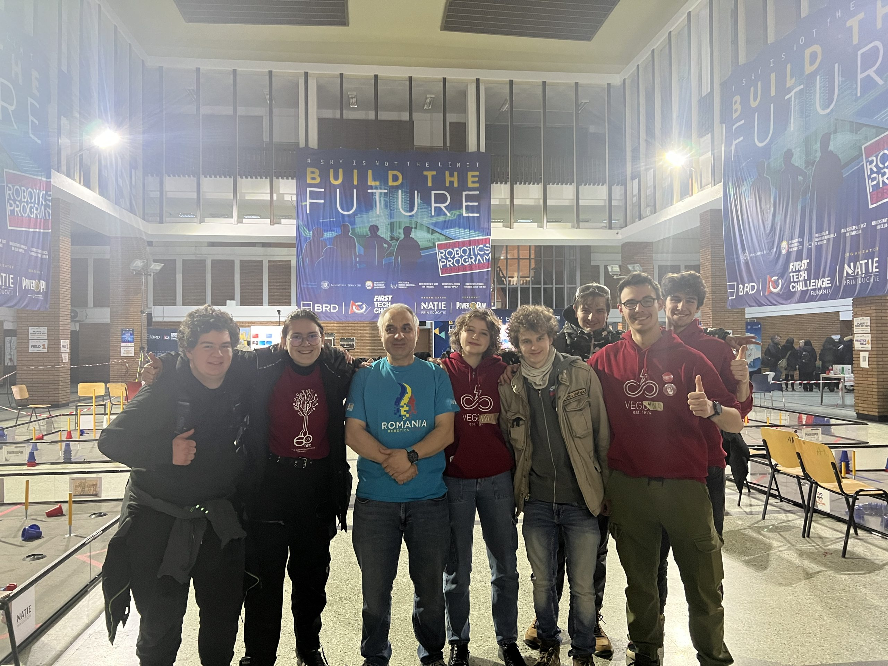
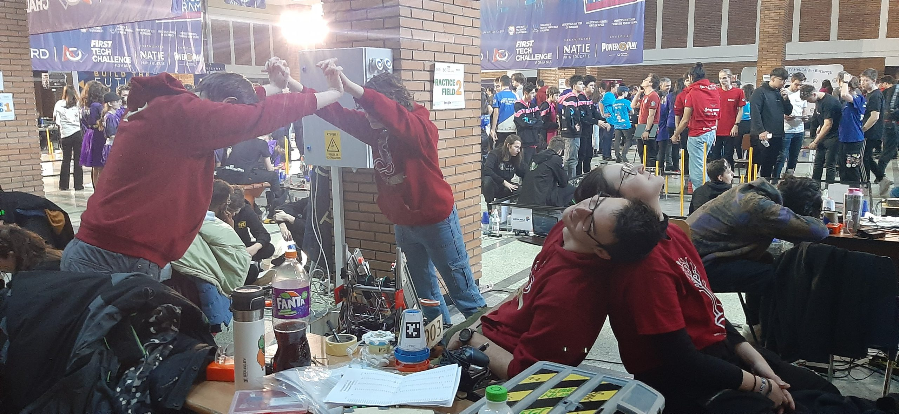
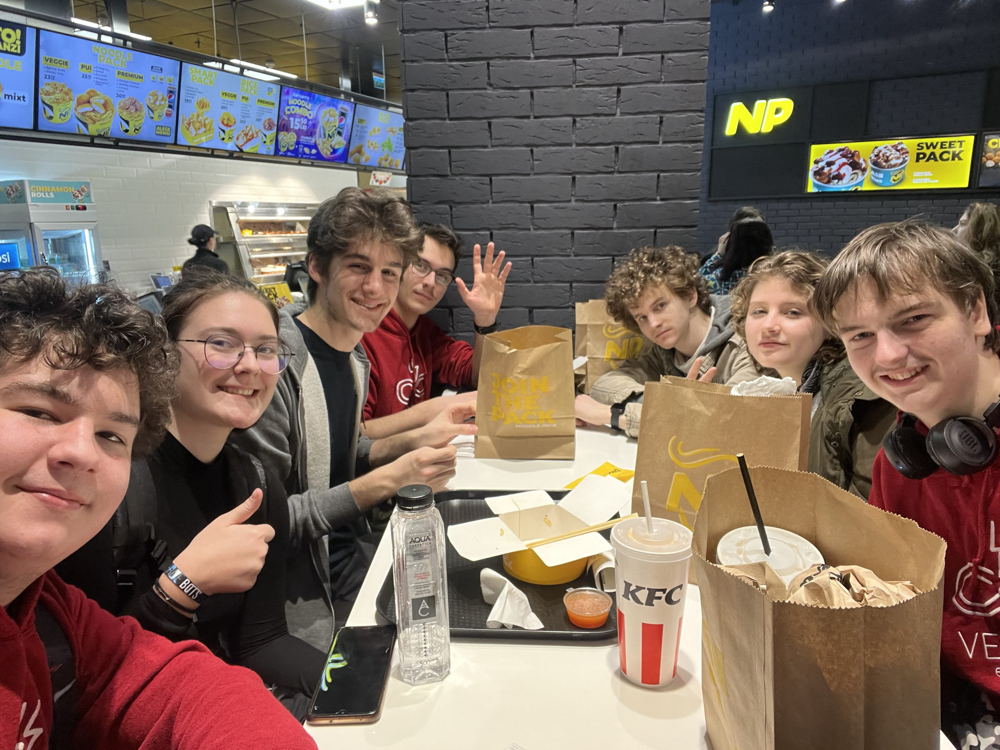
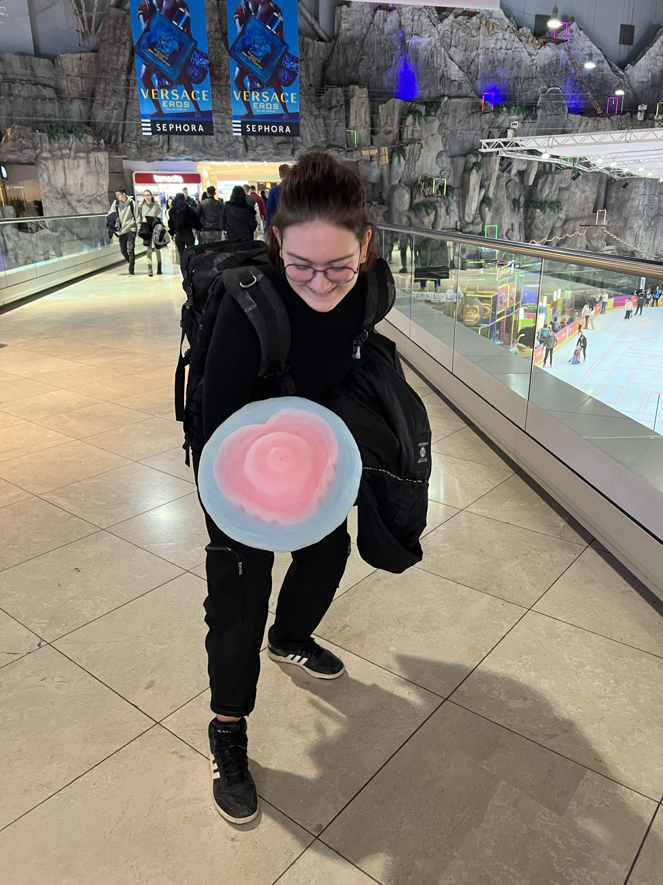

Z razgledom na vzhajajoče sonce in bližnje bloke ter cerkev smo začeli drugo jutro našega obiska Bukarešte. Močnemu
zajtrku je sledil sprehod do dvorane naše primarne dejavnosti popotovanja. Namesto razteznih vaj smo se lotili popravil
na robotu in pokanja prstov z udarjanjem tipk na tipkovnici. <!-- truncate --> Prilagajanje nastavitev tipk igralnega
ploščka voznikovim željam in izdelava avtonomnega delovanja robota sta zaposlila programerski del ekipe do pričetka
inšpekcij in kvalifikacijskih iger. Pregledu robota je sledil zagovoru naših včerajšnjih pisnih del, ki je bil začinjen
s priimkom našega biatlonca in delnim razpadom samega robota. Za tem smo pa bili deležni tudi preizkusa delovanja robota
na igralnem polju, pri čemer nas je oviralo delovanje avtonomnega dela. Z manjšimi popravki smo uspešno prestali
preizkus in se osredotočili na naslednje izzive, kljub prepovedi spreminjanja robota. Sreča je bila na naši strani in
našo prvo tekmo premaknila na drugi dan, kar nam je omogočilo uvedbo popravkov. Delovanje robota je bilo stabilizirano
in dvižni mehanizem je bil izboljšan glede na naše zahteve. Naša nastopajoča ekipa – David T. (voznik), Ana (sovoznica),
David Z. (coach) – so se prvi dan udeležili sestanka, ki je bil namenjen razčiščevanju možnih nejasnosti in ponovitvi
pravil. Vodja ekipe David T. je tudi pravočasno stopil do naših sotekmovalcev na modri strani in se pomenil o sami
strategiji igre, ki jo bo naša dvojica robotov želela izvesti.

Naša prva kvalifikacijska igra (številka 16 na senzamu) je bila igrana v sodelovanju z ekipo CYB3RG0DS (#22998), ki se
jo končala z zmago naše alianse z rezultatom 107 proti 89. Z obilo več občutka za samo igro (in upravljanje robota) smo
se vrnili k preostanku ekipe in se nemudoma lotili potrebnih popravkov, kmalu za tem pa tudi ponovno kovanje strategij.

Z vmesnimi počitki in sprehodi tekom katerih smo člani ekipe VegaMind spoznali nove ljudi in ustvarili prijateljstva.
Naši najboljši prijatelji so bili sprva kar naši sosedi, ekipa BrutForce (#22941). Tekom spoznavanja smo bili
presenečeni nad številom članov/-ic nekaterih ekip, ki je seglo tudi do 17 brez mentorjev. Barvitost, logotipi, darila
in manjše debate so krasile hodnik, ki je vodil od vhoda v stavbo do središča dogajanja. Med ekipami smo srečali (in
spoznali) svetovne prvake tekmovanja FTC sezone 2021/2022 – Delta Force. Njihov robot je bil vsekakor izstopajoč in je
deloval s pomočjo mehanizma podobnega žerjavu. Postali smo tudi dobri prijatelji z nekaterimi člani ekipe CSH, predvsem
pa nihom govornikom Cristiejem, saj je le on rade volje prihajal do nas in se pogovarjal.

Ure so minevale vedno hitreje, podobno kot so se vedno hitreje premikali roboti na poljih. Napočila je naša druga tekma
FTC kariere (zaporedna številka 38), na kateri smo nastopili ponovno na modri strani, vendar tokrat z ekipo Bots’
Brain (#19081). Nekoliko slabša koordinacija in smola sta nam prinesli zgolj 41 točk, kar pa ni bilo dovolj za zmago.
Utrujeni smo se vrnili na naše mesto in počasi upali na prihod hrane, ki nas je kljub obupnem okusu uspela napolniti za
nekaj časa.

Tekom preizkušanja robota smo spoznali nekaj članov iz ekipe Decebal Tech. Njihov programer Matej je naši kodirni
posadki pokazal nekaj zlata vrednih virov, in sicer Road Runner ter program za umetno inteligenco. Prvi je namenjen
olajšanju dela programerjem, ki želijo doseči da se robot giblje po zahtevnejši krivulji. Drugi pa omogoči enostavnejše
prepoznavanje slike, kar je osrednji del avtonomne faze igre, saj nam postavitev na pravilnem delu polja (v odvisnosti
od slike na stožcu) prinese dodatne točke. Skupaj z viri smo izvedeli tudi informacijo, da večina programerjev na
dogodku ne “izumlja tople vode”, saj je tekmovanje na stopnji Romunije tako razvito, da je velika večina programskih
rešitev dostopnih kar na spletu. Po programerskem razsvetljenju smo spoznali še kolege omenjene ekipe, in sicer ekipo
DarkEnergy(#19106), ki jo sestavljajo dijaki in dijakinje iste šole, vendar nižjih letnikov.

Prosti čas najhitreje mine, tako je tudi kmalu do nas pristopil prostovoljec Liviu, ki je kasneje postal naš prijatelj,
in nas opozoril, da je potrebno iti v vrsto za naslednjo igro (zaporedna številka 53). Še vedno s plavim krogom pripetim
na stran našega robota smo se ob strani kolegov iz ekipe November Eleven (#21073) podali v nov dvoboj. Tokrat se nam je
zgodil hujši spodrsljal, robota nismo mogli upravljati. Zaradi senzorja, ki se ni sprožil, je bil vozniku onemogočen
dostop do robota. Potreben je bil le udarec po glavi, vendar je dotikanje robota med igro strogo prepovedano. Mučni 2
minuti sta se vlekli, žal pa nismo mogli nikakor pomagati našim kolegom. Z le 42 točkami smo segli v roke istoobarvanih
ter prav tako rdečih in s sloganom “gracious professionalism” na mislih odkorakali nazaj do čakajočih. Malo bi bilo
reči, da sta programerja imela kar nekaj dela. Na srečo je bila težava hitro odpravljena, kar smo tudi skrbno
preizkušali na polju.

Tekom hektičnega dneva smo prejeli obisk s strani romunske različice ekipi priljubljenega profesorja – Christiana! S
pozitivno energijo in nekoliko poenostavljeno angleščino nas je pozdravil in se nam zahvalil, da smo prišli. Žal je kot
eden izmed osrednjih organizatorjev in sodnikov bil zelo zaseden in ni mogel ostati na daljšem obisku, vendar smo pa
bili veseli da je prišel mimo. Zdaj pa nazaj na delo!

Vse hitreje se je bližala zadnja igra drugega dneva tekmovanja FTC. Igra, ki je zabeležena z zaporedno številko 70, je
bila zadnji izziv pred zasluženim počitkom. Z zamenjavo modrega kroga za rdeči kvadrat smo stopili ob stran članov ekipe
HYPERCUBE (#20925). S solidno strategijo in umirjenim pristopom smo prisluhnili glasnim (zelo glasnim) piskom siren in
hrupu ljudstva. Avtonomni del programa se je pravilno izvedel. Vozniki so po 30-ih sekundah pograbili igralne ploščke in
usmerili pogled na zmago. Željeni manevri in skromno število zloženih stožcev je barvalo začetek igre v umetnino. Ob
natikanju petega stožca na oddaljeno palico, ki nam je ovirala pogled, se je zgodila usodna napaka – stožec je padel v
robota. Ker igra prepoveduje nošenje več kot enega stožca istočasno, samo bili prisiljeni odstraniti stožec iz
notranjosti robota, pri čemer nam niso uspeli pravočasno pomagati kolegi. Preostanek igre smo se poskušali otresti
svojih napak, vendar zaman, saj nas je prehitel končni pisk. Sodnikov nasmeh in spoštovanje sta nam bila znak, da je
potrebno glavo nositi pokonci. Konec napornega dneva je napočil, vendar tokrat smo se odločili oditi pred deseto večerno
uro nazaj v hotel.

Po krajšem obisku soban smo se odpravili v težko pričakovani nakupovalni center – Afi Cotroceni. Do tja nas je
pripeljala potka skozi park in prečkanje romunske upodobitve Celovške ceste. Modra krogla in povečano število ljudi sta
nam dala vedeti da nismo daleč od našega cilja. Sestradani smo se prvo pognali v lov na hrano, no, natančneje
restavracije. Tik po odkritju drsališča, zip line-a in večjega številka restavracij na istem mestu smo našli napravo, ki
s pomočjo robotske roke ustvari sladkorno peno v obliki srca na palici. Po daljšem odločanju med ponudniki resnejšega
obroka smo se odločili za NoodlePack, razen ljubitelji kokošjega mesa, ki so pristali v čakalni vrsti za KFC.

Večerji je sledil sprehod skozi zgradbo in daljši obisk knjigarne z družabnimi igrami ter platami. Ogled smo končali z obiskom trgovine, kjer smo si privoščili vsak nekaj dobrot v zameno za nekaj kraljev živali. Pot nazaj je bila obdana s smehom, spotikanjem in interpretacijo moderne umetnosti. Kmalu smo bili nazaj v hotelu, vendar daleč od mest za sanjarjenje.

Do prihodnjič,  
ajaje
