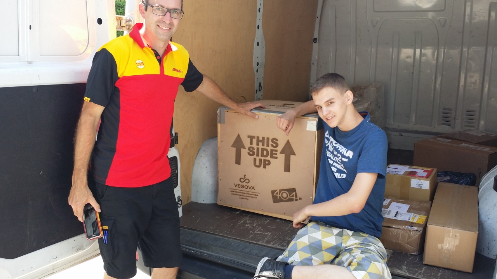
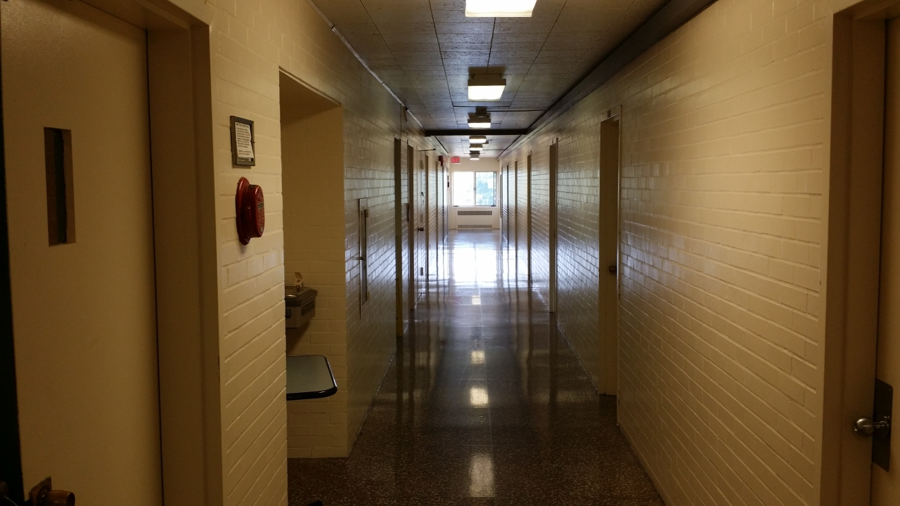

_Tekmovanje First Global Challenge 2017 bi verjetno šlo mimo vseh očes in ušes, če ne bi
ameriška administracija blokirala pridobitve viz ekipama Afganistana, ki so jo sestavljala
sama dekleta, in ekipi Gambije. Novica je bila objavljena v vseh vidnejših medijih po svetu
in tako opozorila, da tako tekmovanje sploh obstaja. Vize so bile odobrene šele po intervenciji
ameriškega predsednika Donalda Trumpa, ko se je menda ta za to osebno zavzel. Tekmovanja
se je udeležila tudi Slovenija, zastopala jo je ekipa: David Kraševec, Luka Maček in Mark
Breznik, dijaki Vegove Ljubljana, in eden od njihovih mentorjev, Aleš Volčini, ki tam
poučuje strokovne predmete in ki je napisal tale krajši dnevnik._

<!-- truncate -->
Na letališču Dulles smo pristali po pravkar minuli nevihti, med katero se je shladilo vse
do 14 ℃. Že tako smo imeli zamudo zaradi naključnih varnostnih pregledov v Amsterdamu, a
smo morali čakati še približno 45 minut, da so dovolili, da se letalo sme približati terminalu.
Res je še malo pihalo in malo je še padal dež, bali so se tudi statične elektrike, ki bi
se med nevihto lahko nabrala na letalu, a vseeno smo imeli potovanja čez lužo počasi vrh
glave. Po pregledih in carinskih procedurah smo se odpravili po prtljago in nato na izhodu
poiskali predstavnike First Global-a. Sledile so komplikacije s prtljago, ki je šla s svojim
vozilom posebej naprej, in čakanje na prevoz v Thurston Hall, kjer je bilo zbirno mesto vseh 163 ekip.

Zrak je bil zadušljiv, hitro se je spet segrel do 35 ℃ in je bil skoraj do konca nasičen z vlago.

Končno je po nas prišel avtobus. Pravi šolski avtobus rumene barve. Stlačili smo se noter.
Za noge spet ni bilo dovolj prostora, saj so ti avtobusi namenjeni osnovnošolcem. V center
smo se vozili skoraj eno uro. David je pripomnil, da ni nikoli mislil, da se bo kje vozil
s takim avtobusom. Makes two of us.

V centru je vladala kar precejšnja zmeda, mi pa smo morali še poiskati našega robota, ki
je štiri dni prej prispel z DHL-om. Ob registraciji so nam povedali, da nas bodo poslali
na drugo lokacijo, Trinity Washington University. Malo smo bili razočarani, saj je to
pomenilo kar precejšnjo oddaljenost od znamenitosti, ki smo si jih želeli ob večerih
pogledati, povrhu pa tam blizu ni bilo trgovin. A se je hitro pokazalo, da je to manjši
problem. Našega robota namreč ni bilo nikjer. Po povpraševanju in paniki so nas potolažili,
da nas bo robot čakal naslednji dan v DAR Constitution Hallu, kjer bodo priprave in tekmovanje.
Right.

Avtobus nas je približno ob 21h prepeljal na Trinity, kjer nas je pričakal Karl. Na vprašanje,
kdo hoče iti prvi v sobo, smo se zagrebli in tako nam je prvim izročil ključe. Kot mentor
sem dobil sobo 506, Mark svojo 504, Luka in David pa skupno 503. Vse sobe so imele po dve
postelji. Gor smo se odpravili z dvigalom, ki je bilo videti staro in dotrajano, a med
nadstopji je vozilo zelo hitro.

Prvo presenečenje je sledilo takoj po prihodu v peto nadstropje (oz. četrto, saj Američani
pritličja štejejo kot prvo nadstropje). Odklenem in stopim v sobo. Vame udari hladen, a
zatohel, zoprno kiselkast zrak. Klima je bila v pogonu, zrak pa zadušljiv, da bolj ne.
Nekdo potrka na vrata. Odprem in pred vrati stoji Mark.

»V moji sobi je že nekdo notri.«

»Kaj?«

»Trije so notri, dva sta na postelji in eden na tleh.«

Smešno. Pogledam in res je soba bila že zasedena. Just great.

»Če ti ni zoprno, se lahko vseliš v mojo sobo. Notri sta dve postelji. Ali pa če greva najprej do Karla.«

Pa sva šla najprej do Karla. Karl je bil strašno presenečen, saj menda ključev od 504 ni
dal nikomur. Nato smo se dogovorili, da bova sobo delila z Markom, ostalo pa bomo urejali
naslednji dan. Okay.

Vrnila sva se v sobo in najprej odprla okna. Iz klime je še vedno vel zrak čudnega vonja,
zato sva jo raje ugasnila. Tudi mikroflora na njej ni ravno vzbujala zaupanja. Oprema je
bila verjetno še iz 80 -ih, dotrajana, a še uporabna. Kljuka na vratih je bila značilno
ameriška – z vrtečim gumbom za odpiranje in ključavnico v sredini ter ni ravno dajala
občutka varnosti. Počutil sem se tako, kot bi bil v igri Fallout. Črne žimnice so bile
praktično nove, novejši stoli so bili na pol gugalniki. Blazina je bila napolnjena z nekim
zračnim polnilom, a ni bila neudobna. Zatohel vonj je izginjal hitro, na znosno raven je
padel že do naslednjega dne, do konca našega bivanja pa na komaj zaznavno raven. Mogoče
smo se pa samo privadili...

Toaletni prostori so bili kombinirani s tuši, pisoarjev ni bilo videti nikjer. Kasneje smo
ugotovili, da zato, ker smo bili v dekliškem internatu oz. dijaškem domu. Navadili smo se tudi na to.

Za večerjo smo pojedli še tisto nekaj hrane, ki smo jo prinesli s sabo. Spravili smo se
tuširat in spat. Zunaj smo slišali še nek prepir in nekdo je govoril, kako da bo poklical
policijo. Malo smo gruntali, kam smo padli, a je hrup kmalu potihnil in vse je bilo spet
mirno. Finally.
