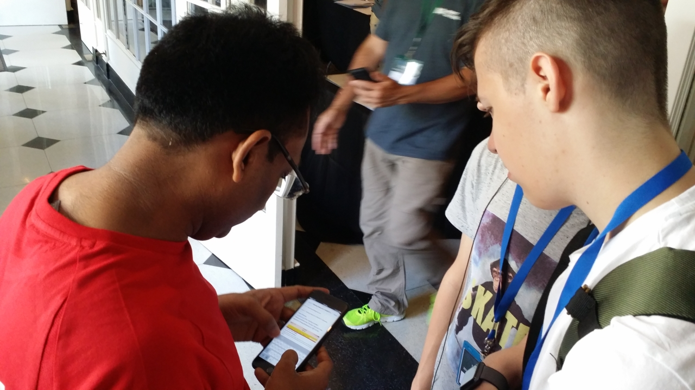
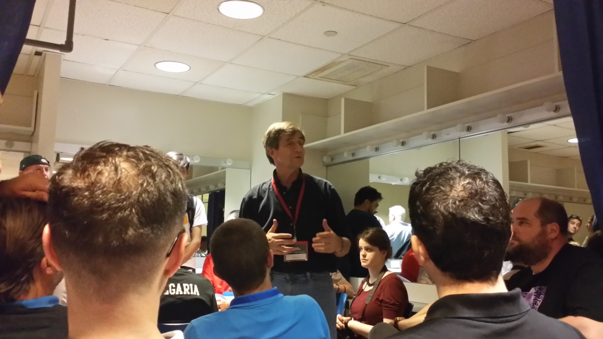
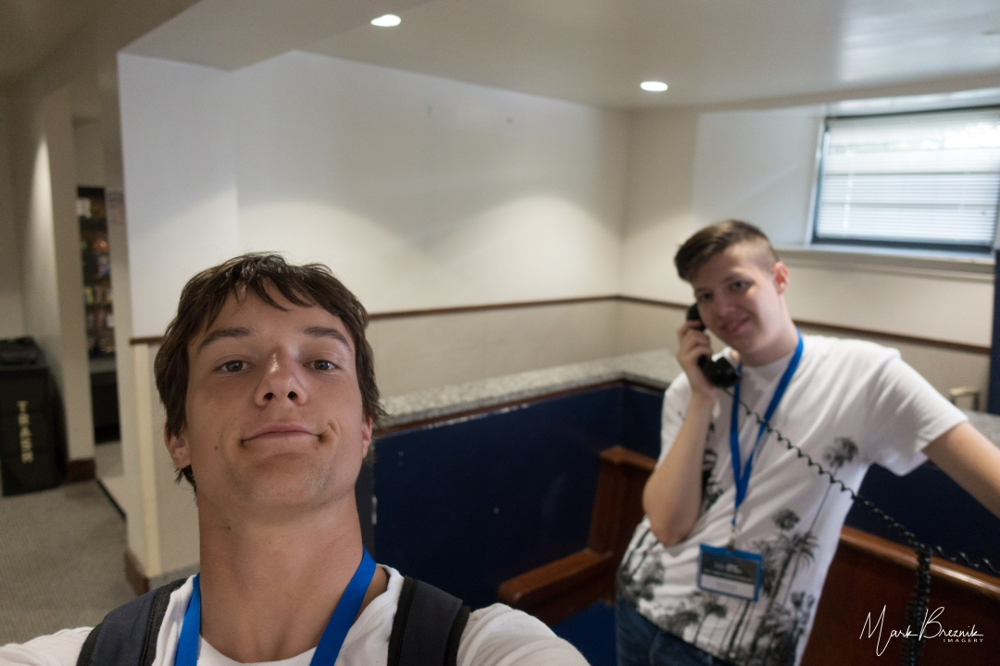

Naslednje jutro se je začelo zelo zanimivo. Maria, ki je nadomeščala Karla, je povedala,
da so zasedeni do konca oz. prenapolnjeni in da manjkajo žimnice (verjetno je manjkala tista
iz 504, na kateri je spal tisti na tleh). Nekomu je zato odstopila svojo in si prinesla
spalno vrečo, nato pa odstopila še to. Nekdo je moral celo prespati v avli spodaj na kavču.
<!-- truncate -->

Ušteli so se, da so med tekmovalci tudi dekleta, ki bi jih morali ustrezno ločiti. Dobili
pa so samo imena, po imenih s celega sveta pa niso mogli ugotoviti, kam kdo sodi. Tudi Frank,
član osebja First Global, je to noč prespal v kombiju in je bil zjutraj zelo neprespan in
slabe volje. Ugibali smo, da je bil verjetno prav on tisti, s katerim se je Karl prepiral
prejšnji večer, saj bi moral imeti eno sobo zase.

Seveda je bila prva stvar vprašati Franka, če so našli našega robota. Odgovor je bil, da
nas verjetno čaka v DAR Hall-u, ali pa nam bo Tom iz servisa pomagal sestaviti novega. Right.

Preden je prišel avtobus, sta se Mark in Luka odpravila v bližnjo delikateso po nakupih, a
sta takoj prišla nazaj praznih rok, saj se le-ta odpre šele ob 8h, torej čez eno uro.

Po nas je prišel avtobus in nas odpeljal v DAR Constitution Hall, prizorišče priprav in tekmovanj.

Prostori za priprave so bili v pritličju okoli centralnega koncertnega prostora in kleti,
ekipe pa zelo neenakomerno razporejene. V kleti s precej manjšo površino kot pritličje je
bila skoraj polovica ekip in dobesedno ni bilo enega prostega kvadratnega metra, razen ob
bližnjem servisu. Osvetljava je bila jakosti sveč, po dve ekipi sta si delili eno mizo z
enim samim stolom.

Gneča je bila nepopisna, ljudje so iskali svoje robote, ki so jih tja pripeljali ločeno od
ekip. Večina ekip jih je hitro našla, le nekaj nesrečnikov, med njimi tudi mi, pa ne.
Ukrajina svojega ni uspela pripeljati v ZDA, ker ga med prestopanjem letalska družba ni
pravočasno pretovorila, in je prišel šele naslednji dan, dve ekipi sta svojega izgubili na
poti, našega, ki smo ga v Thurston Hall poslali po DHL-u, pa tudi ni bilo nikjer. Ekipa
Bahraina je prišla z enodnevno zamudo, a so robota kmalu našli. Malo manj so bili zadovoljni,
ko so ugotovili, da imajo prenočišče tam kot mi, a da tam ni več prostora in si morajo najti
zasebno bivališče.

Po uri iskanja smo angažirali še nekaj prostovoljcev in osebja, a zaman. Veliko nam je pomagal
g.Gagan, član indijske ekipe, ki je bil iz nekega razloga zelo dobro informiran, kam se obrniti.
Frank in ostali so tudi poskušali pomagati, a veliko učinka ni bilo. Nekdo iz servisa se je
spomnil, da je videl škatlo, a je Mark pravilno posumil, da jo je videl zgolj na videu, ki
smo ga objavili na spletni strani Youtube. Po kosilu, sendvič in čips, smo približno ob
enih že obupovali, da robota morda sploh ne bomo več videli.

Zjutraj od 8h do 11h so potekala še srečanja mentorjev z direktorjem Joe Sestakom, kjer je Joe,
bivši kongresnik in mornariški častnik, razlagal, kako so prišli do take svetovne udeležbe,
nekaj anekdot, kako vojska lahko samo ustavi konflikt, ne more pa ga razrešiti in kaj nameravajo
s tekmovanjem v prihodnosti. Nekdo je omenil, kako je imela zgodba o afganistanskih dekletih
velik odmev v javnosti in je nehote naredila veliko reklame za dogodek, še posebej po tem,
ko se je ameriški predsednik menda osebno zavzel za odobritev viz. Joe je dejal, da mora
osebje, ki izdaja vize, po službeni dolžnosti predvidevati, da želi prosilec ostati v ZDA
za vedno, ta pa mora dokazati nasprotno. Do dovoljenja za vstop ali vize so prišle vse
prijavljene ekipe, tudi ekipe Afganistana, Burundija in Gambije.

Po sestanku sem ob 11h ujel še Liz, ki je obljubila svojo pomoč pri iskanju našega robota.

Ob 14h še vedno ni bilo nič novega, zato smo se odločili stvar vzeti v svoje roke. Mark in
David sta se odpravila v Thurston Hall, da bi situacijo preverila na kraju samem, Luka in
jaz pa sva počakala v DAR hallu. Čez tričetrt ure je od Marka prišel SMS, da robota nista
našla, da pa imata novice. Cliffhanger.

Z Lukom sva ugibala: robota nista našla, imata pa novice. Kakšne? Najbrž vesta vsaj, da je
prispel. Morda celo, kaj je z njim. Ali ga je nekdo videl ... Mark verjetno namerno ni
povedal kakšne novice, torej so najbrž dobre. Namerno naju je pustil v negotovosti. Cheeky.

Mark in David sta se vrnila. Ko sta po paketu povprašala v Thurston Hallu, so ju skorajda
odslovili. Tam je bila skupina varnostnikov. Varnostnica ju je skoraj odslovila, drugi
varnostnik, ki se mu je dozdevalo, kaj se je zgodilo, pa je v bližnji govorilnici poklical
nekoga iz administracije Univerze Georgea Washingtona (kamor spada Thurston Hall). Prijazna
gospa na drugi strani je Marku povedala, da vse pošiljke pošiljajo v poštni center univerze,
dva bloka stran, ki je trenutno zaprt. Odprt bo v ponedeljek zjutraj. Great.

Očitno je bil ta dan za nas izgubljen. Obvestili smo Franka, da gremo nazaj na Trinity sami,
ker danes pač ne moremo narediti ničesar in gremo raje malo naokoli. Odpravili smo se do
Thurston Halla, da bi se še posebej zahvalili varnostniku, a ga ni bilo več tam. Too bad.

Uro kasneje prileti elektronska pošta: gospa iz administracije je Marka med pogovorom dala
trikrat na čakanje in vmes kontaktirala organizatorje, zdaj pa je direktor Joe sporočil,
da bo robot dostavljen zvečer v DAR. Hvala, Jake in Joe. Yay.

Mark se je zelo dobro znašel in hitro ugotovil, da storitev Lyft v Washingtonu sploh ni
draga in odločili smo se, da se poskusimo z njo vrniti na Trinity Univesity v internat. Prva
vožnja z Lyftom je potekala brez zapletov. Med pogovorom z voznikom smo ugotovili, da pozna
Slovenijo in jo je pravilno postavil južno od Avstrije, k Trstu. Ko smo ga vprašali, kaj se 
plača ogledati v Washingtonu, je naštel nekaj standardnih krajev, omenil pa je tudi Baziliko
narodnega svetišča brezmadežnega spočetja in vedel povedati, da ima v njem tudi Slovenija
svoj oltar. Pohvalil je prvo damo in dejal, da tako lepe prve dame v ZDA še niso imeli.
Melanija je Slovenijo očitno dobro postavila na zemljevid, saj nas v času našega bivanja
ni nihče vprašal, kje ali celo kaj Slovenija je. Nice.

V internatu smo se malo osvežili in se nato peš odpravili do 4 km oddaljenega trgovskega
centra Giant. Sprehodili smo se med tipično ameriškimi vrstnimi hišami, ozkimi in dva
nadstropja visokimi, z nekaj malo trate pred vhodom in ugibali, koliko se je tam sploh
varno sprehajati. A se v nas ni nihče vtaknil, vmes pa smo lahko videli pred hišami na
trati kak neusposobljen starinski avto, osnovno šolo, sladoledarski avto z značilno
lajnarsko glasbo in še kaj. Interesting.

V centru smo kupili nekaj pijače (voda iz pipe je bila precej klorirana, celo ustekleničena
voda je bila sumljivega okusa – iz nekega razloga je imela dodane minerale ali »minerale«),
nekaj toasta, marmelado in arašidovo maslo. Rahlo sem bil znerviran, ker od hrane nismo kupili
nič zanimivega, pa sem kupil borovničevo pito ter neke narezane mesnine. Luka je kupil
instant rezance, čeprav še nismo vedeli, kje bomo dobili vročo in pravo pitno vodo. Z Lyftom
smo se odpeljali tudi nazaj. Meso je šlo zelo hitro, borovničeve pite pa naslednje dva dni
ni hotel nihče niti poskusiti, pa je bila zelo dobra. Youth these days..

Izgubili smo praktično ves dan, a smo vsaj z optimizmom zrli v jutrišnjega.