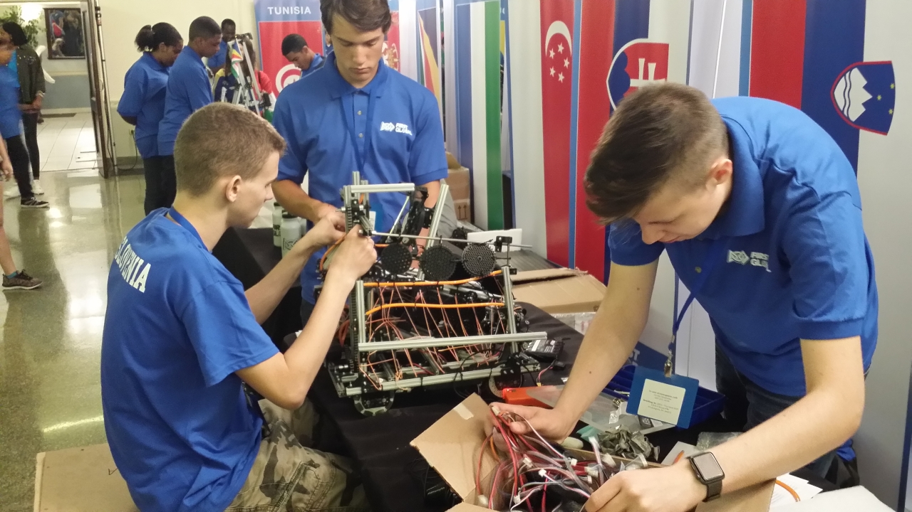
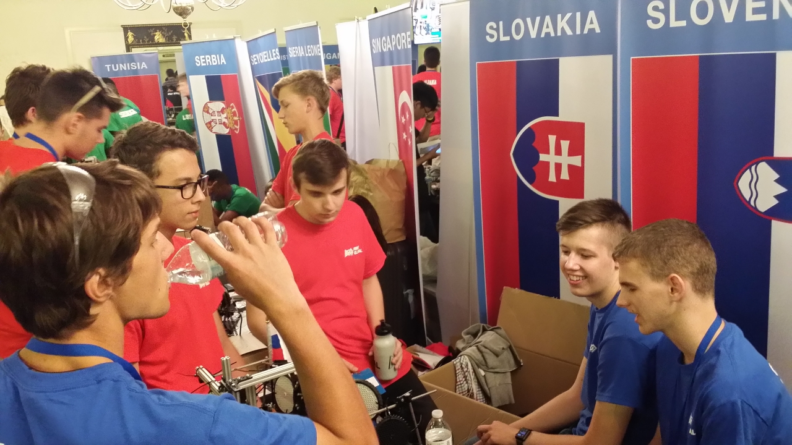
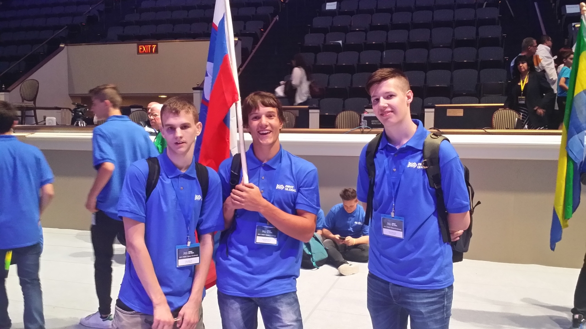

Za zajtrk toast, marmelada in arašidovo maslo ter raznorazne pregovorno škodljive sladke
pijače. Ob 6:45 so nas z avtobusi odpeljali v DAR. Robota še vedno ni bilo tam, rečeno pa
nam je bilo, naj počakamo, da ga bodo že pripeljali. Čakalo pa nas je še drugo presenečenje.
Ponoči so nekaj ekip preselili drugam in za razliko od prejšnjega dne se je zdaj človek lahko
celo premaknil, ne da bi komu stopil na nogo. Uspelo jim je prižgati tudi dva lestenca in
tako se je dalo normalno delati.
<!-- truncate -->

Do 12h robota še ni bilo, menda je bil v Thurston Hallu. Spet smo se odločili, da ga gremo
iskat sami, ker sicer bo šel še en dan po gobe. Mark in Luka sta se Tomom odpravila v 1 km
oddaljeni Thurston Hall, da bi ga prinesli kar peš. Brave.

Ko je trojica bila najbrž že tam, pa so mi prišli povedat, da nas robot čaka gor. Stekel
sem po stopnicah in res, naša škatla nas je čakala pred vhodom v DAR. Obvestil sem Marka,
da je robot zdaj tu in da lahko pridejo nazaj, z Davidom pa sva škatlo odnesla do servisa,
da bi jo tam odprla. A izkazalo se je, da je Tom vzel edini vijačnik s sabo, tako da sva z
Davidom potem odvijala 10 cm vijake z izvijači in multifunkcijskimi orodji. Šlo je zelo
počasi in še z enim prostovoljcem smo do takrat, ko so Mark, Luka in Tom prispeli nazaj,
uspeli odviti polovico vijakov. Z vijačnikom je šlo do konca precej hitreje. Yay.

Odnesli smo škatlo na naš prostor in sestavili robota, ki je bil podrt ravno toliko, da je
bil pripravljen na varen prevoz. Po testiranju smo ga odnesli na pregled in tam so se stvari
malo zapletle. Med kontrolorjem in razširitveno enoto smo namreč uporabili USB-povezavo,
ker povezave RS-485 nismo mogli nikakor usposobiti. Komisija je vztrajala, da preidemo na
RS-485, pa smo potem skupaj ugotovili, da povezava res nikakor ne dela. Rešitev je bila
menjava kontrolne enote, jaz pa sem morda naredil napako, ko nisem zaradi večje zanesljivosti
zahteval tudi menjavo razširitvene enote in vseh kablov. Čisti rez pač. Ker se je res mudilo,
smo menjali samo kontrolno enoto. Na zamenjano enoto je bilo potrebno ponovno naložiti
program (bili smo pripravljeni in smo imeli smo rezervno kopijo) in ponovno nastaviti,
kateri motor in kateri senzor je na kakem priključku. Postopek se sliši enostaven, a ne z
obstoječo programsko opremo. Na srečo se je Mark izredno dobro oborožil z iPripomočki in z
Lukom sta dala vse od sebe, da smo dobesedno nekaj sekund pred zadnjim možnim treningom,
načrtovanim za našo ekipo, imeli robota v delujočem stanju. Vsaj tako smo mislili, saj je
sem ter tja prihajalo do manjših tehničnih težav s povezavami. Temu tako osebje kot mi nismo
pripisovali večjega pomena, saj je bilo precej brezžičnih dostopnih točk v okolici in ker
se je to občasno dogajalo tudi drugim. Mistake.

V naslednjih urah smo še opravljali razne izboljšave, saj je robot med transportom rahlo
spremenil svoje dimenzije. Vmes sta potekali še dve generalki otvoritve, kjer so tekmovalci
prihajali na prireditveni prostor z nacionalnimi zastavami. Da ima problem z ločevanjem
Slovenije in Slovaške še kdo drug, je med generalko ugotovila tudi slovaška ekipa, ki je
na vprašanje prostovoljca, ki je pošiljal ekipe na prizorišče, »Slovenia?« najprej
odgovorila pritrdilno. Funny.

Do konca dneva smo še ugotovili, da povezava med tablico in robotom čedalje pogosteje pada
dol in preroško ugotovili, da bo to še problem.

Sledila je uradna otvoritev, ki so jo prenašali tudi preko spleta. Med govorniki sta bila
predsednik Joe Sestak in ustanovitelj Dean Kamen. Tisti Dean Kamen, ki je pred leti svetu
predstavil dvokolesnik Segway. Za govornika, ki naj bi navdahnil zbrane srednješolce, so
čisto po ameriško za najbolj primernega povabili nekoč južnokorejskega imigranta, sedaj
predsednika svetovne banke, Jim Yong Kima. Po končani otvoritvi so se na zaslonu prikazala
imena ekip, ki naj počakajo na prizorišču, saj da jih bodo obiskali diplomatski predstavniki
njihovih držav. Prišli so predstavniki večine držav, a slovenske smo čakali zaman, kljub
temu da smo z zastavo zelo opozarjali nase.

Vrnili smo se v internat. Naredili smo analizo stanja, bili zadovoljni, da smo sploh prišli
do robota, skrbelo pa nas je padanje povezave. Za večerjo smo se odločili, da gremo ven na
kakšno pico ter našli Pizza Domino v bližini, a se je izkazalo, da jo tam lahko dobiš samo
za sabo. Na srečo je bil takoj zraven Subway, kjer so nam naredili ne ravno poceni, a vseeno
velike in dobre sendviče. Še preden smo pojedli, se je že pošteno stemnilo in ko smo se
odpravili v Seven Eleven, dvoje vrat stran, je bilo tam že nekaj nesrečnikov, ki so prosili
za drobiž za kak sendvič ali kaj drugega. Neki ženski sem dal pet dolarjev in popolnoma
spregledal, da je bilo tam več ljudi z istim problemom. Malo mi je postalo zoprno, kajti
prodajalne so bile nekako na samem, a me je pogled na dva policista v trgovini pomiril.
Kupili smo še nekaj stvari za zajtrk, naročili Lyft in se izpred trgovine odpeljali domov.
Voznica je bila prijazna in zgovorna, povedala je, da dela podaljšani delovni čas in da bo
zato zamudila prvo epizodo nove sezone Igre prestolov, a da bo že bolje.
