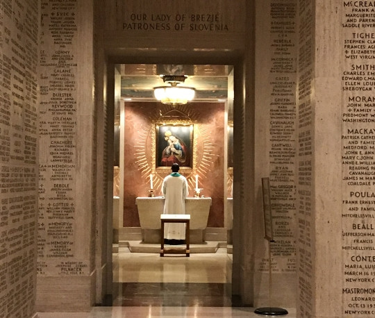

Napočil je dan, ko se je bilo treba pripraviti na povratek. Po zajtrku smo spakirali prtljago
in do 10h pospravili sobo. Vmes je od nekod prišla novica, da pogrešajo šest članov ekipe
Burundija, ki je stanovala v isti stavbi. Policija spodaj dan poprej in nepospravljena
soba sta nenadoma dobila smiseln zaključek. Izginili so menda še pred podelitvijo nagrad,
dva pa so danes že opazili na meji s Kanado, kjer bodo najbrž iskali azil.
<!-- truncate -->

Ker smo imeli še dve uri časa, smo se odpravili na ogled Bazilike narodnega svetišča
brezmadežnega spočetja, ki je bila del samega kampusa. Stavba je kar velika in površen
ogled je vzel uro in pol. Bogato okrasje je kazil delovni oder, nad katerim dokončujejo
osrednjo kupolo, ki bo nared konec leta. Spodnji prostori so bili opasani z marmornimi
ploščami, na katerih so bili izpisani donatorji, namen ali v spomin koga je bil prispevek
darovan. Ko smo že ugibali, ali je naš prvi voznik Lyfta zamenjal Slovenijo s Slovaško, pa
smo spodaj med kapelicami zagledali tudi Marijo Pomagaj z Brezij. Duhovnik je tam ravno
maševal, pa smo jo slikali samo od daleč. Na poti ven smo se ustavili še v prodajalni
spominkov, kjer sva David in jaz kupila nekaj stvari za domače.

Ko smo se vrnili, je trajalo še nekaj časa, da je po nas prišel avtobus in nas odpeljal v
Thurston Hall, od tam pa z naslednjim avtobusom na letališče Dulles. S pomočjo telefonske
aplikacije letalske družbe KLM smo opravili prijavo na let še v internatu in si tako na
letališču prislužili prednostno obravnavo. Ko smo oddali robota med prtljago in opravili
preglede, je bilo na voljo še nekaj časa za kosilo. Po njem pa sem si vzel nekaj minut za
nekaj spodbudnih besed ob zaključku poti. Fantje so v robota vložili ogromno časa, trpelo
je zdravje in šolski uspeh, tvegali so popravne izpite, rezultat pa je bil, kot je bil.
Fantom je bilo potrebno povedati, da so se ne glede na rezultat dobro odrezali, da sem bil
vesel, da pritiski niso razbili enotnosti in da niso zašli v konflikte, da niso popuščali
do samega konca, da so se borili kot levi, da so se izkazali tako, kot je treba in da sem
nanje ponosen. Realnost je pač taka, da je zmagovalec samo eden, prvi poraženec je že drugi
na lestvici in da je povsod zraven tudi kakšna kuhinja. Napetost je vidno popustila. To bi
moral narediti že prej.
