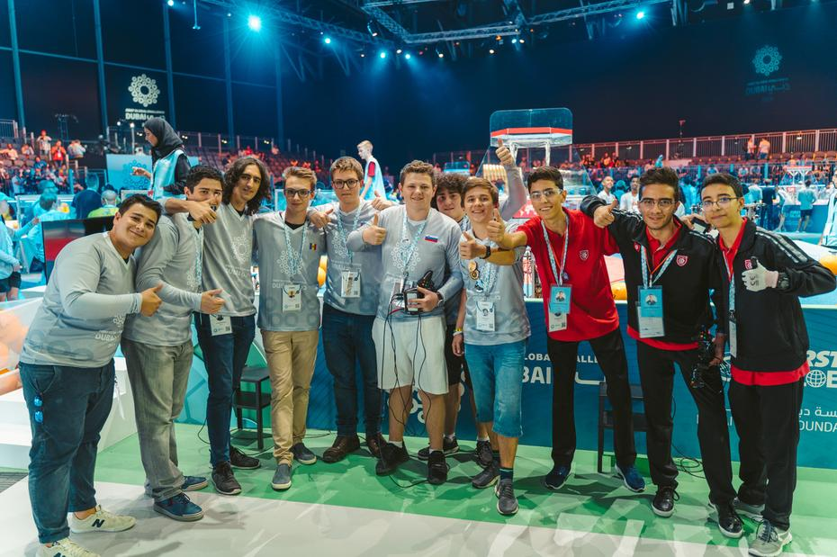
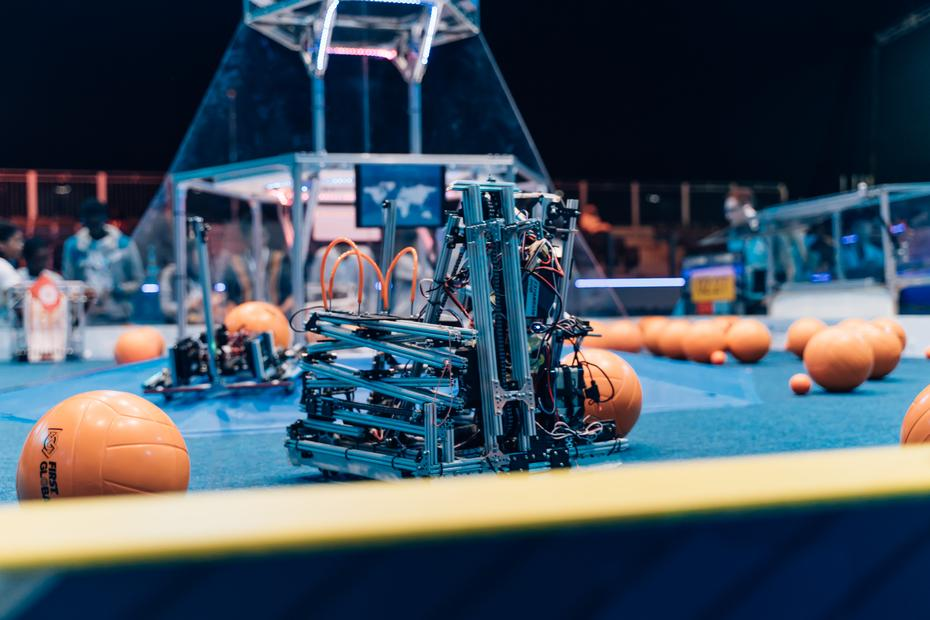
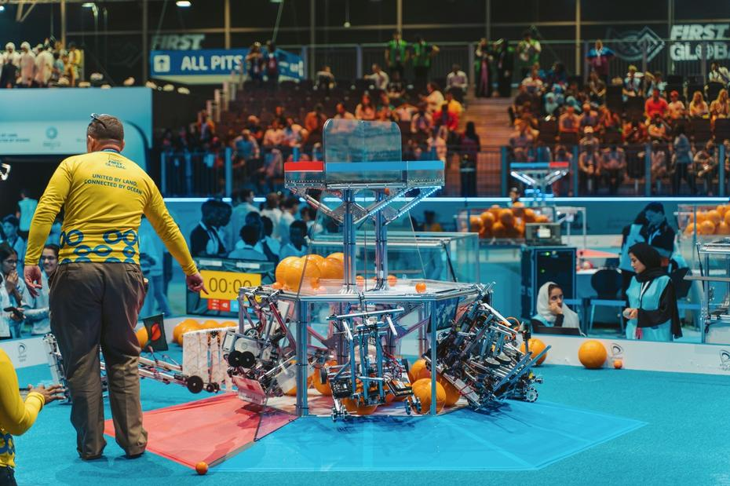
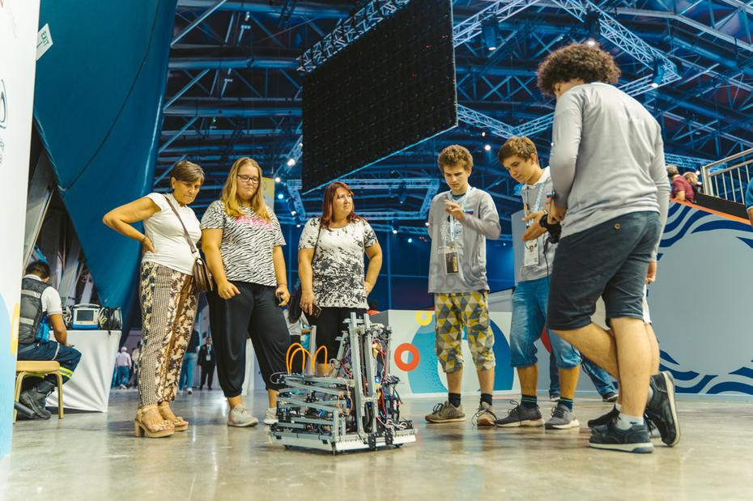
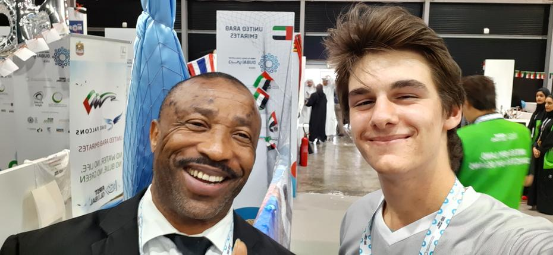

Vsaka izmed iger je potekala na istem poligonu, ki je bil enak za našo in nasprotno ekipo.
Na sredini poligona je bil simetričen heksagonalni lik, s katerega se je dvigala platforma
pod približno 25-stopinjskim kotom. <!-- truncate --> S pomočjo teh platform pridemo do še
enega šestkotnika, ki je predstavljal 1. stopnjo, na katero so lahko tekmovalci potisnili 
makrokomponente oz. velike žoge, ali pa mikrokomponente oz. majhne žoge. Nižja kot je bila
stopnja, manj točk je prejela ekipa za vsako žogo. Druga stopnja heksagonalnega stolpa je
bila od 1. stopnje oddaljena približno 50 cm. 2. stopnja je bila manjša od prve, kar je tudi
oteževalo izziv. Sem so lahko tekmovalci dvignili ali pa izstrelili žoge želene velikosti.
Na to platformo se je lahko robot proti koncu igre tudi obesil, tako da je bil dvignjen od
tal, in za to je prejela ekipa dodatne točke. Še malo višje od druge stopnje se je nahajala
najmanjša, tretja, stopnja, vendar je imela ta namesto trdnih tal mrežo. Najvišjo stopnjo
smo poimenovali kar »high risk, high reward,« saj je bilo tveganje visoko, vendar pa smo
lahko prav na tej stopnji dosegli največ točk. Omeniti moramo tudi, da je bila med posamezno
polovico sredinskega telesa tudi prozorna stena, ki je ločila modro in rdečo stran igrišča
znotraj območja šestkotnika. Obema ekipama je bil določen tudi kot, v katerega sta lahko
potisnili žoge, ki jih je kasneje t. i. »human player« prijel z lastno roko, saj se človeška
roka med igro ni smela dotakniti ne robota ne žog. Pred začetkom igre robotov nismo smeli
zagnati, zagnali smo jih lahko šele, ko se je peščena ura obrnila in začela odštevati 2,5
minuti. Ob igrišču sta bila prisotna tudi sodnika, ki sta vneto spremljata igro in ob koncu
igre tudi pomagata pripraviti poligon za naslednji dvoboj, prav tako pa sta se rada tudi
fotografirala s tekmovalci.

Pred začetkom iger za kvalifikacijo smo imeli priložnost odigrati tudi dve poskusni igri,
ki sta nam bili pisani na kožo, zato smo bili toliko bolj motivirani za bolj tekmovalne dvoboje.
Prva igra, prvi koš. S pomočjo Andore ter Tunizije nam je uspelo premagati Kosovo, Kubo ter
Eritrejo z rezultatom 82 : 64. Ekipa je bila navdušena. Igra številka dve – zmaga številka dve.
Poleg nas sta na strani modre ekipe bili tudi ekipa Komorov ter Belorusije, ki sta pripomogli
k opaznejši razliki točk, in sicer kar 135 : 81 proti rdeči ekipi. Tretja in tudi zadnja tekma
prvega tekmovalnega dne sta se končali s porazom modre ekipe, ki so jo poleg nas sestavljali
tudi člani sosednje Afrike, natančneje Namibije, ter oddaljene Južne Koreje. Glave smo držali
pokonci, saj smo zmago proti azijskim tekmecem zgrešili le za sedem točk. Prvi dan smo torej
končali na Black Jack rezultatu, 2 : 1.

Do naslednjič,  
İyi geceler

