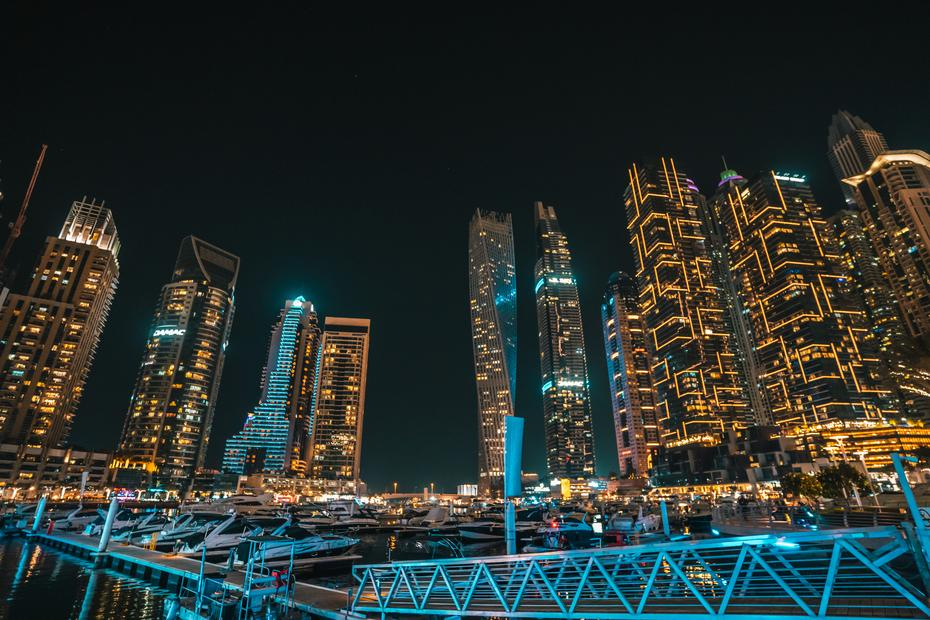
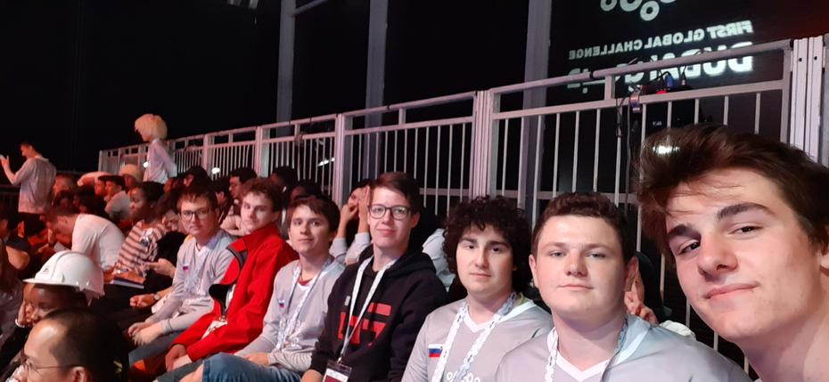
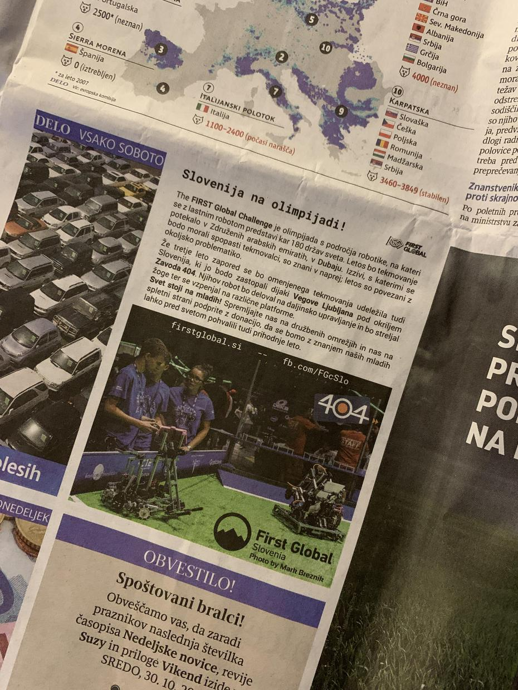

Čri, Čri, dan tri! Naša prva igra tretjega dne je padla v našo košaro z zmago proti Peruju,
Braziliji ter Slonokoščeni obali. K doseganju rezultata 90 : 42 sta pripomogli tudi Džibuti
ter Papua Nova Gvineja. <!-- truncate --> Pred nami je še zadnja kvalifikacijska igra. Skupaj
z nami sta na strani rdeče ekipe bili tudi Vietnam ter Litva. Žal so bili nasprotniki tokrat
spretnejši od nas, vendar smo še vedno s ponosom segli v roko članom Slovaške, Združenih
arabskih emiratov ter Ruande. Žal se z rezultatom 5 : 4 nismo uvrstili v finale, vendar smo
pristali na meji najboljše tretjine vseh tekmovalcev. Imeli pa smo priložnost s tribun gledati
napet finale ter navijati za prijatelje iz Venezuele.

Konec dober, vse dobro, smo si rekli, ko so nas počastili z zlato medaljo za »fundraising«.
Nekaj dobrega v nečem slabem ter nekaj slabega v nečem dobrem! Iz velemesta kamel, puščav
in dragih avtov smo se vrnili izkušenejši z lepimi spomini in novimi sklenjenimi prijateljstvi.

Do prihodnjih avantur,  
good night

