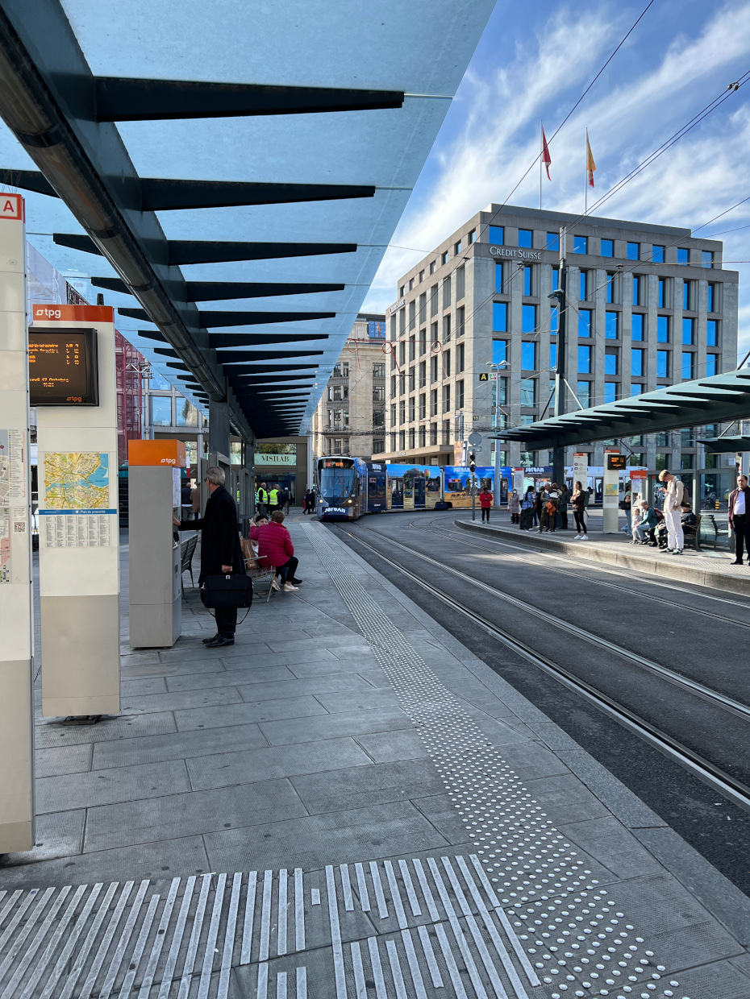
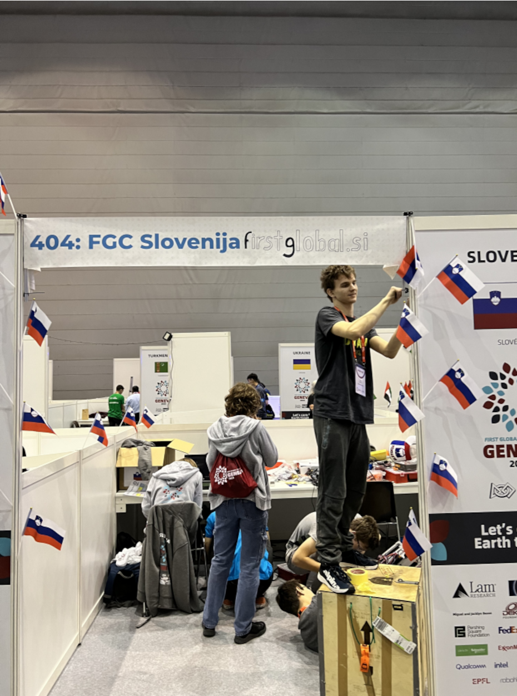
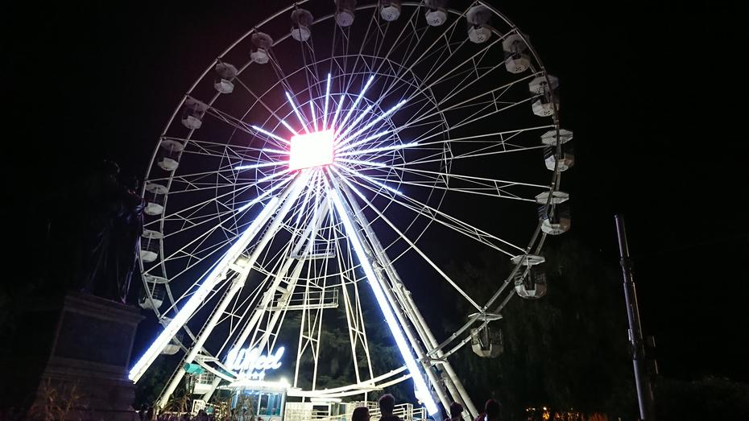
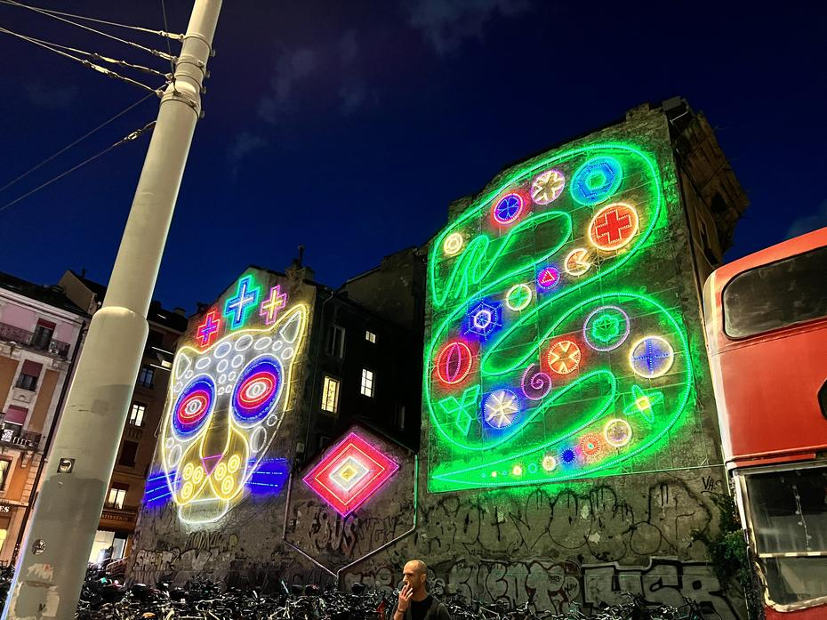
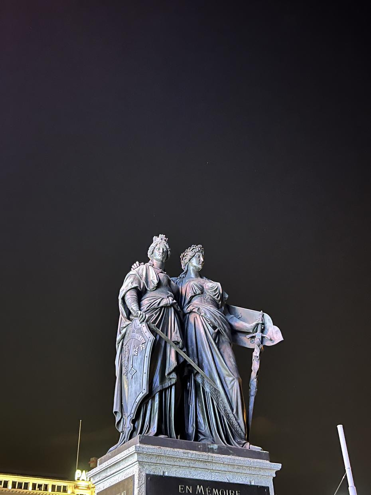

Mirne ženevske ulice in parke so 12.10. obiskali mladi dijaki in dijakinje inženirskih strok
s celega sveta, med drugim tudi naša, slovenska reprezentanca. Letu iz Brnika je sledilo čakanje
na pariškem letališču, od koder smo hitro prispeli v Ževeno. Prispeli smo že noč pred odprtjem
arene, da smo se lahko spočili in dogradili našega robota – Baltazarja. Dan smo začeli z obilnim
zajtrkom, ki mu je sledila postavitev naše miniaturne delavnice oz. pit-a. Obesili smo kar
nekaj zastavic, si pripravili električne podaljške in se podali v akcijo.
<!-- truncate -->

Uvodni dan je bil obogaten z iskanjem zaklada, ki je bil podoben bingotu. Vsak opravljen
izziv iz tabele potrdimo s podpisom tuje države. Iskanje drugih ekip, ki so ustrezali kriterijem
izzivov, nam je vzelo kar nekaj časa, čeprav je bil Jaka zelo aktiven. Tekom dneva smo spoznali
mnoge ekipe, Cayman Islands, Team Suriname, Slovakia in tudi naše stare prijatelje iz Norveške.
Prvi dan smo po pripravah si postregli s kosilom, ki so ga sestavljale solate (kozji sir in
orehi zmagajo – goated) in manjši sendviči ter jabolka. Kmalu za kosilom je na urniku bila
večerja, kar je marsikateremu trebuhu nagajalo, vendar je bila hrana po pričakovanjih, zato
smo si raje zagotovili dodatne zaloge. Čeprav je mentor Maček, smo izbrali medvedji pristop,
kar se nam je na dolgem sprehodu do središča mesta splačalo. Kljub brezplačnemu javnemu prevozu
smo bili primorani ubrati LPP metodo zaradi protesta s strani voznikov. Na srečo nas je zemljevid
skupaj z orientacijo pomagal priti do znanega mostu ob Ženevskem jezeru.

Prečkali smo zibajoči se most in si ogledali Genev-eye, sončnično uro iz rož, ki deluje na elektriko,
in za konec uvodnega dela še sosednji vodošpric (fontana). Po rekalibraciji in šaljivih Kupidovih
prizorih smo se odpravili skozi osrednji del mesta, ki je bil obogaten z trgovinami luksuznih
znamk vse do zgodovinskega predela mesta. Nočna osvetlitev je polepšala marsikateri pitnik
vode, ki smo ga srečali na poti do cerkve sv. Petra, po počitku smo pa pot nadaljevali proti
Old Arsenal, kjer smo si ogledali tope in mozaike. Tej je sledil obisk parka, razgledne točke
in igral. Zadnji turistnični obiski so bili namenjeni ogledu zunanjosti zgradbe Ateene, parka
podobnega Tivoliju (vendar dvopasovna različica), kjer so bili spomeniki reformatorjev. Preden
smo se odpravili na avtobus nazaj smo si ogledali Place de Nueve, eno izmed najbolj imenitnih
zgradb v mestu, nasproti katere je kip generala Dufourja na konju.

Avtobus številka 3 nas je pripeljal do postaje Bel Air, kjer smo prestopili na avtobus št.
5, ki nas je hitro pripeljal domov v hotel Ibis Budget zraven Palexpo arene.

Do naslednjič, lahko noč.