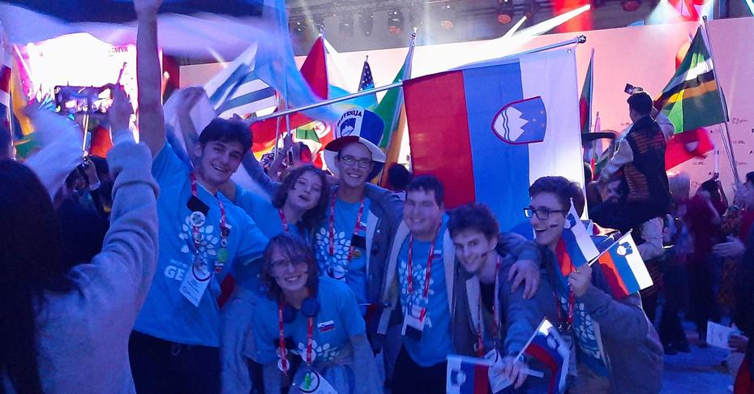
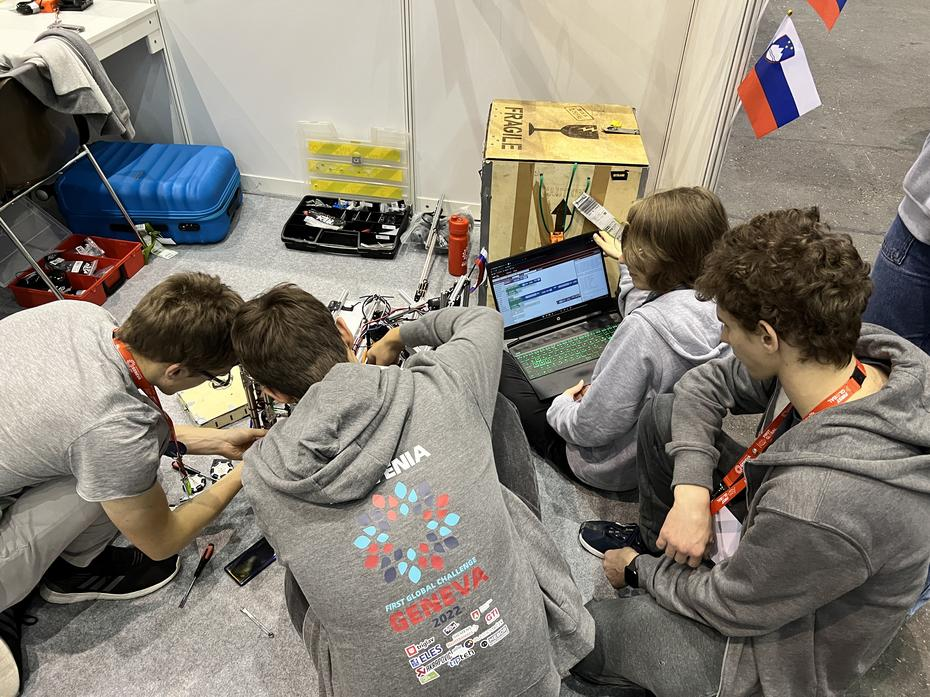
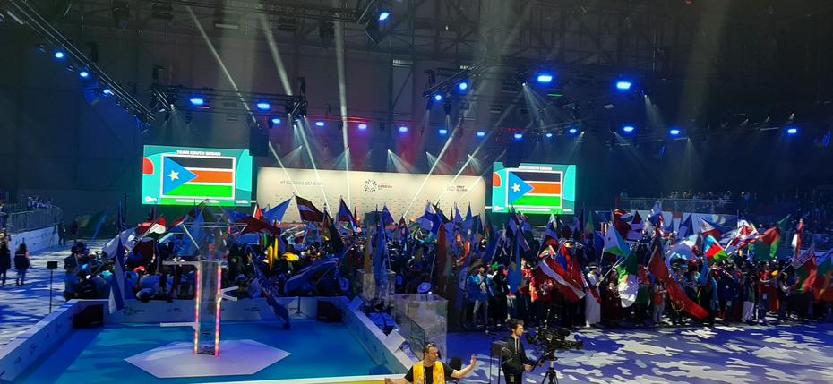
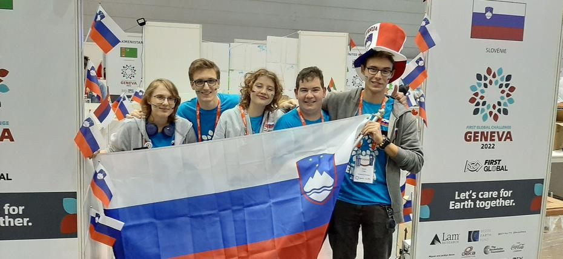

Turistični dan Ženeve je v nas prebudil duh Švice in nas navdahnil za prve igre. 13.10.
smo odigrali prve vadbene igre in vznemirjeno pričakovali otvoritveno predstavo.
<!-- truncate -->

Kljub vražjeverni številki je bil četrtek za nas prijeten dan. Srečali smo mnogo starih prijateljev,
mentorjev in spoznali nove ekipe držav. Čeprav so bile priprave na tekmovanje polne pozitivnega
stresa, saj nam mnogi mehanizmi robota niso bili naklonjeni, smo se uspeli za vsak obrok
prijetno spočiti in ugotoviti, da smo se v resnici naučili nekaj novega. Rezultati so bili
vse razen obetavni, saj smo komaj dosegli kako točko zaradi nezadovoljivega delovanja
mehanizma za izstrelitev, smo pa vsakič odkrili novo pomanjkljivost dvižnega mehanizma.

Dneva je bilo kmalu konec in smo se odpravili na zgodnjo večerjo (pozno kosilo bi se lahko
temu reklo). Ob nekoliko nadležni glasbeni spremljavi Tunizije (ponovno) smo pojedli svojo
zelenjavo in riž ter si postregli s sladico. Obiskal nas je tudi glasbenik Will.i.am in vsem
udeležencem namenil motivacijski govor. Odpravili smo se nazaj v Halo 3 prosta Palexpo, kjer
smo bili mentorji primorani sedeti na tribunah in čakati svoje ekipe, ki so počasi privihtele
svoje zastave na oder ob spremni anekdoti komentatorjev. Države so se postavile v več vrst
in čakale (kar nekaj časa) na uradno otvoritev dogodka First Global! Bili smo deležni besed
ustanovitelja Dean-a Kamen-a, predstavnikov podjetij, ki so podporniki organizacije FIRST
in pomembnežev Švice.

Po uvodnih govorih se je prireditev šele zares začela. Na oder je prikorakal gospod, ki je
zaigral svojo priredbo skladbe “Shape Of You” avtorja Eda Sheerena na dolg švicarski rog,
kanglice za mleko in ropotuljice. V spremstvo so mu kasneje prišli gospodi, ki so vihteli
Švicarsko zastavo za fanti, ki so plesali breakdance. Ravno, ko smo mislili, da se zabava
končuje smo bili deležni standardne FIRST nadgradnje. Luči so se zatemnile in na oder so prišli
možje z lučkastimi bobni v spremljavi fantov, ki so krožili z lučkastimi palicami z namenom,
da med vrtenjem izrišejo grb švicarske zastave in logotip dogodka. Pridružili sta se jim plesalki
z lučkami v obliki pavinega repa. Po uvodni glasbeni spremljavi je na oder prikorakal (neznani)
DJ. Ob njegovi glasbi so že utrujeni člani in članice ekip prejele poživitev in začele plesati,
plezati na oder in se zabavati na plesišču. Kljub temu, da so nekatere ekipe že pred začetkom
odšle v svoje hotelske sobe, smo mi malce kasneje odkorakali v skupni prostor hotela, kjer
smo noč končali z družabnimi igrami.

Do naslednjič, ofi!
