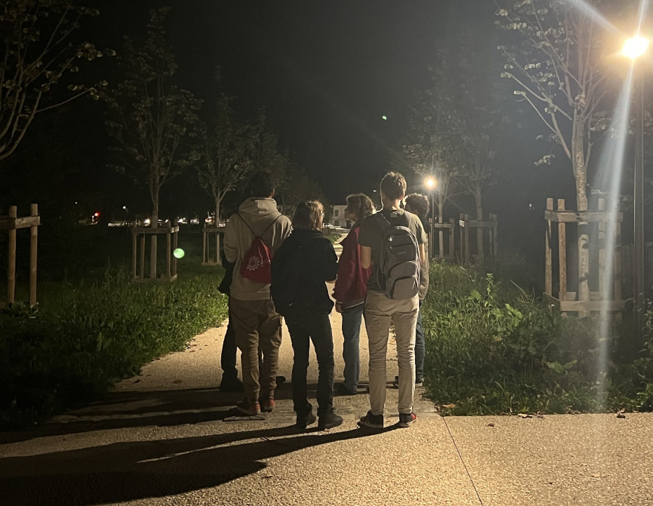
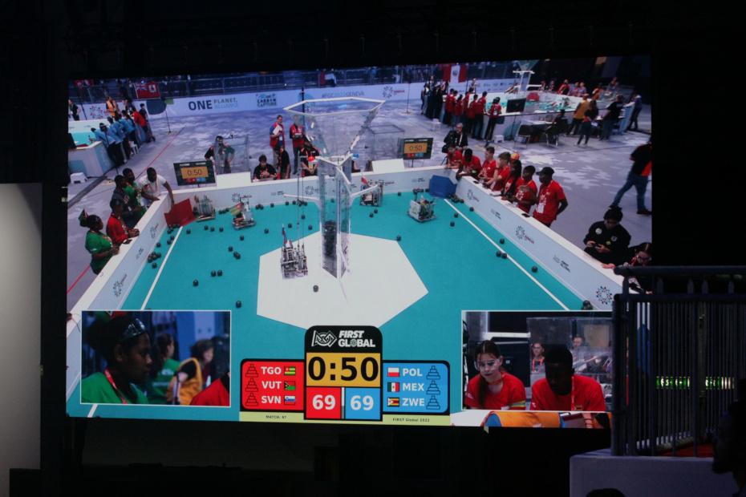
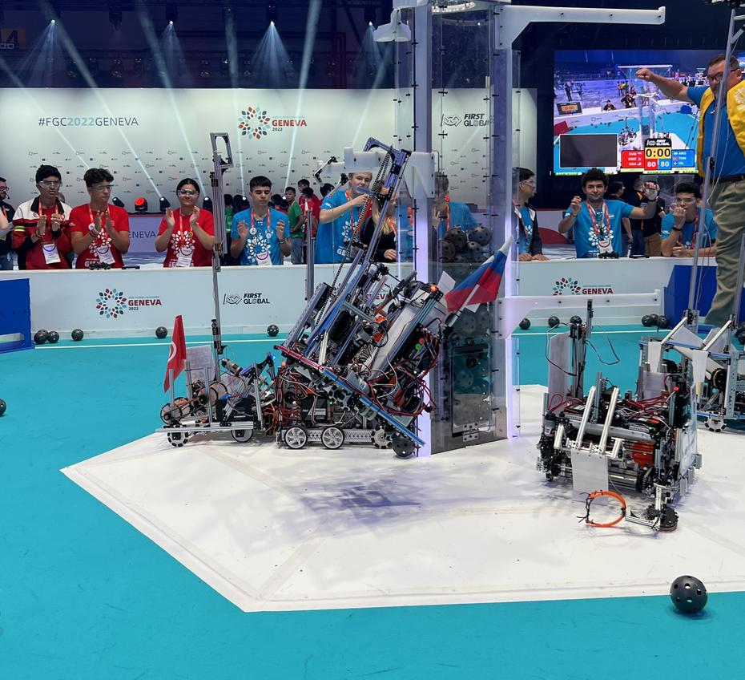

Lepe avanture spremljali še lepši dnevi. Sobota reprezentance se je kot vsak dan začela
zaspano, a po krepkem zajtrku smo pohiteli v areno, saj nas je prva tekma čakala že ob 9:15.
S hitrimi popravki je naša trojica, ki jo sestavljajo voznik, sovoznica in “human player”,
odhitela predstaviti Slovenijo v najboljši luči. Večino sobote smo preživeli na polju številka
5, kar pomeni da so nas lahko gledali vsi na tribunah in na domačih kavčih.
<!-- truncate -->

Tekme so minevale, s tem pa so se tudi nabirale zmage (in žal tudi kakšen poraz), kot vsak
stroj je pa tudi naša ekipa delala na sendvičih in solatah (nekateri pa tudi na čaju in
energijskih napitkih). Kljub napornemu dnevu smo bili veseli, saj smo uspeli izmenjati par
besed z mnogimi ekipami,  da je čas hitreje minil, in s tem je tudi prej nastopila večerja.
Ob večerji je predstavnik iz LAM Research Lab, ki so zvesti podporniki dogodka First Global,
izžrebal zmagovalno ekipo iz nabora žogic z  napisano vsoto izločenega ogljika po tekmi.
Prva klicana država ni bila prisotna, po ponovnem žrebanju je pa bila izglasovana ekipa Velike
Britanije in prijele nekaj Raspberry Pi računalnikov. Predstavitvi in podelitvi nagrad je
sledil nastop DJ-a in (še en) ples, ki se ga je udeležilo občutno manj ljudi.

Konec dneva smo zaznamovali s … pešačenjem v Francijo! Prvotni načrt je vseboval sprehod do
E.Lecrerc-a, ki se je spremenil v obisk Cheatau-ja in ulic obmejnega mesteca Ferney-Voltaire.
Majhno, skromno, prikupno. Moč je bilo občutiti spremembno arhitekture, miroljubnost je pa
ostala enaka. Na poti nazaj smo si ogledali tamkajšnjo cerkev preden smo se usedli na avtobus,
ki nas je odpeljal nazaj v Švico. Nekateri smo se odločili obiskati postelje, medtem ko so
ostali odpeketali na večerni sprehod v mesto.

Do naslednjič, goedenacht.