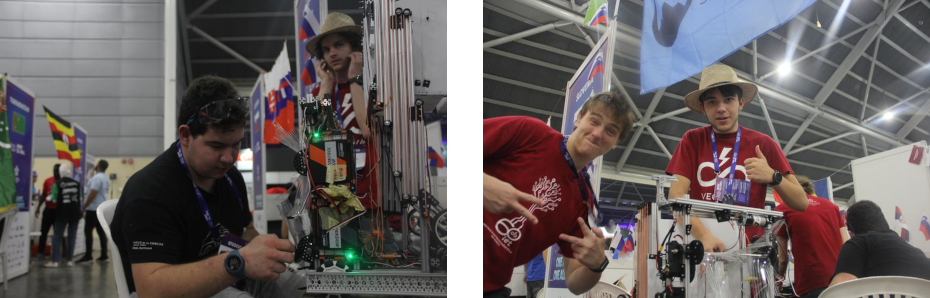
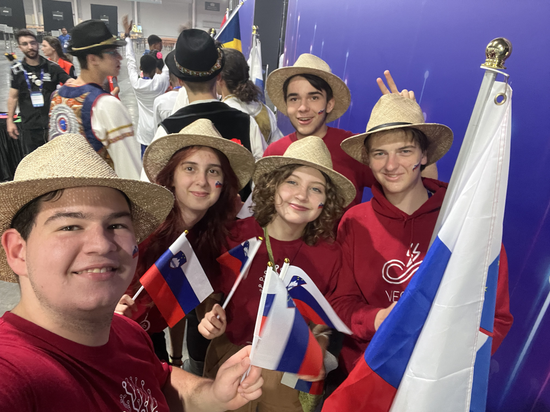
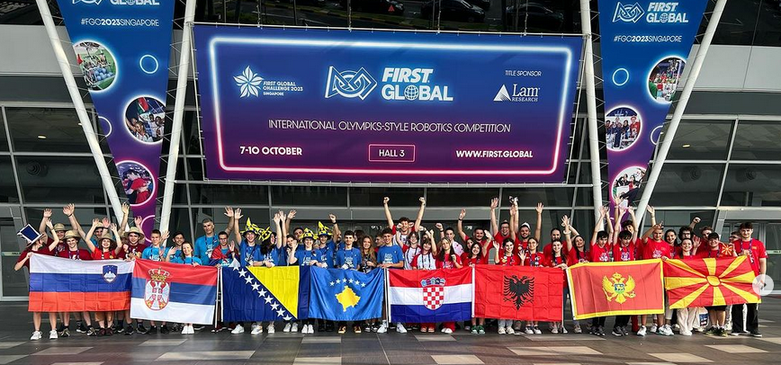
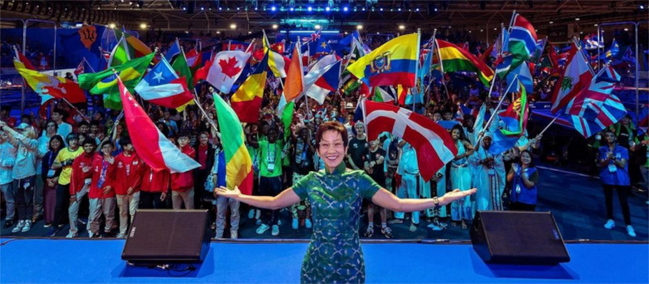
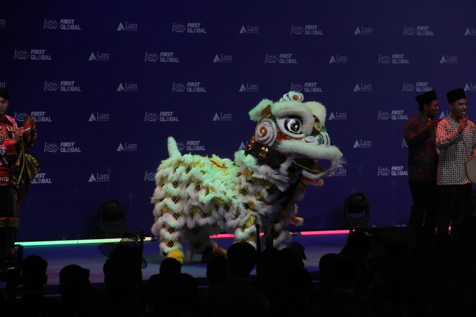
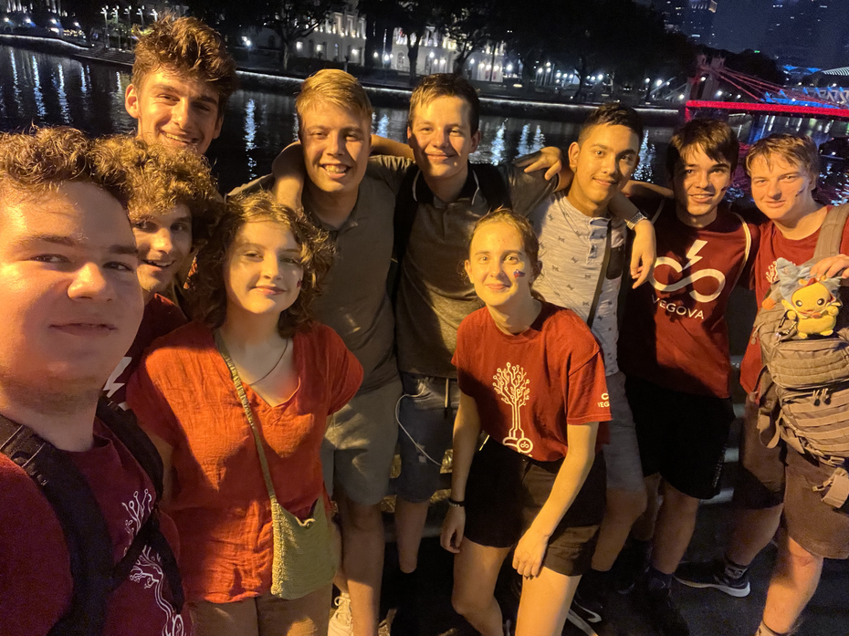
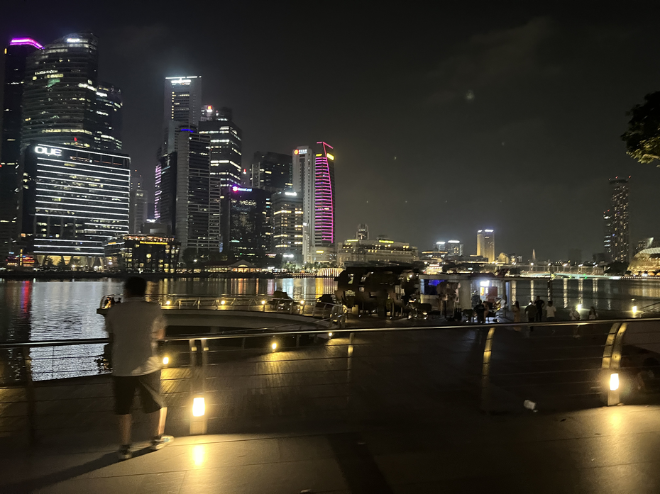
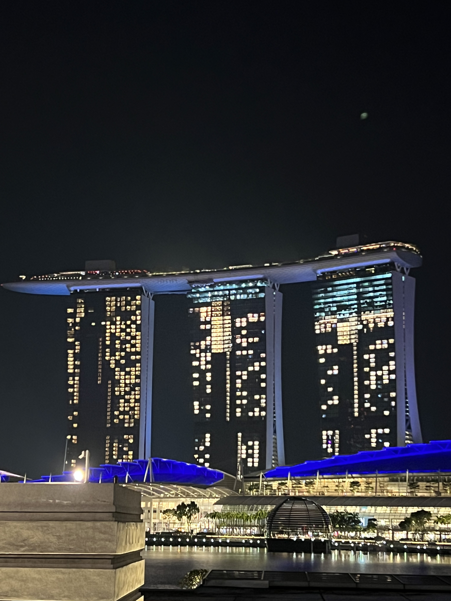
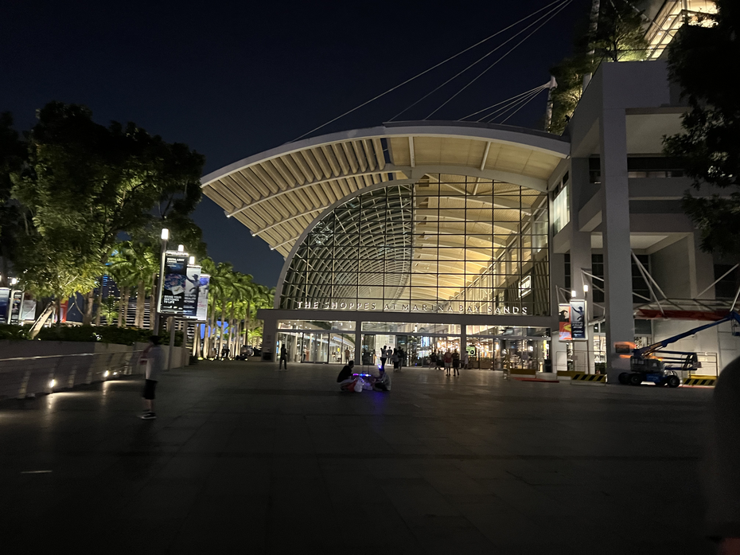

Dan srečne številke v oktobru, 7.10.2023, se je začel počasi in postal vsak trenutek bolj
pospešen. Obilnemu zajtrku in pol ure vožnje je sledilo popravljanje robota z namenom
pridobitve kljukice pri robotskem inšpektorju.

<!-- truncate -->

Po kosilu so nas čakali le še manjši popravki, brez katerih nam je vseeno uspelo priti skozi
inšpekcijo! Očitno jih kakšen nepovezan kabel prav nič preveč ne moti. Veseli smo bili, da
smo dobili kljukico in zeleno nalepko dovolj zgodaj, saj je ob dveh popoldne po singapurškem
času (ki je šest ur naprej od domačega) naše člane in članici čakala vaja za otvoritveno
prireditev. Čakanje v vrsti in vihtenje zastave lastne države v kulturnih oblačilih ni
ravno najlažje opravilo, sploh če je teh zastav 191.

Po vaji smo bili veseli obiska naših prijateljev iz države Suriname, sploh pa mentorja Yurija,
s katerim smo se spoprijateljili že lansko leto v Ženevi. Darilo prijateljstva se ni končalo
le pri kolegih, ki radi zaužijejo aligatorje, saj smo srečali tudi Christiana iz Romunije,
ki nam velikokrat nameni pozitiven nasvet in je poln zanimivih šal in zamisli o šolstvu.
Ta dan smo tudi obiskali članice balkana, ki so nas povabile na skupinsko sliko, ki je že
nekakšna tradicija na dogodku First Global Challenge.

“Pa začnimo dogodek!”, so si rekli organizatorji. Otvoritvena proslava je vključevala sprehod
vsake izmed 191 držav po odru med igralnimi polji, pri čemer so vihteli zastavo in po želji
oblekli narodno nošo. Vsak sprehod je spremljala anekdota s strani komentatorjev. Morje
zastav je bilo z vsako ekipo bolj razburkano, da sploh nismo iz tribun mogli videti na oder.
Po nastopu vseh držav je sledil uvodni govor ustanovitelja Deana Kamena, za njem pa tudi
ministrice za trajnost Singapurja Grace Fu in dr. Philip Yeo (vodja oddelka razvojnih inovacij
v Singapurju). Za konec nas je pozdravil z govorom tudi vodja Lam Research podjetja.

Otvoritev se je zaključila s plesom zmajev, plesalcev in plesalk v tradicionalnih oblačilih,
in hiphop skupine. Navdušeni in pripravljeni na tekmovanje smo s težkim srcem spakirali
stvari in se vrnili v hotel.

Dneva še ni bilo konec za nas, prav tako pa tudi ne za ekipo Nizozemske. Po krajšem počitku
smo se odpravili na MRT oz. podzemni metro do centra mesta. Vlak, ki ob zavojih ni imel ne
konca ne začetka, je bil izjemno hiter, pogost in cenovno dostopen, tako da smo se kmalu znašli
v središču mesta. Od hotela (postaja Lavender) do mesta (Raffles place) smo potrebovali le
8 minut. Pot nas je povedla okoli Marina Bay znamenitosti, kjer smo si lahko ogledali
osvetljen del mesta, visoke stolpnice in tudi luksuzno nakupovalno središče. Zaradi časovne
zadrege (saj podzemna železnica obratuje le do polnoči), smo se kar znotraj shopping mall-a
odpravili nazaj v hotel in v procesu dvakrat prestopali metroje.

Zadovoljni in zmatrani smo se ulegli in se prepustili začetku prijetnega počitka.

Do prihodnjič,
Goedenacht
