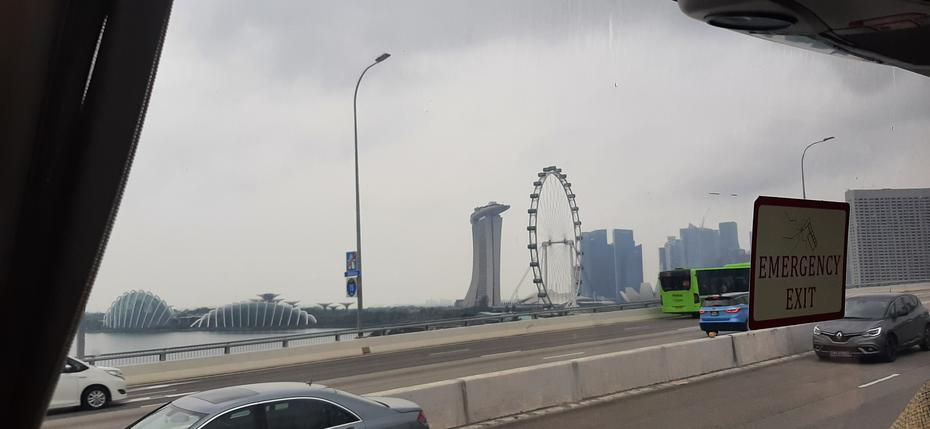

Klimatiziran in zaspan začetek dneva nas je ponovno zbudil in nas pospremil do 4. nadstropja,
kjer nas je, kot vsako jutro naše avanture levjega mesta, čakal zajtrk. Hrana različnih kultur
in navad nas je okrepčala, tako da smo se lahko z idejo prvih točkovanih iger odpravili proti
avtobusom. Pol ure vožnje (in polovičnega spanca) po singapurških avtocestah nam je dalo nekaj
časa, da dorečemo načrt za današnji dan.
<!-- truncate -->

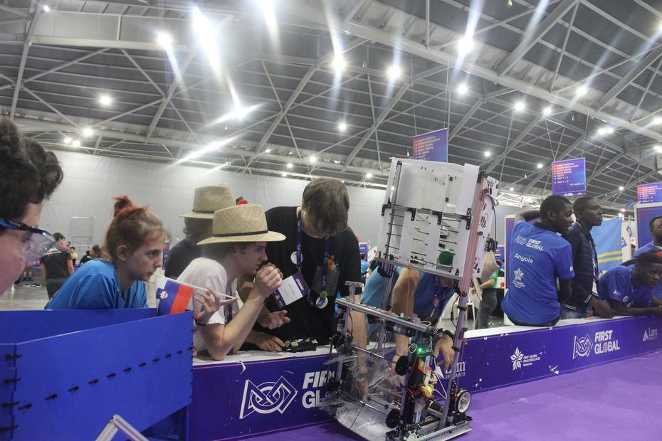

Po vrnitvi v naše delovno okolje v singapurškem EXPO centru smo se takoj lotili popravil na
robotu, saj naš Krtek ni najbolje obratoval, do prve tekme smo pa imeli le nekaj ur časa.
žDokončanje škatle za shranjevanje žogic in dodelava pobiralnega mehanizma sta bila naša
osrednja cilja, namreč naš robot se je lahko že vozil!

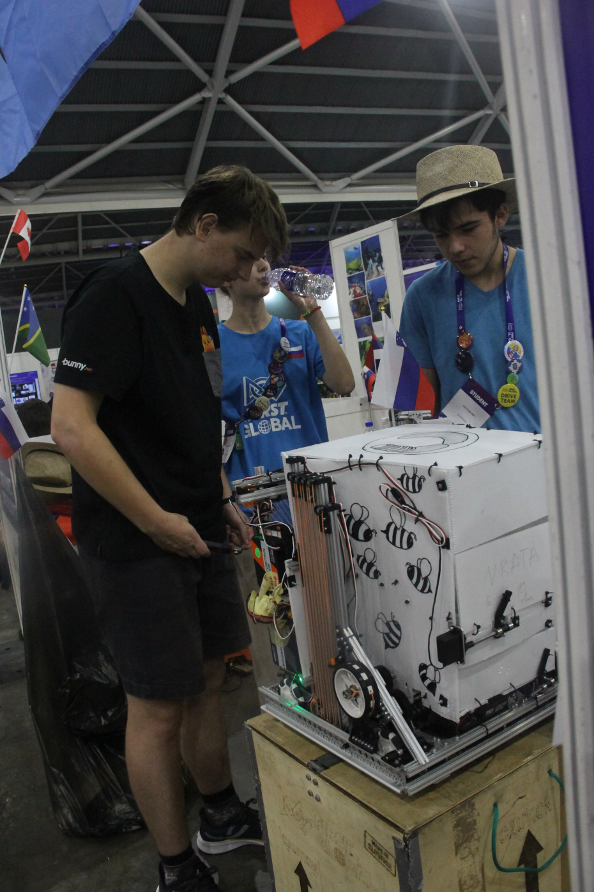

Naša prva igra je bila [zaporedne številke 17](https://youtu.be/43vi8mebumc?t=2135), tako
da smo z informacijo da smo v skupini z reprezentanco Jamajke in Somalije se lotili
strategije. Jamajka ni bila ravno najmočnejša ekipa, medtem ko Somalija v času igre sploh
še prispela ni na dogodek. V igri z nizkim rezultatom smo žal izgubili proti ekipam Saint
Vincent and the Grenadines, Bhutan in Nicaragua z izzidom 28:20.

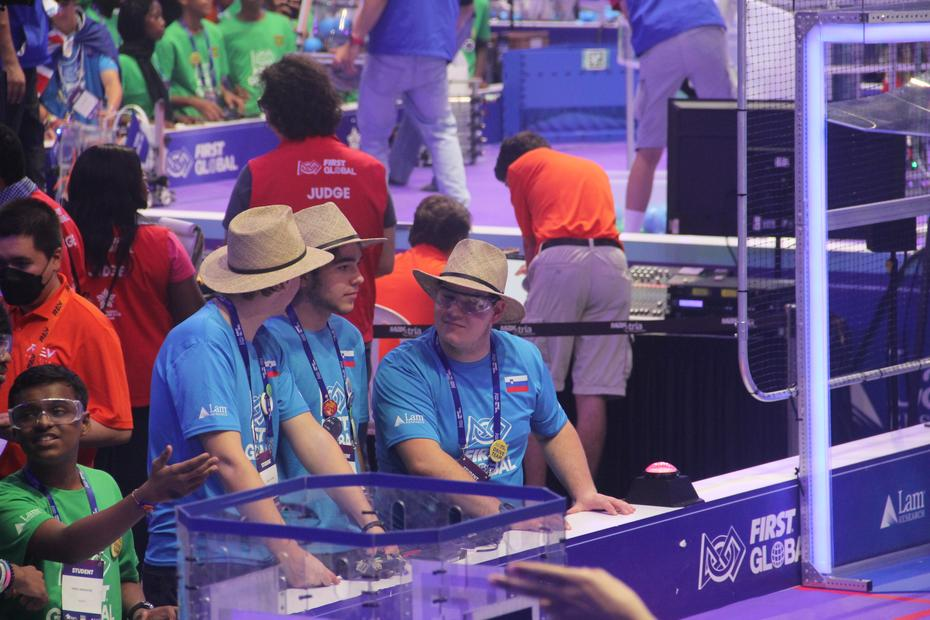

Naša prva prava igra nam je odprla oči glede možnih popravkov na našem robotu, tako da smo
odhiteli nazaj in se lotili popravljanja poškodovanih delov ter kalibriranja našega sredinskega
kolesa, ki je namenjen premiku levo in desno. Po kosilu nas je čakala 
[igra številka 45](https://youtu.be/6uGkEqgfV9o?t=5559), tokrat na osrednjem polju (št. 5).
Igrali smo skupaj z ekipama držav Gvineja (ki je prispevala le metalca modrih žog) in Aruba,
proti ekipam držav Barbados, Nigerija in Kuba. Tokrat smo za las ujeli zmago in v nekoliko
počasnejši igri zmagali z rezultatom 16:15.

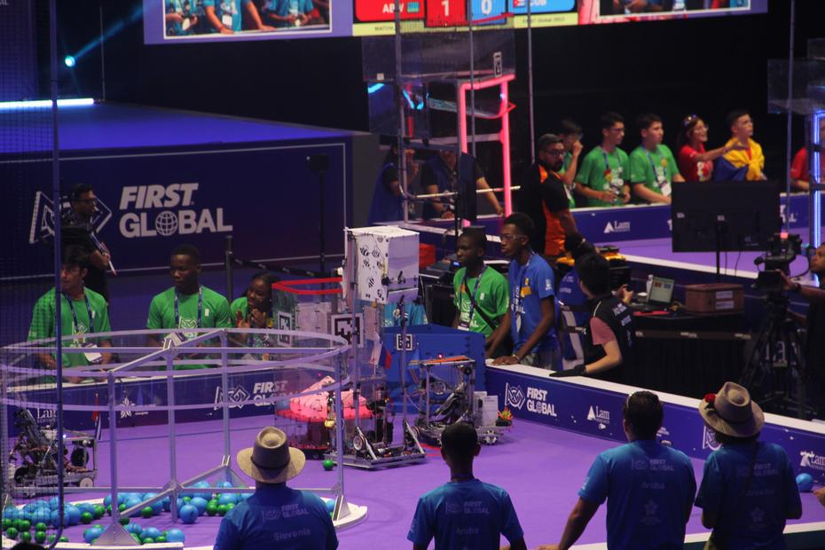
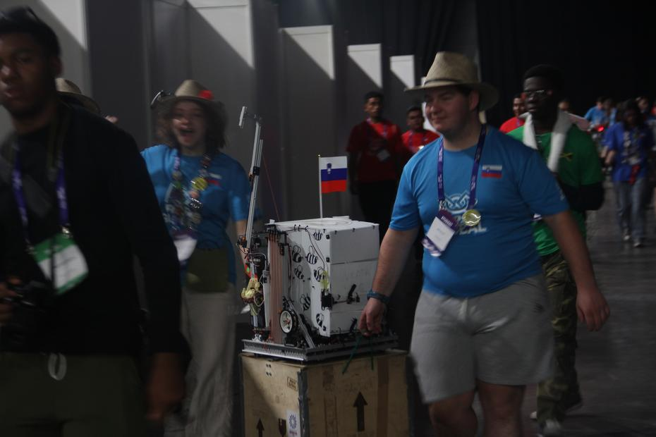

Medtem ko se je vozniški del ekipe (ali Drive Team) boril za točke, sta preostala člana
ekipe se veselila z ekipo Nizozemske, saj je njihov robot končno prispel, in pomagala Cook
Islands pri popravljanju njihovega robota. Naporen dan smo končali nekaj ur bolj zgodaj kot
običajno in se vsi odpravili nazaj v hotel, da smo se lahko spočili, saj nas je čakala
kulturna večerja v Gardens By The Bay.

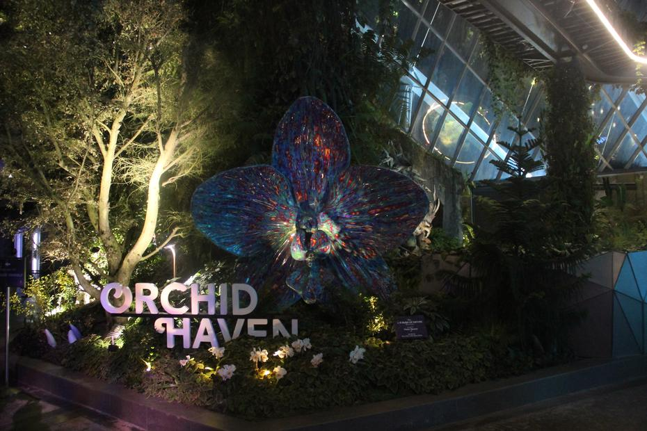

Singapurški botanični vrt s tematiko filma (z modrimi bitji) Avatar je bil navdušujoča izkušnja,
sploh glede na to da smo se lahko ekipe okrepčale z uživanjem večerje z jemanjem nekaj porcij
različnih jedi, ki so nam bile ponujene. Lučke in družba ob dobri hrani sta bila razlog za
še bolj sproščeno atmosfero, iz katere smo se kmalu podali na ogled razstave.

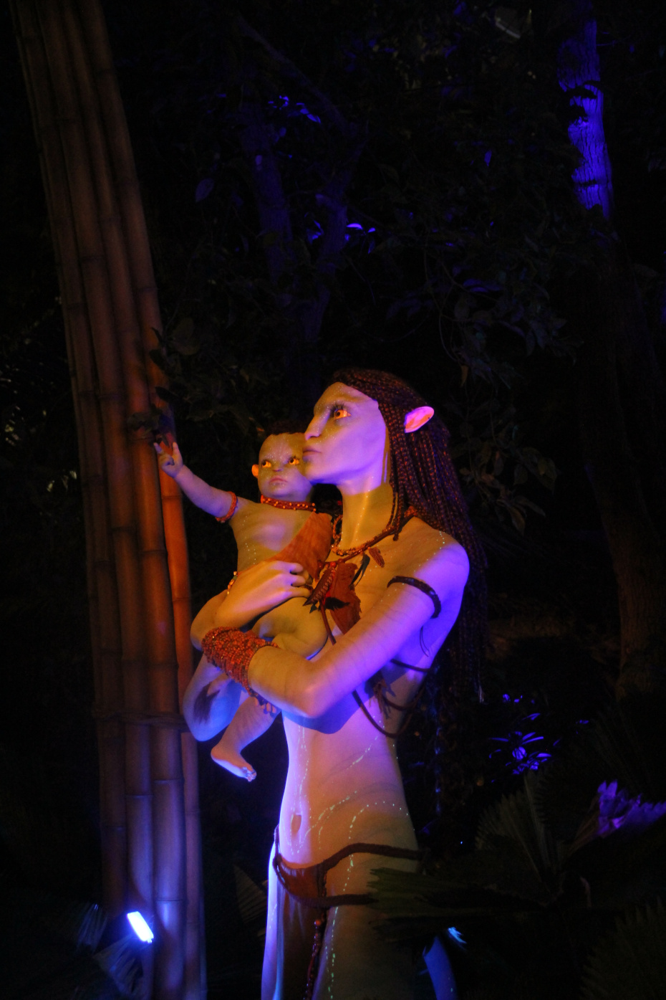

Različna bitja, listi, lučke in slap so nas pozdravili takoj ob vstopu v osrednji del magičnega
vrta. Dvigalo nas je popeljalo kar na vrh, kjer je izvor samega slapa, za čemer smo se odpravili
po označenih poteh dol po nadstropjih in uživali v rastlinstvu in dogajanju namenjenemu tako
odraslim kot otrokom. Zmaji, igrice in fotografiranje so popestrili pot skozi Cloud Forest.

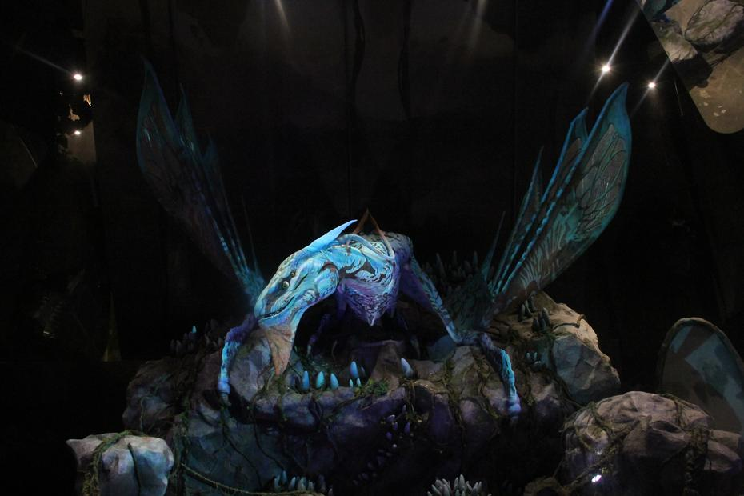
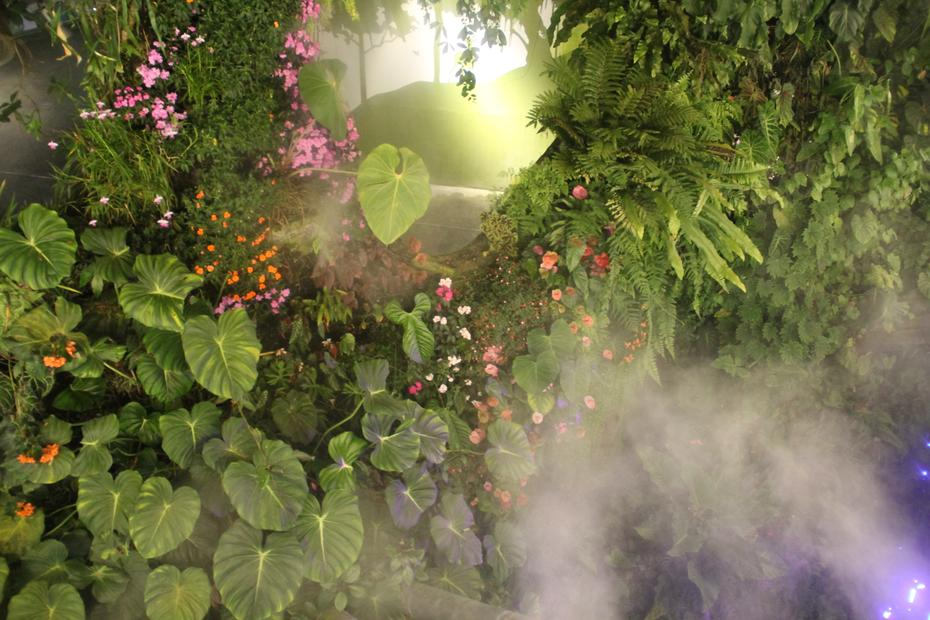

Poleg botanične tematike smo srečali tudi igro z lučkami in svetlobnimi dekoracijami v temi.
Kmalu nas je ponovno dočakala dnevna svetloba (ki je skupaj z dnevom že bežala stran) in smo
se zato napotili do naslednje atrakcije oz. prizorišča: Light Show pri umetnih drevesih.
Lepa osvetlitev in nekoliko monotono ter tiho ozvočenje sta bila zanimiva izkušnja za vse
, ki so se kmalu utrujeni, a veseli, napotili nazaj v hotel z namenom spanca (ali pa
potikanja naokoli).

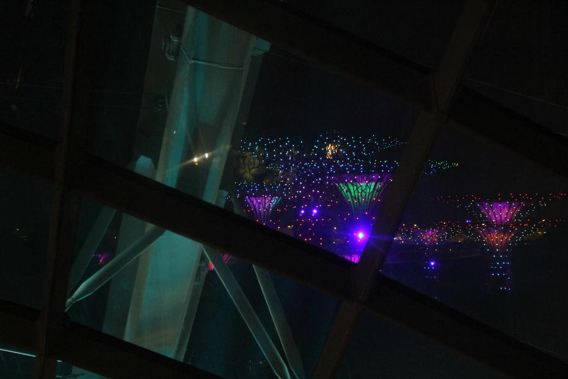

Do prihodnjič,
buenas noches
