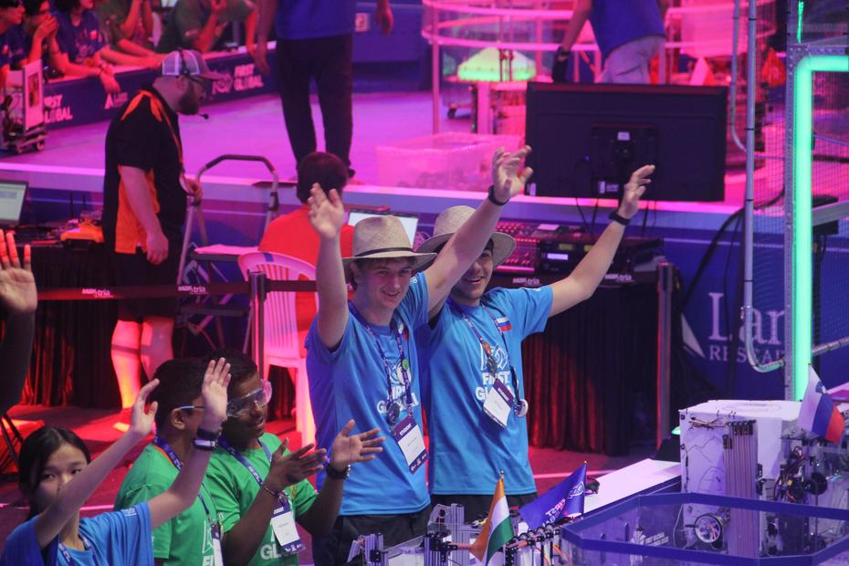

Prebujanje v najbolj naporen dan celotnega tekmovanja je bilo nekaj občutno drugačnega.
Zamisel, da nas danes čaka kar 6 iger, smo poskušali odmisliti in v miru zaužiti jutranje
kosmiče, riž, rezance in karkoli drugega je pristalo na krožniku. Po dobrem teku smo
odhiteli na avtobus in se po prihodi v našo dvorano lotili nadaljnega dela na našem robotu.
<!-- truncate -->

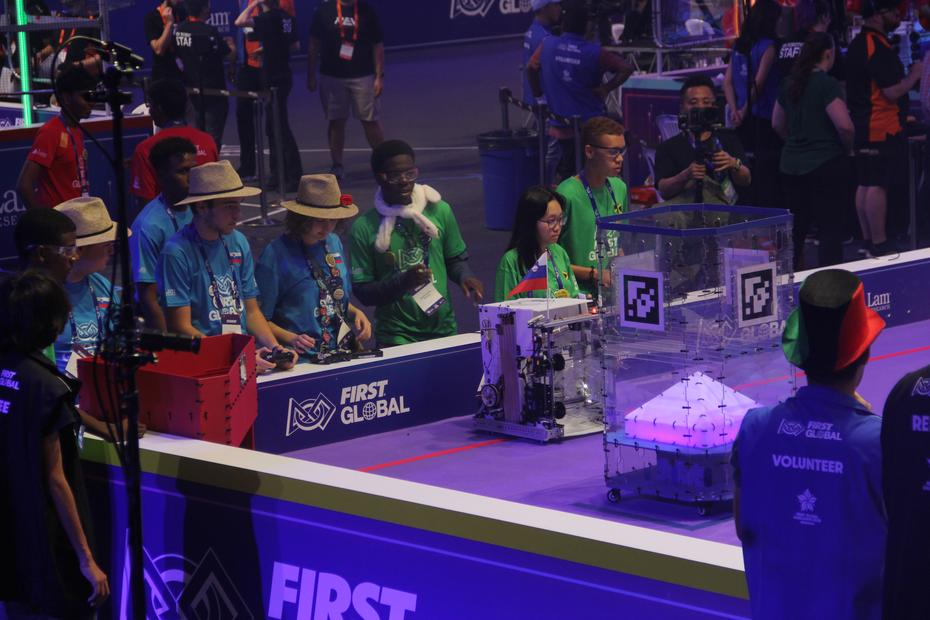

Prva tekma dneva, ki nas je čakala že dve uri po prihodu, je bila
[številka 95](https://youtu.be/9Cgij9hvTjQ?t=6349), pri kateri smo igrali na strani Indije
in naših sosedov v štandih – Solomon Islands. Na drugi sdrani oz. v nasprotni barvi smo se
pa lahko videli ekipe držav Portugalska, Kamerun in Sudan. Tokrat z občutno bolje dodelanim
robotom (in boljšo trojico) smo odnesli igro skupaj s seboj z izzidom 62:15.

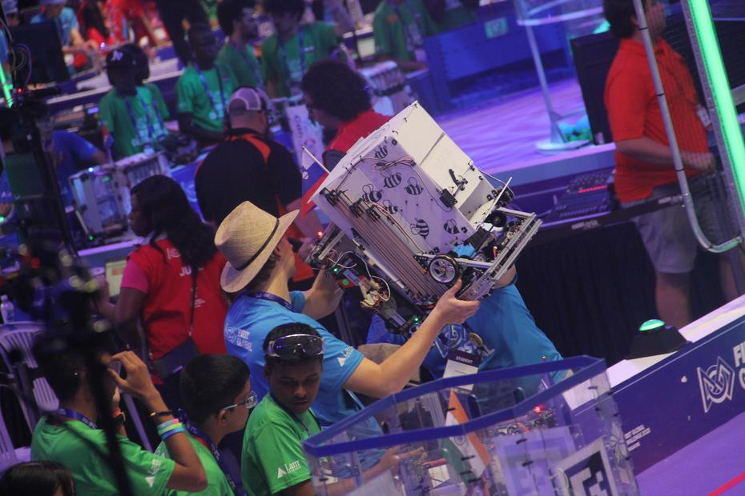

S povečanim tempom iger smo bili kmalu zopet na vrsti, s približno 30-minutnim premorom vmes.
Kmalu smo so zopet slišali značilen zvok troblje in že smo pognali robote v 
[igro številka 113](https://youtu.be/9Cgij9hvTjQ?t=9145). Tokrat smo delili stran z ekipama
Irske in Džakarte. Z nekaj smole in slabše izvedbe strategije smo končali z manj pikami od
nasprotnikov, vendar smo si segli v roke in slišali ploskanje dlani. Z izzidom 73:30 so nas
premagale ekipe Jordana, Cipra in Kiribatov.

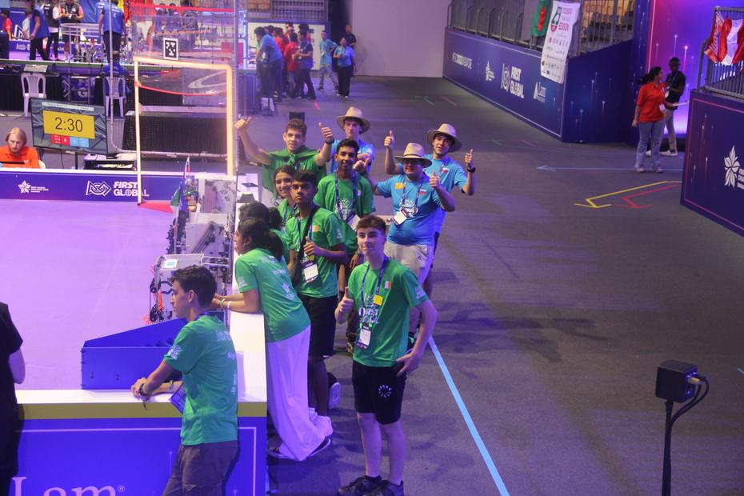

Z dvignjenim pogledom smo pilili našega robota in našega vozniške sposobnosti naprej! Pred
nami je bila [igra številka 133](https://youtu.be/IgS8z1B1yg0?t=12383), ki je za nas bila
posebnega pomena, saj smo vedeli da bomo igrali na isti strani kot naši prijatelji – ekipa
Nove Zelandije! Skupaj z nama je bila tudi država Izraela, in tako smo se podali v “borbo”
proti trem nasprotnim ekipam – predstavnicam držav Kosovo, Maldivi in Mozambique. Moč
prijateljstva je zmagala, tako da smo ob spremstvu vriskanja s tribun si segli v roke in
podpisali rezultat 45:27.

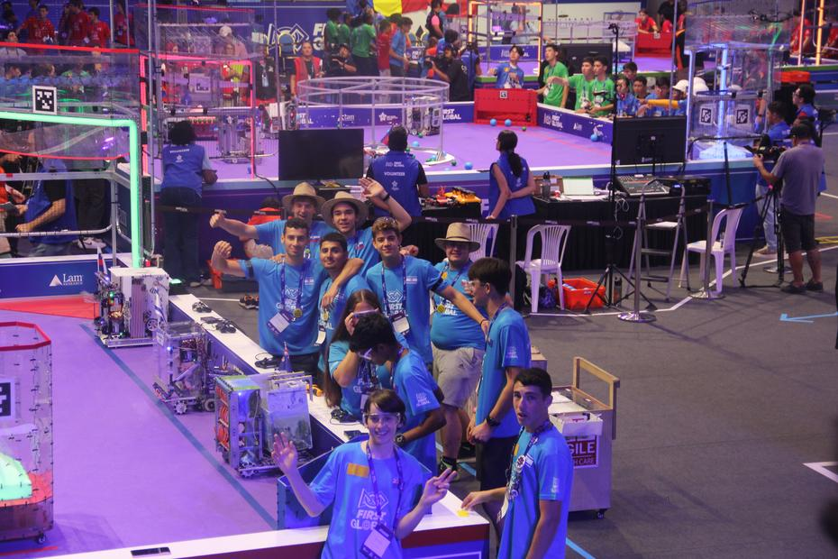
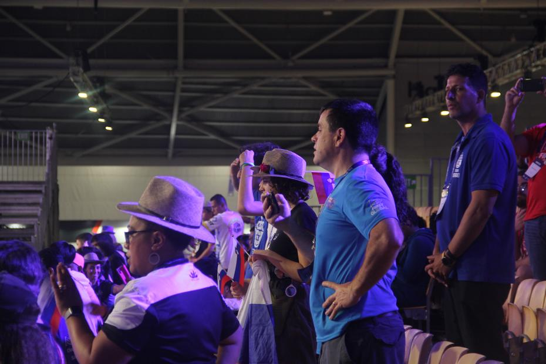
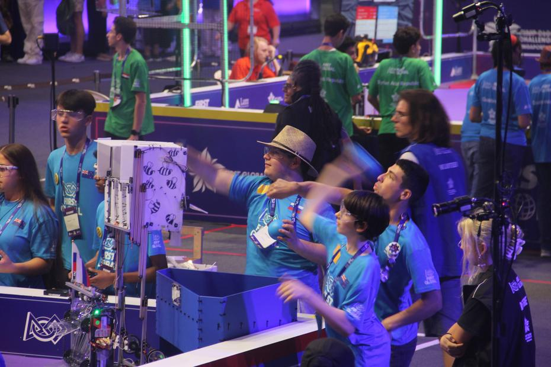

Čas za kosilo! Ponovno (kot vsak dan) smo se imeli priložnost okrepčati z enim izmed vnaprej
pripravljenih štirih menijev. S polnim (ali pa delno napolnjenim) trebuhom je lažje popravljati
robota, tako so člani oddrveli servisirati, saj nas je čakala še ena pomembna igra v
prijateljskem smislu. Pred nami je bila [igra številka 169](https://youtu.be/IgS8z1B1yg0?t=21009),
pri kateri smo si delili stran z našimi kolegi iz Nizozemske ter tudi reprezentanco
Dominikanske Republike. Pestra igra polna zlomkov se je končala z izenačenim izzidom 42:42
proti trojici ekip, ki so predstavljale Team U.S. Virgin Islands, Azerbejdžan in Tajsko.
Zadovoljni smo v spremstvu nizozemskih izrazov za veselje odkorakali s polja.

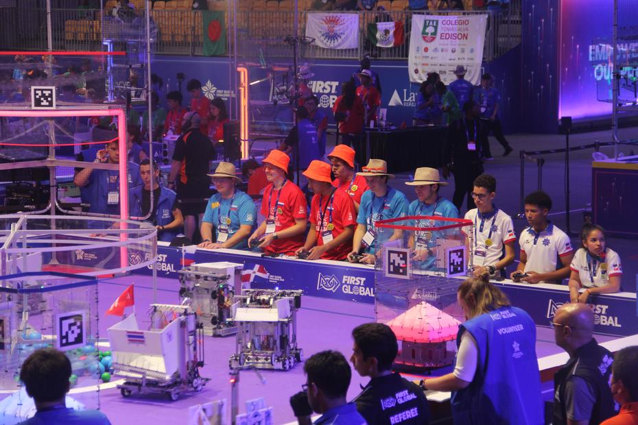
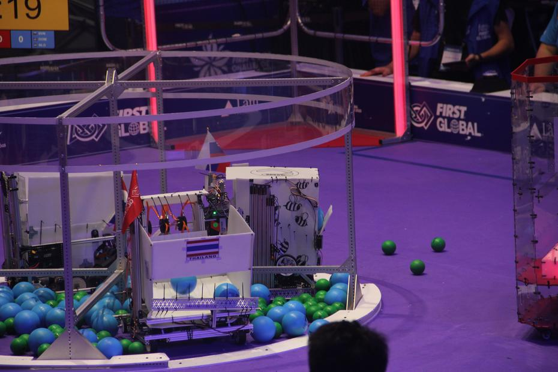
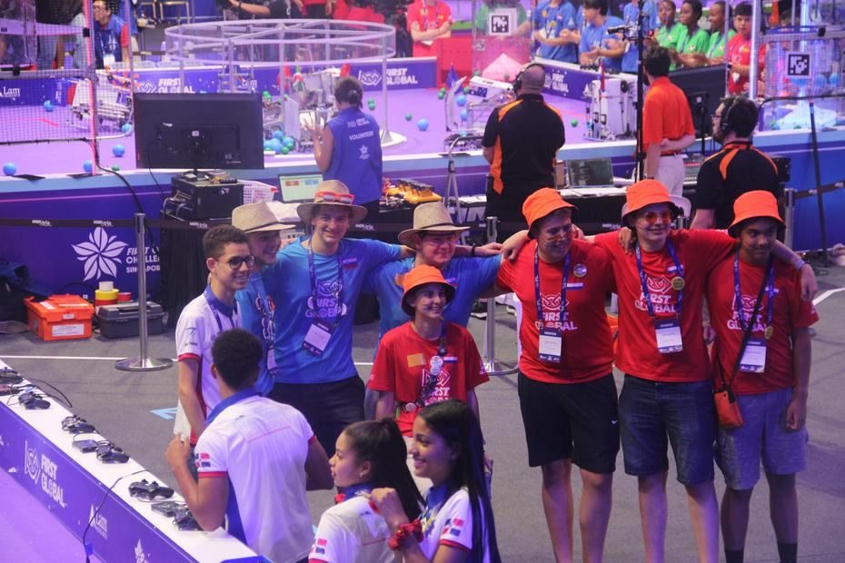

Popravki, popravki, popravki! In sladkarije tujih držav ter izmenjane zastave, to je bil
nekako moto vmes med igrami. Vsak bonbon nas je bližal naši naslednji igri, natančneje
[igri številka 211](https://youtu.be/IgS8z1B1yg0?t=26881), ki je na nasprotni strani vključevala
eno izmed naših daljnih balkanskih sosed. Tokrat smo imeli priložnost sodelovati z ekipama
držav Palau in Filipini. 2min in 30sekund je hitro minilo, na koncu smo člani modre ekipe
pristali na slabšem koncu in izgubili za eno točko s končnim izzidom 46:45 proti rdeči
strani, ki so jo formirale ekipe držav Srbija, Gambia in Češka.

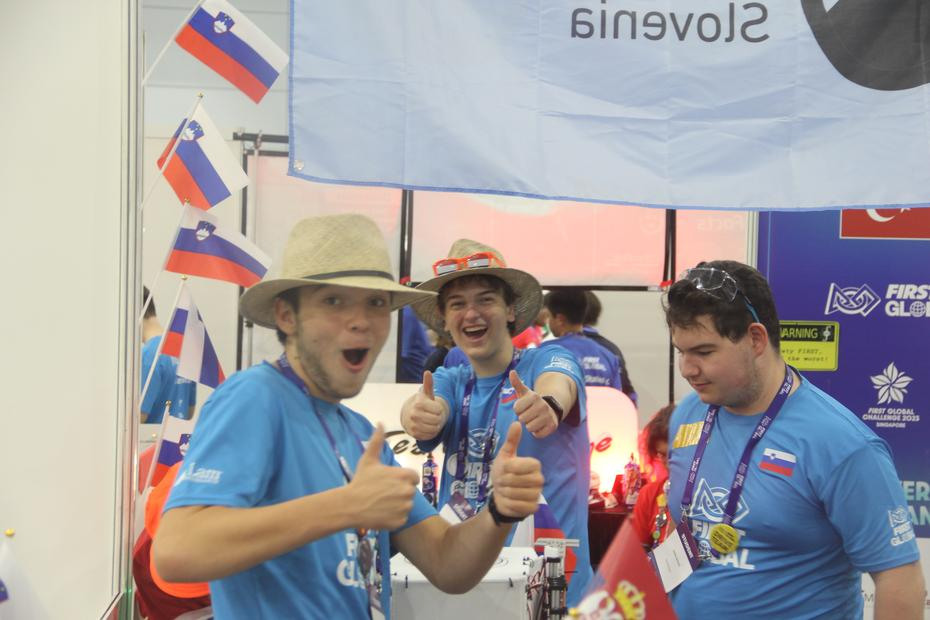
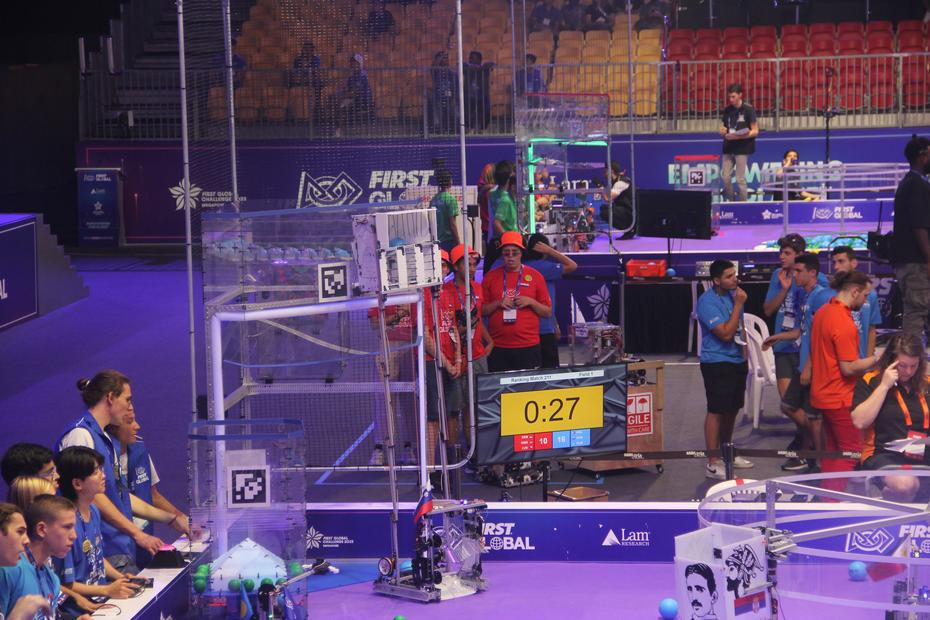
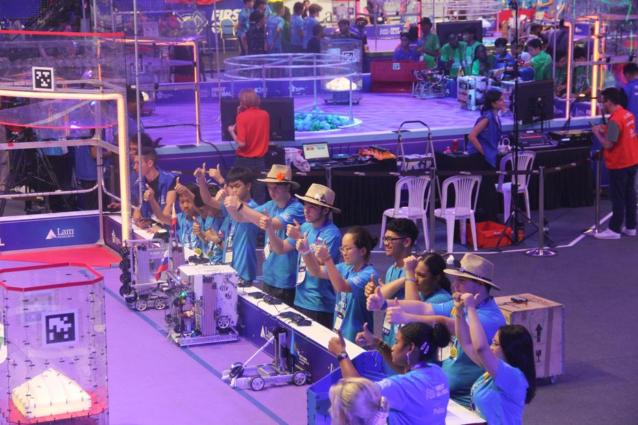

“Sam še ena, pa smo.” Pred nami je bila zadnja igra dneva polnega popravil, dela in smeha.
[Igro številka 230](https://youtu.be/EDLcrV-ZWCs?t=29188) smo odigrali v sodelovanju z
ekipama držav Južni Sudan in Finska ter si priborili 38 točk, kar nam je prineslo zmago proti
rdeči aliansi. Nasprotno polovico so formirale ekipe držav Marshall Islands, Djibouti in Belize.

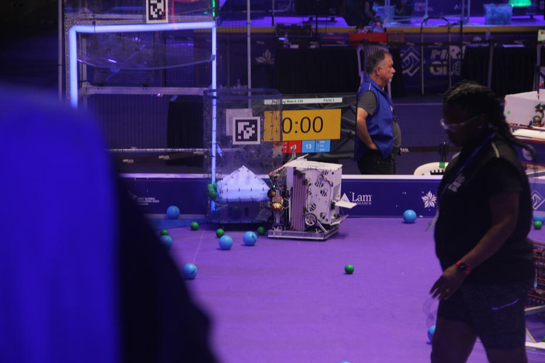
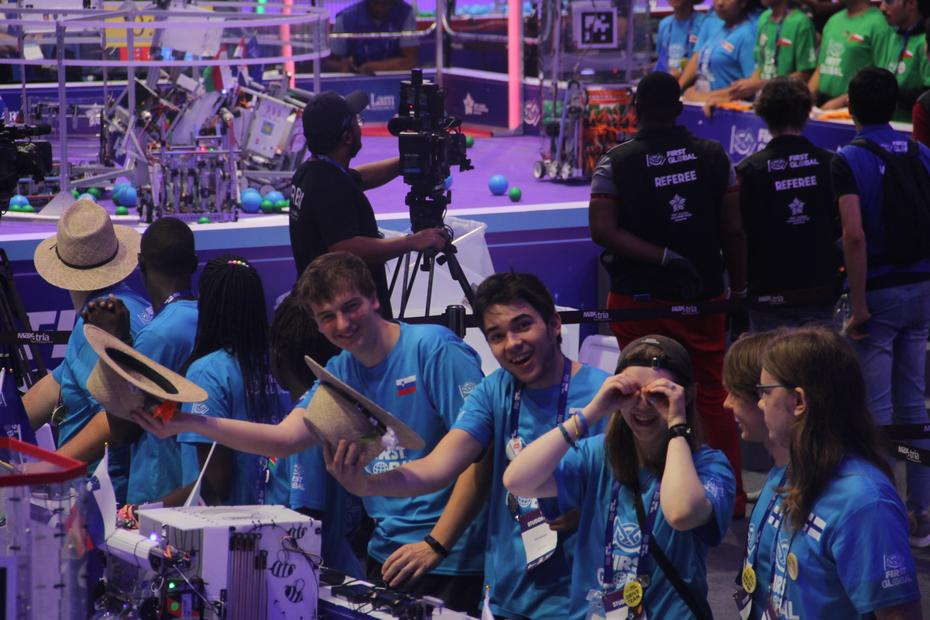

Utrujajoč dan je prišel do konca, vsaj v tekmovalnem pogledu. Končali smo z zadovoljivimi
rezultati in skrbjo o preskakovanju zobnika dvižnega mehanizma, vendar to nas ni ustavilo
da smo se napotili na avanturo do Changi letališča, kjer smo zapravili slabi dve uri.
Nakupovalno središče z znamenitim slapom brez konca (vortex waterfall) je krasilo kar nekaj
nadstropij polnih trgovin, restavracij in celo labirintov, trampolin parkov in podobnih reči.
Obisk različnih trgovin kot so Pokemon Center, Apple Store in podobne nam je poleg iskanja
dogovorjenega mesta za zbor vzelo kar nekaj časa. Izrčpani smo se z metrojem vrnili nazaj
v hotel in prepustili sanjam prosto pot.

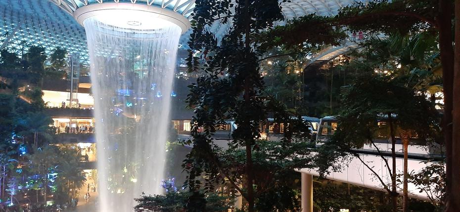
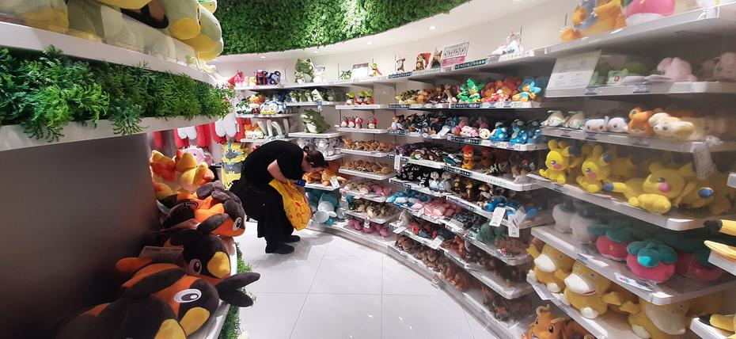

Do prihodnjič,
Goeienag