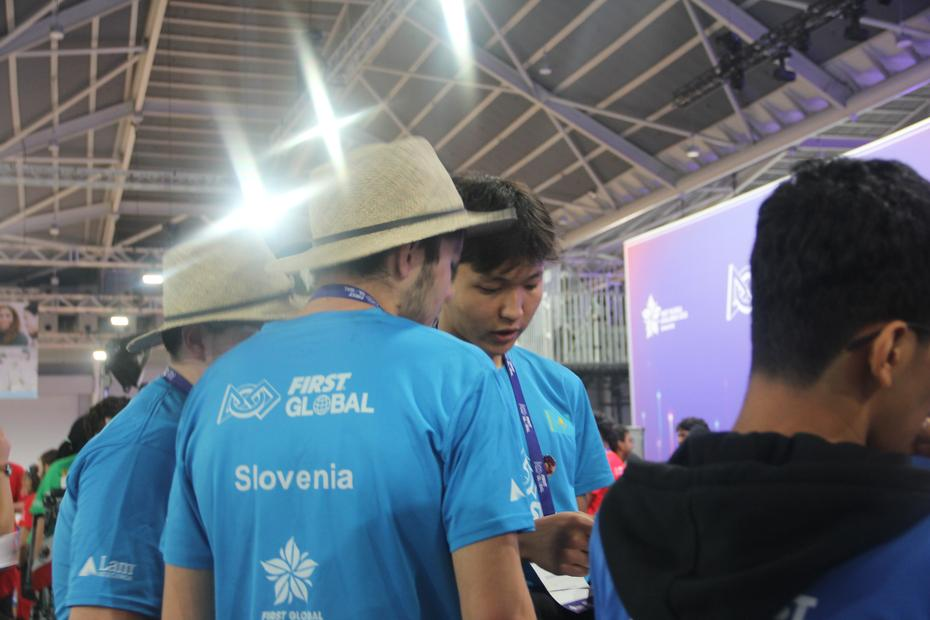
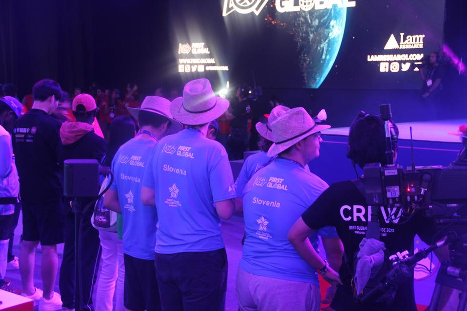

Zadnji tekmovalni dan se je pričel pestro, saj smo morali zgodaj vstati, da smo ugodili ekipi
Kazahstana, ki so želeli skovati popolno strategijo za našo igro, do katere smo imeli še
nekaj ur časa. Nekaj članov ekipe je naknadno vkorakalo v areno, medtem ko so ostali pridno
risali in razmišljali o igri. Preizkušanje dvižnega mehanizma je prav tako zaznamovalo naš
začetek dneva, skupaj z željo članov ekipe Kazahstana, ki so želeli pomagati pri popravilu
oz. izboljšavi našega robota.
<!--truncate -->

Ura tika taka, na nič ne čaka. Preden smo se zavedali smo že stali v čakalni vrsti z dobrim
upanjem za [igro številka 280](https://youtu.be/96H0_qOIa84?t=7123). Tokrat smo bili
priviligirano postavljeni na isto stran kot ekipi držav Kazahstan in Kambodža. Naša do
popolnosti izpiljena strategija je delovala odlično in nam prinesla kar 155 točk! V igri
proti ekipam držav Egipt, Centralna Afriška Republika in Bahami smo se na lestvici dvignili
za kar 81 mest.

V pozitivnem šoku smo se hvaležno vrnili v svoj štand po proslavljanju s prijatelji, ki so
prišli navijati za nas. Počasi smo se seveda začeli pripravljati na našo zadnjo tekmo, ki
je slučajno bila tudi zadnja tekma rednih kvalifikacij. V
[igri številka 319](https://youtu.be/hQeEWxXgboc?t=12359) smo bili poparčkani z ekipama držav
Tadžikistan in Kolumbija. To tekmovanje smo bili z majhnim zadovoljni, tako smo tudi z manjšo
številko izzida 23:22 veselo odkorakali stran od igralnega polja. Zadnjo kvalifikacijsko
tekmo je zmagala trojica, ki so jo tvorile ekipe držav Albanija, Eswatini in Dominica.

Najboljših nekaj držav je bilo izbranih skupaj z nekaj naključnimi predstavnicami, da smo
imeli končnih 32 ekip razdeljenih v štirice. Napete tekme so v finale pripeljale le tri izmed
osmih štiric, zmagovalna štirica na podlagi povprečnega števila točk je bila sestavljena iz
ekip držav: Kitajska, Eritreja, ekipa Hope in Vietnam.

Napetim igram je sledil obred podeljevanja nagrad. Mi smo bili deležni bronaste nagrade za
pomoč ostalim ekipam (Helping Hands Award). Zapuščanje sedišč, iz katerih smo opazovali vse
napete igre tekom dogodka, pomeni tudi zapuščanje singapurškega EXPO centra za seboj.
Poslovili smo se od drugih ekip, izmenjali majice in podpise z ekipo Nizozemske ter se nato
odpravili na večerjo. Ob poslavljanju in obroku smo lahko opazovali gradbenike, ki so prišli
razstaviti štandte in tribune ter odstraniti napise First Global Challenge.

Pa je že za nami. V hotelu smo si vzeli malo časa za oddih in se odpravili na sprehod do nam
najbolj znane trgovine FairPrice po prigrizke, preden smo začeli z nabiranjem energije za naš
zadnji dan v levjem mestu.

Do prihodnjič,
Қайырлы түн