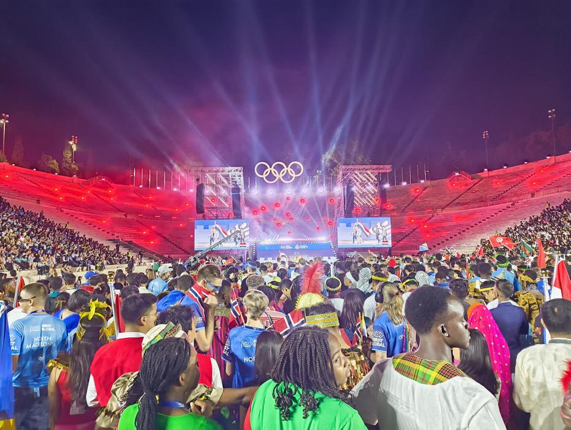
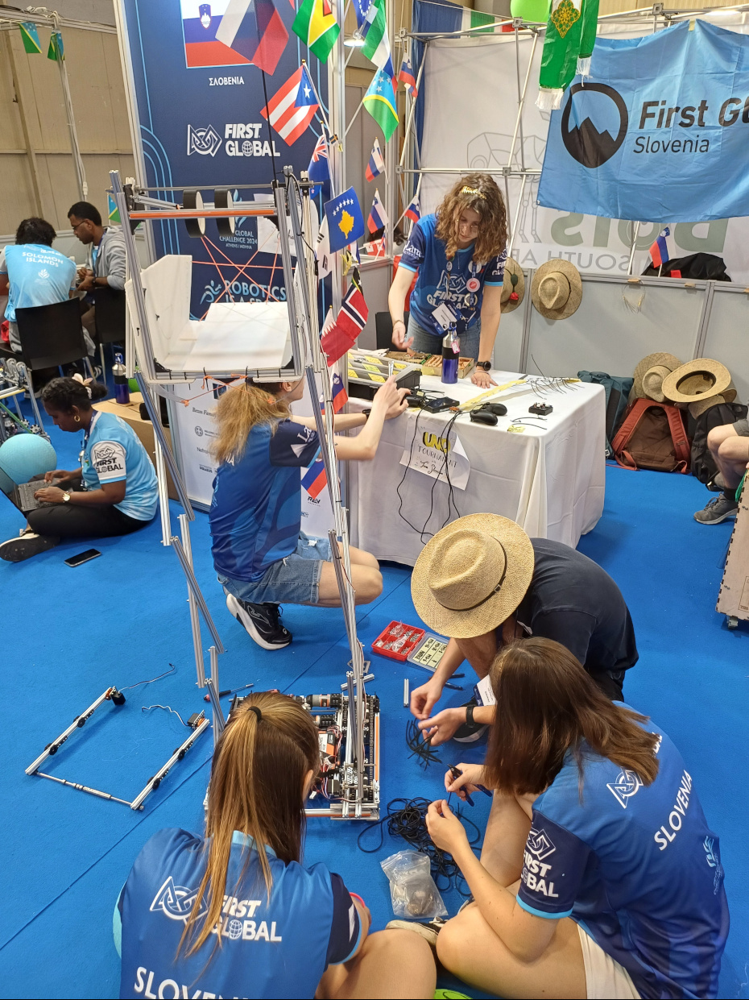
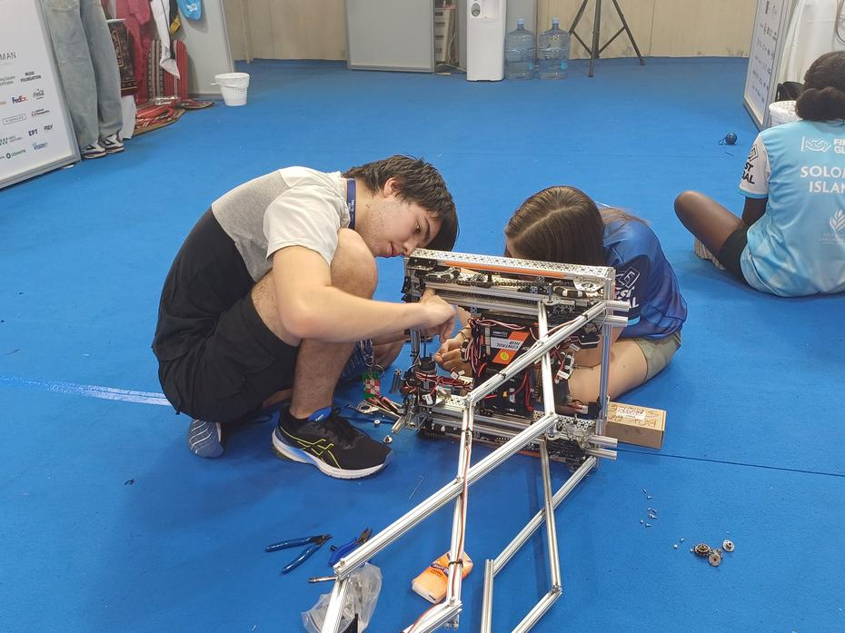
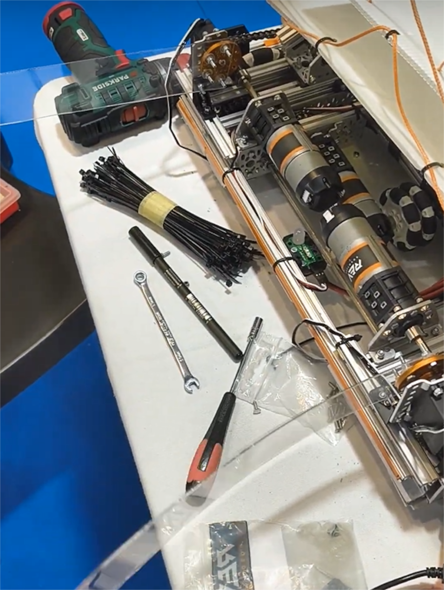
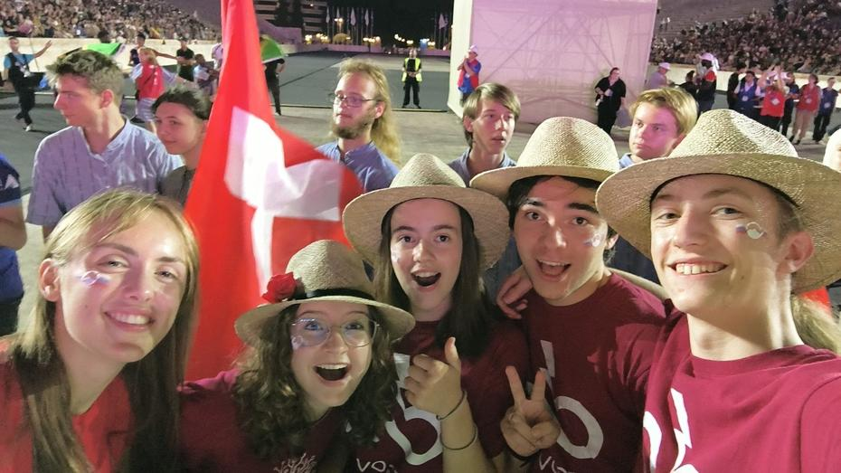
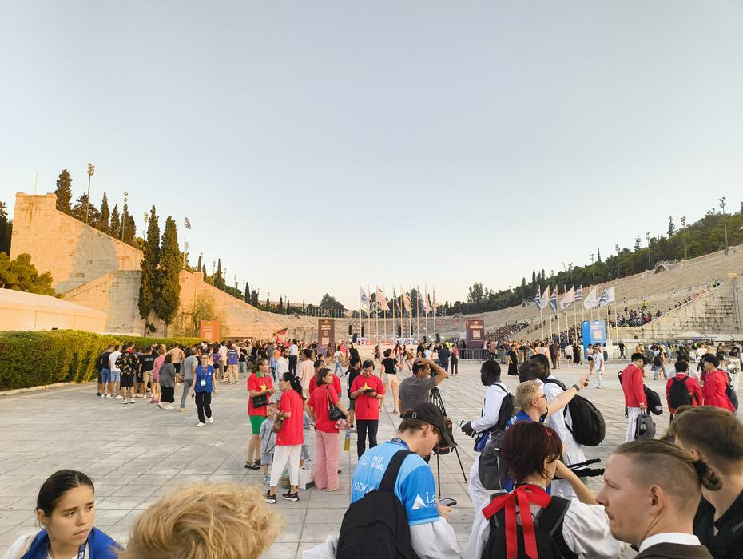
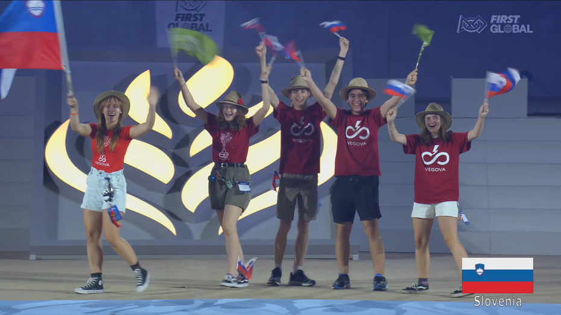
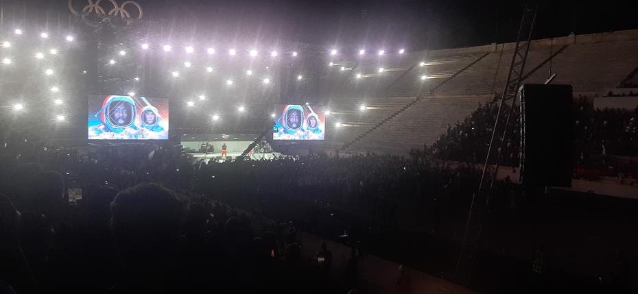

Olimpijada robotike se je začela! Nastopil je 26. september, prvi izmed štirih za našo
olimpijsko ekipo robotike. Ponovnemu obilnemu zajtrku in poti do stadiona miru in prijateljstva
je sledila še ena udomačitev v našem štandu in oddaja tehnične dokumentacije našega robota.
<!-- truncate -->

Ker smo se zavedali, da nas čaka dolg dan, smo se odločili energijo prišparati in vaditi
vožnjo robota. Rezervacija polja za vaje je nastopila kmalu po prihodu in tako sta voznika
ter človeška igralca lahko vadila. Na koncu seje intenzivne vožnje, po približno petnajstih
minutah, smo odkrili da je robot občutno šibkejši zaradi uničenega sestavnega dela na dvižnem
mehanizmu naše škatle, ki sicer velja za enega izmed najrobustnejših. Zamenjava tega je bila
razmeroma enostavna, saj sta High Strengh Hub-a bila locirana takoj za pogonskim motorjev
in na sklopu, kjer je gnana gred.

Tekom vaje smo ugotovili, da je možno pridobiti večje število točk, če oranžno obarvano žogo,
ki predstavlja hrano pridobljeno iz vode in energije, lahko pripeljemo do človeškega igralca.
Prvotna zamisel je zajemala odrivanje žoge, kar pa je precej nepredvidljivo. Zato smo se
odločili, da sestavimo ograjo za žogo, s pomočjo katere bomo lahko zanesljivo žogo odrinili
oz. privlekli do človeških igralcev. Prvi prototipi so zajemali strukturne elemente iz
prozorne plastike (polikarbonat), karton in lepilni trak, vse skupaj sta pa gnala dva servo
motorja. Dodatna komponenta je bila svojevrsten izziv, saj mora biti zmožna stabilno vleči
žogo iz gume in se tudi pospraviti dovolj kompaktno, da robot ne bo presegal omejitve velikost
50x50x50 cm. Prvi poskusi so se izkazali za pogojno uspešne, saj je robot lahko žogo vlekel
za seboj vendar zelo počasi. Veliko težavo je predstavljalo tudi vrtenje robota v krogu,
saj je tako kot v primeru prehitre vleke lahko žoga ušla zaradi upogibajočega se plastičnega
sestavnega dela.

 

Delovno obarvan del našega dneva je hitro srečal svoj konec z vmesnim kosilom in zelo zgodnjo
večerjo, ki jima je sledil čas za preobleči se v tradicionalna oblačila, v katerih naj bi
ekipe predstavile svojo državo na otvoritveni prireditvi. Zadnja tri leta je naša skupinska
ne-narodna noša majica naše srednje šole – Vegove Ljubljana, tako da zamenjava majic ni bila
časovno prehud zalogaj. S tem smo dokončali delo za četrtek in pustili preostanek prirejanja
novega mehanizma robota za prihodnji dan. Pred odhodom na otvoritveno prireditev smo pospravili
delovno mesto in odigrali eno rundo igre s kartami Uno Flip, ki je ujela pozornost nekaterih
mimoidočih, le ti se pa niso mogli pridružiti, saj so nas ravno ob koncu igre poklicali, da
pričnemo svojo pot proti avtobusu.

Odpravili smo se v kolono skupaj s sosedi iz Slovaške in Solomonskih otokov. Na poti do
olimpijskega stadiona (Panathenaic Stadium) smo bili deležni karaok, ki so jih vodili člani
slovaške ekipe. Ko smo prispeli pred stadion, nas je dočakala dolga kolona naših sotekmovalcev
in ostalih obiskovalcev brezplačne prireditve.

Kmalu sva bila mentorja ločena od dijakov in se pridružila čredi, ki je hitela na stopniščna
sedišča čim bližje odru, na katerem je ob našem prihodu vrtel glasbo DJ. Kmalu sta naju
pozdravila voditelj in voditeljica, ko smo si lahko ogledali vnaprej pripravljene videoposnetke
o namenu olimpijade First Global Challenge. Temu je sledila otvoritvena prireditev plesne
skupine in za tem tudi sprehod zastav, ko je lahko 193 ekip (vsaka iz svoje države) stopilo
na oder v narodni noši in vihtelo svojo zastavo.

Slavnostnemu morju zastav je sledil govor ustanovitelja organizacije FIRST, gospoda Dean-a
Kamen-a. Po daljšem govoru o pomembnosti programa, ki se ga udeležujemo, saj prinaša enotnost
in potrebno znanje za doseganje boljšega jutri, je sledil nastop glasbene skupine Black Eyed Peas.

Dobre melodije so se prehitro končale in s tem tudi otvoritvena prireditev. Napotili smo
se proti avtobusu do hotela, kjer je nekoga čakal zaslužen spanec, ostale pa sprehod do
bližnjega McDonalds-a.

Do naslednjič,
gudnaet
