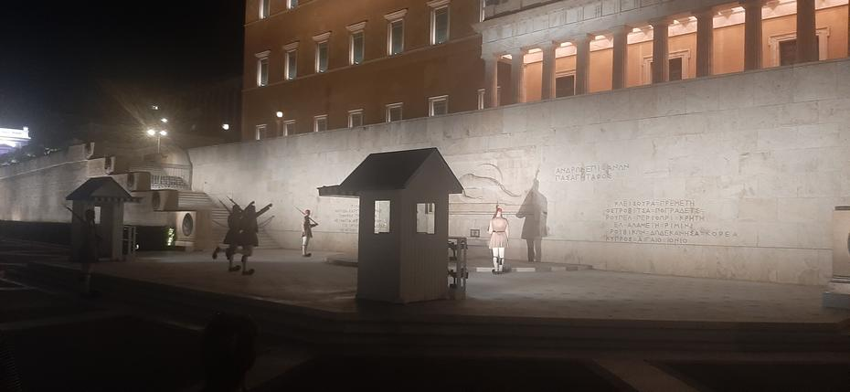
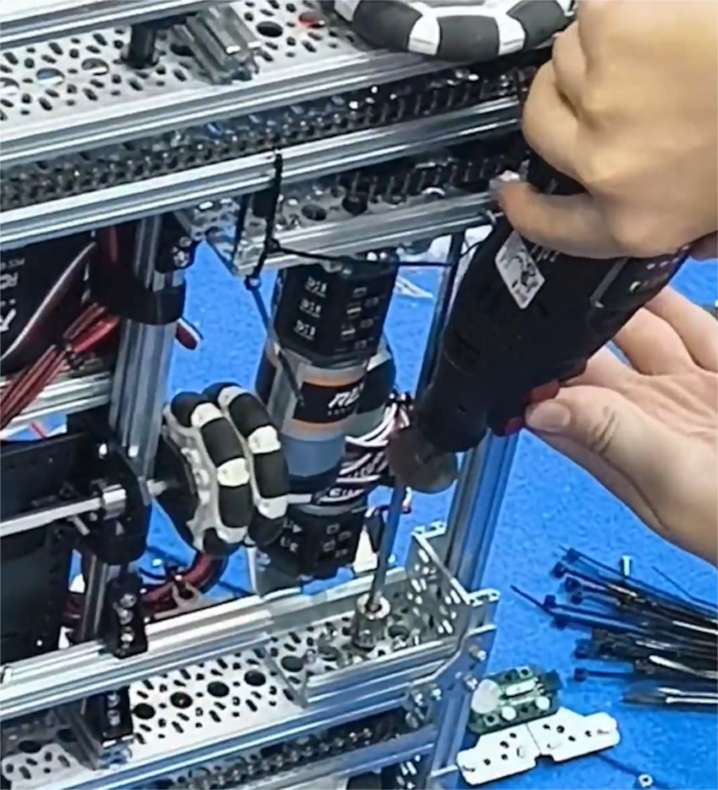
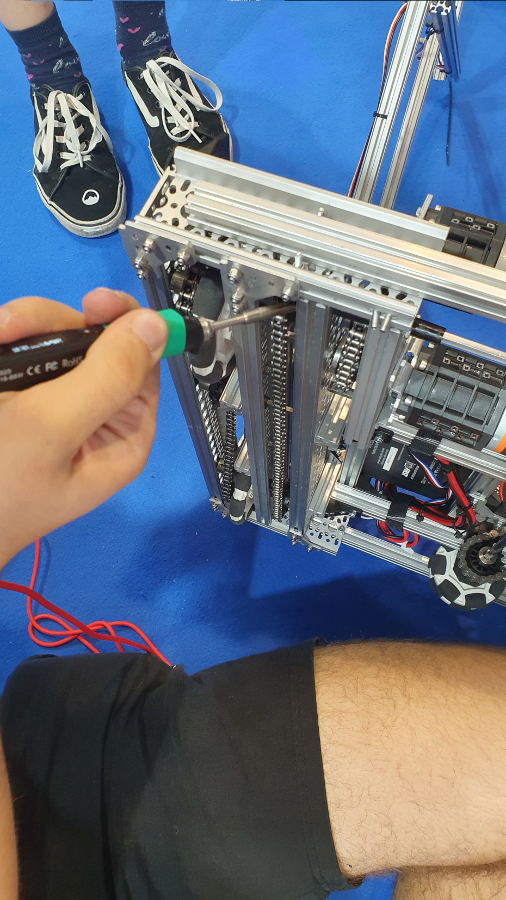
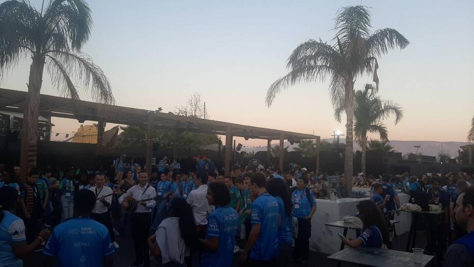
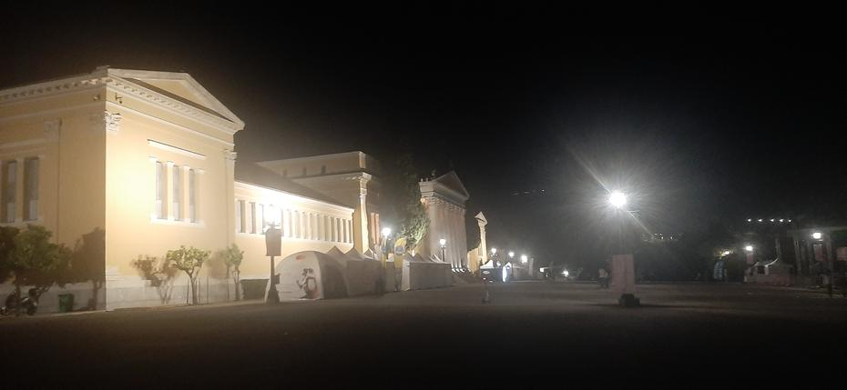
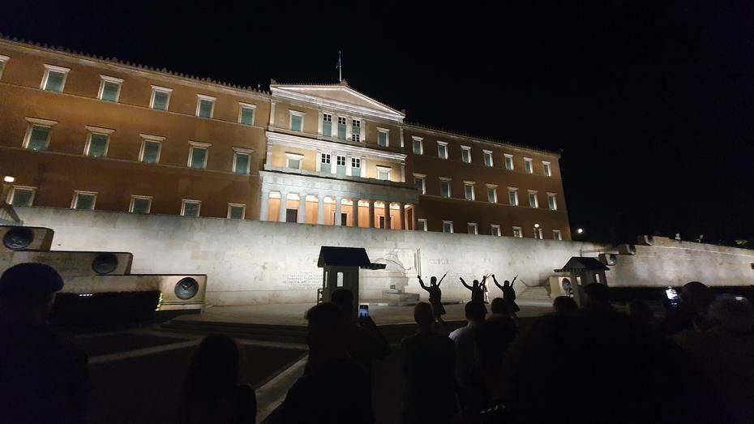
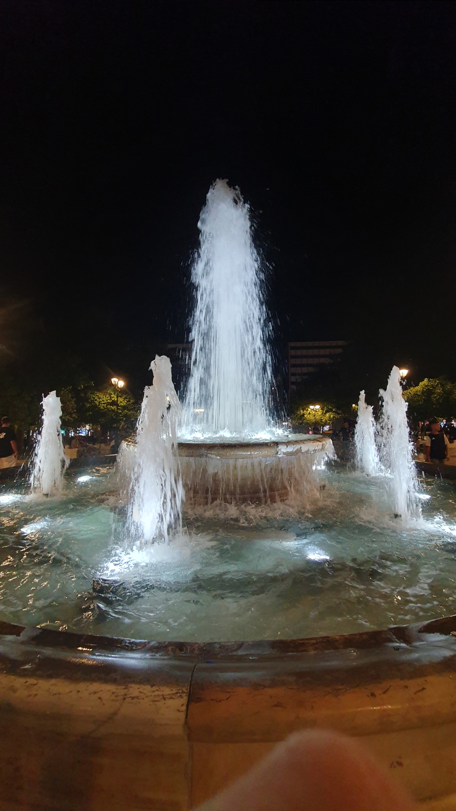

Nastopila je sobota, naš predzadnji dan v glavnem mestu Grčije. Jutranjemu ritualu je
sledila obilna porcija dela, saj je bilo potrebno robota spraviti v red pred prvo tekmo dneva,
ki pa ni bila ravno daleč stran od ure našega prihoda. Vijačenje se je žal zavleklo do te
mere, da smo eno igro odigrali brez robota, le s človeškim igralcem, ki je zastopal našo
ekipo. S tem smo tekmo številka 123 v družbi Argentine in Kapverdskih otokov proti zasedbi
Saint Vincent in Grenadine, Maldivov ter Sudana zaključili s porazom (16 - 58).
<!-- truncate -->

<iframe title="YouTube video player" src="https://www.youtube.com/embed/8MyPCVkS7EQ?si=gXGlAzbY1yMvj_nk&amp;start=2029" style={{ width: "100%", aspectRatio: '16/9' }} frameborder="0" allowfullscreen="allowfullscreen"></iframe>

Vijačenje robota še ni bilo končano, smo pa kmalu po prvi uradni tekmi imeli napovedan
nastop na dodatnem tekmovanju Skills Challenge, kjer naj bi unikatno možnost robota pokazali,
česar se pa seveda na koncu nismo šli z nedelujočim robotom. Nastop smo preklicali in nadaljevali
s servisiranjem. Robot je bil po nekem času v občutno bolj delujočem stanju z mehanizmom,
ki se je uspel dvigniti. Pojavila se je težava pri dvigovanju dveh žog, zato smo bili
primorani v tekmah dvigati le eno. Upogibanje je ostalo težava pri dvigu do 120cm, vendar
je druga igra dneva nastopila prehitro. Tekma številka 153 je s piskom spustila modro alianco,
ki smo jo sestavljali Slovenija, Vietnam in Filipini, ter rdečo alianco, ki so jo sestavljale
Čad, Saint Lucia in Guam, v začetek tekme. Tokrat je zmago ponovno pobrala rdeča alianca z
izzidom 53 - 31.

<iframe title="YouTube video player" src="https://www.youtube.com/embed/8MyPCVkS7EQ?si=IPPslYgt26dvl1A4&amp;start=7403" style={{ width: "100%", aspectRatio: '16/9' }} frameborder="0" allowfullscreen="allowfullscreen"></iframe>

Naknadno smo ugotovili, da so za nas kritični deli (High Strength Hex Hub) bili tako nameščeni,
da se ja vsakič uničil naslednji od prejšnjega dokler se ni zaključil krog. Seveda je bilo
potrebno ob vsakem uničenju zadevo zamenjati. Preizkušanje je s seboj prineslo več uničenih
komponent enake sorte, tako da je robot običajno obratoval dobro približno malo več kot eno
igro, preden je potreboval servis. Kompleksen sistem, ki smo ga načrtali in izdelali, je
sicer impresiven, vendar ima premalo moči oz. preveč kritičnih točk.

Dan smo nadaljevali in nastopili na tekmi številka 209 v družbi Moldavije in Turkmenistana.
Na drugi strani polja smo lahko videli predstavnike Severne Makedonije, Nigerije in Deviških
otokov (Ameriško ozemlje). Omenjena igra je bila za nas znatnega pomena, saj je Moldavija
ena izmed najboljših držav na tekmovanju in to je ena izmed naših redkih priložnosti, da
lahko igramo ob strani enega izmed najboljših robotov. Tokrat je bila premoč na naši strani
in smo uspeli v štand priti nasmejani in motivirani zaradi tekme z izzidom 113 - 57.

<iframe title="YouTube video player" src="https://www.youtube.com/embed/V9FKjsyXfr0?si=Cj2958JK9F2jgdIc&amp;start=18604" style={{ width: "100%", aspectRatio: '16/9' }} frameborder="0" allowfullscreen="allowfullscreen"></iframe>

Sledilo je kosilo, do katerega smo se lahko odpravili nekoliko manj prepoteni, saj so nas
že od jutra hladili ventilatorji, ki kompenzirajo narobe nameščeno klimo. Kmalu je nastopil
čas za tekmo številka 238. Tokrat smo igrali le v dvojici skupaj z članico iz Afganistana,
ki žal ni mogel pripeljati preostanka ekipe zaradi težav na meji. Tretja članica rdeče
alianca bi morala biti ekipa Marshallovih otokov, ki se pa ni prikazala. Na nasprotni strani
smo lahko videli robote Britanskih Deviških otokov, Pakistana in Libije. Zmaga je pristala
na strani modre aliance z izzidom 43 proti 22.

<iframe title="YouTube video player" src="https://www.youtube.com/embed/53eYbymnZd4?si=QUg66DSKfddGM_FG&amp;start=22979" style={{ width: "100%", aspectRatio: '16/9' }} frameborder="0" allowfullscreen="allowfullscreen"></iframe>

Vmesni odmori med tekmami so omogočili reden servis in tudi preizkušanje sladkarij skoraj
vseh držav sveta. Sladkor se je izkazal za solidno surovino za točke, vendar ga očitno ni
bilo dovolj, da bi lahko tekmo številka 263 končali na zmagovalni polovici. Tokrat smo na
modri strani sodelovali s Federativnimi državami Mikronezije in Singaporjem, ki so mu naši
člani pripeli vzdevek "Sigmapor", s katerim so se popolnoma nasmejani strinjali. Rdečo
stran so krasili zastopniki Kostarike, Kitajske in Barbadosa. Tokrat si je naša stran
uspela prislužiti kar 85 točk, vendar smo bili za 8 prekratki. Tako se je igra končala z
izzidom 93 - 85 za nasprotnike.

<iframe title="YouTube video player" src="https://www.youtube.com/embed/V9FKjsyXfr0?si=1gmXxXzK7apTq8GT&amp;start=26367" style={{ width: "100%", aspectRatio: '16/9' }} frameborder="0" allowfullscreen="allowfullscreen"></iframe>

Tekom dneva smo imeli priložnost si ogledati ponudbo ameriških kolidžev WPI in MIT ter tudi
kaj počnejo pri grških izobraževalnih, telekomunikacijskih in energetskih podjetjih. Poleg
omenjenega smo lahko tudi videli primer lesene robotske gospe, ki se lahko premika s pomočjo
stročnic in natoči mešanico vode in vina, ko je v njeno dlan postavljena posoda. S tem smo
se lahko kratkočasili, ko nismo popravljali našega prekompleksnega mehanizma.

Občutne težave so se izkazale za usodne pri tekmi številka 285, ki je zaznamovala tudi zadnjo
za predzadnji dan tekmovanja. Tokrat smo kot vsako tekmo predčasno skovali strategijo, le
da smo se tokrat pogovarjali z Luksemburgom ter Antigvo in Barbudo. Čeprav morajo naši roboti
sodelovati, se to redko izkaže med modro in rdečo alianco, ki so jo tokrat sestavljale ekipe
iz Svazija, Libanona in Ukrajine. Žal smo zadnjo igro dneva končali s porazom, v številkah 50 - 32.

<iframe title="YouTube video player" src="https://www.youtube.com/embed/8MyPCVkS7EQ?si=F0O_w0e07r_kOzP3&amp;start=29180" style={{ width: "100%", aspectRatio: '16/9' }} frameborder="0" allowfullscreen="allowfullscreen"></iframe>

Po napornem tekmovalnem delu dneva se spodobi sprostitev, ki so nam jo organizatorji zagotovili
v baru poleg stadiona miru in prijateljstva. Tam so nas čakale aktivnosti, kot je bilo risanje
tetovaž z vodnimi barvami, labirint in decimalke številke pi, po kateri je zabava tudi poimenovana.
Naša prva postaja je bila ob vhodu, kjer smo si lahko izdelali broško po želji. Temu je
sledila menjava kupona za brezalkoholno pijačo po želji. Za tem, ko smo našli prosto mizo
brez sedežev (stoječa miza) smo se odločili stoje začeti z igro Exploding Kittens. Tekom
naše igre se je na najbolj odprtem delu plesišča pričela predvajati glasba, ob kateri so se
lahko obiskovalci naučili tradicionalnih grških plesov. Naših nekaj iger ekspolizivnih muckov
se je razvleklo do odhoda avtobusov. Tekom čakanja ob cesti izven bara smo uspeli stopiti
do morja in si namočiti prste. Naše čakanje avtobusa za hotel Titania je bilo utrujajoče,
saj smo čakali pravilen avtobus iz kolone avtobusov, pri čemer smo čakali približno 1,5 h.

Po povratku v hotel smo se hitro preoblekli in se podali na sprehod po mestu. Naš prvi obisk
je bila državna banka, pred katero vedno varujeta dva vojaka kip neznanega padlega vojaka.
Ob polni uri se straža zamenja, kar je v Atenah ena izmed znamenitosti. Ker smo prispeli
dobrih deset minut pred začetkom menjave smo se sprehodili po podhodu, ki je med drugim
tudi postaja za podzemni metro, vendar ima tudi razstavo na prostem. Ogledali smo si lahko
ostanke posod in obzidja oz. grobov. Nato smo skočili še do bližnjega parka, znotraj
katerega se skriva palača, pred katero so ob času našega obiska stali manjši šotori,
ki so nas spomnili na DM-ov tek za ženske.

Ravno ob pravem času smo se lahko pridružili čredi obiskovalcev, ki so prav tako prišli na
ogled menjave straže. Za čas menjave stojita dva manj tradicionalna oz. zanimiva vojaka pri
hišici blizu, eden ki bo za čas izmene tam in drugi, ki bo pospremil vojaka, ki sta pravkar
opravila dolžnost. Menjava traja nekaj minut in zahteva s strani obiskovalcev, da stojijo
na primerni razdalji stran, saj so sicer opozorjeni, da naj stopijo nazaj. Tekom menjave
pristopita nova dva vojaka s počasnim dvigom ene roke in noge ter slišnim podrsavanjem čevljev
z večjo okroglo bunko na koncu čevlja. Vojaki so opravljeni v tradicionalna oblačila in nosijo
čepico ter orožje ves čas. Po menjavi nova vojaka stojita vsak pri svoji postaji, stacionirani
(" manj tradicionalen ") vojak jima pride popraviti oblačila in čepico. Tradicionalna vojaka,
ki sta opravila izmeno, pospremi eden izmed dveh manj tradicionalnih vojakov, ki prvo mora
zagotoviti prostor med ljudmi, da lahko pridejo mimo.

Za tem smo se odločili pogledati park, ki je spominjal na domači park Zvezda s fontano v
sredini. Nekateri člani ekipe so se z mentorjem ustavili na večerji v KFC-ju, medtem ko so
se ostali odpravili na počitek v hotel, pri čemer so na poti iskali še diagonalne torbice.

Do naslednjič,
تصبح على خير