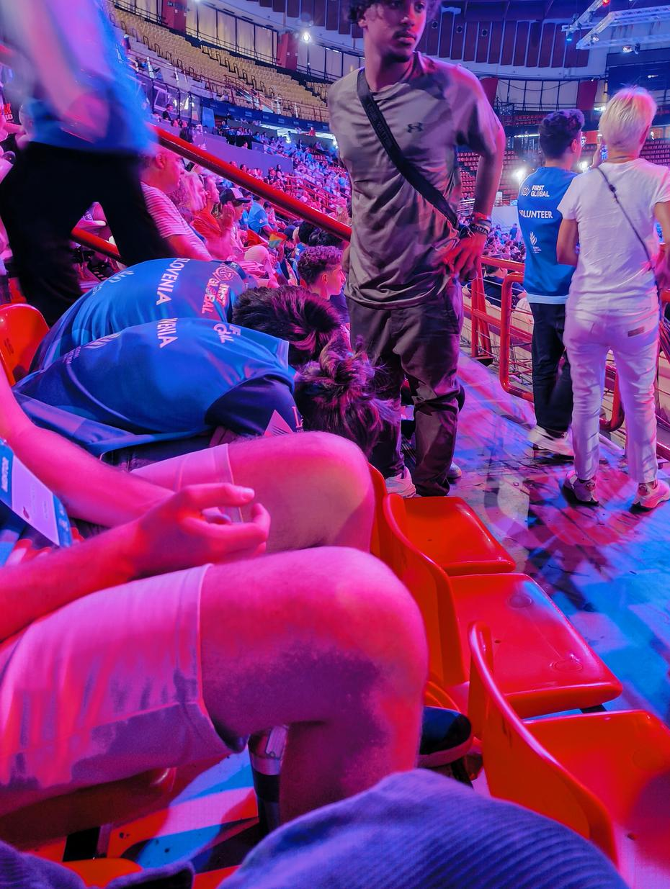

Nastopil je predzadnji dan septembra in s tem zadnji dan tekmovanja First Global Challenge
za leto 2024. Jutranjemu ritualu je sledilo ponovno servisiranje robota, saj smo želeli
končati tekmovanje v zmagovalnem slogu. Pred nami sta bili dve tekmi, kar pomeni da smo
imeli priložnost garati do približno 12.30 in nato imeti preostanek dneva v stadionu prostega.
<!-- truncate -->

Popravki so bili skoraj izpopolnjeni, vendar je pred tem nastopila tekma številka 307, ki
smo jo igrali ob strani Kiribatov in San Marina. Nasprotno (rdečo) polovico polja so krasili
predstavniki Srbije, Bahamov in Sirije. Zmaga nam je za las ušla in smo tako priznali poraz
z izzidom 59 - 55.

<iframe title="YouTube video player" src="https://www.youtube.com/embed/MRKgTGhcV0M?si=mIWYMXQBEY4CrdFh&amp;start=4103" style={{ width: "100%", aspectRatio: '16/9' }} frameborder="0" allowfullscreen="allowfullscreen"></iframe>

"Več kot uro časa imamo do naslednje tekme!" smo si rekli in nadaljevali s hudo potrebnimi
popravki. Kmalu je robot lahko spet stal na dveh nogah, vendar smo spremenili strategijo,
da se ne bomo potegovali za najvišje košare, saj ne želimo tvegati, da bi se še kaj uničilo.
Tako se je kmalu oglasila sirena za začetek tekme številka 335. Modro alianco smo zajemali
Slovenija, Španija, ki je imela enak mehanizem na robotu kot mi, in Latvija. Na drugi strani
smo lahko videli barve Puerto Rica, Švice in Kosova. Zadnjo tekmo olimpijade smo zmagali z
udarnim izzidom 139 - 119. Zadnja zmaga je kompenzirala za vse pretekle izgube in je našim
dijakov narisala nasmehe na obraz.

<iframe title="YouTube video player" src="https://www.youtube.com/embed/TOi5-RFpaGY?si=mPmP-tt5YI8abtmg&amp;start=7669" style={{ width: "100%", aspectRatio: '16/9' }} frameborder="0" allowfullscreen="allowfullscreen"></iframe>

Po končanju rednega programa je sledilo kosilo in nato naznanitev najboljših 24 ekip in 8
naključnih, ki bodo vse skupaj pomešane v aliance po 4 in se bodo borile za mesto v finalih.
Igra bo sicer ostala v stilu 3 na 3, pri čemer bo morala vsaka izmed štirih držav aliance
nastopiti na polju vsaj enkrat. Vendar za playoffe in finale so bila pravila igre nekoliko
drugačna in s tem zahtevnejša - dodane so bile 3 dodatne modre žoge na točno določenih
pozicijah, kar lahko omogoči dodatne točke. Mi nismo bili poklicani med najboljših 32,
tako da smo si lahko privoščili počitek.

Preostanek dneva je za našo ekipo zajemal podpisovanje dresov sotekmovalcev, ogled tekem in
navijanje za Norvežane, ki so bili izbrani za kvalifikacije. Sicer se je našim prijateljem
s severa kmalu zgodila smola, saj je eden izmed robotov v alianci imel težave, in so zato
posledično izgubili tekme in s tem možnost za nastop v finalih. Medtem ko so dijaki navijali
in gledali tekme, sta mentorja stražarila štand in podpisovala dodatne drese in knjigice.

Po povratku ekipe na svoje delovno mesto smo imeli priložnost zamenjati drese s sosedi iz
Slovaške, saj je vsak izmed nas prejel 3 drese. Veselo smo razdelili tudi majice z napisom
"Ljubljana je najlepše mesto" in s tem prijateljem dali dodaten spominček. Uspeli smo se
slikati tudi z našimi prijatelji in Nove Zelandije, Norveške in tudi z vsemi državami Balkana.

Postregli smo si par sladkarij iz vseh koncev sveta in kmalu za tem je nastopil čas za večerjo
in pospravljanje štanda. Preden smo pa odšli so si naši dijaki zadali cilj, da spoznajo enega
izmed vodilnih ljudi v podjetju REV in mu predajo sporočilo, da najtrpežnejši del v našem naboru
ni dovolj trpežen. Skupaj s pismom je dobil tudi ogrlico vseh uničenih komponent.

Koncu dogodka je sledilo dolgo čakanje avtobusov, saj je očitno naš hotel precej nepopularen.
Za nas je to bilo sploh naporno, saj smo se na avtobus usedli okoli 21-ih, pri čemer nam je
bilo rečeno da nas bo avtobus za na letališče pobral ob polnoči. S tem smo v hotelu hitro
spakirali svoje stvari in se odpravili na zadnji sprehod do trgovinice, ki je vedno odprta.
Tam smo si vzeli rogljičke, napitke in prigrizke, nato pa nazaj dol po klancu odhiteli v
hotel pod tuš in na letališče. Na poti do letališče smo pobrali tudi enega izmed članov
črnogorske ekipe, ki se trenutno šola v Sloveniji, in zato potuje z nami.

Na letališču smo logistiko opravili dokaj hitro, bolj duhomorno je bilo tehtanje vseh kovčkov
in porazdelitev teže. Ko smo izvedeli, na katerih vratih se moramo oglasiti, se je za večino
članov ekipe začel čas za krajši spanec, preden je nastopil čas da se usedemo na letalo.
Nato smo kmalu pripeli v Beograd, kjer smo se kratkočasili s sprehajanjem, opazovanjem
sončnega vzhoda in kartanjem. Preden smo se zavedali smo že pristali v Ljubljani in med
čakanjem na našo prtljago posneli zahvalni video za zavarovalnico Triglav, ki nam je tudi
letos pomagala z zavarovanjem. Klobučarji smo si pomahali v slovo in se odpravili domov na
zaslužen počitek in dolg spanec.

Do naslednjič,
pō mārie