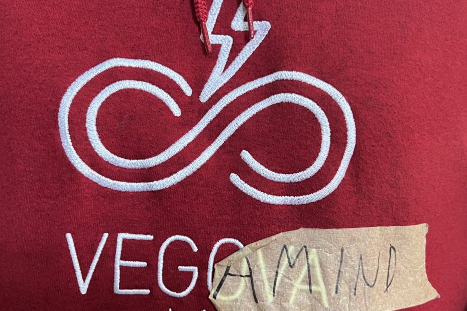
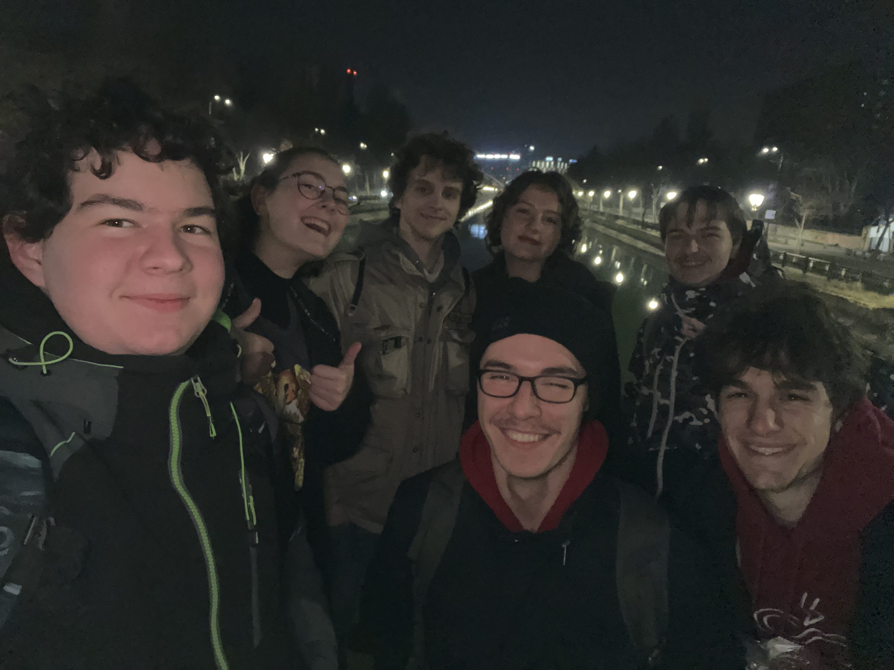
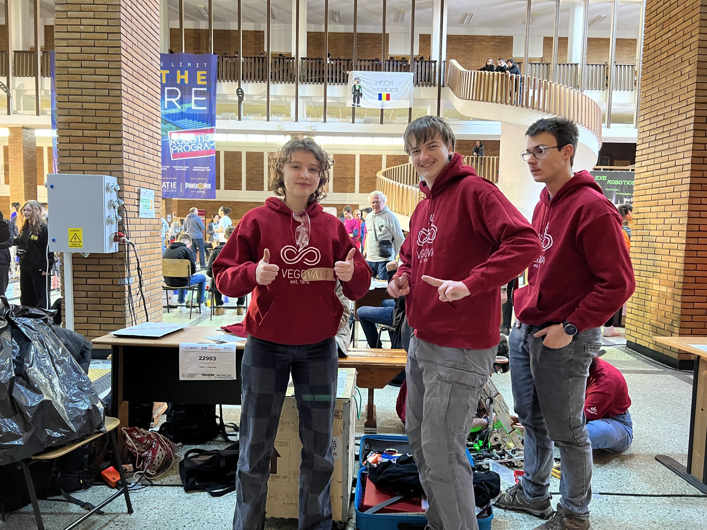
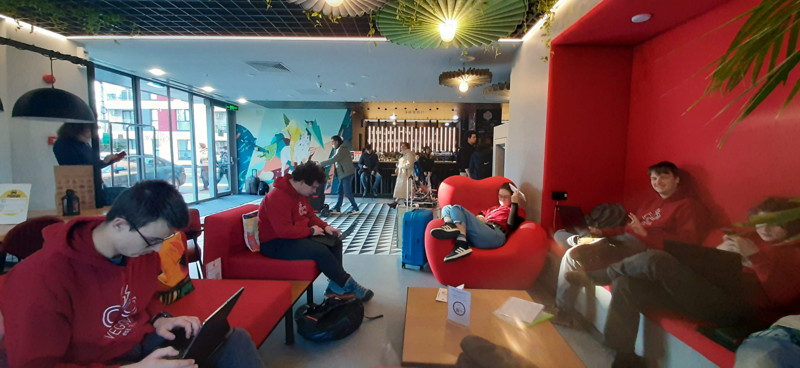
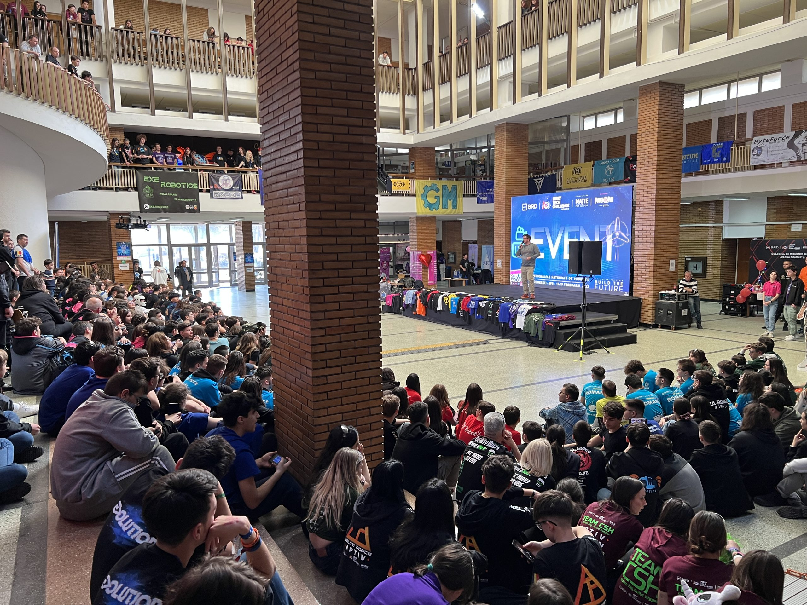
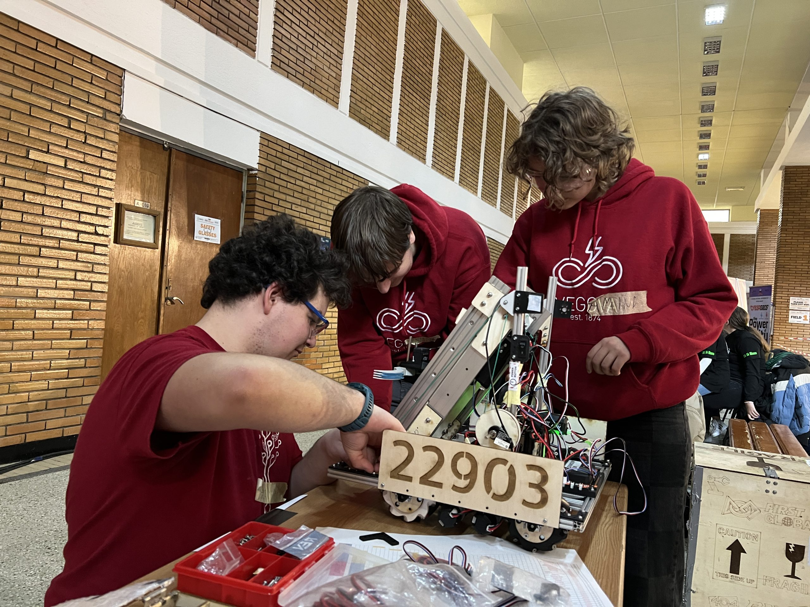
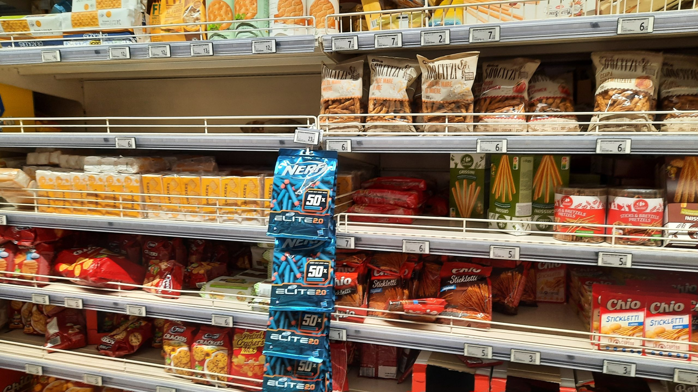

Kmalu po povratku domov je padla ekipna odločitev za skok v mrzlo vodo – želja po udeležitvi na tekmovanju First Tech
Challenge (v nadaljevanju FTC). Evropske ekipe smo nekoliko omejene s kvalifikacijskimi turnirji, zato nas je pot
popeljala v Bukarešto, glavno mesto Romunije. <!-- truncate --> Z obilo neprespanih noči in razhroščenih dni smo se
usedli na letalo, ki
nas je z vmesnim postankom v Beogradu odpeljal do Bukarešte. Ta nas je dočakala z taksistično zmedo, ki sta jo rešila
Uber in popravljalec klim Sin Valentin. Nepripeti vožnji in ogledu polovice znamenitosti mesta med potjo je sledila
nastanitev v hotelu Ibis, verigi pri kateri smo se udomačili že pri obisku Ženeve! Že v avli smo srečali nekaj naših
sotekmovalcev. Zaradi dokaj poznega prihoda in zaupanja nevrednemu izgledu okolice smo se odločili prvo noč v Romuniji
preživeti z obiskom najbližje trgovine ter sprehodom do lokacije, kjer se bo v prihodnjih dneh odvijalo tekmovanje FTC.

Prednost lokacije prenočišča je ta, da se zbudimo na razdalji 10 minutnega sprehoda od zgradbe Politechnica University
of Bucharest, ki se nahaja na študentskem kampusu skupaj z obilo drugih inženirsko obarvah fakultet. 𝐹𝐼𝑅𝑆𝑇-ovsko obarvan
hodnik in gruča živahnih sotekmovalcev sta nam namignila k temu, da smo na pravem mestu. Po sprehodu do vadbenih polj,
ki se nahajajo v bližini osrednjih tekmovalnih polj in odra smo našli v neposredni bližini tudi mizo oz. “štand” naše
ekipe, VegaMind #22903. Ogledu je sledilo spreminjanje napisa na vegovskih oblačil v VegaMind, kar nam je omogočil
lepilni trak.

Po povratku v največji sobo od treh nas je čakal kup dela s pisanjem dokumentacije, natančneje pisnih prispevkov
“Engineering Notebook” in “Team Portfolio”. Praksa bedenja do poznih ur se je izkazala kot uporabna vendarle pri igranju
družabne igre eksplozivnih muck.

Po obilnem zajtrku smo naši pisni deli dokončali in s prijazno prošnjo naprintal na recepciji hotela. Jutro je bilo
delovno obarvano, saj nam je dostop do poligona omogočil dopolnjevanje programskih rešitev. Poleg omenjenih obveznosti
smo se lotili tudi popravil na samem robotu, na katerem smo odkrili nekaj pomankljivosti. Poskusne vožnje so nam
prikazale resnične zmogljivosti robota, in sicer da lahko ciljamo zgolj talne spoje in najnižje palice. Dočakali smo
tudi uvodno otvoritev, ki je bila sicer v romunščini, vendar smo uspeli prispevati tudi mi z donacijo “dresa” za skupno
fotografijo.

Prvi dan je poleg inženirskih dejavnosti prinesel tudi družabne, saj smo se spoprijateljili z nekaterimi ekipami in si
ogledali robote naših sotekmovalcev, pogled na katere je pognal pot po naših čelih.

Delo do poznih ur smo nagradili z obiskom bližnjega nakupovalnega centra Carrefour Orhideea, v katerem smo si privoščili
prvič videne napitke in raziskali svet romunskih prigrizkov. Sprehodu do hotela je sledilo načrtovanje novega dne in še
ščepec dela.

Do prihodnjič,  
takle mamo
