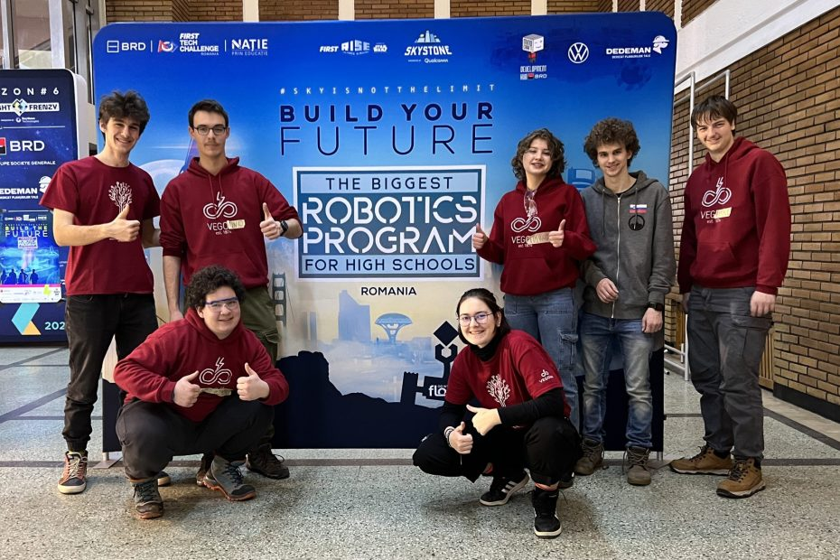
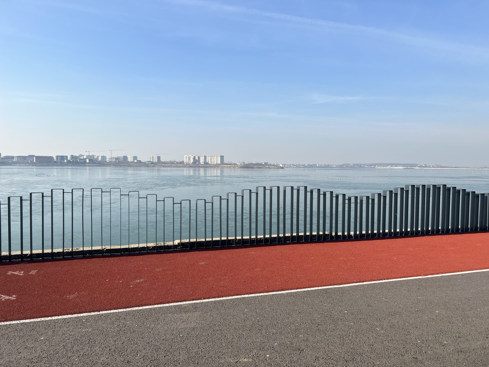
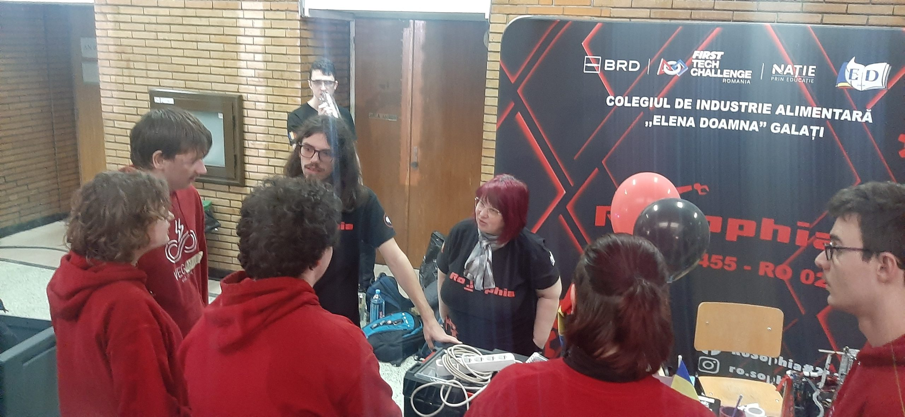
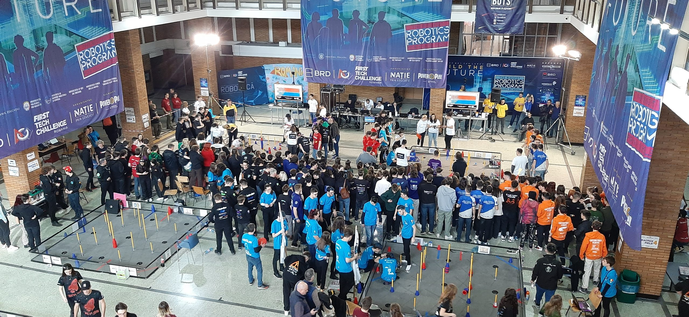
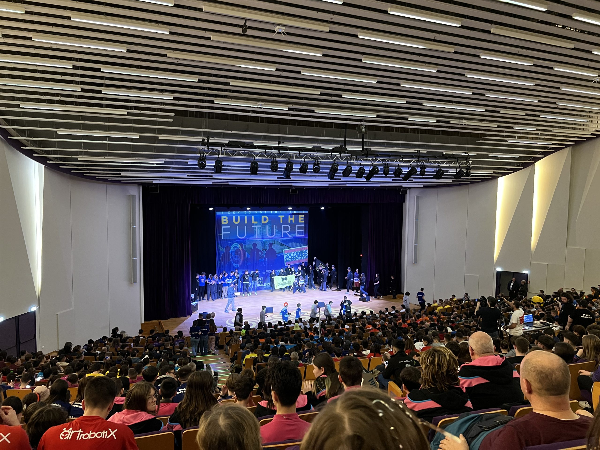
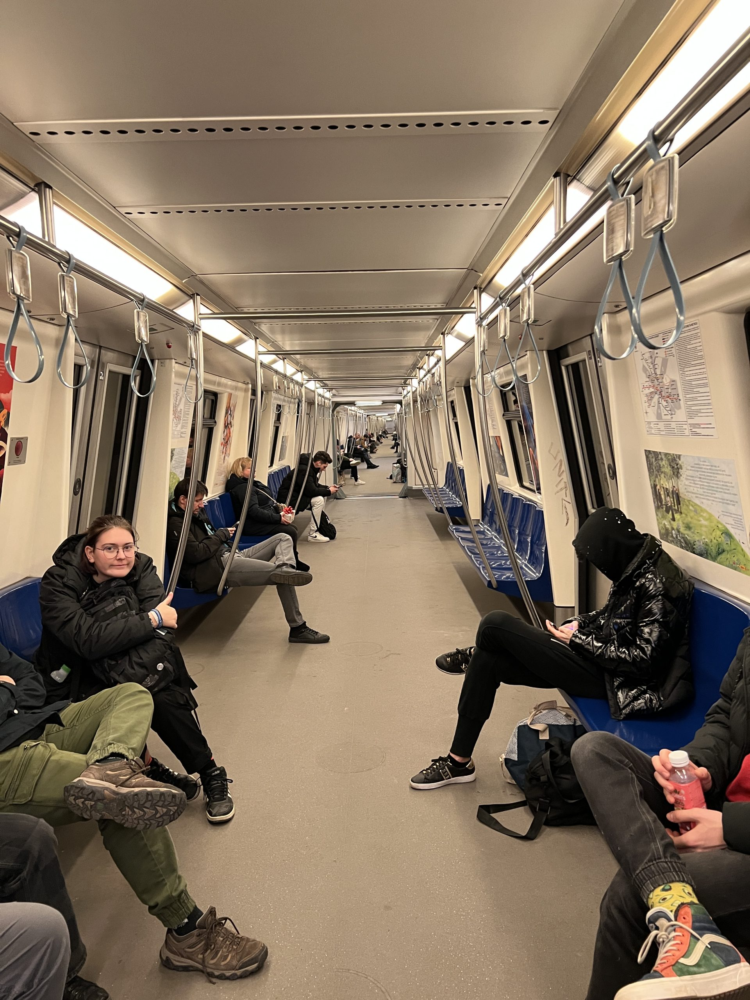
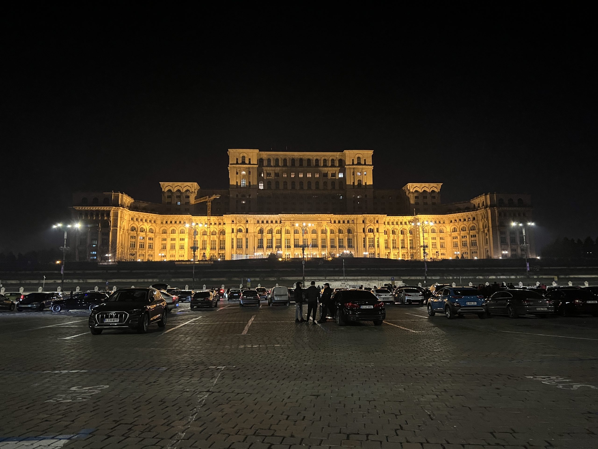
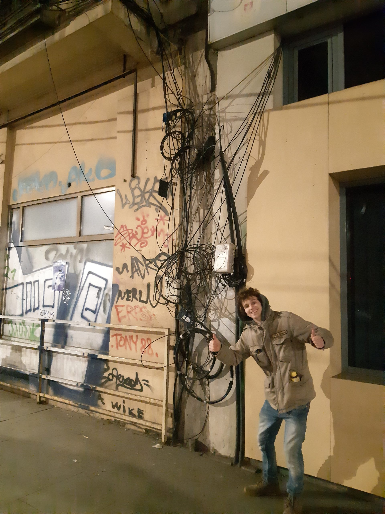
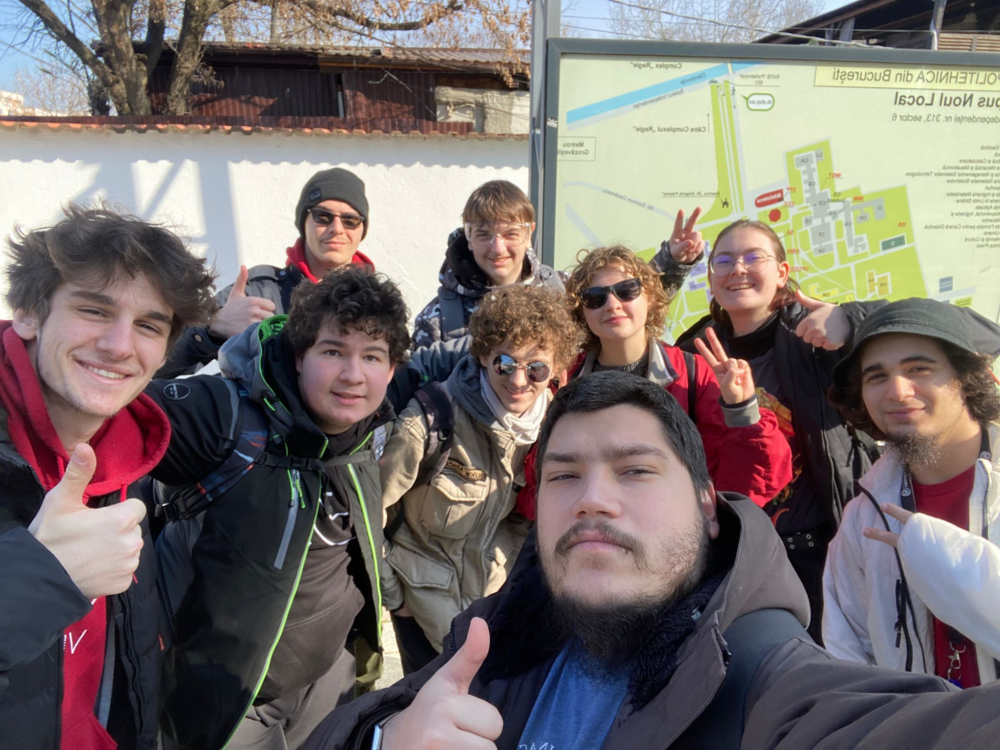
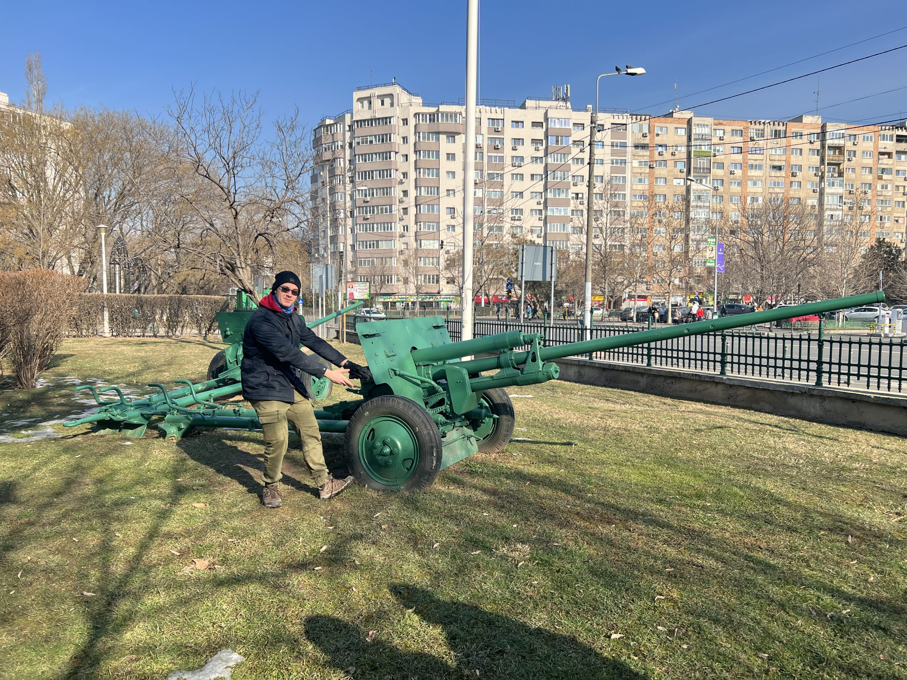

Zadnji dan prvega regijskega tekmovanja v Bukarešti je napočil. Dolgemu prebujanju, obilnemu zajtrku in spremljanju
romunskih električarjev na delu je sledila pot do mesta naših poslednjih tekem za letošnjo sezono. Smehu popotniških šal
je sedilo ogrevanje v obliki manjših popravkov na robotu in v samem programu. <!-- truncate --> Dokaj kmalu se je pri
naši mizi oglasil prostovoljec z opozorilom za čakalno vrsto naše tekme. Tokrat smo igralnemu polju pristopili ob strani
ekipe Evolution (#19131) na strani rdeče alianse. S strategijo skovano že prejšnji dan smo se ob zvoku troblje podali v
igro z zaporedno številko 96. Tokrat smo čutili dodatno napetost, saj smo nasprotovali kolegom iz ekipe CSH(#17861).
Kljub strategiji in koordiniraem sodelovanju smo bili preprosto nekoliko počasnejši od nasprotne barve in smo bili ob
zaključnem pisku kratki ze nekaj točk.

Nastopajoči člani posadke so se vrnili k mizi zadovoljni in motivirani. Do naslednje tekme je ostalo kar nekaj časa,
zato smo se odločili za obisk kolegov in nova spoznanstva. Spoprijateljili smo se z ekipo RoSofija. Debata o robotu in
programu je prerasla v dobro prijateljstvo. Podarili so nam tudi romunsko različico Jafa piškotov, ki so bili prijeten
prigrizek. Kasneje tekom dogodka so se oglasili še pri naši mizi in se pogovarjali z nami o trenutnem stanju države in
njeni zgodovini. Najbolj smo se spoprijateljili s članoma Frumo in Sebi.

Kmalu je minilo tudi kosilo in s tem tudi čas do naše zadnje kvalifikacijske tekme, z zaporedno številko 115. Še vedno s
pritrjenim redčim kvadratom na strani robota smo pravočasno dognali strategijo z ekipo Gentlemen (#17857). Tokrat smo
poslednjič pripeli svoje Driver in Coach broške na dres in se napotili k igralnemu polju. Začetka sirena je kmalu
spustila svoj zvok, ki mu je sledila uspešna avtonomna faza za obe ekipi rdečih. Medtem ko smo poslušali s strani
gledalcev “Haj rošu” (“dajmo rdeči”), smo manevrirali kar se je le dalo optimalno po polju in se držali dogovorjene
“circuit” stratgije. Z uspešno napeljanim vezjem in zadovoljivim številom točk smo uspeli končati naš nastop na
tekmovanju First Tech Challenge v uspešni luči.

Kmalu po naši zadnji igri se je začel izbor alians za polfinale tekmovanja. Vedno več prisotnih se je nabiralo okoli
igralnih polj, na balkonih in stopnicah, da so lahko spremljali pofinale in finale v živo, četudi s pogledom na veliki
ekran. Napetost in hrup sta se le stopnjevala, kar je doprineslo k vzdušju samih iger, ki so bile v slogu "prva ekipa do
dveh dobljenih iger, zmaga" (best of three).

Ko je hrup publike in pihal usahnil, smo se premaknili s sosednji paviljon, kjer se je odvila slavnostna podelitev
nagrad. Dogodek je vključeval nam tuji jezik (brez podnapisov), ploskanje in navijanje za naše prijatelje, ko so le ti
osvojili nagrado. Po prijetnem dogodku smo se še zadnjič za ta dogodek sestali z našim prijateljem Christianom, s komer
smo si uspeli izmejati še nekaj besed.

Hitro smo ugotovili kaj je sledeče na sporedu za lačne in utrujene tekmovalce in tekmovalke, kaj drugega kot pa večerja!
Po krajšem obisku hotelskih soban smo se odpravili v nam že znan Carefour Express nakupovalni center. Tekom odločanja
med ponudniki hitre hrane so do nas pristopili naši kolegi iz ekip DarkEnergy in DecebalTech. Pogovor je tekel o manj
tekmovalnih tematikah, predvsem pa o hrani in središču mesta. Dolgemu pogovoru je sledilo še daljše poslavljanje, ki se
je pa vendarle končalo z obilo nasmehov. Na koncu smo se v veliki večini odločili za obisk restavracije ChopStix, razen
za nekatere, ki so se odločili za obisk ponunika Popeye’s. S polnimi trebuhi in dobrotami za na pot smo se odpravili do
najbližje postaje za podzemni vlak.

S pomočjo enostavnega sistema in voznega reda smo se kmalu uspeli usesti na vlak, ki nas je za le par minut v zameno za
dobre pol evra pripeljal do središča mesta, natančneje v bližino znamenitosti, ki je prva na našem seznamu – parlament.
Na poti do površja smo se srečali tudi s simulacijo Krasa, natančneje vetrov le tega. Nekaj minut hoje nas je pripeljalo
do drugega največjega parlamenta na svetu, ki smo si ga lahko ogledali s parkinga, ki je primerno oddaljen od sprednje
strani zgradbe.

Ogled mesta smo nadaljevali v smeri starega mestnega jedra, ki ga okrašujejo visoke zgradbe, sumljivo temačni podhodi in
malodane nerešljive Kirchoffove zanke. Ozke ulice so na srečo imele veliko manjših zemljevidov za lažjo orientacijo,
tako da smo lahko brez težav si ogledali znamenitosti kot je Nacionalni muzej. Zaradi omejitev glede transporta smo
morali pohiteti in smo na poti lahko ujeli le še nekaj zaprtih trgovin, cerkev, nacionalni muzej umetnosti, trg univerze
in kip sedečega moškega (Iuliu Maniu). Hitre noge so nas pravočasno pripeljale do postaje ob reki, nato pa nas je vlak
odpeljal nazaj do okolice nakupovalnega središča Carefour.

Toplina hotelskih soban nas je spravila v stanje udobja in nas spodbudila k še zadnjemu večernemu druženju v Romuniji,
ki je pa žal bilo delno okrašeno tudi z pakiranjem orodja in lokalnih energijski pijač. Kmalu je napočil čas za spanec,
vendar za nekatere prej kot za ostale. Novo jutro je s seboj prineslo nove avanture. Zaradi popoldanskega leta smo se
odločili, da po srečanju z dvema prostovoljcema in zamenjavi majc, obiščemo znamenitost v neposrednji bližini – jezero
Lacul Morii. Po zajtrku in oddaji kartic ter prtljage smo se napotili na ogled omenjene znamenitosti. Pot do tja smo
napeljali skozi park, ki ga je skupaj z njegovo okolico načel čas in nas je spomnil na sovjetski slog. Igrala in
dogajanje sta bila, kljub zelo prijetnemu sončnemu vremenu, precej nenavdušujoča, če ne štejemo vojaške opreme
razstavljene v parku. Samo jezero je pa občutno večje od parka, obdaja ga pa tekaška steza in oboki v slogu moderne
umetnosti, ki so služili kot preizkus hitrosti s pomočjo golobov. Na oddaljenem koncu je bilo možno opaziti manjši
polotok, na katerem so ostanki starodavnih stebrov.

Kmalu smo se vrnili v hotel, kjer nam je le še preostalo čakanje naročenega Uberja in klic Sina Valentina. Prevoz do
letališča nam je ponudil ponovno izkušnjo romunskih vozniških spretnosti ter ogled znamenitosti kot sta Slavolok zmage (
Arcul de Triumf) in Muzej vaške zgodovine. Srečanju na letališču je sledilo čakanje in checkin ter pojasnitev, da v
škatli za robota vendarle niso buteljke vina. Tekom potovanja smo tudi objavili zahvalni video namenjen našim tokratnim
podpornikom, Zavarovalnici Triglav.

Do prihodnjič,  
salut
