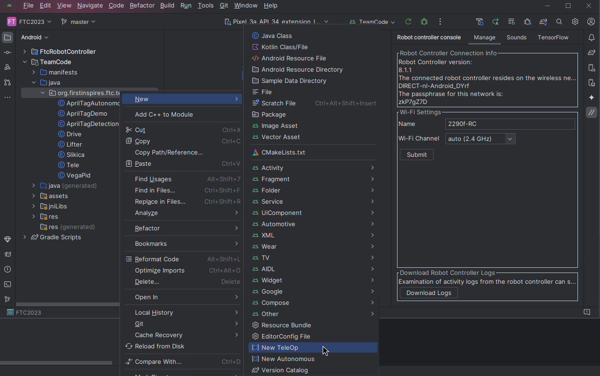

import Link from '@docusaurus/Link';

# FTC Companion
### FTC companion plugin za Android Studio

## Prenos

## Funkcionalnosti
FTC companion za Android Studio FTC ekipam olajša razvoj robotov. Vključuje generator izrezkov kode in konzolo za nadzor robota – vse znotraj Android Studio.

### Generator izrezkov kode
FTC Companion vključuje generator izrezkov kode, ki olajša ustvarjanje kode za OpMode. Podpira generiranje kode tako za TeleOp kot tudi za Autonomous.

<Link className="button button--primary" to="/docs/ftccompanion/snippet-generators">Preberi več</Link>

### Konzola za nadzor robota
Vgrajena konzola omogoča nastavljanje nekaterih parametrov, ki so drugače dostopni le na spetnem vmesniku. Med drugim podpira spreminjanje WiFi nastavitev, dodajanje zvokov in podobno

<Link className="button button--primary" to="/docs/ftccompanion/controller-console">Preberi več</Link>
