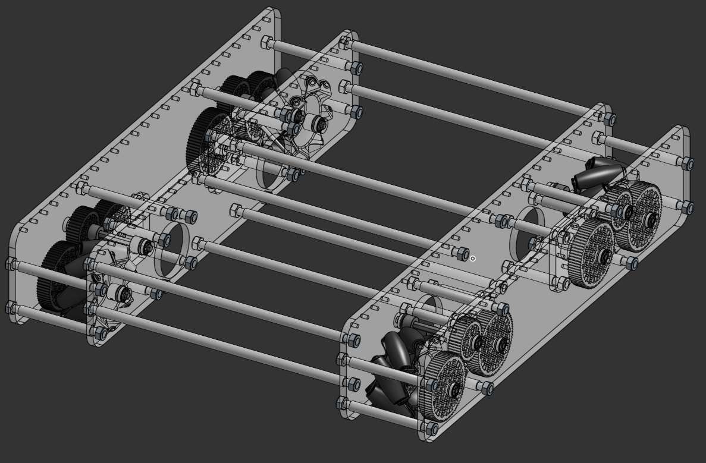

# Mecanum podvozje
To je podvozje s pogonom na štiri Mecanum kolesa, združljivo s sistemoma REV Robotics in goBILDA.
Vključuje številne različne nastavljive parametre, lahko pa dokument skopirate in ga prilagodite po vaših želji 

## CAD
Trenutno sta v razvoju dve različici podvozja:
- namenjena laserskemu razrezu:  
	najdete jo [tukaj](https://cad.onshape.com/documents/4e65c7e93fb9b9d70e47d504/w/bd88bb0fb1144ac90c8e0fea/e/b6aa0f24d8907cb64c8843fa)
- namenjena izdelavi s CNC rezkarjem:  
	_jo bomo objavili, ko bo dokončana_

## Primeri
Zaslonska slika CAD modela.

Preizkušen na tekmovanju (ekipa: #22093 VegaMind)

# Dokumentacija
_**TBD**_
