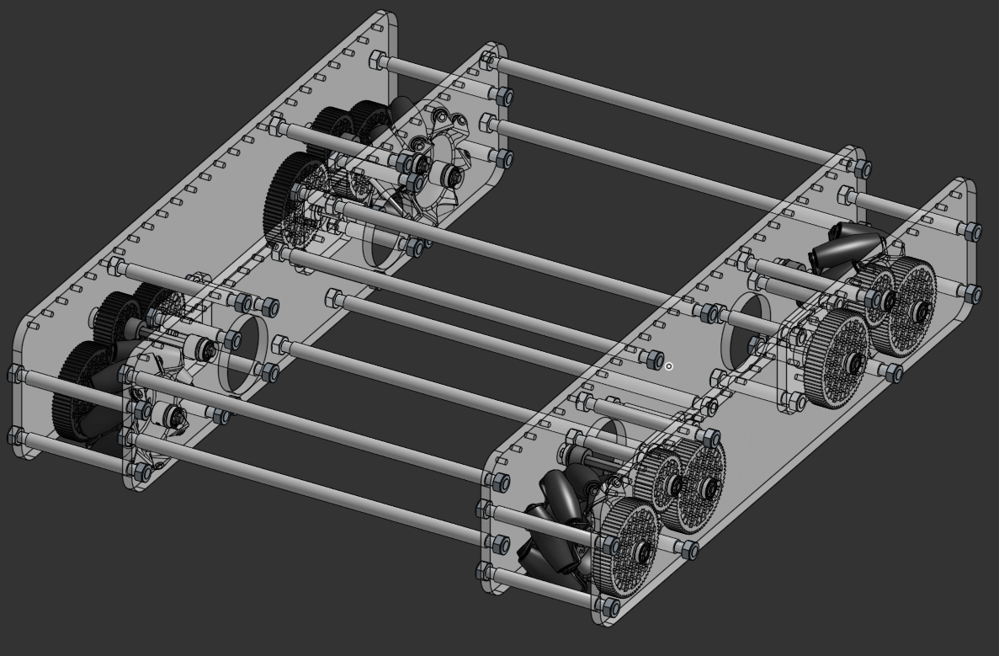

import Link from '@docusaurus/Link';

# Project Strand
Projekt, katerega cilj je standardizacija robotskih delov za tekmovanje FTC.

Razvijata ga ekipe #22903 VegaMind in #28080 VegaTech

## Mecanum podvozje
This is a four wheel mecanum drive based drivetrain, compatible with noth the REV Robotics and goBILDA build systems.

To je podvozje s pogonom na štiri Mecanum kolesa, združljivo s sistemoma REV Robotics in goBILDA.

<Link className="button button--primary" to="/docs/project-strand/drivetrain">Preberi več</Link>  

Zaslonska slika CAD modela.

