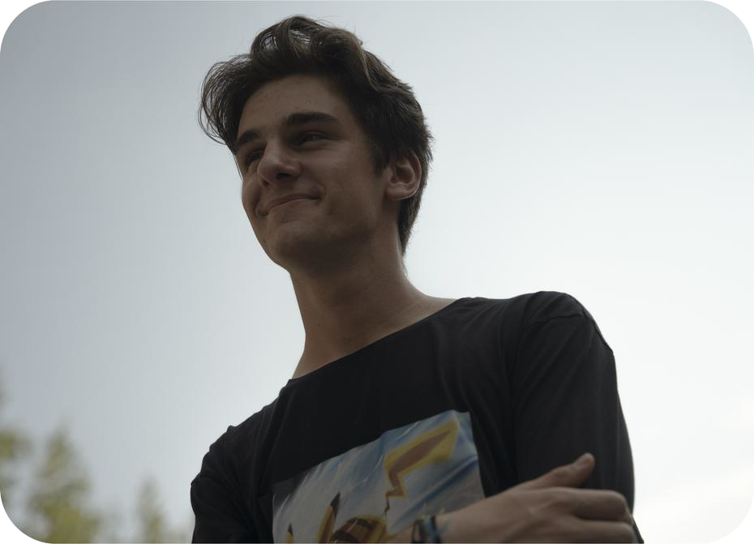

# Team Slovenia 2020

**David Zindović** – znan tudi pod vzdevkoma “Zindo” in “Zindy” je družabna duša našega jeklenega moštva. Krasijo ga tudi pozitiven pogled na svet, slabi vici (ko jih ekipa potrebuje), delavnost in besedna igra. Kot dijak elektronike se rad napoti v divjino in preizkusi nova področja, ki segajo od 3D modeliranja do poezije. Je tudi osebni šofer naše maskote Pikachuja. David tudi rad ureja naše objave na družabnih omrežjih, zato nam podarite “follow”.

P.s.: Zindo pravi, da moramo vsi za domačo nalogo uživati oz. kot se danes pravi “vajbati”.

**Uroš Anže Tomažič** – nadarjeni dijak elektrotehniške smeri, ki ima za seboj marsikateri projekt, vključno z lanskoletnim in letošnjim FGC izzivom. Kot elektronik in bodoči študent Fakultete za elektrotehniko rad zagrabi vsak izziv, ki mu je podan, pa naj bo ta inženirski ali igriški. Kot oseba je razgledan, zadržan in šaljiv. Vedno je za, ko je govor o ekipnem delu, prav tako je pa podpornik razvoja novih izdelkov in uresničitve novih idej.

**Matej Šajn** – svež maturant in eden izmed najvišje uvrščenih dijakov elektrotehnike v Sloveniji. V ekipi First Globa Slovenija že leta beleži svojo prisotnost z efektivnim sodelovanjem pri vsakem projektu in prvovrstnih inženirskih rešitvah. Kot posameznik je nasmejan, zabaven, energičen in osredotočen na izzive, ki mu pridejo nasproti. Skratka, ko mu pod dolgimi lasmi postane vroče, zgradi klimatsko napravo. Je tako izvrsten, da ga je omenila tudi pevka Rihanna v eni izmed svojih                                                                                      skladb (“Šajn bright like a diamond.”).

**Najl Kuduzović** – energičen navdušenec praktičnega dela, ki je zaznamoval leto 2019 za našo ekipo s tem, da je bil voznik robota in s tem nam priboril kar veliko zmag. Krasijo ga tudi iskrenost, iznajdljivost in občutek za južnjaški humor, s katerim se je hitro sporazumel z drugimi članicami Balkana. Kot deloven najstnik rad ustvarja, vijači in podarja izdelke svojim najbližnjim

**Klemen Mehle** – novinec, dijak računalniške smeri na Vegovi in oboževalec računalniških iger. Letos je Klemnovo prvo leto na ekipi FGC SLO in se je že ujel s preostalimi člani in tudi našel svojo vlogo in nov hobi. Poleg vsestranskosti se je odločil za video montažo, kar pomeni, da je on zadnja postanka marsikatere naše objave, preden se znajde na spletu. Kot oseba je zelo pozitivno orientiran in nasmejan, rad pa tudi premisli preden kaj reče.

**Žiga Kralj** – nadarjeni računalničar, ki se ne boji nikakršnega tehnološkega “bav bav-a”. Je svež član, ljubitelj lubenice in tehnoloških debat o zadevah kot so operacijski sistemi, novosti na tehnološkem trgu in ostalih polj znotraj področja “STEM” (Science, Technology, Engineering, Math). V preteklosti se je poleg raznih projektov lotil tudi učnih ur, saj ima dovolj znanja, da bi ga lahko malo okoli delil. Kljub zanimivemu priimku je navaden srednješolec s kančkom realizma in tehnološkega humorja.

---

**Luka Maček** – mentor, motorist, maneken in še marsikaj, ki se začne na črko m, kot na primer pilot. Lukini čevlji stojijo na tleh tekmovanja First Global Challenge že od prvega tekmovanja iz leta 2017 v Washingtonu. Kot študent računalništva in bivši dijak Vegove srednje šole rad širi svoje znanje in podaja priložnost drugim bodočim inženirjem, da se tudi sami preizkusijo v okoljskem tekmovanju, ki ga dekorirajo roboti. Kljub priimku nam v letošnjem letu pomaga prebroditi čez pasje izzive, ki nas vsakič bolj zbližajo kot ekipo.

**Mark Breznik** – študent multimedije, športnik, šarmer, njegova črka je pa š, saj je tudi fotograf. Skupaj z Luko sta že drugo leto zapored mentorja ekipi nadobudnih dijakov, ki jima poleg preglavic rada povzroči tudi kakšen nasmeh ali pa dva. Kratek opisa Marka bi vseboval besede miroljuben, preračunan, zanesljiv in dobrodušen. Kljub zasedenemu poletju je našel tudi čas za robotiko in bil vodilna glava v izdelavi letošnjega enormnega papirnatega letala.