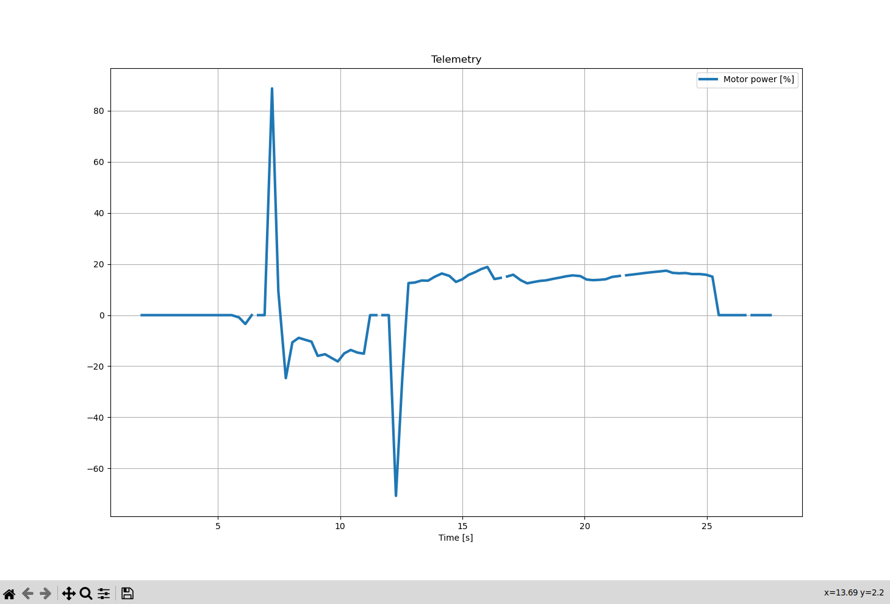
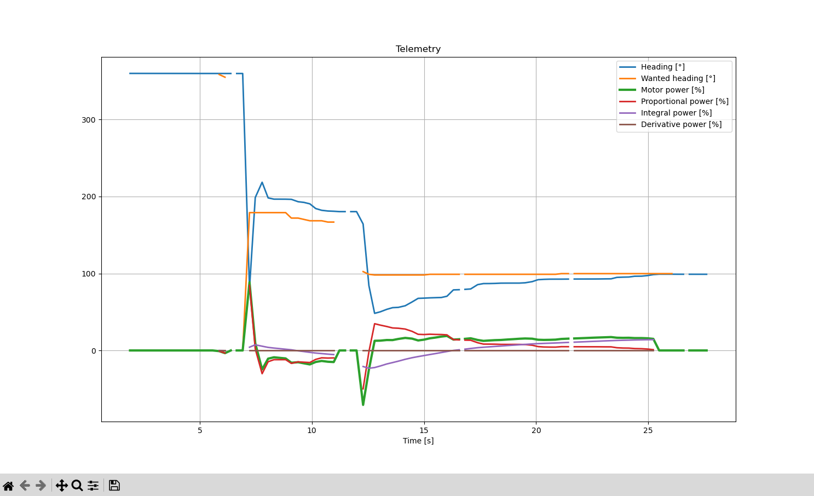

# Creating graphs with dumped telemetry data

Passing the [command-line option](command-line-arguments) `-e` or `--export-telemetry`, will dump all received telemetry packets into a file called `telemetry_log.json` in the active directory.

This file's structure looks like

```json
[
	{"t_elapsed_ms":3257,"entries":{"Telemetry key": "value", "Some otherkey": "1.0", ...},
	...
]
```

Note that:
- Not all elements of the array of telemetry packets contain your custom defined values. Some will only contain keys that are added by REV, such as `$System$Warning$`, `$System$None$`, and `Status`. `Battery Voltage [V]` is also a special one, which contains the last reported voltage on the battery.
- All values are sent as strings, regardless of their actual type. You'll need to manually parse them
- Certain telemetry entries will have weird keys, such as `\u0000Ƅ`. These keys (starting with a unicode null character) are used for telemetry lines (telemetry values that have no key)

You can then parse this file in e.g. python, to draw a graph with matplotlib:





Example code:

```python
import matplotlib.pyplot as plt
import sys
import json

# sys.argv[1] means we'll open the file passed
# as our second argument
#
# You'll run this as python3 main.py myfile.json
with open(sys.argv[1], 'r') as file:

	# Read the file and parse it as json
	data = file.read()
	parsed = json.loads(data)

	# Let's say we want to graph our motor power over time
	# and we have a line in our robot's code:
	# telemetry.addData("Motor power", motorPower)
	# where motorPower is a float, from -1.0 to 1.0
	power = list()

	time = list()

	# these two lists need to have the same number of elements, and the nth element in one
	# has to correspond to the nth element in the other

	for packet in parsed:

		# For the values of time, take every packet's time in seconds
		#
		# We'll map all our y values to this; this is so matplotlib knows at what time we received what data
		time.append(float(packet["t_elapsed_ms"]) / 1000.0)

		# Potentially get the value from the packet's entries
		power_e = entry["entries"].get("Motor power")

		# If the entry contained that value
		if power_e is not None:

			power_as_float = float(power_e)

			# This is optional, map values of (-1.0, 1.0) to (-100.0, 100.0)
			# This is to show how you can manipulate data before adding it to the list
			power_as_float = power_as_float * 100.0

			power.append(power_as_float)
		else:
			# If it didn't, let matplotlib know
			# If we didn't append None here, we'd mess up the 1 - 1 mapping of power to time
			power.append(None)

	fig, ax = plt.subplots()

	ax.plot(time, power, linewidth=3, label="Motor power [%]")
	# If you want to add more plots, add another list, add its elements in the above loop, then call
	# ax.plot(time, my_data, label="Something")

	# These just make things look a bit nicer, ax.legend() is very useful
	#
	# plt.show() actually shows the graph
	#
	# you should take a look at matplotlib's docs
	ax.set_xlabel("Time [s]")
	ax.set_title("Telemetry")
	ax.legend()
	ax.grid(True)
	plt.show()
```
