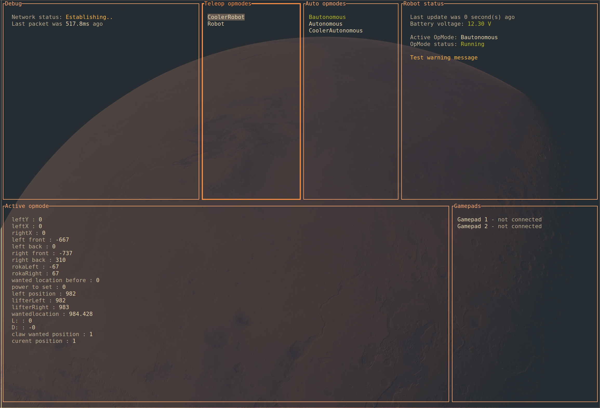

import Link from '@docusaurus/Link';

# FTC Tui

FTC Tui is a desktop app written in rust which functions as a drop-in replacement for REV Robotics' Driver hub / Driver Station app.

The Tui in the name stands for Terminal User Interface, since it was created as a terminal app for ease of development and performance reasons.

 
<Link className="button button--primary" to="https://github.com/firstslovenia/FTCTui">View on Github</Link>
 

 
<Link className="button button--primary" to="https://github.com/firstslovenia/FTCTui/releases">Releases</Link>
 

### Docs

- [Installation and usage](/docs/ftctui/installation-and-usage)
- [Command-line arguments](/docs/ftctui/command-line-arguments)
- [Graphs from telemetry data](/docs/ftctui/graphs-with-telemetry)
