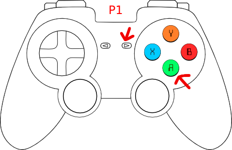
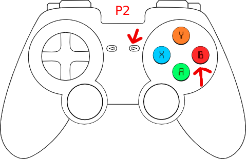
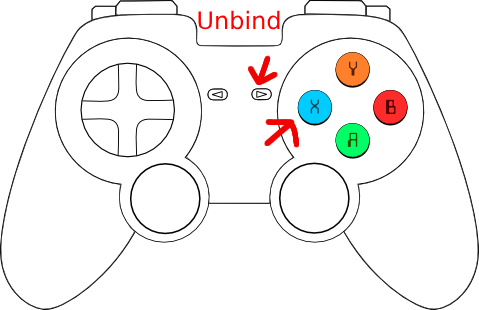

# Installation and Usage

## Installation

Check the [releases tab on Github](https://github.com/firstslovenia/FTCTui/releases) and download the relevant binary for your system and CPU architecture (if you don't know what that means, choose `windows_x64`).

The .zip file contains a self-contained executable of the app. No additional things need to be installed.

### Windows

On Windows running the .exe should open the app inside a command prompt.

### Linux

To unzip the archive:

```unzip ftctui_v0.1.0_linux_x64.zip```

You may need to manually mark it as an executable:

```chmod +x ./ftctui```

You may also need to run it manually from your preferred terminal emulator:

```./ftctui```

## Usage

The app has a basic layout with 6 blocks, one of which is always selected.

You can select the next block with Tab / Right arrow, and the previous one with Shift + Tab / Left arrow.

| Block name     | Function                                                           | Useful hotkeys                                                                                                   |
|----------------|--------------------------------------------------------------------|------------------------------------------------------------------------------------------------------------------|
| Debug          | Shows network connection status and debug data                     | /                                                                                                                |
| Teleop opmodes | Shows a selectable list of Teleop opmodes                          | K / Up arrow - move selection up, J / Down arrow - move selection down; Enter - Initialize / run / stop opmode   |
| Auto opmodes   | Shows a selectable list of Autonomous opmodes                      | K / Up arrow - move selection up, J / Down arrow - move selection down; Enter - Initialize / run / stop opmode   |
| Robot status   | Shows the robot's battery voltage, running opmode and any warnings | /                                                                                                                |
| Active opmode  | Shows telemetry data from the running opmode, if any               | K / Up arrow - scroll telemetry lines up, J / Down arrow - scroll telemetry lines down                           |
| Gamepads       | Shows info about our bound gamepads                                | /                                                                                                                |

Pressing space at any point will stop or start the active opmode.

| Hotkey                   | Use                                                           |
|--------------------------|---------------------------------------------------------------|
| Tab / Right arrow        | Select next block                                             |
| Shift + Tab / Left arrow | Select previous block                                         |
| K / Up arrow             | Move selection up / Scroll up                                 |
| J / Down arrow           | Move selection down / Scroll down                             |
| Enter                    | Activate selected (initialize / run / stop OpMode)            |
| Space                    | Activate current OpMode (run if initialized, stop if running) |
| Escape                   | Go back                                                       |
| Q / Ctrl + C             | Quit                                                          |
| :                        | Open command bar                                              |

### Gamepads

To bind a connected gamepad to user 1, press the Option / Start button (the one just to the top left or left of the main buttons) and the Cross / A (bottom most) button at the same time.



To bind a connected gamepad to user 2, press the Option / Start button and the Circle / B (right most) button at the same time.



To unbind a connected gamepad, press the Option / Start button and the Square / X (left most) button at the same time.



(The Triangle / Y (top most) button is planned for navigating the UI with a controller)

([credit for the original gamepad image](https://opengameart.org/content/generic-gamepad-template))
